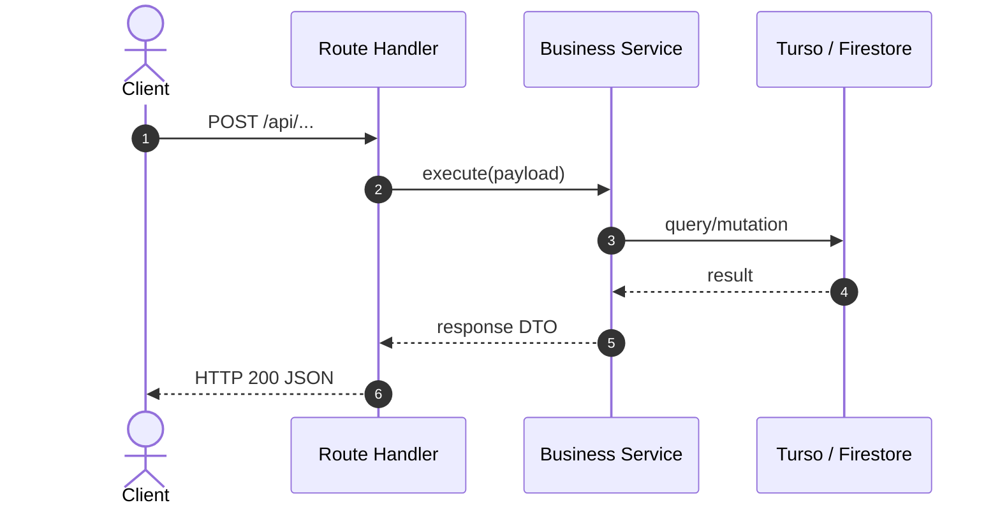

# TECHNICAL DESIGN: [Feature / Module Name]

**Specification Reference:** `SPEC-[TRACK]-[NAME]`

## 1. Architecture Topology & Sequence Diagram


## 2. Data Models & Type Contracts (TypeScript / Zod)
```typescript
import { z } from 'zod';

export const ExampleSchema = z.object({
  id: z.string().uuid(),
  name: z.string().min(1),
  createdAt: z.string().datetime(),
});

export type Example = z.infer<typeof ExampleSchema>;
```

## 3. Error Taxonomy & Status Mapping
| Error Type | Trigger Condition | HTTP Status | Error Code | Mitigation Strategy |
| :--- | :--- | :--- | :--- | :--- |
| `ValidationError` | Invalid input payload | 400 | `BAD_REQUEST` | Return validation error array |
| `UnauthorizedError`| Non-institutional session| 403 | `UNAUTHORIZED_DOMAIN` | Redirect to domain policy notice |
| `NotFoundError`    | Entity not found in DB   | 404 | `NOT_FOUND` | Return 404 with error message |

## 4. Security, Compliance & Performance Strategy
- Invariants checked: Authentication, authorization, Ley 19.628 data protection.
- Latency / memory budgets and caching strategies.
