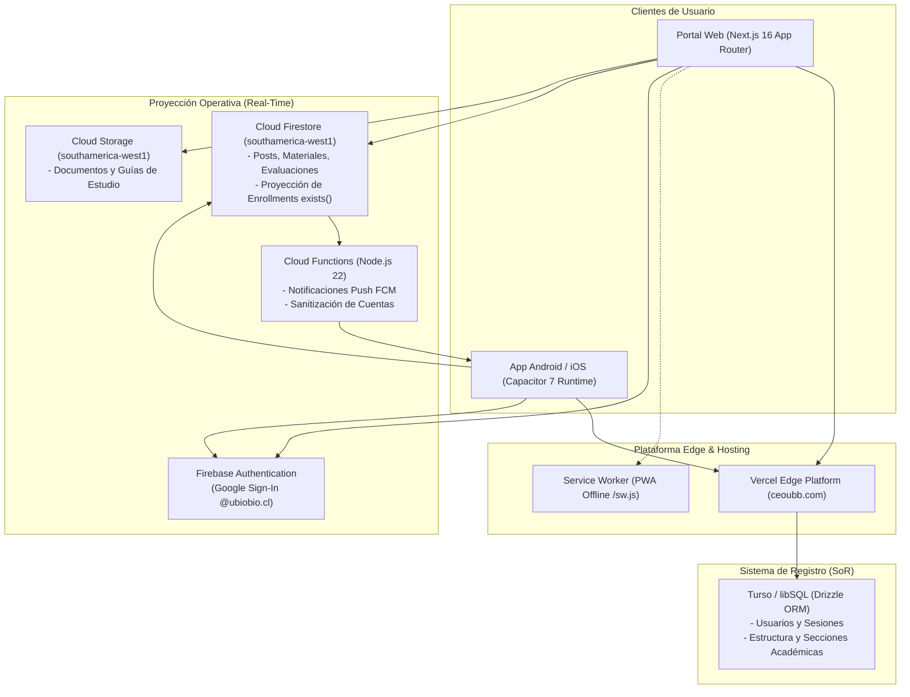

# Centro de Estudio UBB (CEOUBB)

[](https://github.com/CEOUBB/CEOUBB/actions/workflows/ci.yml)
[](https://nextjs.org/)
[](https://react.dev/)
[](https://www.typescriptlang.org/)
[](https://capacitorjs.com/)
[](https://firebase.google.com/)
[](https://turso.tech/)
[](LICENSE)

Plataforma de aprendizaje y gestión académica (Learning Management System, LMS) para la comunidad de la **Universidad del Bío-Bío (UBB)**. Diseñada bajo arquitectura modular, de alto rendimiento y orientada a escala institucional.

- **Portal Web de Producción:** [ceoubb.com](https://ceoubb.com)
- **Aplicación Móvil:** Runtime Capacitor 7 (`cl.ubb.centroestudio`) con soporte sin conexión y notificaciones push FCM.
- **Infraestructura Cloud:** Firebase Authentication, Firestore, Storage y Cloud Functions en la región `southamerica-west1` (Santiago de Chile).

---

## Visión General y Propósito

Centro de Estudio UBB es una plataforma de software académico independiente diseñada como alternativa moderna, modular y accesible frente a sistemas institucionales heredados (Moodle UBB y Adecca UBB).

### Capacidades Principales

1. **Aulas Virtuales y Materiales Jerárquicos:** Organización de recursos por Resultados de Aprendizaje (RAs), carpetas colapsables y visor de archivos integrado.
2. **Libreta de Calificaciones y Simulador Predictivo:** Ponderaciones docentes y motor de cálculo de notas en escala chilena (1.0 a 7.0) con estimación de notas mínimas para aprobación y eximición.
3. **Planificador Académico Semanal:** Bloques de estudio, sincronización de fechas de evaluación y seguimiento visual de carga horaria.
4. **Hub de Recursos de Estudio:** Catálogo de herramientas de IA autorizadas, portales oficiales y biblioteca con soporte matemático KaTeX sin conexión.
5. **Seguridad Institucional Estricta:** Autenticación federada con derivación de roles por dominio (`@alumnos.ubiobio.cl` -> Estudiante, `@ubiobio.cl` -> Docente).

---

## Arquitectura del Sistema

El sistema implementa una arquitectura desacoplada con doble persistencia especializada:



---

## Estructura del Repositorio

```text
.
├── app/                  # Rutas App Router, shell (Portal.tsx) y vistas modulares (app/views/)
├── db/                   # Esquema de base de datos relacional Turso y cliente Drizzle ORM
├── drizzle/              # Migraciones versionadas de esquema SQL
├── lib/                  # Servicios centrales, access-policy.ts, grades.ts y clientes Firebase/Turso
├── android/              # Proyecto nativo Android (Capacitor 7 / Gradle)
├── capacitor/            # Configuración y assets offline para Capacitor
├── firebase/             # Reglas (firestore.rules, storage.rules), índices y Cloud Functions
├── public/               # Assets estáticos, marcas institucionales y biblioteca KaTeX (/biblioteca/)
├── tests/                # Suite de pruebas unitarias, integración y verificación de CI
├── docs/                 # Documentación técnica, institucional y arquitectónica
│   ├── adr/              # Registros de Decisiones de Arquitectura (ADRs)
│   ├── archive/          # Histórico archivado de planes y tareas de desarrollo
│   ├── institutional/    # Dossier de adopción y análisis comparativo Moodle/Adecca
│   └── specs/            # Especificaciones formales SDD (Spec-Driven Development)
├── DESIGN.md             # Especificación canónica del Sistema de Diseño CEOUBB
├── CONTRIBUTING.md       # Guía de contribución, Conventional Commits y compuertas de CI
├── SECURITY.md           # Política de seguridad y cumplimiento normativo (Ley 19.628 / 21.719)
├── LICENSE               # Licencia de software MIT
└── PLAN.md               # Plan de sprint activo, backlog y estado de entrega
```

---

## Inicio Rápido

### Requisitos del Sistema

- **Node.js**: `>= 22.13.0`
- **Gestor de paquetes**: `pnpm >= 11.18.0`
- **Java JDK**: `Java 21` (Temurin) para compilación de Android
- **Android SDK**: Build Tools 36.0.0+ (para desarrollo móvil)

### 1. Desarrollo Web

```bash
# Instalar dependencias
pnpm install

# Iniciar servidor de desarrollo en http://localhost:3000
pnpm run dev

# Ejecutar compuertas de calidad
pnpm run typecheck
pnpm run lint
pnpm run test:unit
```

### 2. Desarrollo Móvil (Android / Capacitor)

```bash
# Sincronizar plugins y configuración de Capacitor
pnpm exec cap sync android

# Compilar APK de depuración
cd android
./gradlew :app:assembleDebug
```

### 3. Firebase (Reglas y Cloud Functions)

```bash
# Verificación de sintaxis de Cloud Functions
pnpm run check:functions

# Despliegue selectivo de reglas (requiere autorización previa)
pnpm dlx firebase-tools@latest deploy --project centro-de-estudio-ubb --only firestore
pnpm dlx firebase-tools@latest deploy --project centro-de-estudio-ubb --only storage
```

---

## Documentación y Gobernanza

- **[Sistema de Diseño (`DESIGN.md`)](DESIGN.md):** Tokens de color, tipografía con pairing `Merriweather` / `Manrope`, micro-sombras y lineamientos de UI.
- **[Decisiones de Arquitectura (`docs/adr/`)](docs/adr/):**
  - [ADR-0001: Separación de Responsabilidades Turso / Firestore](docs/adr/0001-turso-firestore-split.md)
  - [ADR-0002: Adopción del Runtime Capacitor 7 Remote-First](docs/adr/0002-capacitor-mobile-runtime.md)
  - [ADR-0003: Derivación de Roles por Dominio Institucional](docs/adr/0003-domain-role-derivation.md)
- **[Dossier de Adopción Institucional (`docs/institutional/`)](docs/institutional/moodle-adecca-comparison.md):** Comparativa técnica exhaustiva frente a Moodle UBB y Adecca UBB.
- **[Carpeta Legal (`docs/legal/`)](docs/legal/README.md):** Borradores para revisión jurídica sobre encargo de tratamiento, retención, derechos, residencia de datos y término del servicio.
- **[Guía de Contribución (`CONTRIBUTING.md`)](CONTRIBUTING.md):** Flujo de trabajo, branching y Conventional Commits en español.
- **[Política de Seguridad (`SECURITY.md`)](SECURITY.md):** Divulgación responsable y cumplimiento de la Ley chilena N° 19.628 y N° 21.719.

---

## Descargo de Responsabilidad Institucional

Centro de Estudio UBB (CEOUBB) es un proyecto de desarrollo de software académico e independiente creado para la comunidad universitaria. No constituye un canal de comunicación oficial ni cuenta con patrocinio formal de la Universidad del Bío-Bío a menos que se establezca explícitamente mediante convenio institucional.

Los nombres, logotipos y siglas de la Universidad del Bío-Bío utilizados en la interfaz se emplean exclusivamente con propósitos identificatorios y de contextualización académica.
