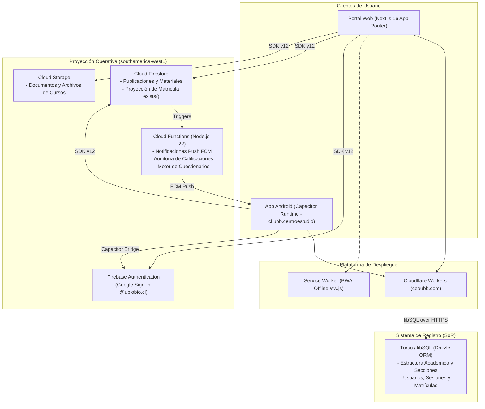

# Centro de Estudio UBB (CEOUBB)

[](https://github.com/CEOUBB/CEOUBB/actions/workflows/ci.yml)
[](https://nextjs.org/)
[](https://react.dev/)
[](https://www.typescriptlang.org/)
[](https://capacitorjs.com/)
[](https://firebase.google.com/)
[](https://turso.tech/)
[](LICENSE)

Plataforma de gestión del aprendizaje (Learning Management System, LMS) y entorno académico digital diseñado para la comunidad universitaria de la **Universidad del Bío-Bío (UBB)**. El sistema está construido sobre una arquitectura desacoplada, de alta concurrencia y orientada a escala institucional (>5.000 estudiantes simultáneos).

- **Portal Web:** [ceoubb.com](https://ceoubb.com) (Alojado en Cloudflare Workers Edge Runtime)
- **Cliente Móvil:** Runtime nativo Capacitor 8 (`cl.ubb.centroestudio`, Android minSdk 26 / Target SDK 36) con soporte offline y notificaciones push FCM.
- **Región Cloud:** `southamerica-west1` (Santiago de Chile) para Firebase Authentication, Cloud Firestore, Cloud Storage y Cloud Functions.

---

## 1. Visión General y Modelo de Dominio

Centro de Estudio UBB provee un entorno académico unificado como alternativa moderna y accesible frente a plataformas institucionales heredadas (Moodle UBB y Adecca UBB).

### Capacidades del Sistema

- **Aulas Virtuales y Contenido Estructurado:** Organización de asignaturas por Resultados de Aprendizaje (RAs), jerarquías de carpetas colapsables, visor de documentos integrado, clases en vivo y editor enriquecido con soporte matemático KaTeX.
- **Interoperabilidad y Migración Académica:** Motor de importación para respaldos de cursos desde Moodle UBB (`.mbz` con descompresión y parseo de estructura) e historial/calificaciones desde Adecca UBB (`.csv`, `.xlsx`).
- **Libreta de Calificaciones y Aritmética Chilena:** Motor de cálculo en escala 1.0 a 7.0 (`lib/grades.ts`) con ponderaciones docentes, soporte para entregas y evaluaciones grupales, cálculo de notas mínimas de aprobación/eximición e historial inmutable de evaluaciones auditado en Cloud Functions.
- **Planificador Académico Semanal:** Gestión de bloques horarios, sincronización de fechas de evaluación y seguimiento visual de carga académica.
- **Centro de Comunicaciones y Solicitudes de Soporte:** Mensajería y avisos por asignatura, más portal de canalización de solicitudes y soporte institucional.
- **Recursos Académicos e Institucionales:** Hub centralizado de accesos directos a bibliotecas UBB, herramientas de IA y servicios universitarios (`app/views/resources/`).
- **Seguridad y Control de Acceso Determinístico:** Asignación de roles por dominio de correo institucional (`lib/access-policy.ts`) y aislamiento estricto de secciones mediante proyecciones de matrícula validadas en reglas de seguridad (`exists()`).

---

## 2. Arquitectura del Sistema y Persistencia

El sistema implementa una arquitectura desacoplada con doble persistencia especializada:

1. **Sistema de Registro (System of Record - SoR):** Base de datos relacional Turso / libSQL gestionada mediante Drizzle ORM. Almacena la estructura académica formal (facultades, carreras, asignaturas, secciones, inscripciones y usuarios).
2. **Proyección Operativa (Operational Cloud):** Cloud Firestore en `southamerica-west1`. Mantiene el estado en tiempo real de publicaciones, comentarios, notificaciones, materiales y la proyección unidireccional de membresía `enrollments/{uid}/sections/{seccionId}`.
3. **Runtime Móvil Remote-First:** Aplicación Capacitor donde el WebView carga la plataforma web en producción (`https://ceoubb.com`) y utiliza `capacitor/www/` exclusivamente como documento de respaldo ante pérdida total de conectividad.



---

## 3. Estructura del Repositorio

```text
.
├── .agents/              # Reglas modulares y habilidades de ingeniería para agentes de IA
├── .github/              # Flujos de trabajo de CI/CD (GitHub Actions)
├── android/              # Proyecto nativo Android (Capacitor Gradle, minSdk 26, targetSdk 36)
├── app/                  # Rutas Next.js App Router, vistas modulares (app/views/) y APIs
├── capacitor/            # Configuración nativa y documento offline de contingencia (capacitor/www/)
├── db/                   # Esquema relacional Turso, esquemas de interoperabilidad y Drizzle ORM
├── docs/                 # Documentación técnica, institucional, operativa y legal
│   ├── adr/              # Registros de Decisiones de Arquitectura (ADRs)
│   ├── architecture/     # Diagramas y especificaciones de arquitectura del sistema
│   ├── institutional/    # Auditoría Moodle/Adecca y dossier de adopción
│   ├── legal/            # Convenios de tratamiento, retención y privacidad (Ley 19.628 / 21.719)
│   ├── operations/       # Líneas base de capacidad, costos y App Check
│   └── specs/            # Especificaciones formales del sistema
├── drizzle/              # Migraciones de esquema SQL autogeneradas
├── firebase/             # Reglas declarativas (firestore.rules, storage.rules) y Cloud Functions
├── lib/                  # Servicios de dominio, access-policy.ts, grades.ts y clientes SDK
├── openspec/             # Especificaciones ejecutables OpenSpec (SDD)
├── public/               # Assets estáticos, marcas, tipografías KaTeX y Service Worker PWA
├── scripts/              # Utilidades de verificación criptográfica, herramientas de prueba y seeders
├── tests/                # Suites de pruebas unitarias, integración, seguridad y accesibilidad
├── AGENTS.md             # Protocolo de gobernanza para agentes de IA e invariantes de sistema
├── capacitor.config.ts   # Configuración de runtime y plugins de Capacitor
├── CONTRIBUTING.md       # Flujo de contribución, ramas y Conventional Commits
├── DESIGN.md             # Sistema de diseño, paleta institucional OKLCH y tipografías
├── LICENSE               # Licencia de software libre (MIT)
├── PLAN.md               # Estado de entrega, tareas activas y backlog técnico
└── SECURITY.md           # Política de seguridad y reporte confidencial de vulnerabilidades
```

---

## 4. Requisitos del Sistema y Prerrequisitos

Para compilar y ejecutar el proyecto en un entorno local, se requieren las siguientes herramientas:

| Componente      | Versión Mínima Requerida         | Propósito                                                   |
| :-------------- | :------------------------------- | :---------------------------------------------------------- |
| **Node.js**     | `>= 22.13.0`                     | Runtime de ejecución backend y herramientas de compilación  |
| **pnpm**        | `10.5.2` (ó `10.x` compatible)   | Gestor de paquetes determinístico obligatorio               |
| **Java JDK**    | `Java 21` (Eclipse Temurin)      | Compilación nativa de la aplicación Android en Gradle       |
| **Android SDK** | `API 36` / Build Tools `36.0.0+` | Compilación y emulación móvil de Capacitor (`targetSdk 36`) |

---

## 5. Variables de Entorno

Copie la plantilla base antes de inicializar la aplicación:

```bash
cp .env.example .env.local
```

### Matriz de Configuración

| Variable                                   | Requerida  | Descripción                                                   | Valor por Defecto / Ejemplo                 |
| :----------------------------------------- | :--------: | :------------------------------------------------------------ | :------------------------------------------ |
| `TURSO_DATABASE_URL`                       |     Sí     | URL de conexión libSQL/Turso                                  | `file:local.db` (Desarrollo local)          |
| `TURSO_AUTH_TOKEN`                         | Producción | Token de autenticación de base de datos Turso                 | `eyJhbGci...`                               |
| `INTEROP_PLATFORM_ORIGIN`                  |  Opcional  | Origen base para interoperabilidad académica y LTI 1.3        | `https://ceoubb.com`                        |
| `INTEROP_CONTENT_ORIGIN`                   |  Opcional  | Origen de contenidos estáticos e incrustados                  | `https://ceoubb.com`                        |
| `LTI_PRIVATE_JWK`                          |  Opcional  | Llave privada JWK para firmas de tokens LTI                   | `{"kty":"RSA",...}`                         |
| `LTI_PREVIOUS_PUBLIC_JWKS`                 |  Opcional  | Llaves públicas previas para rotación de firmas LTI           | `[]`                                        |
| `NEXT_PUBLIC_CEOUBB_ENVIRONMENT`           |     Sí     | Entorno de ejecución (`development`, `staging`, `production`) | `production`                                |
| `NEXT_PUBLIC_FIREBASE_API_KEY`             |     Sí     | Clave de API pública de Firebase Client SDK                   | `AIzaSy...`                                 |
| `NEXT_PUBLIC_FIREBASE_AUTH_DOMAIN`         |     Sí     | Dominio de autenticación Firebase                             | `centro-de-estudio-ubb.firebaseapp.com`     |
| `NEXT_PUBLIC_FIREBASE_PROJECT_ID`          |     Sí     | Identificador del proyecto Firebase                           | `centro-de-estudio-ubb`                     |
| `NEXT_PUBLIC_FIREBASE_STORAGE_BUCKET`      |     Sí     | Bucket de almacenamiento Cloud Storage                        | `centro-de-estudio-ubb.firebasestorage.app` |
| `NEXT_PUBLIC_FIREBASE_MESSAGING_SENDER_ID` |     Sí     | Sender ID para notificaciones push FCM                        | `411177916202`                              |
| `NEXT_PUBLIC_FIREBASE_APP_ID`              |     Sí     | Identificador de aplicación Web Firebase                      | `1:411177916202:web:...`                    |
| `FIREBASE_PROJECT_ID`                      |     Sí     | ID de proyecto para operaciones de servidor                   | `centro-de-estudio-ubb`                     |
| `FIREBASE_SERVICE_ACCOUNT_EMAIL`           |  Servidor  | Correo de cuenta de servicio administrativa de Firebase       | `firebase-adminsdk@...`                     |
| `FIREBASE_SERVICE_ACCOUNT_PRIVATE_KEY`     |  Servidor  | Clave privada RSA de la cuenta de servicio                    | Clave privada RSA en formato PEM            |
| `GEMINI_API_KEY`                           |  Opcional  | Clave para servicios de IA y resúmenes académicos             | `AIzaSy...`                                 |
| `NEXT_PUBLIC_SENTRY_DSN`                   |  Opcional  | DSN para monitoreo de errores en cliente                      | `https://...@sentry.io/...`                 |
| `SENTRY_DSN`                               |  Opcional  | DSN para captura de excepciones en servidor                   | `https://...@sentry.io/...`                 |
| `CAPACITOR_SERVER_URL`                     | Desarrollo | Override para conectar la app móvil al servidor local/staging | `http://192.168.1.7:3000`                   |

---

## 6. Inicio Rápido

Siga estos pasos para levantar el entorno de desarrollo local desde cero:

### 1. Instalación de Dependencias

```bash
pnpm install
```

### 2. Configuración de Base de Datos Local

```bash
# Inicializar base de datos SQLite local (local.db), aplicar migraciones Drizzle y poblar fixtures de prueba
pnpm run db:setup:local

# (Opcional) Si solo se desea repoblar fixtures sin reiniciar el esquema:
pnpm run db:seed:local
```

### 3. Servidor de Desarrollo Web

```bash
pnpm run dev
```

La aplicación estará disponible en `http://localhost:3000`.

---

## 7. Guías de Tareas y Desarrollo Operacional

### Desarrollo Móvil (Android / Capacitor)

El cliente Android sincroniza los plugins nativos y compila mediante Gradle:

```bash
# Sincronizar plugins y puente de Capacitor
pnpm exec cap sync android

# Compilar APK de depuración en Unix/macOS:
cd android
./gradlew :app:assembleDebug

# O en PowerShell (Windows):
cd android
.\gradlew.bat :app:assembleDebug
```

> [!NOTE]
> El proyecto Android se encuentra en `android/`. Toda llamada a plugins nativos (`@capacitor/*`) en el código web debe degradar a una operación sin efecto (_no-op_) cuando se ejecuta en el navegador, mediante `lib/mobile-bridge.ts`.

### Despliegue en Cloudflare Workers

El portal web compila mediante `@opennextjs/cloudflare` para su ejecución en Cloudflare Workers:

```bash
# Compilar bundle de producción optimizado para Cloudflare Workers
pnpm run cloudflare:build

# Previsualizar el bundle localmente con Wrangler
pnpm run cloudflare:preview

# Desplegar a producción en Cloudflare Workers
pnpm run cloudflare:deploy
```

### Sincronización y Validación de Firebase / Cloud Functions

```bash
# Sincronizar motor de cálculo de notas (lib/grades.ts) con Cloud Functions
pnpm run sync:grade-scale

# Validar sintaxis de Cloud Functions
pnpm run check:functions

# Verificar integridad de reglas declarativas de Firestore y Storage bajo emulador local
pnpm run check:rules

# Desplegar reglas de seguridad en Firebase (requiere sesión en Firebase CLI)
pnpm dlx firebase-tools@latest deploy --project centro-de-estudio-ubb --only firestore:rules,storage
```

---

## 8. Compuertas de Calidad y Pruebas

El repositorio implementa un sistema de verificación estricto con validación criptográfica SHA-256 (_Test-Locking_) que prohíbe el debilitamiento o salto de pruebas:

| Comando                      | SLA de Tiempo | Alcance                                                                                  |
| :--------------------------- | :-----------: | :--------------------------------------------------------------------------------------- |
| `pnpm run verify:fast`       |   `< 3.0s`    | Typecheck (`tsc`) + Tests unitarios + Guardián SHA-256 (68 suites) + OpenSpec (31 specs) |
| `pnpm run verify:invariants` |   `< 500ms`   | Reglas de acceso institucional (`access-policy`), notas (`grades`) y modelo Turso        |
| `pnpm run check:rules`       |    `< 10s`    | Pruebas de reglas declarativas de Firestore y Storage bajo emulador local                |
| `pnpm test`                  |    `< 60s`    | Compilación completa (`next build`) + 65 suites de prueba + smoke tests HTML             |
| `pnpm run test:a11y`         |   `< 5.0s`    | Auditoría de accesibilidad WCAG 2.2 con Playwright y axe-core                            |
| `pnpm run typecheck`         |   `< 2.0s`    | Comprobación estricta de tipos TypeScript sin emitir artefactos                          |
| `pnpm run lint`              |   `< 2.0s`    | Auditoría de calidad de código con ESLint 9                                              |
| `pnpm run format:check`      |   `< 1.0s`    | Comprobación de formato de código con Prettier                                           |
| `pnpm run doctor`            |   `< 2.0s`    | Auditoría estática de accesibilidad, performance y bundle con React Doctor               |
| `pnpm run specs:validate`    |   `< 1.0s`    | Validación de coherencia de especificaciones del sistema con OpenSpec CLI                |

---

## 9. Documentación y Gobernanza Técnica

Para profundizar en las decisiones de diseño y normativas del proyecto:

- **[Gobernanza de IA e Invariantes (`AGENTS.md`)](AGENTS.md):** Protocolo vinculante sobre derivación de roles, aislamiento de secciones y restricciones negativas.
- **[Sistema de Diseño (`DESIGN.md`)](DESIGN.md):** Especificación de tokens OKLCH, pairing tipográfico `Merriweather` / `Manrope` y física de animaciones.
- **[Registros de Decisiones de Arquitectura (`docs/adr/`)](docs/adr/):**
  - [ADR-0001: Separación de Responsabilidades Turso / Firestore](docs/adr/0001-turso-firestore-split.md)
  - [ADR-0002: Adopción del Runtime Capacitor 7 Remote-First](docs/adr/0002-capacitor-mobile-runtime.md)
  - [ADR-0003: Derivación de Roles por Dominio Institucional](docs/adr/0003-domain-role-derivation.md)
  - [ADR-0004: Test-Locking, Checksums SHA-256 y Calidad Determinística](docs/adr/0004-test-locking-and-deterministic-qa.md)
- **[Dossier de Adopción Institucional (`docs/institutional/`)](docs/institutional/moodle-adecca-comparison.md):** Comparativa técnica y benchmark frente a Moodle UBB y Adecca UBB.
- **[Carpeta Jurídica y Privacidad (`docs/legal/`)](docs/legal/README.md):** Modelos de encargo de tratamiento, plazos de retención y derechos conforme a la Ley N° 19.628 y N° 21.719.
- **[Guía de Contribución (`CONTRIBUTING.md`)](CONTRIBUTING.md):** Políticas de ramas, Conventional Commits en español y flujo de Pull Requests.
- **[Política de Seguridad (`SECURITY.md`)](SECURITY.md):** Protocolo de divulgación responsable y reporte de vulnerabilidades.

---

## 10. Descargo de Responsabilidad Institucional

Centro de Estudio UBB (CEOUBB) es un proyecto de software académico de carácter independiente desarrollado para la comunidad universitaria. No constituye un canal de comunicación oficial ni cuenta con patrocinio formal de la Universidad del Bío-Bío, salvo que se estipule expresamente mediante convenio institucional.

Los nombres, logotipos y siglas de la Universidad del Bío-Bío utilizados en la interfaz se emplean exclusivamente con propósitos identificatorios y de contextualización académica.
