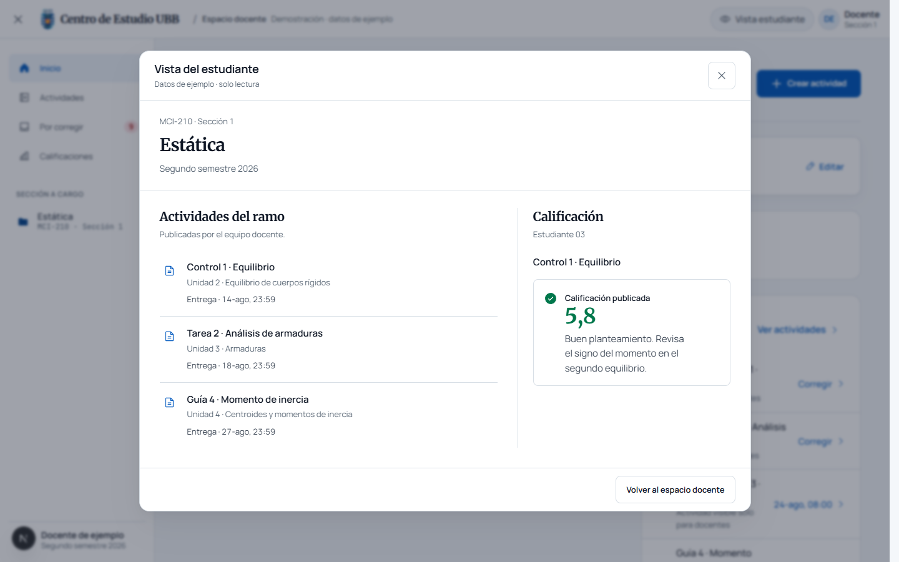
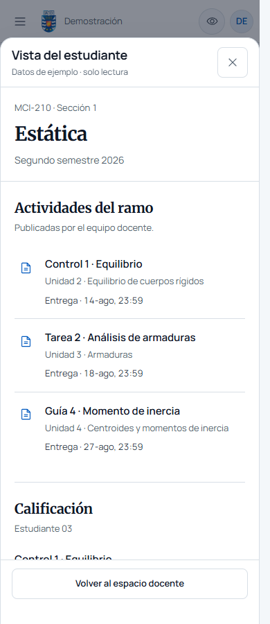

# UI state remediation

## Deliberate decision sheet

- **Subject:** UBB students and teachers must distinguish an unavailable academic record from a genuinely empty section before taking action.
- **Ground:** Sections, enrollment directories, weighted evaluations, classroom notices and local course archives.
- **Palette:** Preserve the existing semantic OKLCH tokens: canvas, card, body text, muted text, hairline and institutional blue. The canvas has a cool academic-paper bias. No new palette or literal hex equivalents are introduced.
- **Type:** Preserve Merriweather for section identity and Manrope for reading and controls; use tabular numerals for academic data. These are the established campus roles.
- **Space:** Use 8/12/16 px inside controls and 24/32 px between task regions. Compact infrequent import actions so mobile users reach the active classroom task earlier.
- **Shape:** Preserve 12 px primary surfaces and 8 px controls; use existing tonal separation. No new decorative elevation.
- **Motion:** Zero new animated moments; existing short transitions retain reduced-motion alternatives. Keyboard feedback stays immediate.
- **Signature:** Course name, section and period remain the stable academic context above every operation.

Critique: a generic dashboard would prioritize interchangeable cards and metrics. This change instead protects the meaning of enrollment, grading and unread activity. Existing identity is a deliberate constraint; changing fonts or colors would not resolve the audited state failures.

### Requested preview redesign

The follow-up screenshot identified excess chrome and cramped activity rows. The preview now uses a compact utility header, the same neutral course header as the classroom, and an unboxed activity list. The previous navy banner was explicitly rejected and removed. Deadlines sit below each activity instead of competing with its title. Desktop places the grade context alongside the list; mobile stacks both in a single scroll region. The repeated read-only footer description is removed, leaving one return action. The amber preview pill and decorative dot are replaced by plain demonstration text; the example-data disclosure remains available.

Desktop, 1440 CSS pixels:

Mobile, 390 CSS pixels:

## Resolution ledger

The source audit covered 42 desktop and 39 mobile screenshots at baseline `ea6b8d5`. The following ledger records the changes against its eleven findings.

| Finding                                                        | Resolution                                                                                                                                                                          | Regression evidence                                                                                                                          |
| -------------------------------------------------------------- | ----------------------------------------------------------------------------------------------------------------------------------------------------------------------------------- | -------------------------------------------------------------------------------------------------------------------------------------------- |
| A01: closed preview remains visible                            | Apply flex layout only to the open native dialog. Preserve mobile sheet width and safe-area spacing; make its independent scroll region keyboard accessible.                        | Open/close/Escape, focus restoration, modal state and bounds at 320, 390 and 1440 px.                                                        |
| A02: failed gradebook appears empty and editable               | Track gradebook loading, ready and error states. Preserve known values, disable the shared editor and dependent grade actions, and offer retry.                                     | Subscription failure versus confirmed absent record; disabled controls retain the loaded evaluation; saving becomes possible after recovery. |
| A03: synchronization failures claim there are no pending items | Aggregate readiness and errors across all section subscriptions. Distinguish pending/error/empty communications and quizzes. Retry failed conversations while preserving the draft. | Partial snapshots, independent section errors, recovery, quiz failure/empty distinction and draft retention.                                 |
| A04: presence count misrepresented as enrollment               | Replace the presence-derived enrollment total with a link to the authoritative participant directory.                                                                               | The link activates the Participants tab at all three widths.                                                                                 |
| A05: crowded teacher action row                                | Group the two infrequent import actions in a native disclosure. Keep publishing and correction directly available.                                                                  | Mobile and desktop classroom inspection; both importers retain their existing teacher authorization guards.                                  |
| A06: short account action targets                              | Set account action minimum height to the existing 44 px project target.                                                                                                             | Browser measurement at all three widths.                                                                                                     |
| A07: opaque interoperability failure                           | Explain the failed read, offer retry/support, retain technical details in a disclosure, and prevent authoring until loading succeeds.                                               | An isolated 403 response followed by successful recovery. Server origin and authorization checks remain intact.                              |
| A08: attachment palette literals                               | Reuse the existing surface, text, border, brand and feedback tokens throughout submission controls. Remove the decorative drag bounce.                                              | Source inspection and production compilation; upload behavior is unchanged.                                                                  |
| A09: duplicate file selectors                                  | Keep the native file input as the sole interactive target, style its containing label, expose focus, and display the complete selected filename.                                    | Real import dialog selection at all three widths; no import is executed.                                                                     |
| A10: duplicate search clear controls                           | Suppress the browser-specific search cancel affordance where the existing accessible clear button is present.                                                                       | Scoped CSS inspection; input/search semantics are preserved.                                                                                 |
| A11: unsupported accessibility claim                           | State the WCAG 2.2 AA objective, bounded review coverage and outstanding assistive-technology validation.                                                                           | Existing accessibility declaration contracts remain unchanged.                                                                               |

## Verification results

- `pnpm test`: production build, 627 unit tests and 25 rendered-page integration tests passed.
- The production build and 25 rendered-page tests passed again after the neutral-header change. `verify:fast` passed TypeScript, unit tests, test seals and specification validation; existing specification advisories remain. Prettier formatting and its verification passed.
- Playwright: all 15 focused UI-state, communications and accessibility regressions passed using installed Chrome with local preview fixtures. The six dialog/classroom checks passed again after the responsive redesign; the three dialog checks passed again after the final neutral-header change.
- Dialog inspection at 320, 390 and 1440 CSS pixels: no horizontal overflow, readable activity titles and deadlines, mobile stacking, desktop columns, close/Escape behavior, focus restoration, and zero axe contrast or scroll-region violations.
- `pnpm run verify:invariants`: 35 tests passed. Protected unit-test expectations and their seals are unchanged.
- ESLint: zero errors; two existing TanStack Virtual compatibility warnings remain in `AdminView` and `GradesSection`.
- React Doctor: 90/100, with two state-grouping suggestions in the existing import dialogs. No new dependency or reducer refactor is needed for the filename disclosure.
- Deliberate source pass: zero errors. The attachment control's compact type scale was retained; the two numeric advisories refer to CSS percentages, not displayed statistics. Screenshots were inspected directly.

## Validation boundaries

The browser regressions use local preview authentication and a local SQLite database. Failure/recovery checks use isolated transports and never submit academic mutations to Firebase. Screenshots are local review artifacts under `.impeccable/review/`, not production evidence.

This remediation does not certify complete WCAG conformance, diagnose production Firebase permission failures, or claim production performance measurements. The visual review preserves the existing institutional design; no new dependency, palette, font or component framework is introduced.
