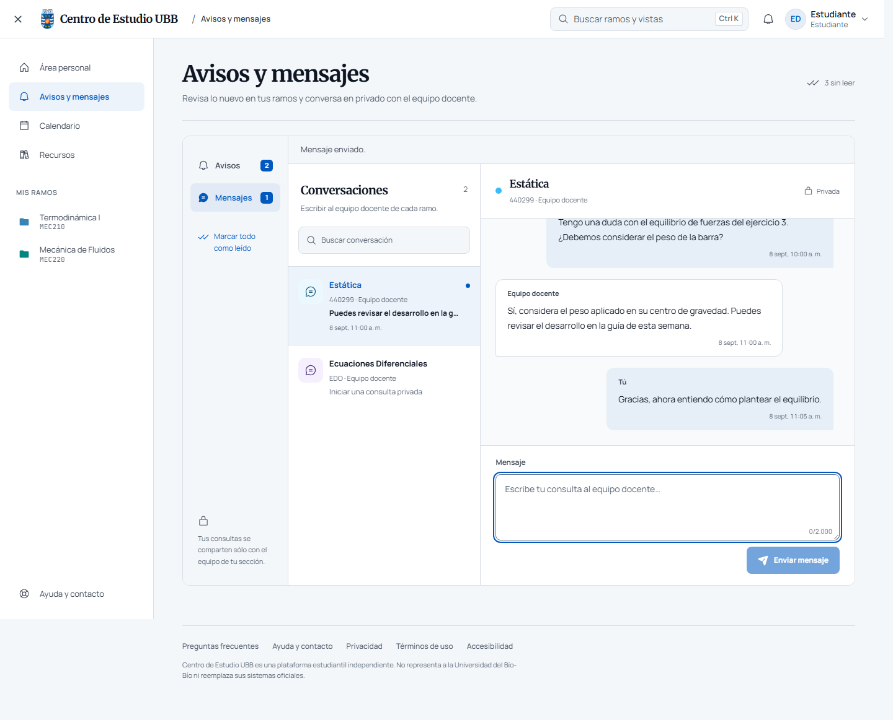
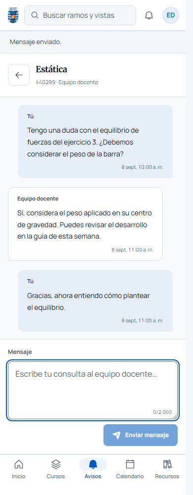
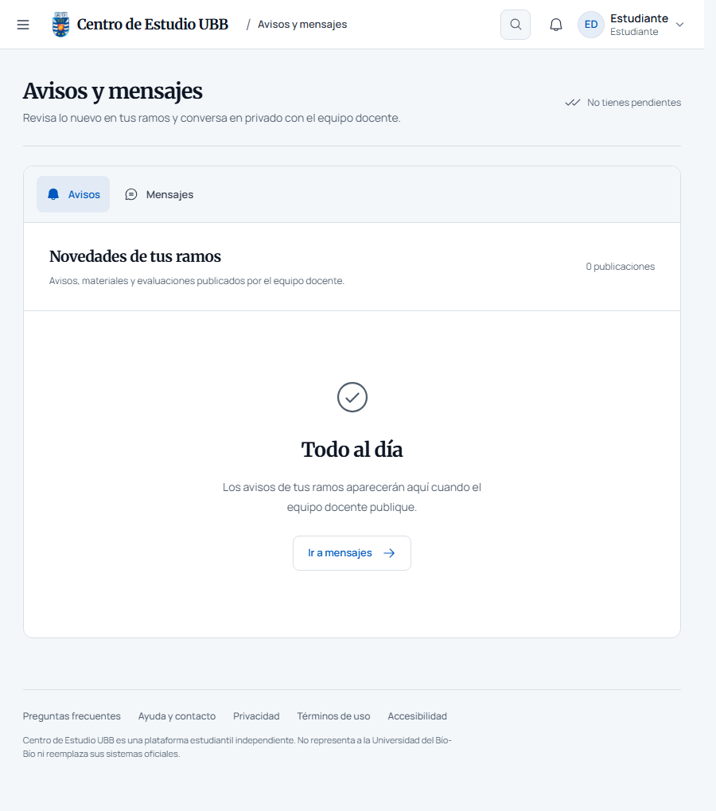

# Rediseño de Avisos y mensajes

Prioridad confirmada: bandeja clara y conversaciones protagonistas, dentro de la identidad institucional del campus.

El centro reúne navegación de Avisos/Mensajes, búsqueda por nombre y contexto de sección, lista con fechas y estado de lectura, historial y redactor. En móvil la conversación ocupa el espacio útil entre cabecera y navegación; volver recupera la lista. Los avisos usan filas con tipo, ramo, fecha y acceso al aula. El estado vacío ofrece acceso a Mensajes.

Se reutilizan los servicios y políticas actuales. No se añaden dependencias, rutas públicas de demostración ni cambios de backend. Las pestañas incorporan flechas, Inicio/Fin y orientación ARIA responsive con snapshot de servidor. El scroll de mensajes queda limitado al historial.

## Verificación

- `pnpm test`: compilación de producción y 624 pruebas aprobadas tras integrar `main` (#169).
- `pnpm run lint`, TypeScript y formato aprobados.
- `verify:fast`: 606 pruebas, 67 sellos SHA-256 y 31 especificaciones aprobadas antes de integrar #169; el hook de push vuelve a comprobar la versión final.
- `verify:invariants`: 35 pruebas aprobadas.
- Playwright: cuatro recorridos a 1918, 1440, 900 y 390px; búsqueda sin resultados, limpieza, orientación y teclado de pestañas, envío vacío bloqueado, error sin pérdida del texto, envío exitoso, vuelta móvil y redactor sobre la barra inferior.
- Dos recorridos adicionales de skeletons a 1440 y 390px aprobados tras integrar #169.
- React Doctor: 91/100 en la primera pasada, con avisos de tamaño de componentes y Motion existente. No se amplió el alcance para refactorizar esas superficies.

La revisión visual independiente validó las 12 capturas y pidió sincronizar la orientación ARIA de las pestañas. La corrección está cubierta por los cuatro recorridos finales. El subagente agotó su cuota antes del veredicto de esa corrección; el cierre y la documentación se realizaron en la tarea principal. No se presenta como una segunda aprobación independiente.

El detector Impeccable señaló desviaciones de tamaños respecto a la rampa documentada, incluyendo CSS global heredado. No se afirma una auditoría WCAG completa ni un detector global limpio.

## Capturas y límites

Las capturas de conversación renderizan el componente real con datos y transporte sintéticos del test; los estados vacíos usan la sesión de desarrollo local. No hubo envíos reales ni validación de Firebase en producción. Las imágenes son capturas de Playwright, sin generación ni edición gráfica.

