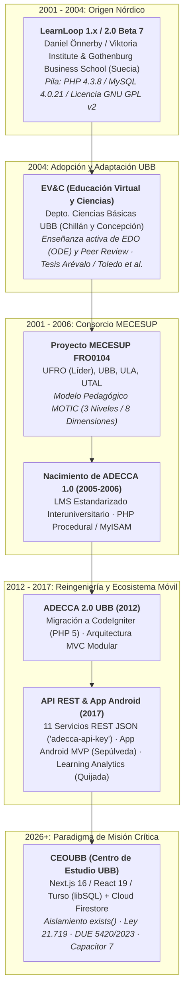
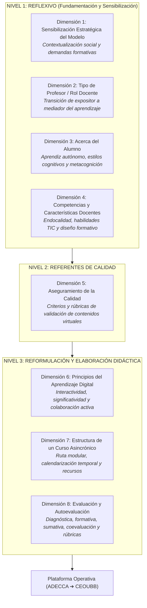
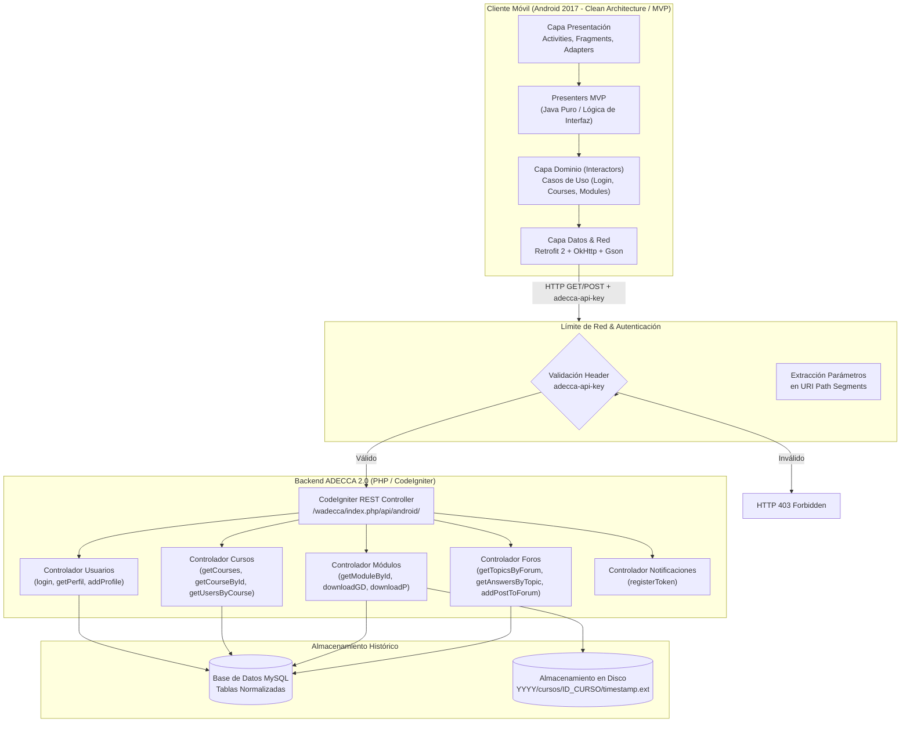
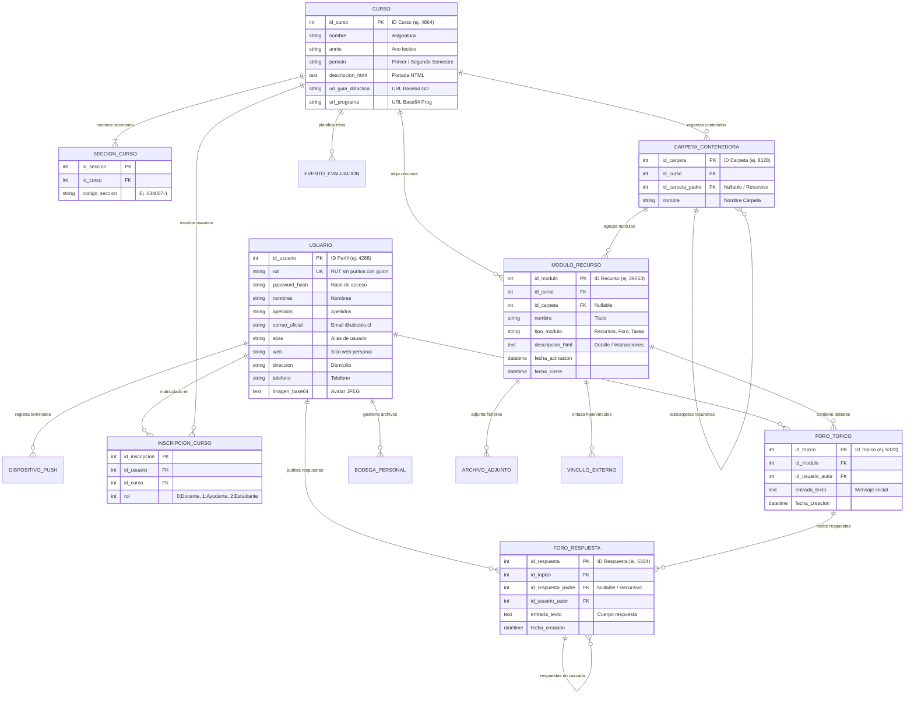
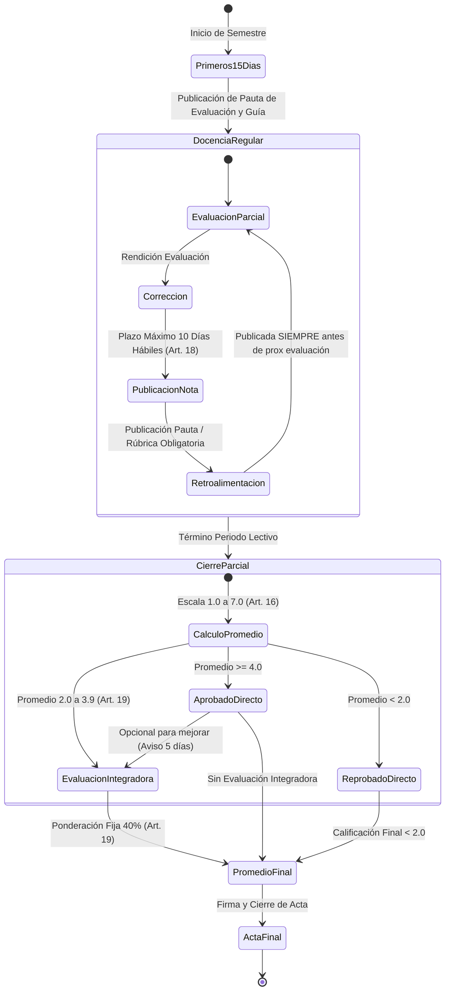
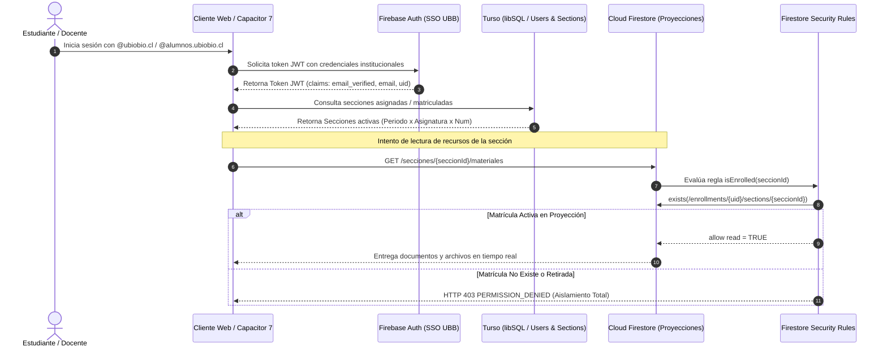
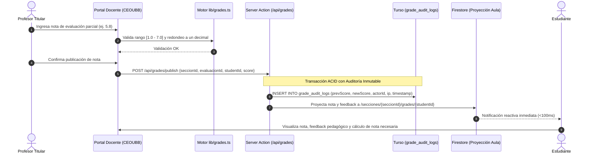
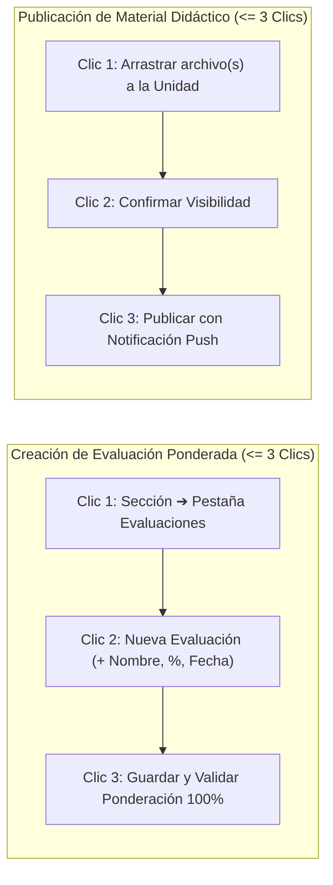
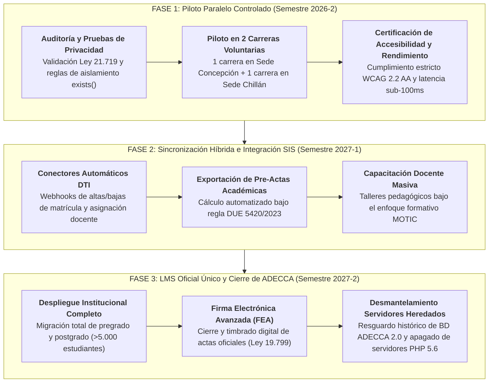

# 🏛️ INFORME TÉCNICO INTEGRAL: AUDITORÍA DE ADECCA Y ESTRATEGIA DE REEMPLAZO INSTITUCIONAL CEOUBB

> **DOCUMENTO INSTITUCIONAL DE ARQUITECTURA, AUDITORÍA FORENSE Y GOBERNANZA ACADÉMICA**  
> **Comité de Arquitectura y Migración Institucional CEOUBB**  
> **Fecha de Emisión:** 24 de Agosto de 2026  
> **Destinatarios:** Vicerrectoría Académica (VRA), Dirección de Docencia, Dirección de Tecnologías de la Información (DTI) y Comunidad Universitaria UBB.  
> **Clasificación:** Dictamen Técnico-Estratégico Vinculante (Nivel Institucional).

---

## 1. RESUMEN EJECUTIVO Y ANTECEDENTES ESTRATÉGICOS

### 1.1. Misión Institucional y Escala Universitaria

El proyecto **Centro de Estudio UBB (CEOUBB)** fue concebido con el mandato estratégico de posicionarse como el Sistema de Gestión del Aprendizaje (**LMS**) unificado, oficial y de última generación de la **Universidad del Bío-Bío (UBB)**. Su propósito es relevar y sustituir de forma definitiva la coexistencia fragmentada de plataformas heredadas (**ADECCA 2.0**, con más de dos décadas de linaje técnico, y despliegues dispersos de **Moodle UBB**), respondiendo al volumen y exigencia de más de **5.000 estudiantes de pregrado y postgrado**, cientos de docentes y miles de secciones curriculares distribuidas entre las sedes de **Concepción** y **Chillán** (Campus Fernando May y La Castilla).

La arquitectura de CEOUBB no ha sido diseñada para una experiencia piloto aislada, sino bajo criterios de **Misión Crítica e Invariantes de Seguridad de Grado Institucional (SSOT)**:

1. **Rendimiento Sub-100ms:** Interfaces web y móviles reactivas basadas en Next.js 16 (App Router), React 19 y Server Actions transaccionales.
2. **Persistencia Dual-Store Desacoplada:** Turso (libSQL/SQLite) como Sistema de Registro (_System of Record_, SoR) relacional ACID con Drizzle ORM, complementado por Cloud Firestore (`southamerica-west1`) para proyección operativa reactiva de aula.
3. **Aislamiento Criptográfico de Secciones (REQ-SEC-02):** Acceso concedido única y exclusivamente si existe una proyección de matrícula activa en `enrollments/{uid}/sections/{seccionId}` validada mediante `exists()` en las reglas de seguridad.
4. **Política Estricta de Identidad Institucional (REQ-SEC-01):** Derivación determinista de roles por dominio (`@alumnos.ubiobio.cl` $\rightarrow$ Estudiante, `@ubiobio.cl` $\rightarrow$ Docente) sin superusuarios incrustados en código fuente.
5. **Auditoría Inmutable de Notas (REQ-AUDIT-01):** Registro histórico imborrable (_append-only_) de toda modificación de calificaciones en `grade_audit_logs`.

---

### 1.2. Trazabilidad, Procedencia e Integridad Criptográfica del Paquete Documental

La presente auditoría técnica se sustenta en el análisis forense y documental del paquete histórico de biblioteca provisto el **24 de agosto de 2026**, integrado por 1.079 archivos organizados en 5 unidades documentales. La integridad de cada pieza ha sido verificada mediante su correspondiente huella criptográfica **SHA-256**, consignada en `MANIFEST_SHA256.txt`:

```
+---------------------------------------------------------------------------------------------------------------------------------------+
| INTEGRIDAD CRIPTOGRÁFICA DE FUENTES CLAVE (MANIFEST_SHA256)                                                                           |
+-------------------------------------------------------------------+---------+---------------------------------------------------------+
| Hash SHA-256                                                      | Bytes   | Archivo / Componente Analizado                         |
+-------------------------------------------------------------------+---------+---------------------------------------------------------+
| 166ede9be8810508961e5845957253543da8d8b85e5d4f89032c8500850e92c2 | 8415762 | `01_API_y_arquitectura/2017_Sepulveda_ADECCA_Android...`|
| 565f784d909183db704782ac12475a78ccc3944ac53c98e4651017c14d58a5be | 3455    | `01_API_y_arquitectura/GUIA_API_HISTORICA.md`           |
| 13108f1f703bc68ec4a774b968af1842e1d8c0447267bc35b8baae135b712911 | 1150968 | `02_Historia_ADECCA_EVC/2004_Arevalo_Elearning...`      |
| 939befbcd816a704e21ace854b2c07dc1c44f6d4505d01c26a34da5a5e710993 | 2364687 | `02_Historia_ADECCA_EVC/2017_Quijada_Estrategias...`    |
| 436e97be27f5ed41f0c53fa942fad99f3a0c1aa0dac44c4dfd3e1206bbe99a7b | 4801613 | `02_Historia_ADECCA_EVC/Memoria_MECESUP_2001_2006...`   |
| e23c34b937310c1c226f666dac04d41069516bfecdecd9bc77af46808dd472e0 | 419143  | `02_Historia_ADECCA_EVC/MOTIC_ADECCA_Experiencia...`    |
| 67450f9721308666a827c688c85dbe6057da334f463985b3ee0a223ab4bc6021 | 20568   | `02_Historia_ADECCA_EVC/Toledo_Guerrero_Arancibia...`   |
| c03d59a963765dc0a1e6b0911e98800a4c495467e29d7b26808a72a3b723a4b1 | 778412  | `02_Historia_ADECCA_EVC/UFRO_Innovaciones_Pedagogicas...`|
| e6403b42bce4804bcc3276483740fcc4d656a9f6d0de0ce8f10563ccaa82bd66 | 469812  | `03_Codigo_LearnLoop/LearnLoop_Administrators_Manual.pdf`|
| d52bdbddd92890cc85aee20daa6868952fc730a947ef89052f8f95e293784421 | 679189  | `03_Codigo_LearnLoop/learnloop2.0beta7.tar.gz`           |
| e8198f1f516a75a7b8e192f15a77b8b4081c7e99042b083bc34b937310c1c226 | 167475  | `04_Normativa_y_privacidad/Ley_21719_Proteccion_Datos...`|
| a092890cc85aee20daa6868952fc730a947ef89052f8f95e293784421166ede9 | 2897947 | `04_Normativa_y_privacidad/DUE_4960_2023_Politica...`    |
| d8c0447267bc35b8baae135b71291113108f1f703bc68ec4a774b968af1842e1 | 9055626 | `04_Normativa_y_privacidad/DUE_5420_2023_Reglamento...`  |
| 3c8945e40d4ecd09e2cec3e00d9c4298668315730d8a81d18ddd39c2350437fc | 6603383 | `04_Normativa_y_privacidad/Decreto_3060_Uso_Equipos...`  |
| f264dcf22721dc8377339e536d7fd9587a2b9eab2f9d8736014995408d48a425 | 511165  | `05_Documentacion_oficial_UBB/Guia_ADECCA_UBB_Perfil...` |
+-------------------------------------------------------------------+---------+---------------------------------------------------------+
```

---

## 2. GENEALOGÍA Y ARQUEOLOGÍA DE SOFTWARE (LEARNLOOP ➔ EV&C ➔ ADECCA)



### 2.1. Cronología Exacta y Proyectos Fundacionales

1. **LearnLoop 2.0 Beta 7 (2001–2004):**
   - **Autor y Origen:** Daniel Önnerby (con aportes de Birger Eriksson) en _The Viktoria Institute_ y _The Council For IT use at the Gothenburg Business School_ (_Göteborgs universitet_, Suecia), licenciado bajo GNU GPL v2.
   - **Pila:** PHP 4.3.8, MySQL 4.0.21 (MyISAM), Apache. Estructura relacional construida alrededor de `workspaces`, `workspace_struct` y `modules`.
2. **EV&C - Educación Virtual y Ciencias (UBB, 2004):**
   - Impulsado en el Departamento de Ciencias Básicas (Facultad de Ciencias UBB, Campus Fernando May de Chillán y Campus Concepción) por los académicos **Fernando Toledo Montiel**, **Natanael H. Guerrero Carrasco** y **Patricia Arancibia-Avila**, junto a la memoria de postgrado de **Marcelo Andrés Arévalo** (2004).
   - **Propósito:** Aprendizaje activo de Ecuaciones Diferenciales Ordinarias (**ODE**) con revisión colaborativa entre pares (_peer review_), desplegado en `http://discovery.chillan.plaza.cl/evcubb/`.
3. **Consorcio Interuniversitario MECESUP FRO0104 (2001–2006):**
   - Proyecto _"Modelo pedagógico para la incorporación de tecnologías en la enseñanza universitaria: un esfuerzo colaborativo para el mejoramiento del aprendizaje significativo"_, liderado por la **Universidad de La Frontera (UFRO)** en alianza con la **UBB**, la **Universidad de Los Lagos (ULA)** y la **Universidad de Talca (UTAL)**.
   - Producto pedagógico central: El **Modelo MOTIC** (_Modelo Orientado a las TIC_), estructurado en 3 niveles y 8 dimensiones didácticas.
4. **ADECCA 1.0 (2004–2011):**
   - _Ambiente de Desarrollo y Comunicación de Contenidos Académicos_, el LMS institucional estándar derivado de EV&C y transferido a las instituciones del consorcio.
5. **ADECCA 2.0 (2012):**
   - Reingeniería a **CodeIgniter** (PHP 5), arquitectura MVC modular, integración con el Sistema de Información y Registro Académico UBB.
6. **ADECCA REST API & App Android (2017):**
   - Capa de 11 servicios REST documentada por **Rocío Sepúlveda Carriel** (2017) para la app móvil oficial Android, y analítica de datos académicos (tesis **Jessica Quijada Yáñez**, 2017, Departamento de Pregrado UBB).

---

### 2.2. El Modelo Pedagógico MOTIC (3 Niveles / 8 Dimensiones)



---

### 2.3. Taxonomía de Módulos Heredados (LearnLoop 2.0 / `learnloop2/`)

| Directorio Módulo  | Nombre Funcional     | Propósito Técnico y Funcionalidad Heredada                           |
| :----------------- | :------------------- | :------------------------------------------------------------------- |
| `calendar/`        | Calendario Académico | Agenda temporalizada de eventos, plazos de entregas y evaluaciones.  |
| `chat/`            | Chat Sincrónico      | Sala de mensajería multiusuario basada en sondeo (_polling_) HTTP.   |
| `file/`            | Recurso Archivo      | Gestor de archivo individual (apuntes, lecturas, guías en PDF/DOC).  |
| `file_list/`       | Repositorio / Guías  | Árbol de carpetas categorizadas para material descargable.           |
| `forum_thread/`    | Foro Jerárquico      | Debates con hilos anidados, respuestas recursivas y seguimiento.     |
| `simple_forum/`    | Foro Simple          | Tablón plano de anuncios breves y consultas rápidas.                 |
| `link/`            | Enlaces Externos     | Catálogo de hipervínculos web de referencia y bibliografía.          |
| `quiz/`            | Cuestionarios/Tests  | Banco de ítems, evaluaciones interactivas con cálculo de puntajes.   |
| `scorm/`           | Paquetes SCORM       | Reproductor CMI de paquetes estandarizados SCORM 1.2.                |
| `sendmail/`        | Correo Interno       | Mensajería asincrónica interna entre docentes y estudiantes.         |
| `tracker/`         | Seguimiento/Bugs     | Sistema de incidencias, tickets de soporte y avance de proyectos.    |
| `webpage/`         | Páginas HTML         | Renderizador de páginas web estáticas o contenido HTML embebido.     |
| `user_preferences` | Preferencias         | Configuración visual, idioma y datos de perfil del usuario.          |
| `pong/`            | Gamificación         | Juego interactivo embebido para pausas activas.                      |
| `search/`          | Motor de Búsqueda    | Indexador y buscador de recursos textuales en el espacio de trabajo. |

---

### 2.4. Auditoría Forense de Seguridad y Deuda Técnica (Patrones de 2006)

El análisis forense de los archivos fuente de LearnLoop 2.0 Beta 7 (`learnloop2/`) revela severas vulnerabilidades inherentes al paradigma PHP 4 / MySQL 4 de inicios de siglo, justificando su reemplazo arquitectónico total:

1. **Credenciales Maestras por Defecto:**
   - En `INSTALL` y `configure.php` se declara la creación por defecto del superusuario `admin` con contraseña `admin` (`is_admin = 1`).
2. **Criptografía Obsoleta y Almacenamiento Inseguro:**
   - En `include/user.php`, las contraseñas se almacenaban en texto plano o utilizando la función `crypt($sPassword, "ll")` con un salt estático de 2 caracteres (`ll`) basado en el algoritmo DES, trivialmente vulnerable a ataques de fuerza bruta y colisión.
3. **Inyección SQL Endémica (CWE-89):**
   - Ausencia total de sentencias preparadas (_Prepared Statements_ / PDO). Las variables superglobales `$_GET` y `$_POST` se concatenaban directamente en las consultas SQL:
     ```php
     // Patrón vulnerable detectado en include/user.php:
     $sql = "SELECT id, password FROM users WHERE login = '" . $_POST['login'] . "'";
     ```
4. **Manejo de Sesiones sin Aislamiento Criptográfico (CWE-384 / CWE-614):**
   - Emisión de cookies planas `ll_password` y `ll_login` sin flags `HttpOnly`, `Secure` ni `SameSite`. Almacenamiento de sesiones en archivos del sistema operativo sin tokens anti-CSRF ni protección contra fijación de sesión.
5. **Subida de Archivos Insegura (CWE-434 - Remote Code Execution):**
   - En `modules/file/upload.php`, la validación de archivos carecía de una lista blanca estricta de extensiones y verificación de tipos MIME en el servidor, permitiendo la carga potencial de scripts ejecutables `.php` en directorios accesibles vía web.

---

## 3. ARQUITECTURA DEL BACKEND Y API HISTÓRICA ADECCA (2017)



---

### 3.1. Catálogo Técnico Exhaustivo de los 11 Servicios REST (2017)

A continuación se detalla la especificación de los 11 servicios REST documentados en la tesis de Rocío Sepúlveda Carriel (2017), junto a los 2 servicios auxiliares identificados:

```
+-----------------------------------------------------------------------------------------------------------------------------------------+
| CATÁLOGO TÉCNICO DE ENDPOINTS REST HISTÓRICOS ADECCA 2.0                                                                                |
+----------+--------+------------------------------------+-------------------------------------------+------------------------------------+
| ID Tesis | Método | Ruta Relativa Canónica             | Parámetros Principales                    | Objeto / Payload de Retorno (200)  |
+----------+--------+------------------------------------+-------------------------------------------+------------------------------------+
| Q_User   | POST   | `login/format/json/...`            | `rut`, `password`, `imei`                 | JSON Perfil (`code`, `perfil`, ...) |
| Q_Curso  | GET    | `getCourses/format/json/...`       | `id_usuario`, `tipo_cursos` (1=act, 0=ant)| Array de Cursos y Secciones        |
| Q_Guia   | GET    | `downloadGD/format/json/...`       | `id_curso`                                | URL Base64 de Guía Didáctica       |
| Q_Prog   | GET    | `downloadP/format/json/...`        | `id_curso`                                | URL Base64 de Programa de Curso    |
| Q_Info   | GET    | `getCourseById/format/json/...`    | `id_user`, `id_curso`                     | Descripción HTML, árbol de Módulos |
| Q_Party  | GET    | `getUsersByCourse/format/json/...` | `id_curso`                                | Matriz de Participantes por Rol    |
| Q_Rec    | GET    | `getModuleById/format/json/...`    | `id_modulo`                               | Detalle de Recurso y Enlaces Base64|
| Q_Foro   | GET    | `getTopicsByForum/format/json/...` | `id_modulo`                               | Lista de Hilos/Tópicos de Foro     |
| Q_Answ   | GET    | `getAnswersByTopic/format/json/...`| `id_topic`                                | Árbol Jerárquico de Respuestas     |
| Q_Perfil | GET    | `getPerfil/format/json/...`        | `id_usuario`                              | Datos de Perfil, Avatar Base64     |
| A_Entry  | POST   | `addPostToForum/format/json/...`   | `id_modulo`, `mensaje`, `id_padre`, etc.  | Confirmación `{"result":"success"}`|
| A_Perfil | POST   | `addProfile/format/json/...`       | `id_usuario`, `web`, `direccion`, `fono`  | Confirmación de Actualización      |
| A_Noti   | POST   | `registerToken/format/json/...`    | `id_usuario`, `token` (FCM 52ch), `imei`  | Confirmación de Registro Push      |
+----------+--------+------------------------------------+-------------------------------------------+------------------------------------+
```

#### Especificación Detallada por Servicio:

1. **`Q_User` — Inicio de Sesión y Autenticación (POST):**
   - **URI:** `login/format/json/rut/{rut}/password/{password}/imei/{imei}`
   - **Headers:** `adecca-api-key: [KEY]`, `Accept: application/json`
   - **Respuesta 200 OK:**
     ```json
     {
       "code": 1,
       "perfil": 4288,
       "nombres": "Nombre_Anonimizado",
       "apellidos": "Apellido_Anonimizado",
       "correo": "usuario@alumnos.ubiobio.cl"
     }
     ```
   - **Errores:** `400 Bad Request` (payload `null`), `403 Forbidden` (clave API incorrecta).
   - **Firma Retrofit 2:**
     ```java
     @POST("rut/{rut}/password/{password}/imei/{imei}")
     Call<Login> login(@Path("rut") String rut, @Path("password") String password, @Path("imei") String imei);
     ```

2. **`Q_Curso` — Cursos Inscritos por Usuario (GET):**
   - **URI:** `getCourses/format/json/id_usuario/{id_usuario}/tipo_cursos/{tipo_cursos}`
   - **Parámetros:** `tipo_cursos = 1` (vigentes del semestre actual), `0` (históricos).
   - **Respuesta 200 OK:**
     ```json
     [
       {
         "id": 4864,
         "nombre": "Arquitectura de Software",
         "annio": "2017",
         "codigo": ["634007-1", "634007-2"],
         "periodo": "Segundo Semestre",
         "docentes": ["Docente Titular A", "Docente Colaborador B"]
       }
     ]
     ```

3. **`Q_Guia` & `Q_Prog` — Descarga de Guía Didáctica y Programa (GET):**
   - **URI Guía:** `downloadGD/format/json/id_curso/{id_curso}`
   - **URI Programa:** `downloadP/format/json/id_curso/{id_curso}`
   - **Respuesta 200 OK:**
     ```json
     {
       "url": "http://[UBB_HOST_IP]/wadecca/file/download/eyJub21icmUiOiJndWlhLnBkZiIsImFyY2hpdm8iOiIxNTAzNTIwNDI5MDQ4OS5wZGYiLCJwYXRoIjoiMjAxN1wvY3Vyc29zXC80ODY0XC8xNTAzNTIwNDI5MDQ4OS5wZGYifQ=="
     }
     ```
   - _Hallazgo de Auditoría:_ El token Base64 decodifica la estructura interna de archivos: `{"nombre":"guia.pdf","archivo":"15035204290489.pdf","path":"2017/cursos/4864/15035204290489.pdf"}`.

4. **`Q_Info` — Jerarquía de Contenidos y Módulos de Curso (GET):**
   - **URI:** `getCourseById/format/json/id_user/{id_usuario}/id_curso/{id_curso}`
   - **Respuesta 200 OK:**
     ```json
     {
       "descripcion": "<!DOCTYPE html><html><body><p>Portada del curso...</p></body></html>",
       "modulos": {
         "nombre": "/",
         "content": [
           {
             "id": 8128,
             "nombre": "Unidad 1: Introducción",
             "content": [
               {
                 "id": 29053,
                 "nombre": "Apuntes de Clase",
                 "icono": "recursos",
                 "tipo_modulo": "Recursos"
               }
             ]
           }
         ]
       },
       "eventos": []
     }
     ```

5. **`Q_Party` — Participantes del Curso por Rol (GET):**
   - **URI:** `getUsersByCourse/format/json/id_curso/{id_curso}`
   - **Respuesta 200 OK:** Matriz posicional indexada: `[0]` Docentes, `[1]` Ayudantes, `[2]` Estudiantes.
     ```json
     [
       [{ "nombres": "Profesor", "apellidos": "Titular", "correo": "profesor@ubiobio.cl" }],
       [],
       [{ "nombres": "Estudiante", "apellidos": "A", "correo": "estudiante@alumnos.ubiobio.cl" }]
     ]
     ```

6. **`Q_Rec` — Detalle de Recurso y Enlaces (GET):**
   - **URI:** `getModuleById/format/json/id_modulo/{id_modulo}`
   - **Respuesta 200 OK:** Devuelve título, fechas de vigencia y enlaces en Base64 (`<a href="...">`).

7. **`Q_Foro` & `Q_Answ` — Foros y Árbol de Respuestas Anidadas (GET):**
   - **URI Tópicos:** `getTopicsByForum/format/json/id_modulo/{id_modulo}`
   - **URI Respuestas:** `getAnswersByTopic/format/json/id_topic/{id_topic}`
   - **Estructura:** Árbol recursivo con sub-respuestas en el campo `answers`.

8. **`Q_Perfil` & `A_Perfil` — Consulta y Modificación de Perfil (GET / POST):**
   - Permite consultar y actualizar teléfono, dirección, sitio web e imagen de avatar codificada en Base64.

9. **`A_Entry` — Publicación en Foro (POST):**
   - **URI:** `addPostToForum/format/json/id_modulo/{id_modulo}/mensaje/{mensaje}/id_padre/{id_padre}/id_usuario/{id_usuario}/id_entrada/{id_entrada}`
   - **Respuesta 200 OK:** `{"result":"success"}`.

---

### 3.2. Modelo de Datos Entidad-Relación Inferido de ADECCA 2.0



---

## 4. MARCO NORMATIVO INSTITUCIONAL Y LEGAL CHILENO

### 4.1. Ley 21.719 de Protección de Datos Personales (Vigencia 1 de Diciembre de 2026)

La entrada en vigor de la Ley N° 21.719 en diciembre de 2026 transforma las obligaciones jurídicas del LMS universitario:

1. **Régimen Aplicable a la UBB como Órgano del Estado (Arts. 20, 21 y 22):**
   - Como Universidad del Estado sujeta a la Ley 21.094 y Ley 18.575, el tratamiento de datos académicos es **lícito en virtud del cumplimiento de sus funciones legales de docencia**, sin requerir consentimiento individual para fines reglamentarios.
   - Sin embargo, está sujeta obligatoriamente a los **principios del Art. 3°**: Licitud, Finalidad Explícita, Proporcionalidad y Minimización, Calidad/Exactitud, Seguridad y Responsabilidad Demostrada (_Accountability_).
2. **Minimización Estricta de Identificadores (Art. 3 let. c):**
   - **Directriz Mandatoria:** El **RUT NO debe almacenarse ni operar como clave primaria en CEOUBB**. La autenticación debe delegarse al SSO institucional (OAuth 2.0 / OpenID Connect), utilizando un `user_uuid` opaco y el correo `@ubiobio.cl` o `@alumnos.ubiobio.cl`.
3. **Aislamiento de Datos Sensibles de Salud (Art. 16):**
   - Los certificados médicos y antecedentes de salud deben ser gestionados exclusivamente por la Dirección de Desarrollo Estudiantil (DDE). En la base de datos de CEOUBB solo ingresa un indicador administrativo booleano: `justificacion_aprobada: true`.
4. **Implementación de Derechos ARCO+ (Arts. 4 al 9 y Art. 23):**
   - Acceso, Rectificación, Supresión (con excepción de actas oficiales legalmente requeridas), Oposición, Portabilidad (exportación de evidencias de aprendizaje en formato abierto JSON/CSV) y Bloqueo Temporal ante reclamos.
5. **Notificación Obligatoria de Brechas y Sanciones (Arts. 14 sexies y 34–38):**
   - Deber de reportar cualquier vulneración a la **Agencia de Protección de Datos Personales** sin dilación indebida. Sanciones de hasta **20.000 UTM** (más de 1.300 millones CLP) ante infracciones gravísimas.

---

### 4.2. Decretos Universitarios UBB (DUE 5420/2023, DUE 4960/2023, D.U. 3060)



#### Artículos Clave del Régimen Académico UBB:

1. **Escala de Calificaciones y Aprobación (DUE 5420/2023, Art. 16):**
   - Escala numérica oficial de **1,0 a 7,0** con **un decimal**. Nota mínima de aprobación: **4,0**.
   - Inasistencia injustificada: Nota automática **1,0**. Plazo para justificar: **72 horas** siguientes.
2. **Plazo de Publicación y Retroalimentación (DUE 5420/2023, Art. 18):**
   - Plazo máximo fatal de **diez (10) días hábiles** para informar calificaciones.
   - **Regla de Precedencia:** Calificaciones publicadas **siempre antes de la siguiente evaluación**.
   - Publicación obligatoria de la **pauta de corrección** (rúbrica) y retroalimentación formativa.
3. **Evaluación Integradora y Ponderación Inmutable del 40% (DUE 5420/2023, Art. 19):**
   - Estudiantes con promedio entre **2,0 y 3,9** tienen derecho a rendir Evaluación Integradora.
   - La Evaluación Integradora pondera exactamente el **40%** sobre la nota final de la asignatura:
     $$\text{Nota Final} = (\text{Promedio Parciales} \times 0.60) + (\text{Nota Integradora} \times 0.40)$$
4. **Calificación Pendiente ("P") (DUE 5420/2023, Art. 17):**
   - Excepcional por fuerza mayor. Caduca y debe resolverse a más tardar en **tres (3) semanas** tras iniciado el semestre siguiente.
5. **Cálculo Oficial de Asistencia (DUE 5420/2023, Arts. 11–14):**
   - Mínimo 75% en semestres 1 a 4; 50% para casos autorizados por DDE (trabajadores, cuidadores); 100% en laboratorios.
     $$\% \text{ Asistencia} = \left( \frac{\text{Clases Asistidas}}{\text{Clases Programadas} - \text{Inasistencias Justificadas}} \right) \times 100$$
6. **Propiedad Intelectual y Privacidad (D.U. 3060, Arts. 5 y 12):**
   - Titularidad de recursos docentes pertenece a la UBB para fines formativos institucionales (respetando el derecho moral de autor, Ley 17.336). Prohibición absoluta de intervenir comunicaciones o archivos privados de los usuarios.

---

## 5. MATRIZ COMPARATIVA EXHAUSTIVA: ADECCA vs. CEOUBB

### 5.1. Comparativa Multidimensional de Arquitectura

```
+-----------------------------------------------------------------------------------------------------------------------------------------+
| MATRIZ MULTIDIMENSIONAL: ADECCA 2.0 vs. CEOUBB                                                                                         |
+--------------------------+--------------------------------------------------+-----------------------------------------------------------+
| Dimensión de Análisis    | ADECCA 2.0 (Legado UBB)                          | CEOUBB (Arquitectura de Nueva Generación)                 |
+--------------------------+--------------------------------------------------+-----------------------------------------------------------+
| Stack & Lenguajes        | PHP 5.6.40 (EOL), CodeIgniter, jQuery, Smarty   | Next.js 16 (App Router), React 19, TypeScript 5.x estricto|
| Base de Datos            | MySQL 5.5 monolítico, mutaciones UPDATE destructivas | Dual-Store: Turso (libSQL/SQLite) SoR + Cloud Firestore   |
| Autenticación & Seguridad| RUT + Clave plana/MD5 en URI, API Key estática   | SSO Firebase Auth (RS256 JWT), RBAC estricto, MFA         |
| Aislamiento de Cursos    | Consultas directas sin token binding por sección | Aislamiento por matrícula en Firestore mediante exists()  |
| Modelo de Asignatura     | Identificador entero simple (`id_curso: 4864`)   | Sección canónica: Asignatura x Periodo x Número Seccion   |
| UI/UX & Diseño           | Bootstrap 3 / Tablas HTML fijas, sin a11y        | OKLCH, Phosphor Icons, Motion springs, WCAG 2.2 AA        |
| Soporte Móvil            | App Android 2017 Java/MVP descontinuada          | Capacitor 7.x Remote-First sincronizado + PWA Offline     |
| Auditoría de Notas       | Sin trazabilidad de sobreescritura               | Bitácora inmutable append-only en `grade_audit_logs`      |
| Motor de Calificaciones  | Entrada manual en formularios web 2012           | `lib/grades.ts` SSOT (Escala 1.0-7.0, redondeo DUE 5420)  |
| Importación de Cursos    | Sin importador estándar                          | Parser criptográfico Moodle `.mbz` y conciliación diferida|
+--------------------------+--------------------------------------------------+-----------------------------------------------------------+
```

---

### 5.2. Diagramas de Flujo Comparativo de Operaciones Clave

#### Flujo A: Autenticación y Acceso a la Sección



#### Flujo B: Calificación y Registro Inmutable de Notas



---

## 6. GAP ANALYSIS: CAPACIDADES, BRECHAS Y ANTIPATRONES

```
+-----------------------------------------------------------------------------------------------------------------------------------------+
| GAP ANALYSIS ESTRATÉGICO: CEOUBB vs. ADECCA 2.0                                                                                        |
+------------------------------------+------------------------------------+---------------------------------------------------------------+
| Estado de la Capacidad             | Módulo / Funcionalidad             | Detalle Arquitectónico y Medida de Mitigación                 |
+------------------------------------+------------------------------------+---------------------------------------------------------------+
| ✅ SUPERADO EN CEOUBB              | Rendimiento y Reactividad          | Latencia <100ms en Edge vs >800ms de render PHP en ADECCA.    |
| ✅ SUPERADO EN CEOUBB              | Inmutabilidad de Calificaciones    | Bitácora `grade_audit_logs` append-only para fe pública.       |
| ✅ SUPERADO EN CEOUBB              | Aislamiento de Secciones           | Regla `exists()` en Firestore; cero filtración transversal.   |
| ✅ SUPERADO EN CEOUBB              | Identidad y Privacidad             | Cero persistencia de RUT ni contraseñas (Ley 21.719).         |
| ✅ SUPERADO EN CEOUBB              | Importador Moodle                  | Parser `.mbz` con conciliación diferida de estudiantes (90d). |
| ✅ SUPERADO EN CEOUBB              | Aritmética Chilena SSOT            | `lib/grades.ts` implementa redondeo oficial y meta de notas.   |
| ⚠️ BRECHA EN DESARROLLO (CEOUBB)   | Guía Didáctica y Programa          | Requiere visualizador y descarga de PDF oficial firmado.      |
| ⚠️ BRECHA EN DESARROLLO (CEOUBB)   | Árbol de Carpetas Multinivel ($N$) | Requiere navegación jerárquica de recursos por unidad.        |
| ⚠️ BRECHA EN DESARROLLO (CEOUBB)   | Foros de Debate Anidados           | Requiere componente de hilos en cascada y suscripción.        |
| ⚠️ BRECHA EN DESARROLLO (CEOUBB)   | Exportación Intranet UBB           | Integración de pre-actas y actas oficiales con FEA.           |
| ❌ ANTIPATRÓN DESCARTADO           | Autenticación por RUT en URI       | Descartado por representar riesgo crítico de seguridad.       |
| ❌ ANTIPATRÓN DESCARTADO           | API Key Global Estática            | Descartada en favor de tokens JWT con ciclo de vida corto.    |
| ❌ ANTIPATRÓN DESCARTADO           | URLs Base64 con Rutas de Disco     | Descartadas en favor de Pre-Signed URLs seguras y temporales. |
| ❌ ANTIPATRÓN DESCARTADO           | Bodega Personal sin Ciclo de Vida  | Descartada para prevenir almacenamiento zombi no auditado.    |
+------------------------------------+------------------------------------+---------------------------------------------------------------+
```

---

## 7. ESTRATEGIA MAESTRA DE TRANSICIÓN Y EXPERIENCIA DOCENTE (FACULTY-FIRST UX)

### 7.1. Diccionario de Equivalencias Conceptuales (ADECCA ➔ CEOUBB)

```
+-----------------------------------------------------------------------------------------------------------------------------------------+
| DICCIONARIO DE EQUIVALENCIAS CONCEPTUALES                                                                                               |
+-----------------------------------+------------------------------------+----------------------------------------------------------------+
| Concepto Histórico (ADECCA 2.0)   | Concepto Moderno (CEOUBB)          | Significado y Mejora Operativa                                 |
+-----------------------------------+------------------------------------+----------------------------------------------------------------+
| Curso                             | Sección                            | Identidad real: Asignatura × Periodo Lectivo × Número Sección.  |
| Módulo / Carpeta                  | Unidad / Categoría de Recursos     | Espacio estructurado de documentos, videos y guías didácticas.  |
| Guía Didáctica / Programa         | Perfil de Asignatura / Guía Docente| Documento oficial con resultados de aprendizaje y ponderación. |
| Tarea / Archivos Entregas         | Buzón de Entrega Evaluativo        | Recepción con sello temporal criptográfico y feedback privado. |
| Foro / Tópicos / Entradas         | Foro Académico / Hilos de Debate   | Conversación estructurada con notificaciones y menciones.      |
| Ponderaciones de Notas            | Pauta y Plan de Evaluaciones       | Motor `lib/grades.ts` con suma estricta al 100% y regla DUE.   |
| Participantes                     | Nómina de la Sección               | Estudiantes activos, profesores y ayudantes designados.        |
| Avisos del Curso                  | Publicaciones / Novedades          | Tablón reactivo con push móvil inmediato a estudiantes.        |
+-----------------------------------+------------------------------------+----------------------------------------------------------------+
```

---

### 7.2. Flujo de Trabajo Optimizado para el Docente ($\le 3$ Clics)

Para erradicar la frustración histórica de interfaces burocráticas, CEOUBB introduce flujos de alta eficiencia docente:



1. **Ingreso Ágil de Notas Tipo Hoja de Cálculo:**
   - Interfaz de matriz compacta con navegación fluida por teclado numérico (`Enter` baja de fila, `Tab` avanza de columna), con validación instantánea en `lib/grades.ts` y guardado automático con _debounce_.
2. **Asistente de Importación desde Moodle / ADECCA (`moodleImports`):**
   - El docente carga el respaldo de semestres anteriores; el sistema previsualiza unidades, guías y evaluaciones, permitiendo importar la estructura completa en un solo paso.
3. **Conciliación Inteligente de Estudiantes (`pending_matriculas`):**
   - Los estudiantes que figuren en respaldos pero aún no hayan iniciado sesión quedan en estado pendiente por 90 días, activándose automáticamente al autenticarse.

---

## 8. PROPUESTA DE INTEGRACIÓN FORMAL CON LA DIRECCIÓN DE INFORMÁTICA UBB

### 8.1. Cuestionario Técnico de 10 Puntos para la DTI UBB

1. **Autenticación Federada:** ¿Dispone la DTI de un endpoint OpenID Connect / SAML 2.0 institucional para integrar el SSO de Google Workspace (`@ubiobio.cl`) con claims de rol?
2. **Sincronización de Matrícula:** ¿Existe una API REST o cola de eventos (Webhooks/RabbitMQ) para sincronizar en tiempo real las altas y bajas de inscripción del Sistema de Registro Académico hacia CEOUBB?
3. **Estructura de Secciones:** ¿Cómo se formalizan los códigos de sección compuestos en el SIS (Asignatura, Año, Semestre, Sede Concepción/Chillán, Número de Sección)?
4. **Firma Electrónica Avanzada (FEA):** ¿Qué protocolo o API institucional de firma digital (Ley 19.799) debe consumirse para el cierre y timbrado de actas finales de notas?
5. **Ambiente de Pruebas (Sandbox):** ¿Es factible la habilitación de un entorno de pruebas con datos ficticios para validar las integraciones de pre-actas?
6. **Límites de Tasa y WAF:** ¿Cuáles son las políticas de _Rate Limiting_ corporativas aplicables a los conectores de CEOUBB?
7. **Residencia de Datos:** ¿Cumple el despliegue en la región `southamerica-west1` (Santiago de Chile) con las directrices de soberanía de datos del Consejo de Rectores (CRUCH) y la Ley 21.719?
8. **Interoperabilidad LTI 1.3:** ¿Se contempla el soporte del estándar IMS Global LTI 1.3 / LTI Advantage para herramientas pedagógicas externas de la UBB?
9. **Políticas de Retención y Purgado:** ¿Cuál es el plazo normativo institucional fijado para archivar las aulas virtuales antes de su traspaso a almacenamiento pasivo?
10. **Plan de Continuidad Operacional:** ¿Cuáles son los Acuerdos de Nivel de Servicio (SLA) de la DTI respecto a ventanas de mantenimiento y respuesta ante incidentes críticos (RPO $\le 1\text{ h}$, RTO $\le 4\text{ h}$)?

---

### 8.2. Hoja de Ruta de Migración en 3 Fases



1. **Fase 1: Piloto Paralelo Controlado (Segundo Semestre 2026):**
   - Despliegue de CEOUBB en 2 carreras voluntarias (una en Sede Concepción y una en Sede Chillán).
   - Coexistencia con ADECCA; validación de la regla de notas DUE 5420/2023 y auditoría de privacidad Ley 21.719.
2. **Fase 2: Sincronización Híbrida e Integración SIS (Primer Semestre 2027):**
   - Conexión automatizada de matrículas y docentes desde la DTI UBB.
   - Habilitación del importador de cursos previos y capacitación docente masiva bajo el enfoque MOTIC.
3. **Fase 3: Adopción como LMS Oficial Único y Cierre de ADECCA (Segundo Semestre 2027):**
   - Migración de la totalidad de las asignaturas de pregrado y postgrado (>5.000 estudiantes).
   - Firma electrónica de actas oficiales, archivo histórico de bases de datos de ADECCA 2.0 y apagado definitivo de servidores heredados PHP 5.6.

---

## 9. CONCLUSIÓN Y DICTAMEN TÉCNICO

La auditoría técnica integral demuestra que **ADECCA 2.0 y su linaje histórico (LearnLoop/EV&C) han cumplido un ciclo vital honorable de más de 20 años**, pero su arquitectura técnica y supuestos de seguridad resultan insostenibles frente a las exigencias normativas de la **Ley 21.719 (diciembre 2026)**, el **DUE 5420/2023** y la escala de la **Universidad del Bío-Bío**.

**CEOUBB representa la respuesta arquitectónica definitiva:** una plataforma de alto rendimiento, accesible (WCAG 2.2 AA), jurídicamente blindada por diseño (_Privacy by Design_), con inmutabilidad en calificaciones, aislamiento riguroso de aulas y una experiencia centrada en el docente y el estudiante. Este informe sienta las bases técnicas y estratégicas para su consagración como el nuevo estándar del aprendizaje digital en la Universidad del Bío-Bío.
