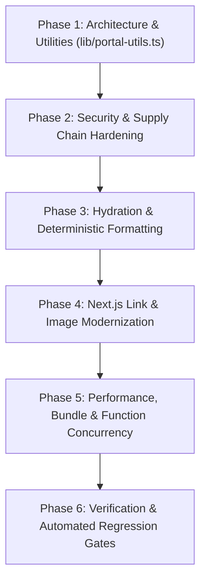

# P0 — React Doctor Quality & Frontend Reliability Remediation (SDD Spec)

- **Document ID**: `SPEC-P0-REACT-DOCTOR`
- **Track**: P0 — Pilot Safety, Correctness & Frontend Architecture
- **Status**: Ready for Implementation (Gated by SDD)
- **Baseline Score**: 40 / 100 (Critical — 1 Error, 67 Warnings, 10 Design Diagnostics)
- **Target Score**: 100 / 100 (Clean Zero-Diagnostic Baseline)
- **Methodology**: Spec-Driven Development (SDD) — *Spec First, Code Second, Machine-Verifiable Acceptance Criteria*

---

## 1. Executive Summary & Objective

A comprehensive diagnostic audit conducted via `react-doctor` identified critical code health, security, hydration, and architectural issues across the Next.js portal, Firebase integration client, and web assets.

Under **Spec-Driven Development (SDD)**, this document acts as the formal, executable contract governing all remediation activities. No functional code changes or refactors shall occur without adherence to the boundaries and acceptance criteria specified herein.

---

## 2. Invariants & Architectural Constraints

All remediation MUST adhere strictly to repository invariants defined in `AGENTS.md`:

1. **Authentication & Domain Policy Invariant**:
   - Domain derivation MUST remain exclusively in [`lib/access-policy.ts`](file:///c:/Users/Pipe/Documents/Proyectos/Web/Next.js/ceoubb/CEOUBB/lib/access-policy.ts). No component or helper may parse emails independently.
   - Tests in [`tests/access-policy.test.ts`](file:///c:/Users/Pipe/Documents/Proyectos/Web/Next.js/ceoubb/CEOUBB/tests/access-policy.test.ts) MUST pass with zero regressions.
2. **Authority & Authorization Invariant**:
   - Client code MUST NOT authoritatively set immutable authorization or ownership fields. Rules in `firebase/firestore.rules` and Firestore projections MUST enforce `request.auth.uid`.
3. **Chilean Regional & Academic Standards**:
   - All time, date, and grade formatting MUST target `es-CL` and timezone `America/Santiago` with deterministic server-side and client-side output.
   - Chilean grade arithmetic (1.0–7.0 scale) MUST remain anchored in [`lib/grades.ts`](file:///c:/Users/Pipe/Documents/Proyectos/Web/Next.js/ceoubb/CEOUBB/lib/grades.ts).
4. **Tooling & Package Constraints**:
   - Package manager is strictly `pnpm`.
   - Next.js App Router conventions (Next.js 16 / React 19) MUST be followed.

---

## 3. Scope & Requirement Specifications

### 3.1 Security & Supply Chain (`SEC`)

- **SEC-1 (Client-Owned Authorization Field)**:
  - **Requirement**: Client write functions in [`lib/firebase-classroom-client.ts`](file:///c:/Users/Pipe/Documents/Proyectos/Web/Next.js/ceoubb/CEOUBB/lib/firebase-classroom-client.ts) MUST derive author credentials from `auth.currentUser.uid` and enforce structural integrity, ensuring security rules reject spoofed client payloads.
  - **Rule**: `firebase-client-owned-authz-field`

- **SEC-2 (Package Manager Hardening)**:
  - **Requirement**: [`pnpm-workspace.yaml`](file:///c:/Users/Pipe/Documents/Proyectos/Web/Next.js/ceoubb/CEOUBB/pnpm-workspace.yaml) (and pnpm configurations) MUST enforce release age protection (`minimumReleaseAge: 10080` / 7 days) and tamper resistance (`trustPolicy: no-downgrade`).
  - **Rule**: `require-pnpm-hardening`

- **SEC-3 (Dynamic HTML Sanitization in Study Library)**:
  - **Requirement**: Content injection in [`android/app/src/main/assets/www/assets/classroom.js`](file:///c:/Users/Pipe/Documents/Proyectos/Web/Next.js/ceoubb/CEOUBB/android/app/src/main/assets/www/assets/classroom.js) and [`public/biblioteca/`](file:///c:/Users/Pipe/Documents/Proyectos/Web/Next.js/ceoubb/CEOUBB/public/biblioteca/) MUST avoid unsafe innerHTML sinks without sanitized boundaries.
  - **Rule**: `dangerous-html-sink`

---

### 3.2 SSR, Hydration & Determinism (`HYD`)

- **HYD-1 (Deterministic Date & Time Formatting)**:
  - **Requirement**: All date formatting helpers in [`app/portal-views.tsx`](file:///c:/Users/Pipe/Documents/Proyectos/Web/Next.js/ceoubb/CEOUBB/app/portal-views.tsx) (`shortDate`, `dayOf`, `monthLabel`, `monthOf`) and [`app/Classroom.tsx`](file:///c:/Users/Pipe/Documents/Proyectos/Web/Next.js/ceoubb/CEOUBB/app/Classroom.tsx) (`formatDate`, `formatDay`) MUST explicitly provide `timeZone: 'America/Santiago'` and `locale: 'es-CL'` or be deferred to post-mount client hooks to eliminate SSR/hydration mismatches.
  - **Rule**: `no-locale-format-in-render`, `rendering-hydration-mismatch-time`

- **HYD-2 (Guarded Browser Globals)**:
  - **Requirement**: All scripts and modules evaluating `window`, `document`, or `localStorage` MUST guard execution with `typeof window !== "undefined"` or evaluate strictly inside lifecycle hooks/handlers.
  - **Rule**: `no-unguarded-browser-global-at-module-scope`

- **HYD-3 (Guarded Numeric & Array Lookups)**:
  - **Requirement**: Number parsing in [`app/Classroom.tsx`](file:///c:/Users/Pipe/Documents/Proyectos/Web/Next.js/ceoubb/CEOUBB/app/Classroom.tsx) and array `.find()` in library scripts MUST handle empty string, `NaN`, and `undefined` safely.
  - **Rule**: `no-unguarded-numeric-input-parse`, `no-array-find-result-member-access-without-guard`

---

### 3.3 Next.js App Router Conventions & Data Patterns (`RTE`)

- **RTE-1 (Client-Side Navigation Preservation)**:
  - **Requirement**: All internal links across [`app/Portal.tsx`](file:///c:/Users/Pipe/Documents/Proyectos/Web/Next.js/ceoubb/CEOUBB/app/Portal.tsx) and [`app/Classroom.tsx`](file:///c:/Users/Pipe/Documents/Proyectos/Web/Next.js/ceoubb/CEOUBB/app/Classroom.tsx) MUST use Next.js `Link` (`next/link`) instead of plain `<a>` tags to maintain SPA state and prefetching.
  - **Rule**: `nextjs-no-a-element`

- **RTE-2 (Image Optimization & Layout Shift Protection)**:
  - **Requirement**: Unoptimized `` tags in [`app/Portal.tsx`](file:///c:/Users/Pipe/Documents/Proyectos/Web/Next.js/ceoubb/CEOUBB/app/Portal.tsx) and [`app/portal-ui.tsx`](file:///c:/Users/Pipe/Documents/Proyectos/Web/Next.js/ceoubb/CEOUBB/app/portal-ui.tsx) MUST use Next.js `Image` (`next/image`) with explicit `width`, `height`, or layout sizing.
  - **Rule**: `nextjs-no-img-element`, `no-img-without-dimensions`

- **RTE-3 (Robust HTTP Fetch & Error Handling)**:
  - **Requirement**: Client-side fetch invocations in [`app/portal-views.tsx`](file:///c:/Users/Pipe/Documents/Proyectos/Web/Next.js/ceoubb/CEOUBB/app/portal-views.tsx) and [`app/Portal.tsx`](file:///c:/Users/Pipe/Documents/Proyectos/Web/Next.js/ceoubb/CEOUBB/app/Portal.tsx) MUST check `response.ok` before consuming the body (`res.json()`) and handle error states gracefully.
  - **Rule**: `no-fetch-response-used-without-status-check`, `no-fetch-in-effect`

---

### 3.4 Architecture & Fast Refresh (`ARCH`)

- **ARCH-1 (Component / Utility Separation)**:
  - **Requirement**: Non-component exports (pure utility functions, constants, formatting helpers, and course icon maps) MUST be extracted from [`app/portal-ui.tsx`](file:///c:/Users/Pipe/Documents/Proyectos/Web/Next.js/ceoubb/CEOUBB/app/portal-ui.tsx) and [`app/portal-views.tsx`](file:///c:/Users/Pipe/Documents/Proyectos/Web/Next.js/ceoubb/CEOUBB/app/portal-views.tsx) into a dedicated shared utility module ([`lib/portal-utils.ts`](file:///c:/Users/Pipe/Documents/Proyectos/Web/Next.js/ceoubb/CEOUBB/lib/portal-utils.ts)).
  - **Rule**: `only-export-components`, `deslop/unused-export`

---

### 3.5 Performance & Bundle Optimization (`PERF`)

- **PERF-1 (Framer Motion Bundle Optimization)**:
  - **Requirement**: Motion imports in [`app/Classroom.tsx`](file:///c:/Users/Pipe/Documents/Proyectos/Web/Next.js/ceoubb/CEOUBB/app/Classroom.tsx), [`app/animated-menu.tsx`](file:///c:/Users/Pipe/Documents/Proyectos/Web/Next.js/ceoubb/CEOUBB/app/animated-menu.tsx), [`app/portal-ui.tsx`](file:///c:/Users/Pipe/Documents/Proyectos/Web/Next.js/ceoubb/CEOUBB/app/portal-ui.tsx), and [`app/portal-views.tsx`](file:///c:/Users/Pipe/Documents/Proyectos/Web/Next.js/ceoubb/CEOUBB/app/portal-views.tsx) MUST use lightweight `m` components with `LazyMotion` or optimized compositor transforms.
  - **Rule**: `use-lazy-motion`, `prefer-motion-transform-property`

- **PERF-2 (Single-Pass Array Operations)**:
  - **Requirement**: Multi-pass array chains (`.map().filter(Boolean)` or `.filter().map()`) in [`lib/courses.ts`](file:///c:/Users/Pipe/Documents/Proyectos/Web/Next.js/ceoubb/CEOUBB/lib/courses.ts), [`lib/grades.ts`](file:///c:/Users/Pipe/Documents/Proyectos/Web/Next.js/ceoubb/CEOUBB/lib/grades.ts), [`lib/firebase-classroom-client.ts`](file:///c:/Users/Pipe/Documents/Proyectos/Web/Next.js/ceoubb/CEOUBB/lib/firebase-classroom-client.ts), and [`public/sw.js`](file:///c:/Users/Pipe/Documents/Proyectos/Web/Next.js/ceoubb/CEOUBB/public/sw.js) MUST be refactored into single-pass `.flatMap()`, `.reduce()`, or standard loops.
  - **Rule**: `js-combine-iterations`, `js-flatmap-filter`

- **PERF-3 (Concurrent Async Execution in Cloud Functions)**:
  - **Requirement**: Independent asynchronous tasks in [`firebase/functions/index.js`](file:///c:/Users/Pipe/Documents/Proyectos/Web/Next.js/ceoubb/CEOUBB/firebase/functions/index.js) MUST execute concurrently via `Promise.all([...])`.
  - **Rule**: `server-sequential-independent-await`

---

## 4. Testable Acceptance Criteria (Gherkin Contracts)

```gherkin
Feature: Frontend Quality & React Health Remediation

  Scenario: Strict Zero-Warning React Doctor Gate
    Given the codebase has completed all remediation tasks
    When "npx react-doctor@latest --verbose" is executed
    Then the exit code MUST be 0
    And the health score MUST reach 100 / 100
    And total security errors MUST be 0.

  Scenario: Hydration Mismatch Elimination
    Given an SSR render on UTC/Linux server and a client hydration in America/Santiago
    When the portal views and classroom pages render dates and timestamps
    Then no React hydration warning ("Text content did not match") shall be logged to the console
    And formatted dates MUST deterministically display Chilean local time.

  Scenario: Fast Refresh State Preservation
    Given a developer edits a component in "app/portal-ui.tsx" or "app/portal-views.tsx"
    When Next.js Fast Refresh applies the change
    Then the component tree state MUST be preserved without triggering a full page reload.

  Scenario: Navigation SPA Integrity
    Given a user clicks an internal navigation link in Portal or Classroom
    When the route transition occurs
    Then navigation MUST happen via client-side routing without a full document reload
    And scroll position and active state MUST be preserved.
```

---

## 5. Execution & Work Breakdown Plan



### Phase 1: Module Extraction & Fast Refresh Architecture
- [ ] Create [`lib/portal-utils.ts`](file:///c:/Users/Pipe/Documents/Proyectos/Web/Next.js/ceoubb/CEOUBB/lib/portal-utils.ts) to house pure utilities, date formatters, and lookup maps.
- [ ] Refactor [`app/portal-ui.tsx`](file:///c:/Users/Pipe/Documents/Proyectos/Web/Next.js/ceoubb/CEOUBB/app/portal-ui.tsx) and [`app/portal-views.tsx`](file:///c:/Users/Pipe/Documents/Proyectos/Web/Next.js/ceoubb/CEOUBB/app/portal-views.tsx) to export React components only.

### Phase 2: Security & Authorization Hardening
- [ ] Harden write payload structures in [`lib/firebase-classroom-client.ts`](file:///c:/Users/Pipe/Documents/Proyectos/Web/Next.js/ceoubb/CEOUBB/lib/firebase-classroom-client.ts).
- [ ] Configure `minimumReleaseAge` and `trustPolicy` in `pnpm-workspace.yaml`.
- [ ] Sanitize dynamic HTML insertion sinks in WebView assets.

### Phase 3: Hydration & SSR Determinism
- [ ] Pin `timeZone: 'America/Santiago'` and `locale: 'es-CL'` across all Intl formatters.
- [ ] Guard `window` / `localStorage` module-level evaluations in asset scripts.
- [ ] Add safe null/fallback guards for numeric parses and `.find()` queries.

### Phase 4: Routing & Asset Optimization
- [ ] Convert all internal `<a>` tags in `Portal.tsx` and `Classroom.tsx` to `next/link`.
- [ ] Convert static `` elements to `next/image` with reserved dimension properties.
- [ ] Add `response.ok` pre-checks to fetch consumers.

### Phase 5: Bundle & Performance Optimization
- [ ] Switch chained `.map().filter()` to `.flatMap()` / `.reduce()`.
- [ ] Modernize motion transforms for compositor acceleration.
- [ ] Parallelize Cloud Function async calls in `firebase/functions/index.js`.

### Phase 6: Automated Verification & Sign-off
- [ ] Execute `pnpm run lint`
- [ ] Execute `pnpm run typecheck`
- [ ] Execute `pnpm test`
- [ ] Execute `npx react-doctor@latest --verbose` to verify 100/100 score.

---

## 6. Definition of Done (DoD)

1. `npx react-doctor@latest --verbose` outputs a clean pass with 0 errors and 0 warnings.
2. `npx react-doctor@latest design --verbose` passes without regression.
3. Unit and integration tests pass (`pnpm run test:unit`, `pnpm test`).
4. TypeScript compilation succeeds without errors (`pnpm run typecheck`).
5. All SDD acceptance criteria verified.
6. `PLAN.md` and `PLAN_ARCHIVE.md` updated with verification evidence and metrics.
