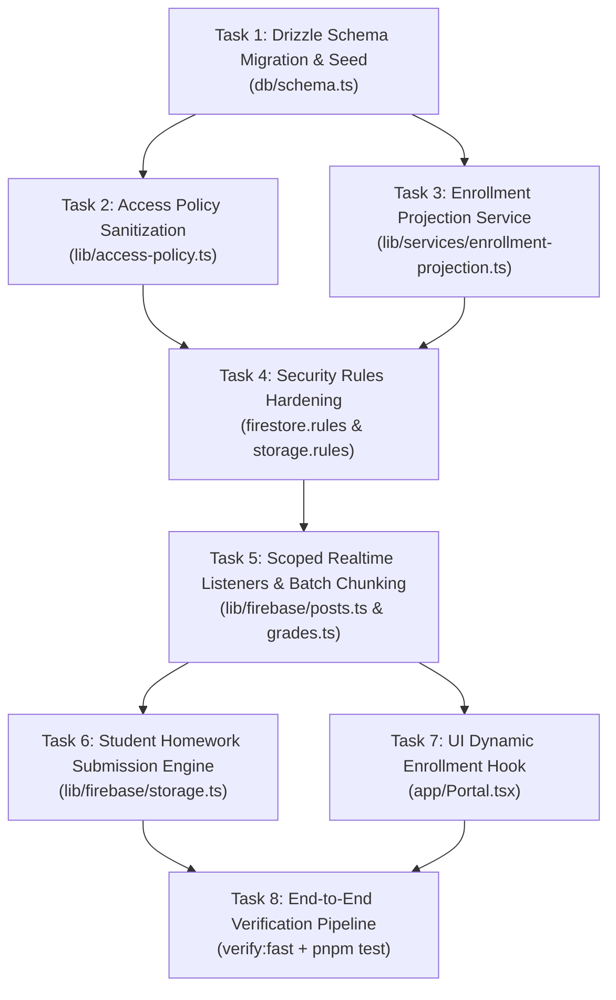

# SPEC-010: Institutional LMS Evolution & Academic Core Architecture

- **Status:** APROBADA
- **Creation Date:** 2026-08-17
- **Author / Responsible Agent:** Ingeniero Civil Informático Senior / Arquitecto de Software DTI-UBB
- **Related ADRs:** ADR-0001 (Turso System of Record), ADR-0002 (Firestore Reactive Projection), ADR-0003 (Access Policy 4-Mirror Synchronization)

---

## 1. Executive Summary & Problem Statement

Centro de Estudio UBB (CEOUBB) is evolving into the official Learning Management System (LMS) and curriculum delivery platform for Universidad del Bío-Bío, targeting over 12,000 students and hundreds of faculty across Concepción and Chillán campuses.

To replace legacy systems (Moodle UBB and Adecca UBB EOL PHP 5.6), the platform must transition from a single-cohort prototype into an institutional-scale architecture:

1. Establish a relational System of Record (SoR) in Turso/Drizzle for faculties, departments, degree programs (_carreras_), study plans, subjects (_asignaturas_), academic periods, sections (_secciones_), and enrollments (_matrículas_).
2. Project enrollment state unidirectionally to Cloud Firestore (`/enrollments/{uid}/sections/{seccionId}`) so declarative security rules enforce strict course boundary isolation via `exists()`.
3. Eliminate hardcoded personal superuser exceptions (`DEVELOPER_EMAILS`) in favor of deterministic RBAC.
4. Mitigate unbounded realtime collection-group sweeps (`watchCourseActivity`, `watchGradebooks`) in favor of scoped queries targeting the user's active enrollments.
5. Enable student assignment submissions in Cloud Storage with strict byte limits ($\le 25\text{ MB}$) and immutable audit logging for gradebook mutations.

---

## 2. Formal Requirements (EARS Syntax)

- **REQ-ACAD-01 (Ubiquitous):** The system SHALL persist all faculties, departments, degree programs, study plans, subjects, academic periods, course sections, and enrollment records in Turso/libSQL via Drizzle ORM as the authoritative relational System of Record.
- **REQ-ACAD-02 (Event-Driven):** WHEN an enrollment record is created, mutated, or archived in Turso, the system SHALL synchronize an immutable projection marker document to Cloud Firestore at `enrollments/{uid}/sections/{seccionId}` containing `{ seccionId, role, status, updatedAt }`.
- **REQ-SEC-01 (Unwanted Behavior):** IF an email does not end with `@alumnos.ubiobio.cl` or `@ubiobio.cl`, THEN the system SHALL reject authentication with HTTP 403, and SHALL NOT contain hardcoded personal email exceptions in production source code or security rules.
- **REQ-SEC-02 (State-Driven):** WHILE any client attempts to read or query course posts, materials, or gradebook metadata in Firestore, security rules SHALL permit access IF AND ONLY IF `exists(/databases/$(database)/documents/enrollments/$(request.auth.uid)/sections/$(seccionId))` is `true` or the authenticated actor has verified institutional admin claims.
- **REQ-PERF-01 (Complex):** WHILE a student or teacher is authenticated, WHEN the client subscribes to course activity, announcements, or calendar deadlines, the system SHALL query strictly the array of sections in which the user holds an active enrollment, and SHALL NOT execute unbounded collection-group queries across the entire database.
- **REQ-PERF-02 (State-Driven):** WHILE persisting bulk grade updates for a section with more than 200 students, the client SHALL partition Firestore write operations into sequential chunks of no more than 400 operations per batch.
- **REQ-EVAL-01 (Event-Driven):** WHEN an enrolled student uploads an assignment submission, the system SHALL store the file in Cloud Storage under `courses/{seccionId}/submissions/{evaluacionId}/{userId}/{fileName}` enforcing a size limit of $\le 25\text{ MB}$.
- **REQ-AUDIT-01 (Event-Driven):** WHEN a teacher updates an official student grade, the system SHALL append an immutable audit log entry in Turso (`grade_audit_logs`) recording `{ seccionId, evaluacionId, studentId, teacherId, prevScore, newScore, timestamp, ipAddress }`.

---

## 3. BDD Acceptance Criteria (Gherkin Scenarios)

```gherkin
Feature: Institutional LMS Academic Core and Boundary Isolation

  Scenario: Authenticated student accesses course posts in an enrolled section
    Given an authenticated user "pedro.soto2001@alumnos.ubiobio.cl" with UID "usr_student_soto"
    And an active section "440299-2026-2-1" exists for "Estática"
    And an enrollment document exists at "/enrollments/usr_student_soto/sections/440299-2026-2-1"
    When the student subscribes to "/courses/440299-2026-2-1/posts"
    Then Firestore security rules evaluate the request to ALLOW
    And the student receives real-time updates for section "440299-2026-2-1"

  Scenario: Authenticated student attempts to read non-enrolled section data
    Given an authenticated user "pedro.soto2001@alumnos.ubiobio.cl" with UID "usr_student_soto"
    And an active section "220318-2026-2-1" exists for "Estadística"
    And NO enrollment document exists at "/enrollments/usr_student_soto/sections/220318-2026-2-1"
    When the student attempts to read "/courses/220318-2026-2-1/posts" or "/courses/220318-2026-2-1/meta/gradebook"
    Then Firestore security rules evaluate the request to DENY
    And the client receives permission-denied error

  Scenario: Large section gradebook batch update
    Given a teacher "profesor.mecanica@ubiobio.cl" enrolled in section "440299-2026-2-1"
    And the section contains 320 enrolled students
    When the teacher publishes the official scores for "Test 01"
    Then the client batches the 320 documents into chunks of 400 operations or fewer
    And all 320 student grade documents are committed without throwing batch limit errors
    And 320 corresponding entries are appended to the "grade_audit_logs" table

  Scenario: Enrolled student uploads homework assignment
    Given an authenticated student with UID "usr_student_soto" enrolled in section "440299-2026-2-1"
    And an evaluation item "eval_informe_1" exists
    When the student uploads a 12 MB PDF "informe_estatica.pdf" to "courses/440299-2026-2-1/submissions/eval_informe_1/usr_student_soto/informe_estatica.pdf"
    Then Cloud Storage security rules evaluate the request to ALLOW
    And a submission receipt is created with metadata
```

---

## 4. Technical Design & Component Architecture

### 4.1 Relational Schema Definition (Turso / Drizzle)

```typescript
// Implements: REQ-ACAD-01, REQ-AUDIT-01
import { index, integer, real, sqliteTable, text, uniqueIndex } from "drizzle-orm/sqlite-core";

export const facultades = sqliteTable("facultades", {
  id: text("id").primaryKey(),
  nombre: text("nombre").notNull(),
  sede: text("sede", { enum: ["Concepcion", "Chillan"] }).notNull(),
});

export const departamentos = sqliteTable("departamentos", {
  id: text("id").primaryKey(),
  facultadId: text("facultad_id")
    .notNull()
    .references(() => facultades.id),
  nombre: text("nombre").notNull(),
});

export const carreras = sqliteTable("carreras", {
  id: text("id").primaryKey(),
  departamentoId: text("departamento_id")
    .notNull()
    .references(() => departamentos.id),
  codigo: text("codigo").notNull().unique(),
  nombre: text("nombre").notNull(),
});

export const asignaturas = sqliteTable("asignaturas", {
  id: text("id").primaryKey(),
  codigo: text("codigo").notNull().unique(),
  nombre: text("nombre").notNull(),
  creditosSct: integer("creditos_sct").notNull().default(0),
  departamentoId: text("departamento_id")
    .notNull()
    .references(() => departamentos.id),
});

export const periodos = sqliteTable("periodos", {
  id: text("id").primaryKey(), // e.g. "2026-2"
  nombre: text("nombre").notNull(),
  fechaInicio: text("fecha_inicio").notNull(),
  fechaFin: text("fecha_fin").notNull(),
  estado: text("estado", { enum: ["abierto", "cerrado", "archivado"] })
    .notNull()
    .default("abierto"),
});

export const secciones = sqliteTable(
  "secciones",
  {
    id: text("id").primaryKey(), // e.g. "440299-2026-2-1"
    asignaturaId: text("asignatura_id")
      .notNull()
      .references(() => asignaturas.id),
    periodoId: text("periodo_id")
      .notNull()
      .references(() => periodos.id),
    numeroSeccion: integer("numero_seccion").notNull().default(1),
    docenteId: text("docente_id")
      .notNull()
      .references(() => users.id),
    createdAt: text("created_at").notNull(),
  },
  (table) => [
    uniqueIndex("idx_seccion_asignatura_periodo_num").on(
      table.asignaturaId,
      table.periodoId,
      table.numeroSeccion
    ),
  ]
);

export const matriculas = sqliteTable(
  "matriculas",
  {
    id: text("id").primaryKey(),
    seccionId: text("seccion_id")
      .notNull()
      .references(() => secciones.id),
    usuarioId: text("usuario_id")
      .notNull()
      .references(() => users.id),
    rolSeccion: text("rol_seccion", {
      enum: ["teacher", "student", "assistant", "coordinator"],
    }).notNull(),
    estado: text("estado", { enum: ["activa", "retirada", "congelada"] })
      .notNull()
      .default("activa"),
    createdAt: text("created_at").notNull(),
  },
  (table) => [
    uniqueIndex("idx_matriculas_seccion_usuario").on(table.seccionId, table.usuarioId),
    index("idx_matriculas_usuario").on(table.usuarioId),
  ]
);

export const gradeAuditLogs = sqliteTable(
  "grade_audit_logs",
  {
    id: text("id").primaryKey(),
    seccionId: text("seccion_id")
      .notNull()
      .references(() => secciones.id),
    evaluacionId: text("evaluacion_id").notNull(),
    studentId: text("student_id")
      .notNull()
      .references(() => users.id),
    actorId: text("actor_id")
      .notNull()
      .references(() => users.id),
    prevScore: real("prev_score"),
    newScore: real("new_score").notNull(),
    timestamp: text("timestamp").notNull(),
    ipAddress: text("ip_address"),
  },
  (table) => [index("idx_grade_audit_seccion_student").on(table.seccionId, table.studentId)]
);
```

### 4.2 File Mapping & Blast Radius

- `[MODIFY]` `db/schema.ts` (Definition of relational academic entities & audit log).
- `[MODIFY]` `lib/access-policy.ts` (Removal of hardcoded developer emails).
- `[NEW]` `lib/services/enrollment-projection.ts` (One-way sync from Turso to Firestore).
- `[MODIFY]` `firebase/firestore.rules` (Enrollment-guarded reads and writes).
- `[MODIFY]` `firebase/storage.rules` (Student homework submission access).
- `[MODIFY]` `lib/firebase/posts.ts` (Enrollment-filtered course activity).
- `[MODIFY]` `lib/firebase/grades.ts` (Enrollment-filtered gradebooks & batch chunking).
- `[MODIFY]` `app/Portal.tsx` (Dynamic section loading for authenticated user).
- `[NEW]` `tests/institutional-academic.test.ts` (Integration tests for academic model).

---

## 5. Task Decomposition (Dependency DAG)



- [x] **Task 1 (Relational Data Model):** Define relational tables in `db/schema.ts` and generate migration. _Verification: `pnpm run db:generate && pnpm run typecheck`_
- [x] **Task 2 (Access Policy):** Remove hardcoded `@gmail.com` exceptions and enforce strict domain RBAC in `lib/access-policy.ts`. _Verification: `pnpm test tests/access-policy.test.ts`_
- [x] **Task 3 (Enrollment Projection):** Implement `lib/services/enrollment-projection.ts` to write `/enrollments/{uid}/sections/{seccionId}` markers. _Verification: `pnpm test tests/services.test.ts`_
- [x] **Task 4 (Security Rules):** Update `firestore.rules` with `isEnrolled()` and `storage.rules` with student submission paths. _Verification: `pnpm run verify:invariants`_
- [x] **Task 5 (Realtime Optimization):** Replace `collectionGroup` sweeping with enrolled section listeners, and add 400-op batch chunking in `lib/firebase/grades.ts`. _Verification: `pnpm test tests/firebase-mappers.test.ts`_
- [x] **Task 6 (Submission Engine):** Implement student homework submission handler in `lib/firebase/storage.ts`. _Verification: `pnpm run typecheck`_
- [x] **Task 7 (UI Integration):** Bind `app/Portal.tsx` to the user's enrolled sections. _Verification: `pnpm run verify:fast`_
- [x] **Task 8 (Verification Gate):** Run full suite (`pnpm run verify:fast`, `pnpm run verify:invariants`, `pnpm test`).
