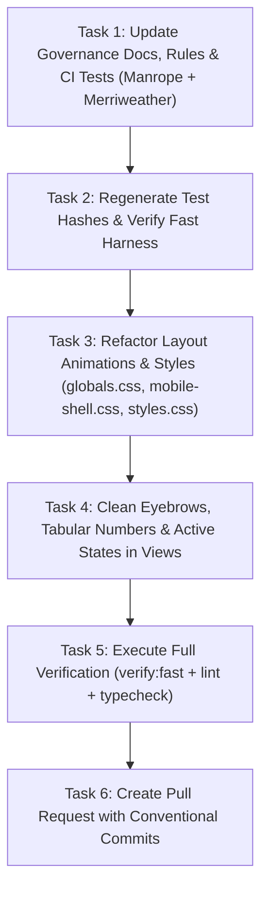

# SPEC-011: UI/UX Deliberate Quality Remediation & Typography SSOT Alignment

- **Status:** APROBADA
- **Creation Date:** 2026-08-19
- **Author / Responsible Agent:** Antigravity (Advanced Agentic Coding)
- **Related ADRs:** [ADR-0001, ADR-0002]

---

## 1. Executive Summary & Problem Statement

Following the `/deliberate` UI/UX forensic audit of the CEOUBB platform, several inherited defaults, AI tell patterns, and documentation-implementation divergences were identified. This specification establishes binding requirements to:

1. Re-align institutional documentation (`AGENTS.md`, `.agents/rules/*.mdc`, `DESIGN.md`, `README.md`) and tests with the active runtime typography: **Manrope** (Core / Operational UI) and **Merriweather** (Display / Editorial Headlines).
2. Clean up the generic Generation-2 "Eyebrow" / Kicker micro-label anti-pattern across views.
3. Enforce tabular numerals (`tabular-nums lining-nums` / `.num`) across all grade, weight, progress, and pagination columns.
4. Correct accessibility defects (`outline: none` without `:focus-visible` replacement on bottom sheets) and restore tactile `:active` press states across teacher and student workspaces.
5. Eliminate layout-triggering property animations (`transition: top`, `transition: width`) in favor of composite-only GPU transforms (`translateY`, `scaleX`) and ensure comprehensive `useReducedMotion()` wrapping.
6. Replace canonical AI color literals (`#8b5cf6`) with calibrated institutional design tokens (`var(--color-academic-purple)`).

---

## 2. Formal Requirements (EARS Syntax)

- **REQ-DELIB-01 (Ubiquitous):** The design system and codebase documentation SHALL recognize `Manrope` as `--font-core` / `--font-sans` and `Merriweather` as `--font-display` / `--font-serif` across `AGENTS.md`, `DESIGN.md`, `.agents/rules/003-ui-components.mdc`, and CI test suites.
- **REQ-DELIB-02 (Ubiquitous):** All data tables, numeric grades, evaluation percentages, date counters, and pagination indicators SHALL render with `font-variant-numeric: tabular-nums lining-nums` via the `.num` class or custom CSS properties.
- **REQ-DELIB-03 (State-Driven):** WHILE interactive elements (buttons, pulse cells, work queue rows, header action buttons) are pressed (`:active`), the client SHALL provide immediate ($0\text{ms}$) visual feedback via calibrated surface contrast.
- **REQ-DELIB-04 (Ubiquitous):** Interactive drawer and sheet components SHALL provide a high-contrast visible focus ring when focused via keyboard navigation, without suppressing outlines without replacement.
- **REQ-DELIB-05 (Ubiquitous):** UI animations and transitions SHALL strictly animate composite-only properties (`transform`, `opacity`) and SHALL NOT trigger layout reflow through `top`, `left`, `right`, `bottom`, `width`, or `height`.
- **REQ-DELIB-06 (State-Driven):** WHILE `prefers-reduced-motion: reduce` is active, all animated components (including student progress bars and modal sheets) SHALL degrade immediately to instant transitions.
- **REQ-DELIB-07 (Ubiquitous):** All course tone fixtures and stylesheet colors SHALL derive strictly from semantic tokens in `globals.css` and SHALL NOT use hardcoded `#8b5cf6` or non-institutional hex values.
- **REQ-DELIB-08 (Ubiquitous):** Section headers and navigation groups SHALL use semantic contextual headings and SHALL NOT rely on tracked uppercase `.eyebrow` kickers placed above headings.

---

## 3. BDD Acceptance Criteria (Gherkin Scenarios)

```gherkin
Feature: Deliberate UI/UX Remediation and Typography SSOT

  Scenario: Typography specification verification
    Given the project design governance files
    When inspecting "DESIGN.md", "AGENTS.md", and ".agents/rules/003-ui-components.mdc"
    Then the display font family must be documented as "Merriweather"
    And the operational font family must be documented as "Manrope"
    And "tests/ci-workflows.test.ts" must assert matching design tokens for "Merriweather"

  Scenario: Keyboard focus on mobile bottom sheets
    Given a user navigating via keyboard or screen reader
    When a modal bottom sheet is opened in "app/mobile-shell.tsx"
    Then the sheet container must display an accessible focus ring on :focus-visible
    And the stylesheet must not strip outline without an accessible replacement

  Scenario: Composite-only animation on calendar and progress indicators
    Given the time-blocking planner and classroom progress bar
    When the current time line or student progress updates
    Then motion transitions must execute via translateY or scaleX transforms
    And no layout reflow transitions on "top" or "width" may be declared

  Scenario: Tabular numbers in academic gradebook and pagination
    Given the classroom grades section or admin view
    When numbers, grades, weights, and page indicators are rendered
    Then elements must carry "num" class or "font-variant-numeric: tabular-nums lining-nums"
```

---

## 4. Technical Design & Component Architecture

### 4.1 File Mapping & Blast Radius

- `[MODIFY]` `DESIGN.md` — Update typography section with `Merriweather` and `Manrope`.
- `[MODIFY]` `AGENTS.md` — Update typography pairing rules.
- `[MODIFY]` `.agents/rules/003-ui-components.mdc` — Update display and operational font references.
- `[MODIFY]` `README.md` — Update design system summary.
- `[MODIFY]` `docs/specs/p9-enterprise-harness-evolution.md` — Update font mentions in spec history.
- `[MODIFY]` `docs/archive/PLAN_ARCHIVE.md` — Update font mentions.
- `[MODIFY]` `tests/ci-workflows.test.ts` — Update assertion from `Source Serif 4` to `Merriweather`.
- `[MODIFY]` `app/globals.css` — Clean typography tokens and refactor `.planner-hours-now` / `.planner-now-tag` animation to `transform: translateY()`.
- `[MODIFY]` `app/mobile-shell.css` — Fix `.sheet-content` focus outline.
- `[MODIFY]` `app/portal-shell.tsx` — Clean `.eyebrow` in sidebar.
- `[MODIFY]` `app/preview/docente/TeacherWorkspacePreview.tsx` — Clean `.eyebrow` in sidebar.
- `[MODIFY]` `app/privacidad/page.tsx` — Clean `.eyebrow` date label.
- `[MODIFY]` `public/biblioteca/index.html` — Clean `.eyebrow`, fix theme-color, update AI CTA copy.
- `[MODIFY]` `public/biblioteca/assets/styles.css` — Fix purple hex and replace `width` transition with `scaleX`.
- `[MODIFY]` `lib/courses.ts` — Replace `#8b5cf6` with calibrated course tone.
- `[MODIFY]` `app/views/classroom/GradesSection.tsx` — Add `.num` to mobile rows.
- `[MODIFY]` `app/views/classroom/ProgressSection.tsx` — Add `.num` and `useReducedMotion()`.
- `[MODIFY]` `app/views/AdminView.tsx` — Add `.num` to counts and pagination.
- `[MODIFY]` `app/preview/docente/teacher-preview-panels.tsx` — Add `.num` to counts.
- `[MODIFY]` `app/preview/docente/teacher-workspace-preview.module.css` — Add `:active` states.

---

## 5. Task Decomposition (Dependency DAG)



- [ ] **Task 1 (SSOT Docs & CI Test):** Update `DESIGN.md`, `AGENTS.md`, `.agents/rules/003-ui-components.mdc`, `README.md`, and `tests/ci-workflows.test.ts`. _Implements: REQ-DELIB-01_
- [ ] **Task 2 (Test-Locking):** Run `node scripts/verify-test-hashes.mjs --generate` and `pnpm run verify:fast`.
- [ ] **Task 3 (Styles & Performance):** Correct `app/globals.css`, `app/mobile-shell.css`, `public/biblioteca/assets/styles.css`, `lib/courses.ts`. _Implements: REQ-DELIB-04, REQ-DELIB-05, REQ-DELIB-07_
- [ ] **Task 4 (Views & Micro-Interactions):** Update `portal-shell.tsx`, `TeacherWorkspacePreview.tsx`, `privacidad/page.tsx`, `GradesSection.tsx`, `ProgressSection.tsx`, `AdminView.tsx`, `teacher-preview-panels.tsx`, `teacher-workspace-preview.module.css`, `public/biblioteca/index.html`. _Implements: REQ-DELIB-02, REQ-DELIB-03, REQ-DELIB-06, REQ-DELIB-08_
- [ ] **Task 5 (Verification):** Run `pnpm run verify:fast`, `pnpm run lint`, `pnpm run typecheck`.
- [ ] **Task 6 (PR & Handoff):** Create unified Git commit and Pull Request using `.github/PULL_REQUEST_TEMPLATE.md`.
