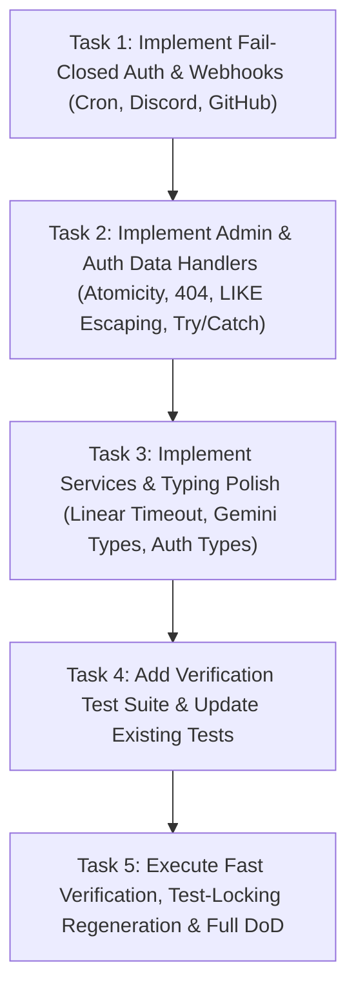

# SPEC-012: Backend Security, Fail-Closed Guards, and API Resilience Remediation

- **Status:** APROBADA
- **Creation Date:** 2026-08-19
- **Author / Responsible Agent:** Antigravity (Advanced Agentic Coding) & Ponytail
- **Related ADRs:** [ADR-0001, ADR-0002]

---

## 1. Executive Summary & Problem Statement

A rigorous code audit of recently updated hotspots (auth, API routes, data persistence layer, webhooks, services) identified 14 technical findings across security, transaction atomicity, unhandled database exceptions, wildcard injection, fetch timeouts, and type escapes.

This specification governs the implementation of:

1. **Universal Fail-Closed Security:** Elimination of all fail-open authentication shortcuts across cron endpoints (`/api/cron/standup`), Discord Ed25519 signature checks (`lib/discord/signature.ts`), and GitHub CI/CD webhooks (`/api/webhooks/github`).
2. **Transactional Atomicity & Schema Alignment:** Consolidating user deletion in `/api/auth/me` with cascading foreign keys and transaction wrappers.
3. **Deterministic Admin API Contracts:** Adding existence validation (404 on missing `userId`), `try/catch` wrappers emitting structured JSON errors (`{ error: string }`), and wildcard sanitization (`%`, `_`, `\`) on SQL `LIKE` queries.
4. **Structured Error Logging & Observability:** Adding explicit error logging to `/api/auth/firebase` and global interaction error resilience in `/api/discord/interactions`.
5. **Network Resilience & Timeout Enforcement:** Adding `AbortSignal.timeout(6000)` to Linear→Discord webhook dispatch.
6. **Type Safety & Governance Conformance:** Removing `as any` in `lib/services/gemini.ts` and refining `PublicUser` typing in `lib/auth.ts` per AGENTS.md §5.
7. **Enrollment Scalability:** Ensuring enrollment identification handles complete section listings without silent truncation.

---

## 2. Formal Requirements (EARS Syntax)

- **REQ-SEC-03 (Unwanted Behavior):** IF `CRON_SECRET` is unset, empty, or fails to match the `Bearer` token in the `Authorization` header, THEN `GET /api/cron/standup` SHALL reject the request with HTTP 401 Unauthorized.
- **REQ-SEC-04 (Unwanted Behavior):** IF no Discord public keys are configured or if signature validation fails, THEN `verifyDiscordRequestSignature` SHALL return `false` (fail-closed) by default, rejecting unauthenticated interaction requests with HTTP 401.
- **REQ-SEC-05 (Unwanted Behavior):** IF `GITHUB_WEBHOOK_SECRET` is unset or empty, THEN `POST /api/webhooks/github` SHALL reject with HTTP 500 (`Webhook secret not configured`); IF the signature is invalid, THEN it SHALL reject with HTTP 401.
- **REQ-DATA-01 (Ubiquitous):** The system SHALL execute user account deletion atomically, ensuring associated sessions and records are cleanly removed and returning structured JSON responses.
- **REQ-API-01 (Unwanted Behavior):** IF an administrator requests a role update for a non-existent `userId` via `PATCH /api/admin/users`, THEN the system SHALL return HTTP 404 with JSON `{ error: "Usuario no encontrado." }`.
- **REQ-API-02 (Ubiquitous):** All API route handlers (`/api/enrollments/me`, `/api/admin/users`, `/api/auth/firebase`, `/api/auth/me`) SHALL wrap database operations and request body parsing in `try/catch` blocks, returning structured JSON error responses per `.agents/rules/005-api-webhooks.mdc`.
- **REQ-OBS-01 (Ubiquitous):** When an exception occurs during authentication in `/api/auth/firebase` or slash command dispatch in `/api/discord/interactions`, the server SHALL log the error with `console.error` and return an appropriate structured response.
- **REQ-SEC-06 (Ubiquitous):** Admin search query parameters interpolated into SQL `LIKE` clauses SHALL escape SQL wildcard characters (`%`, `_`, `\`) before pattern construction.
- **REQ-NET-01 (Ubiquitous):** External HTTP fetch requests to Discord webhook endpoints in `/api/webhooks/linear` SHALL enforce a deterministic timeout via `AbortSignal.timeout(6000)`.
- **REQ-TYPE-01 (Ubiquitous):** The authentication helper `getSessionUser` and Gemini AI service `generateContentWithFallback` SHALL enforce strict TypeScript types without unsafe `as any` assertions or unvalidated type bypasses.
- **REQ-DATA-02 (Ubiquitous):** `listUserSectionIds` and `/api/enrollments/me` SHALL support listing all active enrollments for the current session without silent data loss.

---

## 3. BDD Acceptance Criteria (Gherkin Scenarios)

```gherkin
Feature: Backend Security, Fail-Closed Guards, and API Resilience

  Scenario: Cron endpoint rejects unauthenticated requests when CRON_SECRET is unset or mismatched
    Given a request to "GET /api/cron/standup"
    When the "Authorization" header is missing, invalid, or "CRON_SECRET" is unset
    Then the response status code must be 401
    And the response body must be JSON containing error "Unauthorized"

  Scenario: Discord signature validation fails closed without configured public keys
    Given no Discord public keys configured in environment
    When "verifyDiscordRequestSignature" is called with arbitrary payload
    Then the function must return false
    And unauthenticated requests to "/api/discord/interactions" must return HTTP 401

  Scenario: GitHub webhook rejects requests when secret is unconfigured
    Given "GITHUB_WEBHOOK_SECRET" is unset or empty
    When a POST request arrives at "/api/webhooks/github"
    Then the response status code must be 500
    And the response body must be JSON containing error "Webhook secret not configured"

  Scenario: Admin PATCH returns 404 for non-existent userId
    Given an authenticated owner session
    When submitting a PATCH to "/api/admin/users" with a non-existent "userId"
    Then the response status code must be 404
    And the response body must be JSON containing error "Usuario no encontrado."

  Scenario: Admin user search escapes LIKE wildcards
    Given search term containing special characters "%" or "_"
    When querying "GET /api/admin/users?q=%25"
    Then the query must escape wildcards and match only literal "%" characters

  Scenario: Linear webhook fetch enforces timeout
    Given a valid Linear webhook event payload
    When forwarding the message embed to Discord
    Then the fetch call must include an AbortSignal timeout of 6000ms
```

---

## 4. Technical Design & File Mapping

### 4.1 Affected Hotspots

- `[MODIFY]` [`app/api/cron/standup/route.ts`](file:///c:/Users/Pipe/Documents/Proyectos/Web/Next.js/ceoubb/CEOUBB/app/api/cron/standup/route.ts) — Fail-closed check on `CRON_SECRET` (`// Implements: REQ-SEC-03`).
- `[MODIFY]` [`lib/discord/signature.ts`](file:///c:/Users/Pipe/Documents/Proyectos/Web/Next.js/ceoubb/CEOUBB/lib/discord/signature.ts) — Fail-closed verification (`// Implements: REQ-SEC-04`).
- `[MODIFY]` [`app/api/webhooks/github/route.ts`](file:///c:/Users/Pipe/Documents/Proyectos/Web/Next.js/ceoubb/CEOUBB/app/api/webhooks/github/route.ts) — Fail-closed check on `GITHUB_WEBHOOK_SECRET` (`// Implements: REQ-SEC-05`).
- `[MODIFY]` [`app/api/auth/me/route.ts`](file:///c:/Users/Pipe/Documents/Proyectos/Web/Next.js/ceoubb/CEOUBB/app/api/auth/me/route.ts) — Atomic deletion in `try/catch` (`// Implements: REQ-DATA-01, REQ-API-02`).
- `[MODIFY]` [`app/api/admin/users/route.ts`](file:///c:/Users/Pipe/Documents/Proyectos/Web/Next.js/ceoubb/CEOUBB/app/api/admin/users/route.ts) — 404 on missing target, `try/catch`, LIKE wildcard sanitization (`// Implements: REQ-API-01, REQ-API-02, REQ-SEC-06`).
- `[MODIFY]` [`app/api/enrollments/me/route.ts`](file:///c:/Users/Pipe/Documents/Proyectos/Web/Next.js/ceoubb/CEOUBB/app/api/enrollments/me/route.ts) — `try/catch` wrapper (`// Implements: REQ-API-02, REQ-DATA-02`).
- `[MODIFY]` [`app/api/auth/firebase/route.ts`](file:///c:/Users/Pipe/Documents/Proyectos/Web/Next.js/ceoubb/CEOUBB/app/api/auth/firebase/route.ts) — Error logging in catch block (`// Implements: REQ-OBS-01`).
- `[MODIFY]` [`app/api/discord/interactions/route.ts`](file:///c:/Users/Pipe/Documents/Proyectos/Web/Next.js/ceoubb/CEOUBB/app/api/discord/interactions/route.ts) — Global interaction `try/catch` resilience (`// Implements: REQ-OBS-01`).
- `[MODIFY]` [`app/api/webhooks/linear/route.ts`](file:///c:/Users/Pipe/Documents/Proyectos/Web/Next.js/ceoubb/CEOUBB/app/api/webhooks/linear/route.ts) — `AbortSignal.timeout(6000)` on Discord fetch (`// Implements: REQ-NET-01`).
- `[MODIFY]` [`lib/auth.ts`](file:///c:/Users/Pipe/Documents/Proyectos/Web/Next.js/ceoubb/CEOUBB/lib/auth.ts) — Remove `as PublicUser` type bypass (`// Implements: REQ-TYPE-01`).
- `[MODIFY]` [`lib/services/gemini.ts`](file:///c:/Users/Pipe/Documents/Proyectos/Web/Next.js/ceoubb/CEOUBB/lib/services/gemini.ts) — Strong types for `generateContent` without `as any` (`// Implements: REQ-TYPE-01`).
- `[MODIFY]` [`tests/discord-interactions.test.ts`](file:///c:/Users/Pipe/Documents/Proyectos/Web/Next.js/ceoubb/CEOUBB/tests/discord-interactions.test.ts) — Update test case to verify fail-closed behavior on empty keys.
- `[MODIFY]` [`tests/api-audit-remediation.test.ts`](file:///c:/Users/Pipe/Documents/Proyectos/Web/Next.js/ceoubb/CEOUBB/tests/api-audit-remediation.test.ts) — New test suite covering fail-closed auth, LIKE escaping, 404 status codes, and timeouts.

---

## 5. Task Decomposition (Dependency DAG)


