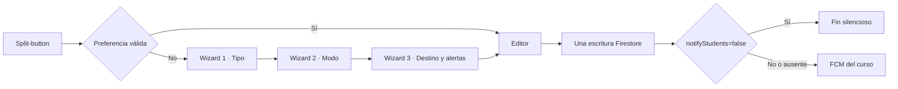

# P15 — CEO-60: Asistente de publicación y split-button

**Estado:** VERIFICADA

**Aprobación humana:** alcance y BDD entregados por Joaquín el 2026-08-20, con instrucción explícita de ejecutar sin solicitar aprobación adicional.

**Objetivo:** aula docente web y shell Capacitor

**Contrato vivo:** `openspec/specs/classroom/publication-wizard/spec.md`

**Cambio archivado:** `openspec/changes/archive/2026-08-20-add-publication-wizard/`

## 1. Requisitos EARS

- **REQ-PUB-01:** WHEN el docente activa la acción principal y existe un modo válido en `ceoubb_default_editor`, el cliente SHALL abrir el editor en ese modo dentro de la misma interacción síncrona, sin wizard ni lectura de red.
- **REQ-PUB-02:** IF la preferencia falta, es inválida o el almacenamiento falla, THEN el cliente SHALL abrir el wizard sin bloquear el flujo.
- **REQ-PUB-03:** WHILE el wizard está abierto, el sistema SHALL presentar tres pasos ordenados: tipo, modo y destino/alertas, preservando las elecciones al retroceder.
- **REQ-PUB-04:** WHEN el docente marca recordar, el cliente SHALL persistir el modo; WHEN desmarca, SHALL eliminar la preferencia existente.
- **REQ-PUB-05:** WHEN se elige un modo desde la flecha, el cliente SHALL actualizar la preferencia y abrir ese editor; el menú SHALL permitir reabrir el wizard.
- **REQ-PUB-06:** WHEN se publica, el sistema SHALL guardar carpeta y política de alerta; IF `notifyStudents` es `false`, THEN la Function SHALL omitir FCM.
- **REQ-PUB-07:** IF un post histórico no contiene `notifyStudents`, THEN la Function SHALL conservar el envío actual.
- **REQ-PUB-08:** El sistema SHALL mantener etiquetas, foco visible, Escape, semántica de menú, objetivos de 44 px y cero consultas/listeners/escrituras adicionales.

## 2. Criterios BDD

```gherkin
Scenario: Preferencia Markdown abre sin wizard
  Given ceoubb_default_editor contiene "markdown"
  When el docente activa "+ Nueva publicación"
  Then el editor abre en Markdown en la misma interacción
  And el wizard no aparece primero

Scenario: Ausencia o corrupción abre el asistente
  Given la preferencia falta, es inválida o localStorage falla
  When el docente activa la acción principal
  Then el wizard abre en el paso 1

Scenario: Recorrido completo
  Given el wizard está abierto
  When el docente elige tipo, modo, carpeta y alertas
  Then el editor recibe las cuatro decisiones
  And volver atrás conserva cada selección

Scenario: El menú cambia y recuerda el formato
  Given la preferencia actual es "visual"
  When el docente elige "Markdown + LaTeX" desde la flecha
  Then el editor abre en Markdown
  And localStorage queda actualizado a "markdown"

Scenario: Publicación silenciosa
  Given el docente seleccionó una carpeta y publicación silenciosa
  When publica el contenido
  Then Firestore guarda notifyStudents en false
  And la Function no envía FCM

Scenario: Publicación histórica
  Given un post no contiene notifyStudents
  When la Function procesa su creación
  Then conserva el envío al tópico del curso
```

## 3. Diseño técnico



El contrato local admite sólo `visual`, `markdown` y `html`; toda excepción de Storage degrada al wizard. El modo viaja como contexto hacia el editor actual para que CEO-59 pueda sustituir esa superficie sin reescribir el launcher. La publicación añade un único booleano opcional, sin migración y sin ampliar consultas.

## 4. Invariantes y presupuestos

| Invariante               | Preservación                                                                  |
| :----------------------- | :---------------------------------------------------------------------------- |
| Roles y matrícula        | El launcher sólo se monta cuando `canTeach`; reglas y autorización no cambian |
| Escala institucional     | Cero listeners/queries nuevos y una escritura por post                        |
| Paridad móvil            | Mismos componentes React en navegador y WebView remota                        |
| Publicaciones históricas | Campo ausente equivale a notificar, como antes                                |
| Seguridad de contenido   | Se reutilizan normalización y render seguro existentes                        |
| Dependencias             | No se incorpora ningún paquete                                                |

## 5. DAG y verificación

- [x] Especificar EARS/BDD, diseño, riesgos y alcance aprobado.
- [x] Registrar suite RED y hash SHA-256: fallo esperado por módulo ausente; 25 archivos bloqueados.
- [x] Implementar contrato puro y guard silencioso.
- [x] Implementar split-button, wizard y editor bajo demanda.
- [x] Integrar materiales y estilos responsive.
- [x] Ejecutar prueba dirigida, `verify:fast`, invariantes, lint, formato y suite completa.
- [x] Verificar escritorio/móvil, actualizar `PLAN.md` y archivar OpenSpec.

Verificación final: `verify:fast` 202/202, invariantes 31/31, lint, formato y Functions limpios; `pnpm test` compila Next.js 16 y aprueba 227/227. React Doctor no reporta hallazgos. El recorrido real en navegador cubrió escritorio y 390 × 844 px, persistencia Markdown, cambio inmediato a HTML y ausencia de overflow o errores de consola.

## 6. Riesgos y despliegue

- La opción silenciosa no será efectiva en producción hasta desplegar la Cloud Function después del merge.
- La edición multimodal real sigue bloqueada por CEO-59; CEO-60 sólo define y transporta el modo de lanzamiento.
- `localStorage` es deliberadamente local al dispositivo y origen; no es una preferencia institucional sincronizada.
