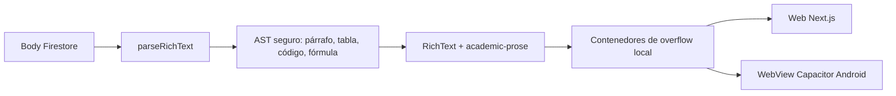

# P16 — Retrocompatibilidad y paridad móvil de publicaciones (CEO-61)

Estado: `VERIFICADA`

Fuente de aprobación humana: solicitud de ejecución de CEO-61 del 2026-08-20, con sus criterios BDD y autorización explícita para implementar y publicar el PR sin un gate adicional.

## 1. Intención y alcance

CEO-61 cierra la red de seguridad del renderer de publicaciones que ya vive en `RichText`: conserva avisos históricos de Firestore sin migración, hace que tablas Markdown anchas sean contenido semántico seguro y limita el desbordamiento horizontal al elemento técnico que lo necesita. El mismo DOM, CSS y runtime KaTeX se sirven al navegador y a la WebView remota de Capacitor.

Incluye `lib/rich-text.ts`, `app/views/classroom/RichText.tsx`, `app/globals.css`, `tests/rich-text.test.ts`, la especificación viva y el handoff. No incluye HTML libre, WYSIWYG, cambios de Firestore, una segunda implementación nativa ni una migración de publicaciones.

## 2. Requisitos formales

- **REQ-CEO61-01 (Event-Driven):** WHEN una publicación histórica de Firestore contiene texto plano y saltos de línea, el sistema SHALL renderizar todos sus segmentos en orden dentro de `.academic-prose`, SHALL conservar los saltos legibles y SHALL NOT exigir una migración o reescritura.
- **REQ-CEO61-02 (Event-Driven):** WHEN una publicación contiene una tabla Markdown delimitada por tuberías y una fila separadora válida, el sistema SHALL producir nodos React semánticos de tabla, SHALL procesar cada celda mediante el parser inline seguro y SHALL conservar sus seis o más columnas.
- **REQ-CEO61-03 (State-Driven):** WHILE una tabla, bloque de código o fórmula KaTeX supera el ancho disponible, el sistema SHALL confinar el desplazamiento horizontal al contenedor técnico, SHALL admitir el gesto táctil horizontal y SHALL NOT ampliar la tarjeta ni el layout general.
- **REQ-CEO61-04 (Unwanted Behavior):** IF texto histórico o una celda contiene HTML crudo, atributos ejecutables o un destino con protocolo inseguro, THEN el sistema SHALL mantener el marcado inerte o eliminar el destino y SHALL NOT usar inyección HTML no saneada.
- **REQ-CEO61-05 (Optional):** WHERE el portal se ejecuta dentro de `cl.ubb.centroestudio`, el sistema SHALL reutilizar el mismo `RichText`, parser, CSS y recurso KaTeX del portal web y SHALL NOT introducir un renderer Android duplicado.
- **REQ-CEO61-06 (Ubiquitous):** El cambio MUST pasar `pnpm run lint`, `pnpm run typecheck`, `pnpm run test:unit` y `pnpm test` sin debilitar aserciones existentes.

## 3. Criterios BDD

```gherkin
Scenario: Aviso histórico de texto plano
  Given un body con CRLF, saltos simples y una separación de párrafo
  When parseRichText procesa el aviso y RichText lo presenta
  Then todos los segmentos aparecen en orden
  And el contenedor incluye academic-prose
  And los saltos se conservan mediante white-space pre-wrap

Scenario: Tabla ancha en un teléfono Android
  Given una tabla Markdown válida con seis columnas
  When el renderer construye el contenido académico
  Then el resultado contiene una tabla semántica con seis encabezados y seis celdas
  And la tabla vive dentro de un contenedor con overflow-x auto
  And el contenedor admite desplazamiento táctil sin ampliar la tarjeta

Scenario: Fórmula y código extensos en la WebView
  Given una fórmula KaTeX y una línea de código más anchas que la tarjeta
  When el mismo bundle remoto se abre en Capacitor Android
  Then cada elemento conserva su propio desplazamiento horizontal
  And el ancho del feed no cambia

Scenario: Contenido hostil dentro de una tabla
  Given una celda con HTML crudo y un enlace javascript
  When el parser procesa la tabla
  Then el HTML permanece como texto
  And el enlace no recibe href
  And el renderer no usa dangerouslySetInnerHTML
```

## 4. Diseño técnico



### 4.1 Contratos

```ts
type TableAlignment = "left" | "center" | "right" | null;

type RichTableBlock = {
  type: "table";
  alignments: TableAlignment[];
  header: RichInline[][];
  rows: RichInline[][][];
};
```

Una tabla sólo se reconoce si la línea siguiente tiene el mismo número de celdas y cada separador coincide con `:?-{3,}:?`. Sólo se consumen filas con el mismo número de celdas del encabezado; una fila incompatible queda disponible para el camino de párrafo y no se pierde. Las tuberías escapadas o dentro de código inline permanecen en la celda.

### 4.2 Errores y degradación

| Condición                                            | Respuesta                          | Reintento                       |
| :--------------------------------------------------- | :--------------------------------- | :------------------------------ |
| Separador inválido o columnas incompatibles          | Renderizar como párrafo            | No                              |
| Protocolo inseguro en celda                          | Renderizar etiqueta sin `href`     | No                              |
| KaTeX ausente o expresión inválida                   | Mostrar fuente TeX original        | Automático al cargar el runtime |
| Contenido mayor que el límite de escritura histórico | Renderizar sin truncar ni escribir | No                              |

### 4.3 Seguridad, rendimiento e invariantes

- El parser mantiene costo lineal respecto del body acotado; no abre consultas, listeners ni nuevas escrituras y conserva la escala de 120 avisos con `content-visibility`.
- Tablas y celdas se construyen como nodos React escapados. No se habilita HTML crudo ni se añade una dependencia de saneamiento.
- Los límites de overflow viven en descendientes con `max-width: 100%` y el ítem flex de la tarjeta conserva `min-width: 0`.
- No cambian roles, reglas Firebase, cálculo de notas, identidad de sección, región ni disclaimers de servicio no oficial.
- `public/biblioteca/` sigue siendo la única copia de KaTeX; Android consume la URL remota de `capacitor.config.ts`.

## 5. DAG de ejecución

- [x] **T1 — REQ-CEO61-01/02:** extender el AST y parser con tablas seguras. Verificación: `node --experimental-strip-types --test tests/rich-text.test.ts`.
- [x] **T2 — REQ-CEO61-01/02/04:** renderizar `.academic-prose` y tabla semántica sin HTML inyectado. Verificación: `pnpm run typecheck`.
- [x] **T3 — REQ-CEO61-03/05:** confinar overflow de tabla, código y KaTeX. Verificación: `pnpm run lint` y QA a 360 px.
- [x] **T4 — REQ-CEO61-01..06:** cubrir regresiones de texto plano, seis columnas, XSS y contratos CSS/Capacitor. Verificación: `pnpm run test:unit`.
- [x] **T5 — REQ-CEO61-06:** ejecutar gates completos, sincronizar especificación y handoff. Verificación: `pnpm test`.

## 6. Evidencia de verificación

- **RED:** la suite inicial no tenía un bloque `table`, contrato `.academic-prose` ni aserciones de overflow local para tabla, código y KaTeX.
- **GREEN:** `tests/rich-text.test.ts` cubre CRLF histórico, tabla de seis columnas, alineación, tuberías literales, HTML inerte, enlaces inseguros sin destino y fallback sin pérdida; 9/9 pruebas focalizadas pasan.
- **REFACTOR:** se mantuvo un único parser y renderer compartido, sin dependencias, consultas, migraciones ni una implementación Android paralela. La trazabilidad usa los marcadores de requisito ya existentes sin añadir comentarios de código.
- **Gates:** `pnpm run verify:fast` (201/201, hashes de 24 archivos y 9/9 specs OpenSpec), `pnpm run verify:invariants` (31/31 y reglas Firebase), `pnpm run lint`, `pnpm run typecheck`, `pnpm run format:check`, `pnpm run test:unit` (201/201) y `pnpm test` (build Next.js 16.3 y 226/226) pasan.
- **QA visual:** Chromium a 360×800 mantuvo `document.scrollWidth === document.clientWidth === 360`; la tarjeta midió 326/326 px y la tabla, código y fórmula conservaron overflow local (262/864, 262/873 y 263/294 px, respectivamente), `touch-action: pan-x pan-y` y cero errores de consola.
- **Límite:** no se ejecutó un gesto en dispositivo Android físico; la paridad se verificó por el componente remoto compartido de Capacitor, los contratos CSS y el viewport móvil de Chromium.
