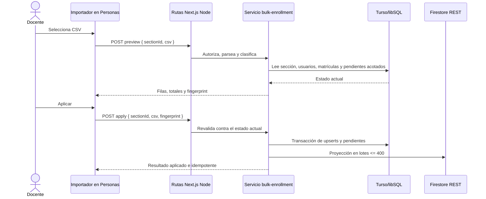
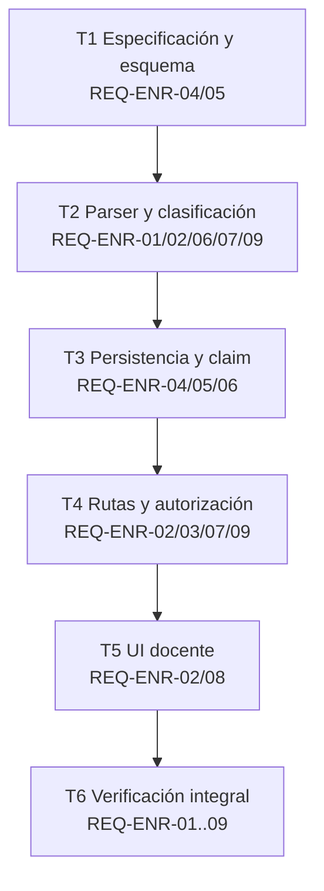

# P17 — Importación masiva de matrículas desde CSV (CEO-16)

- **Estado:** VERIFICADA
- **Fecha:** 2026-08-23
- **Responsable:** Codex / Joaquín
- **Aprobación:** mandato explícito del mantenedor para ejecutar CEO-16 y publicar el resultado en un PR sin gates adicionales.
- **Rama:** `elpapijuaco325/ceo-16-poder-cargar-matriculas-masivamente-desde-una-planilla`

## 1. Intención y alcance

Un docente no puede matricular manualmente a cientos o miles de estudiantes. CEOUBB incorporará en la vista Personas de cada sección un flujo de tres estados: seleccionar CSV, previsualizar sin escribir y aplicar. Turso seguirá siendo el sistema de registro y Firestore recibirá sólo la proyección de acceso. El mismo archivo podrá aplicarse repetidamente sin crear usuarios, pendientes ni matrículas duplicadas.

El archivo identifica estudiantes por correo institucional. Si la cuenta ya existe, la matrícula se activa de inmediato; si aún no existe, queda pendiente por correo y se reclama en el primer ingreso con Google. CEOUBB no almacenará el archivo original.

## 2. Requisitos formales

- **REQ-ENR-01 (Ubiquitous):** The system SHALL accept UTF-8 CSV files of at most 5 MiB and 12,000 data rows, SHALL recognize comma or semicolon delimiters and quoted fields, and SHALL require columns equivalent to `nombre` and `correo`.
- **REQ-ENR-02 (Event-Driven):** WHEN an authorized actor requests a preview, the system SHALL validate every row without mutating Turso or Firestore and SHALL return per-row status plus aggregate counts and a content fingerprint.
- **REQ-ENR-03 (Unwanted Behavior):** IF the actor is neither the platform owner nor the assigned teacher or active teacher/coordinator of the requested section, OR the section period is not open, THEN the system SHALL reject preview and apply operations.
- **REQ-ENR-04 (Event-Driven):** WHEN an authorized actor applies a valid preview, the system SHALL activate registered students in `matriculas`, SHALL persist unregistered students in `matriculas_pendientes`, and SHALL enforce one record per section and student identity through unique database constraints.
- **REQ-ENR-05 (State-Driven):** WHILE a matching pending enrollment exists, WHEN that student completes institutional sign-in, the system SHALL claim the pending record for the Firebase-backed user, activate the canonical enrollment, remove the pending record, and request its Firestore projection.
- **REQ-ENR-06 (Ubiquitous):** The system SHALL make repeated application of the same normalized CSV idempotent, SHALL report unchanged rows separately, and SHALL partition Firestore projections into batches no larger than 400 writes.
- **REQ-ENR-07 (Unwanted Behavior):** IF any row has an invalid student-domain email, missing data, duplicate email, oversized value, or malformed CSV structure, THEN the system SHALL identify the row in Chilean Spanish and SHALL NOT apply any row from that file.
- **REQ-ENR-08 (State-Driven):** WHILE a preview contains thousands of rows, the teacher interface SHALL render a bounded page of 50 rows, SHALL expose totals and navigation, SHALL announce asynchronous status accessibly, and SHALL preserve usable 44 px controls on mobile.
- **REQ-ENR-09 (Ubiquitous):** The system SHALL discard the CSV payload after each request, SHALL NOT log its student data, and SHALL return bounded, non-sensitive error responses.

## 3. Criterios de aceptación BDD

```gherkin
Feature: Carga masiva de matrículas por sección

  Scenario: CSV chileno válido se previsualiza sin escribir
    Given una docente autorizada para la sección "440299-2026-2-1"
    And un CSV UTF-8 separado por punto y coma con columnas "nombre" y "correo"
    When solicita la previsualización
    Then cada fila muestra si se activará, quedará pendiente o no tendrá cambios
    And Turso y Firestore conservan su estado anterior
    And la respuesta incluye un fingerprint del contenido normalizado

  Scenario: Estudiantes registrados y nuevos se aplican de forma diferenciada
    Given una previsualización válida con una cuenta registrada y otra sin primer ingreso
    When la docente aplica el archivo sin modificarlo
    Then la cuenta registrada queda activa en "matriculas"
    And la cuenta no registrada queda en "matriculas_pendientes"
    And sólo la cuenta registrada se proyecta inmediatamente a Firestore

  Scenario: Repetir el mismo archivo no duplica matrículas
    Given que un archivo ya fue aplicado correctamente
    When la docente previsualiza y aplica el mismo archivo otra vez
    Then las filas existentes se informan como sin cambios
    And no aumenta el número de matrículas ni de matrículas pendientes
    And la proyección de cuentas registradas puede repetirse de forma segura

  Scenario: Una estudiante pendiente reclama su matrícula al ingresar
    Given una matrícula pendiente para "ana@alumnos.ubiobio.cl"
    When Ana inicia sesión por primera vez con esa cuenta verificada
    Then se crea o actualiza su usuario Firebase en Turso
    And la matrícula pendiente se convierte en matrícula activa de la misma sección
    And la matrícula pendiente se elimina
    And se solicita el marcador Firestore de Ana para esa sección

  Scenario: Una fila inválida bloquea la aplicación completa
    Given un CSV con 300 filas válidas y una fila de Gmail
    When la docente solicita la previsualización
    Then la fila de Gmail aparece con su número y motivo
    And el control para aplicar permanece deshabilitado
    And ninguna de las 301 filas se escribe

  Scenario: Un docente ajeno no administra la sección
    Given un docente autenticado que no está asignado a la sección solicitada
    When intenta previsualizar o aplicar un CSV
    Then recibe HTTP 403 con un mensaje no sensible
    And no se consulta ni modifica la nómina de esa sección

  Scenario: Una previsualización grande mantiene la interfaz acotada
    Given una previsualización válida de 12,000 estudiantes
    When se muestra en la vista Personas
    Then sólo se renderizan 50 filas a la vez
    And la docente puede avanzar y retroceder entre páginas
    And los totales completos permanecen visibles
```

## 4. Diseño técnico

### 4.1 Topología y secuencia



En el primer ingreso, `app/api/auth/firebase/route.ts` reclama por correo los pendientes después de resolver el usuario canónico y solicita su proyección. Un fallo externo de Firestore no revierte la matrícula ya confirmada en Turso; la operación informa `projection_pending` y una repetición segura reintenta la proyección.

### 4.2 Esquema relacional

```sql
CREATE TABLE matriculas_pendientes (
  id TEXT PRIMARY KEY NOT NULL,
  seccion_id TEXT NOT NULL REFERENCES secciones(id) ON DELETE CASCADE,
  email TEXT NOT NULL,
  nombre TEXT NOT NULL,
  imported_by TEXT REFERENCES users(id) ON DELETE SET NULL,
  created_at TEXT NOT NULL
);
CREATE UNIQUE INDEX idx_matriculas_pendientes_seccion_email
  ON matriculas_pendientes (seccion_id, email);
CREATE INDEX idx_matriculas_pendientes_email
  ON matriculas_pendientes (email);
```

Los correos se normalizan con `normalizeAccessEmail`; la validación de dominio reutiliza exclusivamente `roleForEmail`. No se agrega una segunda política de dominio.

### 4.3 Contratos API

```typescript
type ImportRequest = {
  sectionId: string;
  csv: string;
  fingerprint?: string;
  page?: number;
};

type PreviewRow = {
  row: number;
  name: string;
  email: string;
  status: "activate" | "reactivate" | "pending" | "unchanged" | "invalid";
  message: string;
};

type ImportPreview = {
  fingerprint: string;
  rows: PreviewRow[];
  totals: Record<PreviewRow["status"], number>;
  canApply: boolean;
  page: number;
  pageSize: 50;
  totalPages: number;
};
```

- `POST /api/enrollments/import/preview`: 200 con `ImportPreview`; nunca escribe y devuelve como máximo 50 filas por página.
- `POST /api/enrollments/import/apply`: 200 con conteos; 409 si el fingerprint ya no coincide; 422 si alguna fila es inválida.
- Ambas rutas usan runtime Node.js, la cookie de sesión HTTP-only y autorización de sección en servidor.

### 4.4 Taxonomía de errores

| HTTP | Código               | Condición                                  | Reintento                  |
| ---: | -------------------- | ------------------------------------------ | -------------------------- |
|  400 | `invalid_request`    | cuerpo o identificador de sección inválido | corregir entrada           |
|  401 | `unauthenticated`    | sesión ausente o vencida                   | iniciar sesión             |
|  403 | `forbidden`          | actor sin administración de sección        | no                         |
|  404 | `section_not_found`  | sección inexistente                        | corregir sección           |
|  409 | `preview_changed`    | fingerprint distinto al archivo aplicado   | previsualizar otra vez     |
|  409 | `period_closed`      | período de la sección cerrado              | no                         |
|  413 | `file_too_large`     | más de 5 MiB o 12,000 filas                | dividir/corregir archivo   |
|  422 | `invalid_csv`        | cabecera, sintaxis o filas inválidas       | corregir archivo           |
|  502 | `projection_pending` | Turso aplicado, Firestore pendiente        | sí, misma carga            |
|  500 | `internal_error`     | fallo interno no clasificado               | sí, sin detalles sensibles |

### 4.5 Seguridad y presupuestos

- Autorización antes de leer el CSV o consultar la nómina.
- Lecturas `IN (...)` y escrituras múltiples particionadas en grupos de 100 para no exceder límites de variables SQLite; los grupos se envían mediante batches libSQL y las mutaciones se confirman en una sola transacción atómica.
- Proyecciones Firestore particionadas por el límite existente de 400.
- Máximo 5 MiB, 12,000 filas, 254 caracteres por correo y 120 por nombre.
- La UI conserva sólo el texto en memoria durante previsualización/aplicación y renderiza 50 filas por página.
- Ningún log incluye correo, nombre ni contenido de archivo.

### 4.6 Invariantes afectados

| Invariante                       | Preservación                                                                                 |
| -------------------------------- | -------------------------------------------------------------------------------------------- |
| Turso como sistema de registro   | matrículas activas y pendientes viven en libSQL; Firestore sigue siendo proyección reparable |
| Identidad por sección            | toda operación exige `seccionId`; no existe importación a una asignatura genérica            |
| Política institucional de correo | sólo `roleForEmail` acepta estudiantes institucionales                                       |
| Autorización mínima              | owner o equipo docente de esa sección; períodos no abiertos son inmutables                   |
| Escala institucional             | límites de 12,000 filas, consultas/escrituras por lote y DOM paginado                        |
| Descargo no oficial              | no se modifica la identidad ni los disclaimers del portal                                    |

La preferencia global de no agregar comentarios nuevos a código fuente prevalece sobre los marcadores de comentario de la guía SDD. La trazabilidad se mantiene en la matriz siguiente y en pruebas nombradas por requisito.

## 5. Trazabilidad y tareas



- [x] **T1 — contrato:** crear esta especificación y registrar CEO-16 en `PLAN.md`. Verificación: lectura completa y revisión de invariantes.
- [x] **T2 — parser y plan puro:** implementar normalización, parser CSV, fingerprint, clasificación y conteos. Archivos: `lib/bulk-enrollment.ts`, `tests/bulk-enrollment.test.ts`. Verificación: prueba focal (11/11).
- [x] **T3 — datos y reclamo:** agregar tabla/migración, consultas por lotes, upserts idempotentes, pendientes y reclamo al iniciar sesión. Archivos: `db/schema.ts`, `drizzle/`, `lib/services/bulk-enrollment.ts`, `app/api/auth/firebase/route.ts`. Verificación: integración libSQL real incluida en la prueba focal y `pnpm run typecheck`.
- [x] **T4 — API segura:** implementar preview/apply con revalidación, fingerprint y códigos acotados. Archivos: `app/api/enrollments/import/*`. Verificación: pruebas focales, respuesta 401 sin sesión y `pnpm run lint`.
- [x] **T5 — interfaz:** integrar selector, descarga de plantilla, resumen, tabla paginada, estados y aplicación en Personas. Archivos: `app/views/classroom/EnrollmentImport.tsx`, `PeopleSection.tsx`, `ClassroomView.tsx`, `app/globals.css`. Verificación: aplicación repetida sin duplicados y recorrido visual escritorio/móvil sin overflow ni errores de consola.
- [x] **T6 — gate final:** actualizar hashes y handoff; ejecutar `pnpm run verify:fast`, `pnpm run verify:invariants`, `pnpm run lint`, `pnpm run typecheck`, `pnpm run format:check` y `pnpm test`.

| Requisitos                 | Implementación prevista                       | Evidencia                                                 |
| -------------------------- | --------------------------------------------- | --------------------------------------------------------- |
| REQ-ENR-01, 02, 06, 07, 09 | `lib/bulk-enrollment.ts`, rutas preview/apply | pruebas de parser, límites, fingerprint y no mutación     |
| REQ-ENR-03                 | `lib/services/bulk-enrollment.ts`, rutas      | pruebas de matriz owner/docente/coordinador/ajeno/período |
| REQ-ENR-04, 05, 06         | esquema, migración, servicio, auth Firebase   | pruebas de plan idempotente y reclamo                     |
| REQ-ENR-08                 | `EnrollmentImport.tsx`, CSS                   | pruebas de contrato UI y verificación visual              |

## 6. Verificación final

- Prueba focal `tests/bulk-enrollment.test.ts`: 11/11, incluyendo parser, límites, clasificación, batch de 102 filas en más de un chunk, primera aplicación, repetición idempotente y reclamo de pendientes sobre libSQL migrado en memoria.
- `pnpm run verify:fast`: 239/239; hashes de 29 archivos y 14/14 contratos OpenSpec.
- `pnpm run verify:invariants`: 32/32 y reglas Firebase sincronizadas.
- `pnpm run lint`, `pnpm run typecheck` y `pnpm run format:check`: limpios.
- `pnpm test`: build de producción Next.js 16.3.0 y 264/264 pruebas.
- React Doctor `--scope changed`: 90/100; sin hallazgos en archivos de CEO-16 y dos observaciones preexistentes fuera del alcance.
- QA Chromium a 1440×1000 y 390×844: selección, preview válida, aplicación, segunda preview `Sin cambios`, rechazo de Gmail, paginación y controles táctiles sin overflow global, overlays ni errores de consola.
- Contrato sin sesión: `POST /api/enrollments/import/preview` responde 401 con cuerpo JSON acotado.

No hubo despliegue ni cambios en servicios externos. La migración `0005_curly_kylun.sql` deberá aplicarse en el entorno destino antes de habilitar el flujo.
