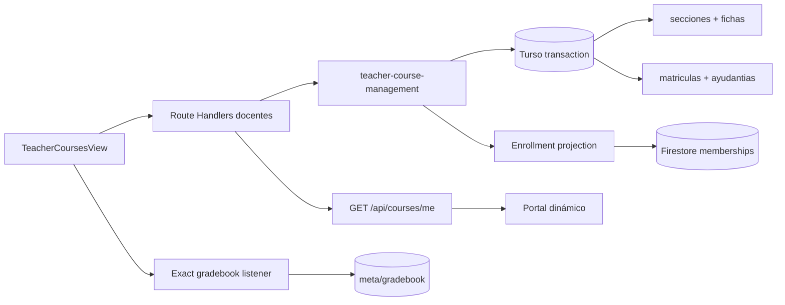

# P17 — CEO-27: Panel docente para administrar su ramo

**Estado:** VERIFICADA
**Aprobación:** solicitud explícita de ejecución y PR de CEO-27, 2026-08-23
**Alcance:** Web / Docentes / Aula virtual

## 1. Intención

El equipo docente debe poder crear una sección, mantener su ficha, publicar su esquema de notas y declarar ayudantes sin coordinación manual por WhatsApp. Turso conserva la estructura académica y la membresía; Firestore conserva el gradebook operacional ya existente.

## 2. Requisitos EARS

- **REQ-TCM-01:** El sistema SHALL mostrar el espacio `Administrar ramos` únicamente a cuentas autenticadas con rango `teacher` u `owner`.
- **REQ-TCM-02:** WHEN un docente envía una ficha válida, el sistema SHALL crear o reutilizar la asignatura y SHALL crear, dentro de una transacción, la sección, su ficha editable y la matrícula docente; la proyección Firestore SHALL completarse o la operación SHALL compensarse.
- **REQ-TCM-03:** WHEN el docente responsable actualiza título visible, descripción, modalidad, sala o color académico, el sistema SHALL modificar únicamente la ficha de su sección; un docente ajeno SHALL recibir HTTP 403.
- **REQ-TCM-04:** WHEN el docente guarda evaluaciones, el sistema SHALL exigir nombres no vacíos, ponderaciones positivas cuya suma sea exactamente 100 y nota de eximición válida, y SHALL persistir el documento exacto `courses/{seccionId}/meta/gradebook`.
- **REQ-TCM-05:** WHEN el docente designa como ayudante a una cuenta estudiantil institucional registrada, el sistema SHALL conservar su rol anterior, SHALL activar `rol_seccion = assistant` y SHALL proyectarlo a Firestore; WHEN la retira, SHALL restaurar la matrícula previa o retirar la creada por la ayudantía.
- **REQ-TCM-06:** WHILE una sesión está activa, el portal SHALL obtener sus ramos desde las matrículas activas del sistema de registro y SHALL fallar cerrado con una lista vacía si el catálogo no está disponible.
- **REQ-TCM-07:** IF una entrada es inválida, una cuenta no existe o una proyección falla, THEN el sistema SHALL responder con un código HTTP preciso y SHALL mostrar un mensaje accionable en español sin filtrar detalles internos.
- **REQ-TCM-08:** El sistema SHALL limitar catálogos, secciones y ayudantes a páginas de máximo 100 filas y SHALL abrir como máximo una escucha exacta de gradebook para el ramo seleccionado.
- **REQ-TCM-09:** El panel SHALL conservar el lenguaje visual CEOUBB, objetivos táctiles de 44 px, foco visible, numerales tabulares y la declaración de plataforma independiente.

## 3. Criterios BDD

```gherkin
Scenario: Un docente crea su primera sección
  Given una sesión con rango "teacher"
  And un período abierto y un departamento válidos
  When envía código, nombre, créditos y número de sección válidos
  Then Turso crea la sección, su ficha y su matrícula docente en una transacción
  And Firestore recibe la proyección de matrícula docente
  And el ramo aparece en el catálogo del portal sin recargar la aplicación

Scenario: Un estudiante intenta crear un ramo
  Given una sesión con rango "student"
  When envía la misma solicitud de creación
  Then la API responde HTTP 403
  And no se escribe ninguna tabla académica

Scenario: Un docente ajeno intenta editar una sección
  Given dos docentes responsables de secciones distintas
  When uno modifica el identificador de la sección del otro
  Then la API responde HTTP 403
  And la ficha original permanece sin cambios

Scenario: La ponderación no suma cien
  Given un docente editando el esquema de notas de su sección
  When las evaluaciones suman 90 por ciento
  Then el panel impide guardar
  And anuncia que la ponderación debe sumar 100 por ciento

Scenario: Un docente designa y retira una ayudante
  Given una estudiante institucional registrada
  When la docente la designa por su correo exacto
  Then la matrícula activa usa el rol "assistant"
  And el listado acotado la muestra como ayudante
  When la docente retira la ayudantía
  Then el rol y estado anteriores se restauran

Scenario: El portal carga sólo matrículas activas
  Given un usuario con dos matrículas activas y una retirada
  When abre su área personal
  Then el catálogo contiene exactamente las dos secciones activas
  And las escuchas de actividad y notas reciben sólo esos identificadores
```

## 4. Diseño técnico



### Esquema

- `section_profiles`: PK/FK `seccion_id`, título visible, descripción, modalidad, sala, tono académico y `updated_at`.
- `assistant_assignments`: una fila por sección/usuario con rol y estado anteriores para una reversión determinista.
- `matriculas`: conserva el rol canónico `assistant` ya definido.
- Migración idempotente: agrega ambas tablas y un catálogo general mínimo para que el primer ramo pueda crearse sin intervención manual.

### Contratos HTTP

| Método          | Ruta                                          | Resultado                                   |
| :-------------- | :-------------------------------------------- | :------------------------------------------ |
| GET             | `/api/courses/me`                             | Secciones activas de la sesión, máximo 100  |
| GET/POST        | `/api/teacher/courses`                        | Secciones administrables + catálogos / alta |
| PATCH           | `/api/teacher/courses/{seccionId}`            | Actualiza sólo la ficha autorizada          |
| GET/POST/DELETE | `/api/teacher/courses/{seccionId}/assistants` | Lista, designa o retira ayudantes           |

### Errores

| Código | Caso                                      | Reintento                                        |
| :----- | :---------------------------------------- | :----------------------------------------------- |
| 400    | payload, catálogo o ponderación inválidos | Corregir entrada                                 |
| 401    | sesión ausente                            | Volver a ingresar                                |
| 403    | rango o sección ajena                     | No                                               |
| 404    | sección o estudiante no registrado        | Corregir selección/correo                        |
| 409    | sección duplicada                         | Elegir otro paralelo                             |
| 503    | proyección académica no disponible        | Reintentar; la compensación evita estado parcial |
| 500    | infraestructura no clasificada            | Reintentar sin revelar detalle                   |

### Invariantes y presupuestos

- El rol global continúa derivándose sólo en `lib/access-policy.ts`; la autorización de sección usa `docente_id` y matrículas servidoras.
- Turso sigue siendo SoR; Firestore recibe una proyección unidireccional y el gradebook operacional.
- No se añaden consultas sin `.limit()`, barridos `collectionGroup`, dependencias ni escrituras por estudiante.
- Los ayudantes obtienen identidad y lectura por matrícula. Publicar, corregir o cambiar notas como ayudante no forma parte de CEO-27.
- No se despliegan migraciones ni reglas desde este trabajo.
- La preferencia explícita de no añadir comentarios nuevos al código prevalece sobre marcadores en comentario; la trazabilidad queda fijada por símbolos, tests y esta especificación.

## 5. DAG de ejecución

- [x] **T1 — REQ-TCM-02/03/05:** tablas y migración. Verificar: `pnpm run db:generate && pnpm run typecheck`.
- [x] **T2 — REQ-TCM-02/03/05/08:** validadores, DTO y DAL transaccional con compensación. Verificar: prueba focal nueva.
- [x] **T3 — REQ-TCM-01/02/03/05/06/07:** rutas autenticadas y contratos cliente. Verificar: prueba focal nueva.
- [x] **T4 — REQ-TCM-04/08:** escucha exacta y editor de ponderaciones reutilizable. Verificar: prueba focal y `pnpm run typecheck`.
- [x] **T5 — REQ-TCM-01/03/04/05/09:** espacio docente, navegación y estados responsive. Verificar: navegador escritorio/móvil.
- [x] **T6 — REQ-TCM-06:** catálogo dinámico del portal y recarga tras mutaciones. Verificar: prueba focal y flujo manual.
- [x] **T7 — REQ-TCM-01…09:** hashes, OpenSpec, gates completos y handoff. Verificar: `pnpm run verify:fast`, `pnpm run verify:invariants`, `pnpm run lint`, `pnpm test`.

## 6. Verificación y entrega

- `pnpm run verify:fast`: 236/236 pruebas, 29 hashes; después del archivo, 15 especificaciones vivas válidas.
- `pnpm run verify:invariants`: 31/31 invariantes y reglas Firebase válidas.
- `pnpm run lint`, `pnpm run format:check`, `pnpm run check:functions`: sin hallazgos.
- `pnpm test`: build productivo y 261/261 pruebas integrales.
- React Doctor sobre líneas cambiadas: sin hallazgos.
- Navegador: 1280 × 900 y 390 × 844, sin overlay, errores de consola ni overflow horizontal; controles del formulario móvil de 44 px o más.
- Despliegue: no ejecutado. Antes de producción se debe aplicar `drizzle/0005_public_lila_cheney.sql` y confirmar las credenciales de proyección Firestore del servidor.

## 7. Exclusiones

- Invitaciones a correos que aún no han iniciado sesión.
- Importación SIS/CSV, aprobación institucional de nuevas asignaturas y rollover de períodos.
- Permisos de publicación, entrega o calificación para ayudantes.
- Despliegue de migraciones, Vercel o Firebase.
