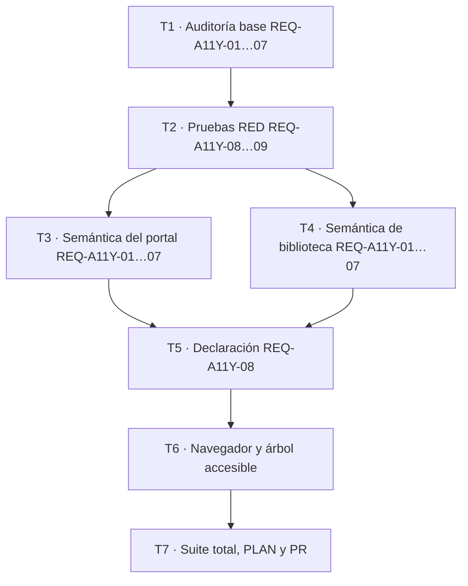

# P17 — Auditoría y conformidad WCAG 2.2 AA

| Campo               | Valor                                                                                               |
| :------------------ | :-------------------------------------------------------------------------------------------------- |
| Issue               | CEO-42                                                                                              |
| Estado              | VERIFICADA                                                                                          |
| Fecha de aprobación | 2026-08-23                                                                                          |
| Base de aprobación  | Solicitud explícita del mantenedor de ejecutar CEO-42 y publicar el PR sin aprobaciones intermedias |
| Alcance             | Portal web, estados autenticados, páginas legales y biblioteca académica web                        |
| Estándar            | [Web Content Accessibility Guidelines 2.2, nivel AA](https://www.w3.org/TR/WCAG22/)                 |

## 1. Intención y alcance

CEOUBB SHALL ofrecer sus superficies web propias de forma perceptible, operable, comprensible y robusta. La afirmación pública cubrirá `https://ceoubb.com/`, sus estados autenticados, `/privacidad`, `/terminos`, `/accesibilidad` y `/biblioteca/index.html`. Los servicios externos abiertos mediante enlaces y los documentos descargables aportados por terceros quedan fuera del conjunto de páginas evaluado.

La auditoría combina análisis automatizado, revisión del árbol accesible y pruebas manuales reproducibles. La declaración MUST mantener la condición independiente y no oficial de CEOUBB.

## 2. Requisitos EARS y trazabilidad

### REQ-A11Y-01 — Teclado, foco y bloques repetidos

The system SHALL expose every portal and library action through native keyboard-operable controls, SHALL provide a visible bypass link before repeated navigation, SHALL preserve a logical focus order without traps, and SHALL keep focused controls unobscured.

```gherkin
Scenario: Recorrer portal y biblioteca usando sólo teclado
  Given una persona que no utiliza puntero
  When recorre cada superficie con Tab, Shift+Tab, Enter, Space y Escape
  Then puede alcanzar y activar todas las acciones disponibles
  And puede saltar al contenido principal
  And ningún componente retiene ni oculta completamente el foco
```

### REQ-A11Y-02 — Semántica y lector de pantalla

WHEN navigation, filters, completion, hints, solutions, notes or progress change, the system SHALL expose an accessible name, role, state and programmatic status message without relying on color or visual position alone.

```gherkin
Scenario: Entender el estado dinámico con un lector de pantalla
  Given una persona que navega mediante el árbol accesible
  When cambia una vista, filtro, ramo, pista, solución, nota o estado de avance
  Then el control anuncia su nombre y estado actual
  And la actualización relevante se comunica mediante una región de estado
  And los elementos decorativos quedan fuera del árbol accesible
```

### REQ-A11Y-03 — Contraste y color

The system SHALL maintain at least 4.5:1 contrast for normal text, 3:1 for large text and 3:1 for essential controls and focus indicators, and SHALL NOT use color as the only carrier of meaning.

```gherkin
Scenario: Interpretar contenido con percepción de color reducida
  Given una persona que no distingue los acentos cromáticos
  When revisa texto, controles, selección, progreso y errores
  Then el contenido mantiene los umbrales WCAG 2.2 AA
  And cada estado conserva una señal textual, semántica or geométrica adicional
```

### REQ-A11Y-04 — Texto ampliado, reflujo y espaciado

WHILE text is resized to 200 percent or the viewport is reduced to 320 CSS pixels, the system SHALL preserve content and functionality without two-dimensional page scrolling, clipping or overlap; user text-spacing overrides SHALL remain usable.

```gherkin
Scenario: Usar las superficies con baja visión
  Given un viewport de 320 CSS pixels o texto ampliado a 200 percent
  When la persona recorre el portal, la biblioteca y la declaración
  Then el contenido refluye en una sola dimensión
  And no se pierde, solapa ni trunca ninguna acción o etiqueta esencial
```

### REQ-A11Y-05 — Movimiento reducido

WHILE `prefers-reduced-motion: reduce` is active, the system SHALL suppress non-essential animation and SHALL use non-animated scrolling for programmatic navigation.

```gherkin
Scenario: Preferencia de movimiento reducido
  Given una persona que solicita movimiento reducido
  When abre vistas, selecciona ramos o recibe estados dinámicos
  Then las transiciones no esenciales duran como máximo 0.01ms o se desactivan
  And ningún desplazamiento programático usa animación suave
```

### REQ-A11Y-06 — Formularios, errores y autenticación

The system SHALL programmatically label every form control, SHALL identify instructions and errors, SHALL announce submission status, and SHALL keep Google institutional sign-in compatible with password-manager-independent accessible authentication.

```gherkin
Scenario: Completar formularios con tecnología de asistencia
  Given una persona que explora controles por su nombre accesible
  When usa acceso, búsqueda, filtros, tutor, notas, administración o aula
  Then cada control expone una etiqueta descriptiva
  And los errores y estados se anuncian sin exigir memoria, transcripción or reconocimiento cognitivo
```

### REQ-A11Y-07 — Tamaño objetivo

The system SHALL provide at least a 24 by 24 CSS pixel target for every non-exempt interactive control at all responsive variants.

```gherkin
Scenario: Accionar controles con precisión motora reducida
  Given una persona que utiliza toque o un puntero impreciso
  When acciona controles no incluidos en texto corrido
  Then cada área interactiva mide al menos 24 por 24 CSS pixels
  And los controles adyacentes no dependen de objetivos superpuestos
```

### REQ-A11Y-08 — Declaración pública

WHEN `/accesibilidad` is requested, the system SHALL publish an easy-to-find Spanish accessibility statement containing the claim date, WCAG title/version/URI, AA level, covered page scope, technologies relied upon, assessment method, compatibility target, feedback channel, response expectation, known limitations and the independent non-official disclaimer.

```gherkin
Scenario: Consultar la declaración de accesibilidad
  Given una visita pública a cualquier entrada principal de CEOUBB
  When la persona sigue el enlace “Accesibilidad”
  Then recibe una página pública con estado HTTP 200
  And encuentra todos los componentes requeridos de la afirmación de conformidad
  And entiende que CEOUBB no es un servicio oficial de la Universidad del Bío-Bío
```

### REQ-A11Y-09 — Prevención de regresiones

WHEN the repository quality gate runs, the system SHALL verify the accessibility contract through JSX lint rules, deterministic regression assertions and the full application suite without weakening existing tests.

```gherkin
Scenario: Bloquear una regresión detectable
  Given una modificación que elimina una etiqueta, bypass, estado o declaración requerida
  When se ejecutan lint y las pruebas automatizadas
  Then al menos una comprobación falla con una causa accionable
  And las pruebas históricas permanecen intactas
```

## 3. Diseño técnico

```mermaid
flowchart LR
    U[Teclado, lector, zoom, toque] --> P[Portal Next.js]
    U --> B[Biblioteca HTML estática]
    P --> S[Semántica, foco y estados]
    B --> S
    S --> C[Contrato WCAG 2.2 AA]
    C --> D[/accesibilidad]
    C --> T[Lint, regresión y navegador]
```

### 3.1 Contrato de la declaración

| Campo          | Valor contractual                                                                 |
| :------------- | :-------------------------------------------------------------------------------- |
| Fecha          | Fecha ISO visible y `dateTime` legible por máquina                                |
| Norma          | WCAG 2.2, nivel AA, enlace normativo W3C                                          |
| Alcance        | URIs propias incluidas y exclusiones de recursos externos enlazados               |
| Tecnologías    | HTML, CSS, JavaScript, WAI-ARIA y SVG                                             |
| Evaluación     | Autoevaluación con lint, reglas deterministas, árbol accesible y pruebas manuales |
| Compatibilidad | Dos versiones vigentes de navegadores principales y lectores de pantalla modernos |
| Contacto       | Canal de soporte existente, sin inventar una dirección nueva                      |
| Vigencia       | Fecha de revisión y compromiso de reevaluación tras cambios sustanciales          |

No se modifica esquema, API, autenticación, Turso, Firestore, Storage ni Firebase.

### 3.2 Taxonomía de fallos

| Fallo                    | Efecto                      | Mitigación                                 | Verificación                            |
| :----------------------- | :-------------------------- | :----------------------------------------- | :-------------------------------------- |
| Nombre/estado ausente    | Control incomprensible      | Etiqueta nativa, `aria-*` y estado textual | lint + regresión + árbol accesible      |
| Foco invisible u oculto  | Acción inoperable           | bypass, foco visible y `scroll-margin`     | teclado + CSS computado                 |
| Reflujo roto             | Contenido perdido           | grids flexibles, wrapping y overflow local | viewport 320 px + zoom 200%             |
| Movimiento no solicitado | Malestar o desorientación   | media query y scroll instantáneo           | emulación reduced motion                |
| Contraste insuficiente   | Texto/control imperceptible | tokens AA medidos                          | análisis automatizado + revisión manual |
| Declaración inaccesible  | Falta de transparencia      | enlace consistente y sitemap               | HTTP/render test                        |

### 3.3 Hallazgos de auditoría y remediación

| Hallazgo base                                                                | Riesgo WCAG                  | Remediación aplicada                                                                                         |
| :--------------------------------------------------------------------------- | :--------------------------- | :----------------------------------------------------------------------------------------------------------- |
| El acceso público y las páginas legales no ofrecían bypass                   | 2.4.1, navegación repetitiva | Enlace de salto visible al foco y destino `main` enfocable en portal y documentos legales                    |
| El cambio de vista del portal no movía ni anunciaba el contexto              | 2.4.3, 4.1.3                 | Foco programático al título principal, `aria-labelledby` y región viva con el nombre de vista                |
| Filtros, progreso, selección, revelaciones y completitud carecían de estado  | 1.3.1, 4.1.2, 4.1.3          | `aria-pressed`, `aria-expanded`, `aria-controls`, `progressbar`, estados vivos y nombres de acción dinámicos |
| Búsqueda, tutor y notas no tenían todas sus instrucciones asociadas          | 1.3.1, 3.3.2, 3.3.3          | `label`, `aria-describedby`, `aria-invalid`, ayuda y error enfocado                                          |
| Texto secundario y bordes esenciales de controles quedaban bajo los umbrales | 1.4.3, 1.4.11                | Tokens medibles de 4,5:1 para texto y 3:1 para controles; completitud usa verde oscuro y señal textual       |
| `body` exigía 320 px antes de sumar la barra vertical                        | 1.4.10                       | Se eliminó el ancho mínimo global y se protegió con una regresión determinista                               |
| La navegación móvil de ramos exigía desplazamiento horizontal                | 1.4.10                       | Cuadrícula de dos columnas bajo 720 px y una columna a 320 px                                                |
| El scroll programático y las transiciones no respetaban toda la preferencia  | 2.2.2, 2.3.3                 | Rama `prefers-reduced-motion`, scroll instantáneo y cancelación global de animación no esencial              |
| No existía una declaración pública completa ni descubrible                   | Transparencia institucional  | Nueva ruta `/accesibilidad`, enlaces consistentes, sitemap, alcance, método, contacto y descargo no oficial  |

### 3.4 Evidencia de navegador

- Portal público, vista docente representativa, biblioteca, privacidad, términos y declaración: `scrollWidth === clientWidth` a 320 CSS px.
- Las mismas seis superficies refluyeron sin desbordamiento a 640 CSS px, equivalente geométrico de zoom 200 % sobre un viewport de 1280 px.
- El árbol accesible expuso bypass, regiones, encabezados, controles nativos, etiquetas, estados de selección, expansión, avance y mensajes vivos; no se encontraron controles visibles sin nombre.
- El control mínimo de completitud midió 24 × 24 CSS px, su borde alcanzó 4,76:1 y su estado activo combinó nombre, `aria-pressed`, marca y fondo oscuro.
- La inspección calculada de texto no arrojó fallos reales: los únicos avisos restantes fueron glifos decorativos con `aria-hidden`, una marca transparente inactiva y texto blanco sobre gradientes oscuros que el cálculo sin gradientes no pudo componer.
- La consola permaneció sin errores durante los recorridos y los recursos de accesibilidad de la biblioteca quedaron versionados para invalidar su caché offline anterior.

### 3.5 Invariantes, seguridad y rendimiento

- La política de roles, las reglas Firebase, el cálculo de notas y la identidad de sección permanecen intactos.
- `public/biblioteca/` continúa como copia única; no se genera un árbol Android duplicado.
- Los store badges permanecen como marcadores no clicables y todos los avisos de servicio independiente se conservan.
- No se agregan consultas, listeners, escrituras, secretos ni dependencias de producción.
- El contenido inicial del portal SHALL permanecer por debajo de 1.500 nodos activos y la biblioteca no añadirá trabajo proporcional al catálogo fuera de su render existente.
- Los objetivos WCAG y la afirmación pública no sustituyen pruebas con personas con discapacidad; cualquier limitación descubierta MUST publicarse y priorizarse.

## 4. Archivos y radio de cambio

- `[NEW] app/accesibilidad/page.tsx`: declaración pública y metadatos.
- `[MODIFY] app/Portal.tsx`, `app/portal-shell.tsx`: enlace consistente, bypass, destino de foco y anuncio de vista.
- `[MODIFY] app/privacidad/page.tsx`, `app/terminos/page.tsx`: bypass en las páginas legales incluidas.
- `[MODIFY] app/globals.css`: bypass, foco no oculto y presentación de la declaración.
- `[MODIFY] app/sitemap.xml/route.ts`: descubrimiento público.
- `[MODIFY] public/biblioteca/index.html`: bypass, etiquetas, estados y enlace a la declaración.
- `[MODIFY] public/biblioteca/assets/app.js`: sincronización accesible de estados y movimiento reducido.
- `[MODIFY] public/biblioteca/assets/styles.css`: reflujo, contraste, foco y objetivos.
- `[MODIFY] public/sw.js`: invalidación de la caché offline para publicar las correcciones inmediatamente.
- `[NEW] tests/accessibility.test.ts`: regresiones deterministas del contrato.
- `[MODIFY] package.json`, `PLAN.md`: quality gate y handoff.

## 5. Tareas y DAG



- [x] **T1 — Auditoría base (REQ-A11Y-01…07):** registrar hallazgos de teclado, semántica, contraste, zoom, movimiento y formularios. Verificación: `pnpm run lint` y navegador local.
- [x] **T2 — Pruebas RED (REQ-A11Y-08…09):** añadir aserciones de contrato sin modificar pruebas históricas. Verificación: `pnpm run test:a11y` falló 7/7 antes de la implementación y pasó 7/7 después.
- [x] **T3 — Portal (REQ-A11Y-01…07):** corregir bypass, foco, anuncios, nombres y acceso consistente. Verificación: `pnpm run lint && pnpm run typecheck`.
- [x] **T4 — Biblioteca (REQ-A11Y-01…07):** corregir semántica dinámica, formularios, reflujo, objetivos y movimiento. Verificación: `pnpm run test:a11y`.
- [x] **T5 — Declaración (REQ-A11Y-08):** publicar y enlazar `/accesibilidad`, manteniendo el aviso no oficial. Verificación: `pnpm run test:a11y`.
- [x] **T6 — Auditoría de navegador (REQ-A11Y-01…08):** probar teclado, árbol accesible, 320 px, 200%, espaciado y reduced motion. Verificación: checklist y ausencia de errores de consola.
- [x] **T7 — Gate final (REQ-A11Y-09):** ejecutar `pnpm run lint`, `pnpm run typecheck`, `pnpm run test:unit`, `pnpm test`, actualizar estado y `PLAN.md`, y abrir PR en español.

## 6. Resultado de verificación

- `pnpm run test:a11y`: 7/7.
- `pnpm run verify:fast`: 234/234, test-locking de 29 archivos y 14 especificaciones OpenSpec válidas.
- `pnpm run verify:invariants`: 31/31 y reglas Firebase válidas.
- `pnpm run format:check`, `pnpm run lint`, `pnpm run check:functions`: sin hallazgos.
- `pnpm test`: build Next.js 16.3 y 259/259 pruebas.
- Auditoría de navegador: seis superficies a 320 y 640 CSS px, árbol accesible, estados dinámicos, contraste computado, objetivos y consola sin errores.
- Despliegue: no ejecutado; la declaración y las correcciones quedan sujetas al merge y al pipeline de Vercel.
