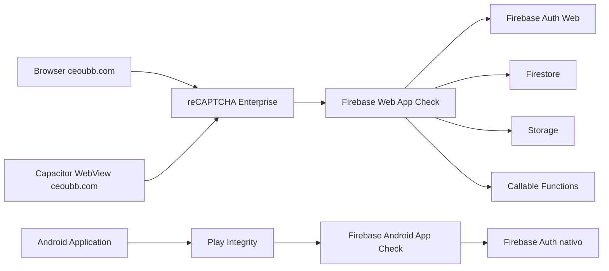
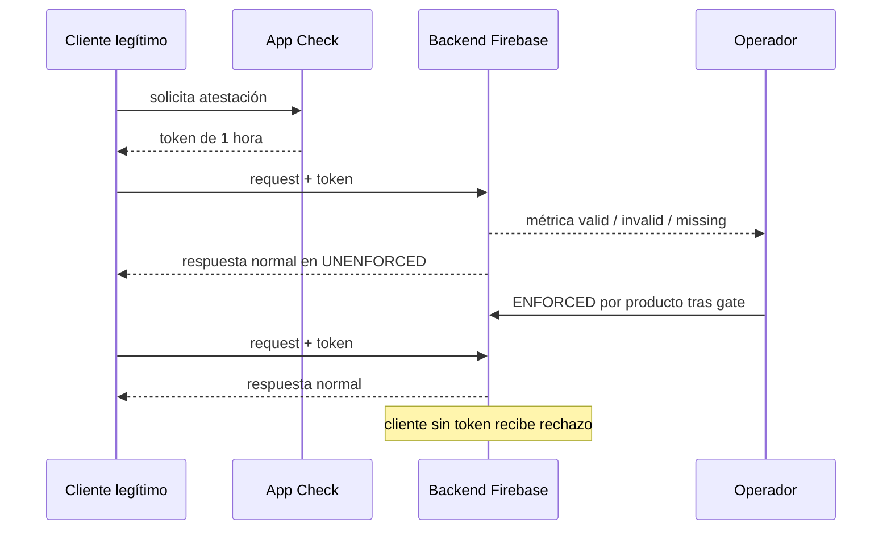

# P18 — Firebase App Check gradual para Web y Android

**Issue:** CEO-47

**Estado:** VERIFICADA

**Aprobación:** el solicitante autorizó expresamente ejecutar los planes de CEO-47 sin gates adicionales el 2026-08-23

**Owner:** Juako / Codex

**Última actualización:** 2026-08-23

## 0. Constitución e intención

CEOUBB debe añadir atestación de cliente a Firebase sin convertir el primer despliegue en un corte para usuarios legítimos. La app Capacitor es remota: Firestore, Storage y Functions se consumen con el SDK web desde `https://ceoubb.com`; el SDK Android sólo participa en autenticación y notificaciones. Por eso ambos proveedores son necesarios y protegen superficies distintas.

Se preservan el aislamiento por matrícula, las reglas default-deny, el rol institucional, la región `southamerica-west1`, el límite de 50 MiB y el descargo de independencia. App Check complementa Auth y Security Rules; no las reemplaza.

## 1. Requisitos EARS y RFC 2119

- **REQ-APPCHK-01 (Ubiquitous):** The Web client SHALL initialize Firebase App Check with a score-based reCAPTCHA Enterprise key for `ceoubb.com`, a one-hour token TTL, a minimum valid score of `0.5`, and automatic token refresh before accessing Firebase Auth, Firestore, Storage, or callable Functions.
- **REQ-APPCHK-02 (State-Driven):** WHILE the Capacitor WebView loads `https://ceoubb.com`, the system SHALL use the same Web App Check attestation path as the browser for Firestore, Storage, and callable Functions.
- **REQ-APPCHK-03 (State-Driven):** WHILE an Android build starts, the native process SHALL install Play Integrity App Check before the native Firebase Authentication plugin can access Firebase.
- **REQ-APPCHK-04 (Unwanted Behavior):** IF a developer runs the web client on `localhost`, THEN the development build MAY request a non-committed Firebase App Check debug token and the production build MUST NOT enable the debug provider.
- **REQ-APPCHK-05 (State-Driven):** WHILE CEO-47 is in observation, Firestore, Storage, and Authentication SHALL remain `UNENFORCED`, callable Functions SHALL accept missing App Check tokens, and all supported App Check metrics SHALL be collected.
- **REQ-APPCHK-06 (Event-Driven):** WHEN at least 24 continuous hours of representative web and physical-Android traffic show at least 99% valid requests for every protected product with no legitimate App Check error, the operator SHALL enforce Firestore first, Storage second, callable Functions third, and Authentication last, with at least 30 minutes of healthy metrics between stages.
- **REQ-APPCHK-07 (Unwanted Behavior):** IF valid traffic falls below 99%, a supported flow returns `401`, `403`, `permission-denied`, `storage/unauthorized`, or `functions/unauthenticated`, or production error rate rises by at least 0.5 percentage points after a stage, THEN the operator SHALL restore that product to `UNENFORCED` before investigating.
- **REQ-APPCHK-08 (Ubiquitous):** The repository SHALL contain automated assertions for the web provider, Android provider, debug isolation, monitoring default, and enforcement order, without committing debug tokens, service-account material, or reCAPTCHA secrets.

## 2. Criterios BDD

```gherkin
Scenario: El portal productivo adjunta App Check
  Given el portal servido desde "https://ceoubb.com"
  When Firebase se inicializa en el navegador
  Then App Check debe usar ReCaptchaEnterpriseProvider con la clave registrada
  And la renovación automática de tokens debe estar habilitada
  And Auth, Firestore, Storage y Functions deben inicializarse después

Scenario: La WebView remota comparte la atestación web
  Given la app Capacitor abre "https://ceoubb.com"
  When el aula usa Firestore, Storage o Functions
  Then las solicitudes deben llevar el token de la app web registrada
  And no debe existir un segundo cliente Firestore nativo

Scenario: Android inicializa Play Integrity antes de Firebase Auth
  Given una compilación Android de "cl.ubb.centroestudio"
  When el proceso de la aplicación arranca
  Then FirebaseAppCheck debe instalar PlayIntegrityAppCheckProviderFactory
  And la Application debe ejecutarse antes de MainActivity

Scenario: Desarrollo local no filtra una credencial
  Given un build de desarrollo servido desde localhost
  When App Check se inicializa
  Then puede solicitar un token de depuración generado localmente
  And ningún token fijo debe existir en el repositorio
  And un build de producción no debe activar el modo de depuración

Scenario: Observación no corta clientes existentes
  Given los proveedores Web y Android registrados
  When se despliega la primera etapa
  Then Firestore, Storage y Authentication deben quedar UNENFORCED
  And las callable Functions no deben exigir App Check
  And las métricas deben distinguir solicitudes válidas, inválidas y sin token

Scenario: Enforcement avanza por etapas
  Given 24 horas con al menos 99% de solicitudes válidas y cero fallas legítimas
  When el operador ejecuta el runbook
  Then debe bloquear Firestore antes que Storage
  And debe bloquear callable Functions antes que Authentication
  And debe observar al menos 30 minutos entre etapas

Scenario: Una regresión revierte sólo la etapa afectada
  Given un producto recién configurado como ENFORCED
  When aparece una falla legítima o se supera el umbral de error
  Then ese producto debe volver a UNENFORCED
  And los demás productos no deben cambiar automáticamente
```

## 3. Diseño técnico



### 3.1 Contratos y configuración

| Superficie           | App Firebase                                                          | Proveedor                  | TTL    | Estado inicial                              |
| :------------------- | :-------------------------------------------------------------------- | :------------------------- | :----- | :------------------------------------------ |
| Portal web y WebView | `1:411177916202:web:57986cb2e14d676fe93053`                           | reCAPTCHA Enterprise score | 3600 s | cliente activo; servicios `UNENFORCED`      |
| Android nativo       | `1:411177916202:android:67a7ba25fbe65ed9e93053`                       | Play Integrity             | 3600 s | cliente activo; Authentication `UNENFORCED` |
| Functions callable   | `saveAuditedStudentScores`, `saveAuditedGradebook`, `deleteMyAccount` | token adjunto por SDK web  | n/a    | `enforceAppCheck: false`                    |

La clave Web acepta sólo `ceoubb.com`; sus subdominios quedan cubiertos por reCAPTCHA Enterprise. `localhost` no se agrega. El piloto Android distribuido fuera de Play admite versiones no reconocidas, exige integridad de dispositivo y no exige licencia; cuando la distribución sea exclusivamente Play, el operador deberá endurecer esos dos verdicts después de observar la versión publicada.

La CSP admite exclusivamente `https://www.google.com/recaptcha/` y `https://www.gstatic.com/recaptcha/` en `script-src`, `https://www.google.com/recaptcha/` en `connect-src`, y `https://www.google.com/recaptcha/` más `https://recaptcha.google.com/recaptcha/` en `frame-src`. Los demás orígenes y directivas conservan el contrato previo.

### 3.2 Secuencia operacional



### 3.3 Taxonomía de fallos

| Falla                       | Señal                                        | Efecto en observación                       | Respuesta                                    |
| :-------------------------- | :------------------------------------------- | :------------------------------------------ | :------------------------------------------- |
| reCAPTCHA no emite token    | consola `appCheck/recaptcha-error`           | request continúa sin token                  | mantener `UNENFORCED`, revisar dominio/clave |
| Play Integrity no atesta    | `FirebaseAppCheckException`                  | Auth nativo continúa mientras no se aplique | revisar SHA-256, API y distribución          |
| Firestore/Storage bloqueado | `permission-denied` / `storage/unauthorized` | no debe ocurrir por App Check               | revertir producto a `UNENFORCED`             |
| Callable sin token          | `request.app` ausente                        | se registra, no se rechaza                  | corregir cliente antes de enforcement        |
| Abuso sin atestación        | métrica invalid/missing                      | autorizado sólo por reglas/Auth existentes  | confirmar tendencia y luego aplicar          |

### 3.4 Seguridad, rendimiento e invariantes

- La atestación no concede roles ni matrícula y no modifica Firestore/Storage Rules.
- No se versionan tokens de depuración ni credenciales; la site key score-based es un identificador público limitado por dominio y App Check.
- TTL de una hora implica aproximadamente dos evaluaciones reCAPTCHA por cliente-hora activo; se debe vigilar cuota/costo contra CEO-9 antes de reducirlo.
- La inicialización añade una atestación temprana y reutiliza el token; no agrega consultas, listeners ni escrituras por usuario.
- El flujo web debe seguir funcionando si el token falla durante observación; enforcement sólo se habilita tras el gate cuantitativo.

## 4. DAG de tareas

- [x] **TASK-01 — Infraestructura de observación** (`REQ-APPCHK-01`, `02`, `03`, `05`): habilitar APIs, crear la clave score-based, registrar ambos proveedores y configurar los servicios como `UNENFORCED`. **Verificación:** consultar Firebase App Check API y registrar evidencia en el runbook.
- [x] **TASK-02 — Cliente web** (`REQ-APPCHK-01`, `02`, `04`): inicializar App Check antes de otros clientes Firebase y aislar el modo debug a desarrollo local. **Verificación:** `pnpm exec node --experimental-strip-types --test tests/app-check.test.ts`.
- [x] **TASK-03 — Cliente Android** (`REQ-APPCHK-03`): instalar Play Integrity desde `Application` y declarar la dependencia nativa compatible. **Verificación:** `android\\gradlew.bat :app:assembleDebug`.
- [x] **TASK-04 — Observación de Functions y runbook** (`REQ-APPCHK-05`, `06`, `07`): declarar la etapa no aplicada y documentar gates, orden y reversa. **Verificación:** `pnpm run check:functions` y revisión automatizada del runbook.
- [x] **TASK-05 — Protección de regresión** (`REQ-APPCHK-08`): incorporar assertions y test-locking. **Verificación:** `pnpm run verify:fast` y `pnpm run verify:invariants`.
- [x] **TASK-06 — Gate integral** (`REQ-APPCHK-01` … `08`): validar build, lint, formato, Functions y suite completa. **Verificación:** `pnpm run lint`, `pnpm run format:check`, `pnpm run check:functions`, `pnpm test`.

## 5. Gate de verificación

La spec avanzará a `VERIFICADA` sólo cuando TASK-01 a TASK-06 estén cerradas y los checks locales pasen. Eso verifica la **etapa de observación**. El enforcement de producción no forma parte del primer despliegue: permanece condicionado a datos reales posteriores al merge y despliegue, de acuerdo con `REQ-APPCHK-06` y `REQ-APPCHK-07`.

Evidencia del 2026-08-23: Firebase App Check API devolvió TTL `3600s`, score mínimo `0.5`, Play Integrity con `MEETS_DEVICE_INTEGRITY` y Firestore, Storage y Authentication en `UNENFORCED`. La prueba focal pasó 6/6; `verify:fast`, 254/254; invariantes, 31/31; suite integral con build Next.js, 279/279; lint, formato y Functions quedaron limpios; Android `assembleDebug` terminó 197/197 tareas. Quedan deliberadamente fuera de este gate el despliegue de los clientes, la observación productiva durante 24 horas, la prueba en Android físico y cualquier enforcement.
