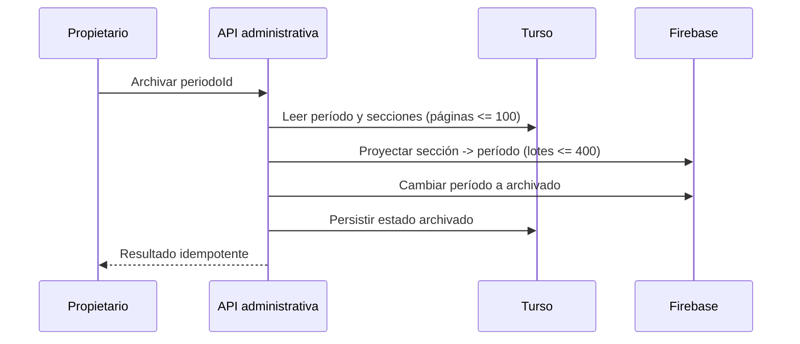

# CEO-18: Cierre de semestre y archivo de secciones

- **Estado:** IMPLEMENTADA — pendiente de revisión y despliegue
- **Fecha:** 2026-08-24
- **Aprobación:** Juako autorizó ejecutar y publicar el plan sin una pausa adicional de aprobación.
- **Rama:** `elpapijuaco325/ceo-18-cierre-de-semestre-archivar-ramos-del-periodo-anterior`
- **Dependencia:** CEO-14 completada

## 1. Intención y alcance

El cierre conserva períodos, secciones, matrículas y contenido académico. Un período que deja de estar abierto sale de las superficies de trabajo vigente, permanece consultable en un historial separado y bloquea toda mutación en Web y Capacitor. Repetir una asignatura crea otra matrícula asociada a una sección de otro período; nunca reactiva ni sobrescribe la matrícula histórica.

## 2. Requisitos formales

- **REQ-ARCH-01 (Event-Driven):** WHEN an owner archives an existing academic period, the system SHALL project read-only access to Firebase and SHALL persist `periodos.estado = 'archivado'` without deleting or mutating its sections, enrollments, posts, files, progress, submissions, grades, or audit history.
- **REQ-ARCH-02 (State-Driven):** WHILE a period state is different from `abierto`, the system SHALL allow enrolled members to read its classroom and SHALL deny every course mutation in Firestore, Storage, and privileged grade Functions, including owner mutations.
- **REQ-ARCH-03 (State-Driven):** WHILE an enrollment belongs to an open period, the portal SHALL include its section in the main dashboard, sidebar, calendar, command palette, notifications, and bounded real-time listeners; WHILE it belongs to a closed or archived period, the portal SHALL exclude it from those active surfaces and SHALL expose it in a separate paginated history.
- **REQ-ARCH-04 (Ubiquitous):** The system SHALL transport course identity as `seccionId` plus `periodoId`, `periodoEstado`, and `rolSeccion`, and SHALL render the same lifecycle behavior in the responsive web portal and the remote-first Capacitor shell.
- **REQ-ARCH-05 (Unwanted Behavior):** IF a student repeats an asignatura in a later period, THEN the system SHALL require a distinct section and enrollment identity and SHALL preserve the earlier enrollment as an independent read-only record.
- **REQ-ARCH-06 (Unwanted Behavior):** IF an unauthenticated or non-owner actor requests period archival, or the period identifier is malformed or absent, THEN the API SHALL reject the request without changing Turso or Firebase.
- **REQ-ARCH-07 (Ubiquitous):** The system SHALL bound period, section, and enrollment queries to at most 100 rows per page and SHALL bound Firestore commits to at most 400 writes.

## 3. Criterios de aceptación BDD

```gherkin
Feature: Cierre de semestre sin pérdida de historia

  Scenario: El propietario archiva un período abierto
    Given period "2026-1" is open with sections and active enrollments
    When the authenticated owner archives period "2026-1"
    Then every section mapping is present in Firebase
    And the Firebase period projection becomes "archivado"
    And Turso persists period "2026-1" as "archivado"
    And no section or enrollment is deleted

  Scenario: Un ramo archivado conserva lectura y bloquea escritura
    Given a student and a teacher remain enrolled in an archived section
    When either member reads posts, files, grades, progress, or submissions
    Then Firebase rules allow the authorized read
    When either member attempts any classroom mutation
    Then Firestore, Storage, or the grade Function denies the mutation

  Scenario: El historial no contamina el trabajo vigente
    Given a user has open and archived section enrollments
    When the portal loads
    Then only open sections appear in the main dashboard and active listeners
    And archived sections appear under "Ramos archivados"
    And opening an archived section shows a persistent "Solo lectura" notice

  Scenario: Una asignatura repetida conserva ambas matrículas
    Given a student enrolled in subject "MAT101" during "2025-2"
    When the student enrolls in a new "MAT101" section during "2026-2"
    Then the new enrollment has a different section and enrollment identifier
    And the "2025-2" enrollment remains unchanged and readable

  Scenario: Un actor sin privilegios intenta cerrar un período
    Given the session is missing or its stored role is not "owner"
    When the actor requests archival of "2026-1"
    Then the response is HTTP 401 or 403
    And no period projection or relational record changes
```

## 4. Diseño técnico



La proyección usa dos documentos estrechos y sin datos personales:

```ts
type AcademicSectionProjection = {
  seccionId: string;
  periodoId: string;
};

type AcademicPeriodProjection = {
  periodoId: string;
  status: "abierto" | "cerrado" | "archivado";
  updatedAt: string;
};
```

Rutas:

- `academicSections/{seccionId}` resuelve el período de una sección.
- `academicPeriods/{periodoId}` resuelve si las escrituras están abiertas.
- `enrollments/{uid}/sections/{seccionId}` continúa siendo la condición de lectura y rol.

La operación proyecta primero todos los mapas sección-período, después cambia un único documento de período y finalmente confirma Turso. Un fallo previo al cambio del período no cierra parcialmente las secciones; un fallo posterior deja Firebase en el estado seguro de solo lectura y la repetición idempotente completa Turso.

## 5. Contratos de consulta e interfaz

`EnrolledSection` incorpora `periodoEstado` y `docenteNombre`. El cliente valida el arreglo antes de construir cursos. Los cursos `abierto` alimentan listeners y superficies vigentes; `cerrado` y `archivado` alimentan solamente el historial. La plantilla estática de una asignatura puede aportar unidades y color, pero `seccionId`, período, sección, docente, rol y estado siempre provienen de Turso.

## 6. Errores

| Condición                       | HTTP / código | Conducta                                              |
| :------------------------------ | :------------ | :---------------------------------------------------- |
| Sin sesión                      | 401           | No consulta ni muta datos                             |
| Rol distinto de owner           | 403           | No consulta ni muta datos administrativos             |
| ID inválido                     | 400           | Rechazo previo a toda escritura                       |
| Período ausente                 | 404           | No crea proyecciones huérfanas                        |
| Firebase no confirma el cierre  | 503           | Turso permanece sin archivar; reintento seguro        |
| Turso falla después de Firebase | 500           | Firebase queda en solo lectura; reintento idempotente |

## 7. Seguridad, escala e invariantes

- Turso continúa como sistema de registro; Firebase sólo proyecta autorización operacional.
- Las reglas mantienen default deny, matrícula activa para lectura y estado de período abierto para escritura.
- El cierre escala por secciones, no por estudiantes: hasta 3.000 mapas de sección y una sola mutación de período, frente a 72.000 matrículas de la envolvente institucional.
- Cada consulta SQL lleva cursor indexado y `.limit()`; cada commit Firebase se limita a 400 escrituras.
- No cambia la derivación de rol, la matemática de notas, la biblioteca única, la región Firebase ni el descargo no oficial.
- Las reglas añaden hasta dos lecturas dependientes únicamente en mutaciones de curso; las lecturas normales no pagan ese costo.
- Los marcadores `Implements:` no se añaden como comentarios nuevos en código fuente porque la preferencia global del mantenedor los prohíbe; la trazabilidad vive en esta especificación, nombres de pruebas y atributos declarativos ya admitidos por la interfaz.

## 8. DAG de ejecución y verificación

- [x] **T1 — REQ-ARCH-01, 05, 07:** fijar pruebas RED de proyecciones, identidad histórica, consultas acotadas y API. `node --experimental-strip-types --test tests/semester-archival.test.ts` — RED confirmado por exports de proyección aún inexistentes; snapshot de 32 pruebas registrado.
- [x] **T2 — REQ-ARCH-01, 07:** catálogo, archivo idempotente y proyecciones Firebase implementados. Prueba focal: 6/6.
- [x] **T3 — REQ-ARCH-02, 06:** Firestore, Storage, Functions y rutas owner-only blindados. Invariantes 31/31 y sintaxis de Functions válida.
- [x] **T4 — REQ-ARCH-03, 04:** cursos vigentes e históricos separados con aula de solo lectura en Web/Capacitor. TypeScript y ESLint sin hallazgos; navegador local verificado en escritorio y móvil.
- [x] **T5 — REQ-ARCH-01..07:** 32 hashes registrados, 14 especificaciones OpenSpec válidas, `verify:fast` 254/254 y `pnpm test` con build Next.js 16.3 y 279/279 pruebas.

## 9. Despliegue

Orden obligatorio: desplegar el portal con la proyección y ejecutar sincronización de mapas para períodos abiertos; desplegar Functions; desplegar Storage y Firestore rules; verificar una sección abierta y una archivada con cuentas docente/estudiante; recién entonces usar el botón de cierre en producción. Este PR no despliega servicios ni archiva un período real.
