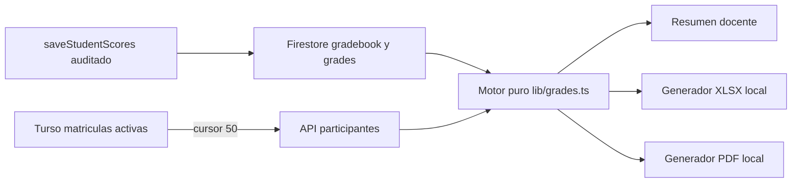

# P19 — Actas finales y evaluación integradora (CEO-74 / P0B.2)

- **Estado:** VERIFICADA
- **Fecha:** 2026-08-28
- **Verificación:** 2026-08-29
- **Responsables:** Codex / Juako
- **Autorización:** orden directa del mantenedor de ejecutar y abrir PR sin gates intermedios
- **Fuentes normativas:** [DUE 5420/2023, artículo 19](https://www.ubiobio.cl/miweb/webfile/media/214/descargas/extras_2024/5420.pdf), [Reglamento General de Régimen de Estudios UBB](https://ubiobio.cl/w/Regimen_de_Estudios/), [Calendario Académico UBB 2026](https://ubiobio.cl/w/Calendario_Academico/)

## 1. Objetivo y límite institucional

Entregar al equipo docente un cierre de sección reproducible: aritmética reglamentaria, condición de evaluación integradora, resumen estadístico y exportaciones Excel/PDF listas para revisión y traspaso a Intranet UBB.

CEOUBB sigue siendo una plataforma independiente. La exportación PDF certifica la declaración del docente mediante identidad visible, instante de generación y huella SHA-256 del contenido, pero MUST indicar que no sustituye el acta oficial ni una firma electrónica avanzada de la Universidad. La integración transaccional con DARCA/Intranet y la certificación como ministro de fe quedan fuera hasta existir convenio y contrato técnico institucional.

## 2. Requisitos EARS y aceptación BDD

### REQ-ACTA-01 — Aritmética y escala institucional

The system SHALL validar todas las calificaciones en la escala inclusiva 1,0–7,0 y SHALL redondear cada promedio reglamentario a un decimal mediante `round1` en `lib/grades.ts`.

```gherkin
Scenario: El promedio cruza el umbral de aprobación por redondeo
  Given un promedio aritmético sin redondear de 3,95
  When el sistema calcula la calificación institucional
  Then la nota resultante debe ser 4,0
```

### REQ-ACTA-02 — Condición de evaluación integradora

WHEN el promedio parcial completo y redondeado esté entre 2,0 y 3,9 inclusive, the system SHALL marcar la evaluación integradora como requerida; WHEN sea igual o superior a 4,0, the system SHALL permitir registrarla voluntariamente; IF el promedio es menor que 2,0 o está incompleto, THEN the system SHALL bloquearla.

```gherkin
Scenario: Estudiante en condición reglamentaria de integradora
  Given un estudiante con todas sus evaluaciones parciales y promedio 3,9
  When se prepara el cierre de acta
  Then su condición debe ser "Integradora pendiente"
  And el docente debe poder registrar una nota integradora

Scenario: Estudiante aprobado opta voluntariamente
  Given un estudiante con promedio parcial 5,0
  When el docente registra una integradora 3,0
  Then la integradora debe considerarse en la nota final aunque la disminuya
```

### REQ-ACTA-03 — Fórmula final DUE 5420/2023

WHEN existe una nota integradora válida para un estudiante habilitado, the system SHALL calcular `round1(promedioParciales × 0,60 + notaIntegradora × 0,40)`; IF la integradora es requerida y falta, THEN la nota final SHALL permanecer pendiente.

```gherkin
Scenario: Cálculo reglamentario con integradora
  Given un promedio parcial 3,5 y una integradora 5,0
  When se calcula la nota final
  Then la nota final debe ser 4,1
```

### REQ-ACTA-04 — Estadísticas de sección

The system SHALL informar total de estudiantes, aprobados, reprobados, cierres pendientes, promedio de notas finales cerradas y estudiantes en condición reglamentaria de integradora.

```gherkin
Scenario: Resumen excluye cierres pendientes del promedio
  Given una sección con una nota final 5,0, una nota final 3,0 y una integradora pendiente
  When se calcula el resumen
  Then debe informar un aprobado, un reprobado y un pendiente
  And el promedio de la sección debe ser 4,0
```

### REQ-ACTA-05 — Nómina completa y acotada

WHEN se abre el cierre de actas, the system SHALL cargar exclusivamente estudiantes con matrícula activa desde Turso mediante el endpoint paginado de participantes, con páginas de hasta 50 filas y techo institucional de 12.000; IF no puede completar la nómina, THEN SHALL bloquear toda exportación.

```gherkin
Scenario: Un estudiante que nunca abrió el aula aparece en el acta
  Given una matrícula activa en Turso sin documento de progreso en Firestore
  When el docente abre el cierre de actas
  Then el estudiante debe aparecer en la pre-acta

Scenario: Falla una página de la nómina
  Given que la segunda página del directorio devuelve un error
  When el docente intenta exportar
  Then los botones de exportación deben permanecer deshabilitados
  And la interfaz debe explicar que no generará un acta parcial
```

### REQ-ACTA-06 — Libro Excel para revisión e Intranet

WHEN el docente descarga Excel, the system SHALL generar un `.xlsx` válido con las hojas `Acta final`, `Carga Intranet`, `Detalle evaluaciones` y `Resumen`; SHALL incluir identificador institucional disponible, nombre, correo, promedio parcial, integradora, nota final y situación; SHALL conservar notas como números y SHALL neutralizar contenido de texto para que nunca se interprete como fórmula.

```gherkin
Scenario: La planilla abre con columnas auditables
  Given una sección cerrada con estudiantes y notas
  When el docente descarga el Excel
  Then el archivo debe comenzar con un contenedor ZIP/XLSX válido
  And la hoja de carga debe referenciar la nota final calculada
  And nombres o correos que comiencen con "=" deben permanecer como texto
```

### REQ-ACTA-07 — PDF certificado por el docente

WHEN el docente descarga el PDF, the system SHALL generar una pre-acta paginada con metadatos de sección, filas de estudiantes, estadísticas, identidad docente, instante ISO y huella SHA-256 sobre el contenido canónico; the system SHALL mostrar el descargo independiente en todas las páginas.

```gherkin
Scenario: Dos instantáneas distintas no comparten huella
  Given dos actas que difieren en una nota final
  When se calculan sus huellas SHA-256
  Then las huellas deben ser distintas
```

### REQ-ACTA-08 — Escritura auditada de integradoras

WHEN un docente registra o elimina una nota integradora, the system SHALL usar la mutación auditada existente `saveStudentScores`, SHALL preservar las demás calificaciones del estudiante y SHALL respetar el modo de solo lectura de períodos archivados.

```gherkin
Scenario: Guardar integradora no borra evaluaciones parciales
  Given un estudiante con tres notas parciales
  When el docente registra su nota integradora
  Then las tres notas parciales deben conservarse
  And el historial inmutable debe registrar sólo el cambio de la integradora
```

## 3. Diseño técnico



### Contratos

```ts
type IntegrativeEligibility = "blocked" | "required" | "optional";

type FinalGradeRecord = {
  userId: string;
  institutionalId: string;
  name: string;
  email: string;
  partialAverage: number | null;
  integrativeGrade: number | null;
  finalGrade: number | null;
  eligibility: IntegrativeEligibility;
  outcome: "incomplete" | "integrative-pending" | "passed" | "failed";
};

type FinalGradeStatistics = {
  total: number;
  passed: number;
  failed: number;
  pending: number;
  integrativeRequired: number;
  integrativePending: number;
  sectionAverage: number | null;
};
```

El identificador institucional exportable será el correo institucional completo mientras el modelo no disponga de matrícula/RUT verificado. El libro declara esa columna como `Identificador institucional` y nunca inventa un RUT. Un contrato futuro de DARCA podrá reemplazar el mapeo sin alterar la aritmética ni la pre-acta.

### Taxonomía de errores

| Código                | Superficie | Tratamiento                                                        |
| :-------------------- | :--------- | :----------------------------------------------------------------- |
| `roster_unavailable`  | Cliente    | Bloquear exportaciones y ofrecer reintento.                        |
| `roster_limit`        | Cliente    | Bloquear; la nómina excede el techo contractual.                   |
| `grades_incomplete`   | Cálculo    | Mantener nota final y carga Intranet pendientes.                   |
| `integrative_invalid` | Entrada    | Rechazar fuera de 1,0–7,0 sin escribir.                            |
| `export_failed`       | Cliente    | No descargar artefacto parcial; informar error en español.         |
| `read_only`           | Entrada    | Impedir cambios y permitir sólo exportar la instantánea existente. |

### Seguridad, privacidad y rendimiento

- La UI docente se monta sólo para roles con permiso de enseñanza ya resuelto por la sección.
- La nómina conserva `private, no-store` y autorización por matrícula; no se crea un endpoint público.
- Cada página tiene máximo 50 estudiantes y el recorrido completo corta en 12.000.
- Los generadores funcionan localmente, no suben una segunda copia de datos personales y no añaden dependencias.
- El PDF y Excel son instantáneas; no contienen comentarios privados ni historial de cambios.
- Se preservan la identidad de sección, el aislamiento por matrícula, la aritmética única en `lib/grades.ts`, la bitácora append-only y el descargo de plataforma independiente.

## 4. DAG de ejecución

- [x] T1 — REQ-ACTA-01..04: ampliar el motor puro y pruebas reglamentarias. Verificación: `node --experimental-strip-types --test tests/grades.test.ts tests/final-grade-records.test.ts`.
- [x] T2 — REQ-ACTA-05: reutilizar el cliente paginado de nómina y probar límites/fallos. Verificación: `node --experimental-strip-types --test tests/participants.test.ts tests/final-grade-records.test.ts`.
- [x] T3 — REQ-ACTA-06..07: implementar XLSX/PDF deterministas y pruebas estructurales. Verificación: `node --experimental-strip-types --test tests/grade-record-exports.test.ts`.
- [x] T4 — REQ-ACTA-02,04,08: integrar panel docente, entrada auditada, estados y estilos. Verificación: `pnpm run typecheck && pnpm run lint`.
- [x] T5 — REQ-ACTA-01..08: validar trazabilidad, artefactos y suite completa; actualizar estado y handoff. Verificación: `pnpm run verify:fast && pnpm run verify:invariants && pnpm test`.

## 5. Riesgos residuales

- Sin API, plantilla oficial vigente ni firma electrónica avanzada de UBB, CEOUBB no puede declarar que el archivo reemplaza el acta custodiada por DARCA. La exportación facilita el traspaso y deja evidencia docente; la autoridad institucional sigue fuera del producto.
- El modelo actual no guarda matrícula/RUT verificado. Se exporta el correo institucional como identificador disponible y se documenta la brecha, sin inferir datos personales.
- La huella demuestra integridad de la instantánea, no identidad jurídica equivalente a firma electrónica avanzada.
