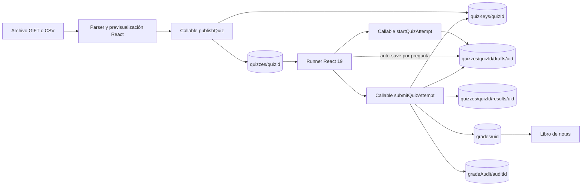

# P19 — Motor de cuestionarios rápidos e importador GIFT/CSV

| Campo        | Valor                                                                                                 |
| :----------- | :---------------------------------------------------------------------------------------------------- |
| Issue        | CEO-79                                                                                                |
| Estado       | VERIFICADA                                                                                            |
| Aprobación   | Instrucción directa del mantenedor del 2026-08-29 para ejecutar y abrir PR sin compuertas intermedias |
| Superficie   | Aula Web/Capacitor, Firebase Functions, Firestore y libro de notas                                    |
| Responsables | Codex / Juako                                                                                         |

## 0. Alcance y decisiones

CEO-79 agrega un módulo opcional por sección para importar preguntas, publicar un control, rendirlo con tiempo acotado y registrar automáticamente la nota. La primera entrega admite alternativa única, verdadero/falso, respuesta corta y respuesta numérica. GIFT con ponderaciones parciales, matching, ensayo o multimedia se reporta como no compatible y nunca se interpreta silenciosamente.

El banco se procesa localmente para previsualización docente; al publicar, la definición visible y la pauta se separan. Firestore conserva cuestionarios, borradores y resultados operacionales. Turso continúa siendo el sistema de registro de estructura académica. La nota oficial se escribe en el documento existente `courses/{sectionId}/grades/{studentId}` y deja una entrada inmutable en `gradeAudit`.

Límites institucionales: 2 MiB por archivo, 500 preguntas por importación, 50 preguntas por cuestionario, 10 alternativas por pregunta y una rendición por estudiante. Una ampliación a múltiples intentos o selección aleatoria requiere otra especificación.

## 1. Requisitos EARS y RFC 2119

- **REQ-QUIZ-01 (Ubiquitous):** The system SHALL parse bounded UTF-8 GIFT and CSV banks into deterministic, typed questions while preserving prompt, alternatives, accepted answers and feedback without executing imported HTML.
- **REQ-QUIZ-02 (Unwanted):** IF an imported item is malformed, unsupported, duplicated or exceeds a limit, THEN the system SHALL reject or warn about that item with its source position and SHALL NOT publish it silently.
- **REQ-QUIZ-03 (Event-driven):** WHEN an authorized teacher publishes a quiz, the system SHALL validate the linked gradebook item and persist the student-visible definition separately from its server-only answer key.
- **REQ-QUIZ-04 (State-driven):** WHILE a student has an active attempt, the system SHALL expose the server-issued deadline, restore the saved draft and prevent answer writes after expiry or submission.
- **REQ-QUIZ-05 (Event-driven):** WHEN a student changes an answer, the system SHALL auto-save that question independently and communicate pending, saved or failed state without blocking navigation.
- **REQ-QUIZ-06 (Event-driven):** WHEN a student submits or the timer expires, the system SHALL grade the saved server-side draft exactly once and return immediate per-question correction.
- **REQ-QUIZ-07 (Event-driven):** WHEN grading succeeds, the system SHALL convert points to Chilean scale 1.0–7.0 through the grade math source in `lib/grades.ts`, update only the linked grade item and append an immutable audit record with previous value, new value, student, quiz and timestamp.
- **REQ-QUIZ-08 (Unwanted):** IF a caller is unauthenticated, not enrolled, has an unauthorized section role, targets an archived section or requests an unavailable quiz, THEN the system SHALL deny the operation with a stable Firebase error code and clean Chilean Spanish message.
- **REQ-QUIZ-09 (State-driven):** WHILE a section is archived, the system SHALL render historical quiz results read-only and SHALL NOT allow publication, starts, answer writes or submissions.
- **REQ-QUIZ-10 (Ubiquitous):** The system SHALL keep reads and writes bounded for 3,000 concurrent sessions by using one quiz document, one private key document, one draft document per student, one result document per student and no unbounded collection listener.

## 2. Criterios BDD

```gherkin
Scenario: Importar un banco GIFT compatible
  Given a UTF-8 GIFT bank with choice, true/false, short-answer and numerical items
  When the teacher imports the file
  Then every compatible item is available in the preview without retyping
  And unsupported items are listed with their source position

Scenario: Importar CSV entre comillas y con saltos de línea
  Given a CSV bank with quoted commas and multiline prompts
  When the teacher imports the file
  Then the parser preserves field content and maps the declared answer type

Scenario: Separar cuestionario y pauta
  Given an authenticated teacher assigned to an open section
  When the teacher publishes a valid imported quiz linked to a grade item
  Then enrolled students can read prompts and alternatives
  And no student-readable document contains accepted answers or tolerances

Scenario: Reanudar un intento con temporizador autoritativo
  Given an enrolled student with an unsubmitted attempt
  When the student opens the quiz again
  Then the runner restores saved answers
  And the deadline remains the original server-issued deadline

Scenario: Guardar una respuesta por pregunta
  Given an active attempt before its deadline
  When the student changes one answer
  Then only that answer is merged into the draft
  And the runner announces that it was saved

Scenario: Rechazar guardado vencido
  Given an attempt whose server deadline has elapsed
  When the client tries to update an answer
  Then Firestore denies the write
  And the runner proceeds to final submission

Scenario: Corregir una entrega una sola vez
  Given a saved draft and a private answer key
  When the student submits the attempt twice
  Then both calls return the same persisted result
  And only one result and one grade audit mutation exist

Scenario: Convertir puntaje a nota chilena
  Given a quiz with 60 percent correct under 60 percent exigency
  When the server grades the attempt
  Then the official grade is 4.0
  And 0 percent maps to 1.0 and 100 percent maps to 7.0

Scenario: Volcar la nota sin borrar otras evaluaciones
  Given the student already has scores for other gradebook items
  When a linked quiz is graded
  Then only the quiz grade item changes
  And gradeAudit records previous and new values with source quiz

Scenario: Respetar una sección archivada
  Given the academic period is archived
  When a teacher or student attempts a quiz mutation
  Then the operation fails with failed-precondition
  And existing results remain readable
```

## 3. Diseño técnico



### 3.1 Contratos TypeScript

```ts
type QuizQuestionKind = "single_choice" | "true_false" | "short_answer" | "numerical";

type QuizQuestion = {
  id: string;
  title: string;
  prompt: string;
  kind: QuizQuestionKind;
  options: { id: string; label: string }[];
  points: number;
};

type QuizAnswerKey = {
  questionId: string;
  kind: QuizQuestionKind;
  acceptedAnswers: string[];
  correctOptionId: string | null;
  numericalAnswer: number | null;
  tolerance: number;
  feedback: string;
};

type QuizDefinition = {
  id: string;
  courseId: string;
  title: string;
  description: string;
  durationMinutes: number;
  gradeItemId: string;
  status: "published";
  questions: QuizQuestion[];
  totalPoints: number;
  createdBy: string;
};

type QuizResult = {
  quizId: string;
  userId: string;
  earnedPoints: number;
  totalPoints: number;
  grade: number;
  corrections: QuizCorrection[];
  submittedAt: string;
};
```

### 3.2 Persistencia Firestore

| Ruta                                                 | Lectura cliente                                             | Escritura cliente                               | Contenido                                |
| :--------------------------------------------------- | :---------------------------------------------------------- | :---------------------------------------------- | :--------------------------------------- |
| `courses/{sectionId}/quizzes/{quizId}`               | Docente asignado o estudiante matriculado si está publicado | Nunca                                           | Configuración y preguntas sin pauta      |
| `courses/{sectionId}/quizKeys/{quizId}`              | Nunca                                                       | Nunca                                           | Pauta completa, sólo Admin SDK           |
| `courses/{sectionId}/quizzes/{quizId}/drafts/{uid}`  | Propio estudiante o docente asignado                        | Sólo merge del propio `answers` antes del plazo | Inicio, vencimiento, respuestas y estado |
| `courses/{sectionId}/quizzes/{quizId}/results/{uid}` | Propio estudiante o docente asignado                        | Nunca                                           | Puntaje, nota y corrección inmediata     |
| `courses/{sectionId}/grades/{uid}`                   | Política vigente                                            | Nunca                                           | Notas oficiales existentes               |
| `courses/{sectionId}/gradeAudit/{id}`                | Política vigente                                            | Nunca                                           | Mutación inmutable con `source: quiz`    |

### 3.3 Escala de nota

La exigencia predeterminada es 60%. La función canónica vive en `lib/grades.ts` y se compila como artefacto CommonJS para Firebase Functions:

- `0% -> 1.0`
- `60% -> 4.0`
- `100% -> 7.0`
- tramo inferior y superior lineales, acotados y redondeados a un decimal.

Una prueba de sincronización compara el módulo TypeScript y el artefacto consumido por Functions para impedir divergencia.

### 3.4 Errores

| Código                | Condición                                                          | Reintento                         |
| :-------------------- | :----------------------------------------------------------------- | :-------------------------------- |
| `unauthenticated`     | Sesión Firebase ausente o correo no verificado                     | Reautenticar                      |
| `permission-denied`   | Rol o matrícula insuficiente                                       | No                                |
| `failed-precondition` | Período cerrado, quiz vencido, ya entregado o ítem de nota ausente | No; refrescar estado              |
| `not-found`           | Quiz, pauta o intento inexistente                                  | No                                |
| `invalid-argument`    | Archivo, pregunta, respuesta o límite inválido                     | Corregir entrada                  |
| `internal`            | Falla transitoria no clasificada                                   | Sí, sin duplicar por idempotencia |

### 3.5 Seguridad y rendimiento

- La pauta MUST permanecer fuera de todo documento legible por estudiantes.
- Toda Callable MUST revalidar autenticación, rol por sección, período y pertenencia del recurso.
- El resultado MUST provenir del borrador almacenado, nunca de respuestas enviadas al submit.
- Publicación y entrega MUST ser idempotentes por `quizId` y `uid`.
- No se admite HTML ejecutable, URL remota ni archivo embebido desde GIFT/CSV.
- Los listeners MUST limitarse a la colección de cuestionarios de una sección y a documentos propios del estudiante.
- Una entrega realiza como máximo una transacción con seis lecturas y tres escrituras más una auditoría.

## 4. Invariantes afectados

| Invariante            | Preservación                                                                                    |
| :-------------------- | :---------------------------------------------------------------------------------------------- |
| Identidad y roles     | No se replica lógica de dominios; Functions usa perfil y proyección de matrícula vigentes.      |
| Identidad de curso    | Todas las rutas usan `sectionId` canónico.                                                      |
| Split Turso/Firestore | La estructura permanece en Turso; cuestionarios e intentos son operación de aula en Firestore.  |
| Matemática de notas   | La conversión se agrega al SSOT `lib/grades.ts` y el artefacto de Functions se genera desde él. |
| Auditoría de notas    | Cada cambio crea entrada inmutable y no habilita escrituras de cliente.                         |
| Estado no oficial     | No se altera ninguna declaración institucional ni badge de tienda.                              |
| Sección archivada     | Mutaciones consultan `academicSections` y `academicPeriods`; la lectura histórica permanece.    |

## 5. DAG de ejecución

- [x] **T1 — REQ-QUIZ-01/02:** implementar tipos, parser GIFT/CSV y pruebas. Verificar: `node --experimental-strip-types --test tests/quizzes.test.ts`.
- [x] **T2 — REQ-QUIZ-07:** agregar conversión canónica de puntaje y artefacto Functions. Verificar: `node --experimental-strip-types --test tests/grades.test.ts tests/quiz-engine.test.ts`.
- [x] **T3 — REQ-QUIZ-03/06/07/08:** implementar normalización y corrección pura en Functions. Verificar: `node --experimental-strip-types --test tests/quiz-engine.test.ts`.
- [x] **T4 — REQ-QUIZ-03/04/06/07/08:** agregar Callables de publicación, inicio y entrega. Verificar: `pnpm run check:functions`.
- [x] **T5 — REQ-QUIZ-03/04/05/09:** cerrar reglas de pauta, borradores y resultados. Verificar: `node --experimental-strip-types --test tests/quizzes.test.ts`.
- [x] **T6 — REQ-QUIZ-03/04/05/06:** agregar cliente Firebase acotado y exportaciones. Verificar: `pnpm run typecheck`.
- [x] **T7 — REQ-QUIZ-01/02/03:** construir importador y previsualización docente. Verificar: `pnpm run typecheck`.
- [x] **T8 — REQ-QUIZ-04/05/06:** construir runner con timer, reanudación, auto-save y corrección. Verificar: `pnpm run typecheck`.
- [x] **T9 — REQ-QUIZ-08/09/10:** integrar pestaña, estados vacíos, móvil y estilos. Verificar: `pnpm run lint`.
- [x] **T10 — REQ-QUIZ-01..10:** ejecutar suite completa y validar trazabilidad. Verificar: `pnpm run lint && pnpm run typecheck && pnpm test`.
- [x] **T11 — REQ-QUIZ-01..10:** actualizar PLAN/archivo de handoff y abrir PR. Verificar: `git diff --check` y CI del PR.

## 6. Riesgos fuera de alcance

- GIFT con Cloze, matching, ensayo, ponderación parcial, imágenes o archivos Moodle se informará como no compatible.
- No se implementan múltiples intentos, barajado, preguntas aleatorias ni analítica psicométrica.
- El despliegue de Functions y reglas a producción requiere la secuencia de staging definida por el proyecto; este PR entrega código y pruebas, no muta producción.

## 7. Evidencia de verificación

- Parsers, motor de corrección y escala: pruebas focales aprobadas para GIFT, CSV, normalización, límites, idempotencia y conversión 1.0–7.0.
- TypeScript: `tsc --noEmit` aprobado.
- Calidad: ESLint, Prettier y sintaxis de Firebase Functions aprobados.
- Producción local: `next build` aprobado con 28 rutas; suite integral aprobada con 465/465 pruebas.
- Revisión estática: React Doctor sobre el diff contra `origin/main` aprobado sin hallazgos y prueba adversarial del parser agregada tras la observación CodeQL.
- Gobernanza: test-locking regenerado y verificado; `git diff --check` aprobado.
- Navegador: vista docente comprobada a 1280 px y 390 px, sin overflow, overlay de error ni advertencias de consola. El endpoint local de preferencias devolvió el 500 esperado por ausencia de credenciales administrativas Firebase, sin afectar el módulo.
- Despliegue: no ejecutado. Functions y reglas deben pasar primero por staging y por la matriz manual multirol antes de producción.
