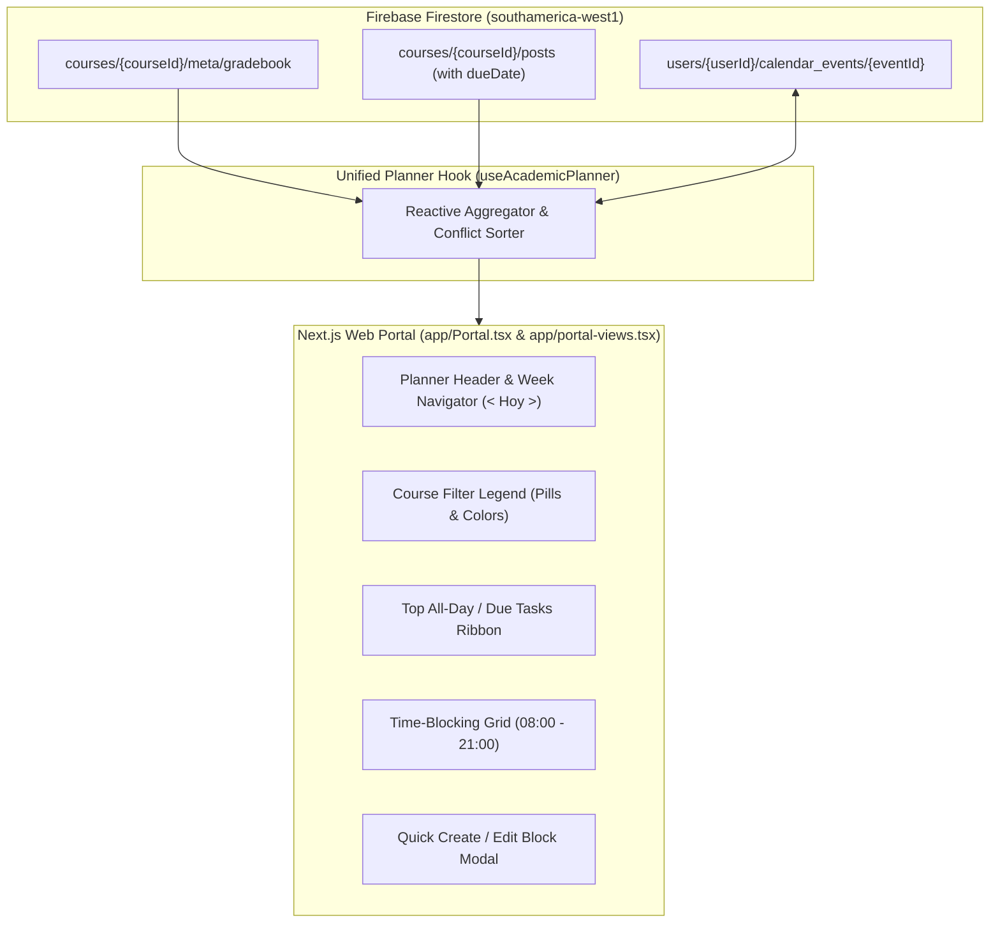

# P2 — Academic Time-Blocking Planner & Event Synchronization (SDD Specification)

**Status:** APPROVED FOR IMPLEMENTATION · **Owner:** Claude Code / Antigravity · **Version:** 1.0.0  
**Target:** Web Portal (`app/Portal.tsx`, `app/portal-views.tsx`, `app/Classroom.tsx`, `lib/firebase-classroom-client.ts`)

---

## 1. Executive Summary & Vision

Transform the static, linear evaluation list (`CalendarView`) into an **interactive Academic Time-Blocking Planner** (inspired by Notion Calendar, Cron/Notion, and Sunsama), purpose-built for Universidad del Bío-Bío students and teachers.

The system combines:
1. **Teacher-Driven Deadlines & Assessments**: Automatic propagation of exam dates (`gradebook`) and assignment/task deadlines (`dueDate` on posts/activities).
2. **Top-Level Due Dates Ribbon**: All-day / due-date bar displaying deadlines, exams, and milestones at the top of each day column.
3. **Weekly Time-Blocking Grid (08:00 – 21:00)**: Interactive timetable for classes, study sessions, group work, and personal blocks with completion checkboxes (`○`/`✓`).
4. **Student Personal Block Authoring**: Real-time CRUD for personal blocks via quick slot-click (`+`), top button, or dialog, synced to per-user private Firestore storage.
5. **Creative & Architectural Freedom**: The implementing agent (Claude) has creative freedom regarding component composition, micro-interactions, drag/click interactions, and animation fidelity, provided core invariants, UBB tokens, and EARS requirements are satisfied.

---

## 2. Requirements Engineering (EARS Syntax & RFC 2119)

### Functional Requirements

- **REQ-CAL-01 (Ubiquitous - Data Normalization)**  
  The system SHALL aggregate events from three sources:
  1. Course Gradebook evaluations (`courses/{courseId}/meta/gradebook` `items.date`)
  2. Course Posts/Tasks with due dates (`courses/{courseId}/posts` with `dueDate`)
  3. Student Personal Blocks (`users/{userId}/calendar_events/{eventId}`)  
  into a unified, reactive timetable feed.

- **REQ-CAL-02 (Event-Driven - Teacher Gradebook Sync)**  
  WHEN a teacher adds or edits an evaluation date in a course gradebook, the system SHALL immediately reflect that evaluation on the all-day / due-date header and/or time slot for all students enrolled in that course without requiring page refresh.

- **REQ-CAL-03 (Event-Driven - Teacher Assignment Due Date Sync)**  
  WHEN a teacher publishes a post or activity with an optional `dueDate` (ISO timestamp or date string), the system SHALL render an assignment deadline item in the corresponding day column for all enrolled students.

- **REQ-CAL-04 (Event-Driven - Student Personal Block Creation)**  
  WHEN an authenticated student creates, edits, or deletes a personal time block (or marks it as completed/uncompleted), the system SHALL persist the change in `users/{userId}/calendar_events/{eventId}` and update the planner view optimistically.

- **REQ-CAL-05 (State-Driven - Time-Grid Interaction)**  
  WHILE rendering the weekly time grid (Monday to Sunday, 08:00 to 21:00), the system SHALL position time blocks according to their start and end times, applying the course tone (`--course-tone`) or personal accent color.

- **REQ-CAL-06 (State-Driven - Navigation & Filtering)**  
  WHILE the user is interacting with the planner header, the system SHALL support weekly navigation (`< Anterior`, `Hoy`, `Siguiente >`), jumping to any date, and toggling visibility per course or category.

- **REQ-CAL-07 (Unwanted Behavior - Authorization & Isolation)**  
  IF an unauthenticated user or another student attempts to read or write a student's personal calendar events, THEN the Firestore security rules SHALL reject the operation with a security violation.

---

## 3. BDD Acceptance Criteria (Gherkin Scenarios)

```gherkin
Feature: Academic Time-Blocking Planner

  Scenario: Teacher publishes a deadline and it synchronizes with student planner
    Given an authenticated teacher for course "estatica"
    And an authenticated student enrolled in "estatica" viewing the Planner for week "2026-08-17 to 2026-08-23"
    When the teacher publishes a task "Entrega Informe 1" with dueDate "2026-08-18T23:59:00"
    Then the student's planner immediately displays "Entrega Informe 1" in the top due-date ribbon for Tuesday Aug 18
    And the item carries the color tone of "Estática" (#38bdf8)

  Scenario: Student creates a personal study time block
    Given an authenticated student on the planner view
    When the student clicks on the Wednesday 15:00 slot or clicks "+ Nuevo bloque"
    And submits title "Estudiar EDO", startTime "15:00", endTime "17:00", course "edo"
    Then a new document is created in Firestore under "users/{userId}/calendar_events"
    And the block renders on Wednesday from 15:00 to 17:00 with the "edo" purple tone
    And clicking the completion circle toggles its completed state to true

  Scenario: Filtering courses in the planner legend
    Given a student enrolled in multiple courses with events across the week
    When the student unchecks "Termodinámica Aplicada" in the course legend/filter
    Then all time blocks and deadlines belonging to "Termodinámica Aplicada" are hidden from the current grid
```

---

## 4. Technical Architecture & Data Contracts

### 4.1 Topology



### 4.2 TypeScript Schemas

```ts
export type PlannerBlockKind = "class" | "evaluation" | "deadline" | "study" | "personal";

export type UnifiedPlannerItem = {
  id: string;
  source: "gradebook_eval" | "course_post_deadline" | "user_personal";
  title: string;
  detail?: string;
  date: string; // YYYY-MM-DD
  startTime?: string; // "08:30" (optional; if missing, rendered in all-day ribbon)
  endTime?: string;   // "10:00"
  courseId?: string;
  courseName?: string;
  tone: string;
  kind: PlannerBlockKind;
  completed?: boolean;
  linkHref?: string;
};

export type UserPersonalEvent = {
  id: string;
  userId: string;
  title: string;
  detail?: string;
  date: string; // YYYY-MM-DD
  startTime: string; // "14:00"
  endTime: string;   // "15:30"
  courseId?: string | null;
  kind: "study" | "personal" | "task";
  completed: boolean;
  createdAt: string;
  updatedAt?: string;
};
```

---

## 5. Security Rules Amendment (`firebase/firestore.rules`)

```javascript
// Add inside match /users/{userId}:
match /calendar_events/{eventId} {
  allow read, write: if signedIn() && request.auth.uid == userId;
}
```

---

## 6. Execution Tasks DAG (Dependency-Ordered)

```
[Task 1: Firestore Rules & Client Types]
   │
   ▼
[Task 2: Classroom Post `dueDate` & Gradebook Date Support]
   │
   ▼
[Task 3: Personal Events Client CRUD & Listeners]
   │
   ▼
[Task 4: `useAcademicPlanner` Aggregation Engine]
   │
   ▼
[Task 5: Time-Blocking Grid UI & Header Navigation Components]
   │
   ▼
[Task 6: Create/Edit Block Modal & Quick Click Interactivity]
   │
   ▼
[Task 7: Automated Tests, Lint & Build Verification]
```

---

## 7. Creative Guidelines for Claude

- **Aesthetic Direction:** Retain CEOUBB's light, calm, academic paper tone (`--canvas-soft` `#f4f6f9`, white cards, UBB Blue `#0055b8` for primary actions, subtle borders, `Inter` display typography).
- **Time Grid Layout:** Use CSS Grid or Flexbox for crisp hour rows (8:00 to 21:00) with proper aspect ratios and fluid responsive behavior.
- **Interactions:** Subtle hover states, smooth check-off animations for completed tasks using `motion/react`, and intuitive slot selection.
- **Empty States:** When a day or week has zero scheduled blocks, show an inspiring, high-quality empty state encouraging rest or study planning.
