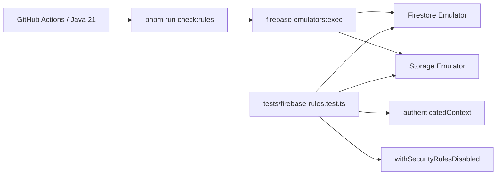

# P20 — Suite automatizada de reglas Firebase con Emulator Suite (CEO-70)

- **Estado:** VERIFICADA
- **Fecha:** 2026-09-01
- **Responsables:** Codex / Juako
- **Autorización:** orden directa del mantenedor de ejecutar y abrir PR sin gates de aprobación intermedios
- **Alcance:** `firebase/`, `tests/`, `package.json`, `pnpm-lock.yaml`, `.github/workflows/ci.yml`

## Objetivo

Reemplazar la comprobación textual de `rules_version` por una matriz ejecutable contra los emuladores de Firestore y Storage. Una regresión de autorización debe fallar localmente y en un job de CI identificable antes del merge.

## Requisitos EARS y RFC 2119

- **REQ-EMU-01 (Ubiquitous):** El sistema **MUST** ejecutar las reglas productivas de Firestore y Storage mediante `@firebase/rules-unit-testing` sobre un proyecto `demo-*`, con datos aislados entre casos y sin credenciales reales.
- **REQ-EMU-02 (State-Driven):** **WHILE** un estudiante institucional verificado tenga matrícula activa en una sección abierta, el sistema **SHALL** permitirle leer esa sección, crear su propio comprobante de entrega y subir un archivo bajo su UID, y **MUST NOT** concederle acceso equivalente a otra sección o UID.
- **REQ-EMU-03 (State-Driven):** **WHILE** un docente institucional verificado sea parte del equipo docente de una sección abierta, el sistema **SHALL** permitirle crear avisos, editar metadatos de aula y leer notas publicadas, y **MUST** rechazar escrituras cliente sobre notas, libro de calificaciones e historial auditado.
- **REQ-EMU-04 (State-Driven):** **WHILE** una persona tenga matrícula delegada con rol `assistant`, el sistema **SHALL** permitirle publicar avisos y materiales, y **MUST NOT** concederle edición del aula, lectura de notas ajenas ni lectura de entregas ajenas.
- **REQ-EMU-05 (Unwanted Behavior):** **IF** una solicitud proviene de una sesión anónima, no verificada, de dominio ajeno o sin matrícula, **THEN** el sistema **SHALL** responder con `permission-denied` o el error equivalente de Storage antes de leer o mutar datos protegidos.
- **REQ-EMU-06 (Event-Driven):** **WHEN** GitHub Actions evalúe un `push` a `main` o un pull request, el sistema **MUST** ejecutar la matriz de emuladores en un job independiente y **MUST NOT** finalizar exitosamente si cualquier frontera falla.
- **REQ-EMU-07 (Ubiquitous):** El comando `pnpm run check:rules` **MUST** compilar y ejercer ambas reglas con los emuladores; una mera búsqueda de texto **MUST NOT** considerarse validación.

## Criterios BDD

```gherkin
Scenario: Estudiante matriculado usa sólo su sección y su entrega
  Given una cuenta estudiantil verificada y matriculada en una sección abierta
  When lee un aviso de esa sección y crea o sube su propia entrega
  Then Firestore y Storage permiten las operaciones
  And la lectura de otra sección y la escritura bajo otro UID son rechazadas

Scenario: Docente administra el aula sin saltarse la auditoría de notas
  Given una cuenta docente verificada y matriculada como teacher en una sección abierta
  When crea un aviso, actualiza los metadatos del aula y lee una nota publicada
  Then las operaciones son permitidas
  But una escritura cliente en grades, meta/gradebook o gradeAudit es rechazada

Scenario: Ayudante recibe sólo capacidades delegadas de contenido
  Given una cuenta institucional verificada y matriculada como assistant
  When crea un aviso y sube material de la sección
  Then ambas operaciones son permitidas
  But editar el aula, leer una nota ajena o leer una entrega ajena es rechazado

Scenario: Usuario ajeno falla de forma predeterminada
  Given una sesión anónima, no verificada, de dominio ajeno o institucional no matriculada
  When intenta leer un aviso o subir un archivo protegido
  Then la operación falla con permission-denied o storage/unauthorized

Scenario: CI bloquea una regresión de reglas
  Given un pull request que modifica reglas o su entorno
  When GitHub Actions ejecuta el job Firebase Rules Emulator
  Then arranca Firestore y Storage con Java 21
  And ejecuta pnpm run check:rules
  And cualquier caso fallido deja el job en estado failed
```

## Diseño técnico



### Contrato de fixtures

| Entidad        | Ruta                                     | Campos mínimos                     |
| :------------- | :--------------------------------------- | :--------------------------------- |
| Usuario        | `users/{uid}`                            | `role`                             |
| Período        | `academicPeriods/{periodId}`             | `status: abierto`                  |
| Sección        | `academicSections/{sectionId}`           | `periodoId`                        |
| Matrícula      | `enrollments/{uid}/sections/{sectionId}` | `role`                             |
| Aviso          | `courses/{sectionId}/posts/{postId}`     | `authorId`                         |
| Nota publicada | `courses/{sectionId}/grades/{uid}`       | carga sintética opaca para lectura |
| Entrega        | `courses/{sectionId}/submissions/{id}`   | `uid`                              |

Cada prueba limpia Firestore y Storage y vuelve a sembrar sólo su estado base mediante `withSecurityRulesDisabled`. Los contextos autenticados declaran `email` y `email_verified`; ninguna prueba usa el proyecto productivo.

### Taxonomía de errores

| Frontera                 | Resultado esperado                                  | Reintento                 |
| :----------------------- | :-------------------------------------------------- | :------------------------ |
| Regla Firestore denegada | `permission-denied`                                 | No                        |
| Regla Storage denegada   | `storage/unauthorized` reconocido por `assertFails` | No                        |
| Emulador no disponible   | fallo de inicialización / proceso distinto de cero  | Sí, tras corregir entorno |
| Java incompatible        | fallo del job antes de la matriz                    | No; CI fija Java 21       |
| Regla inválida           | fallo de carga/compilación del emulador             | No; bloquea merge         |

### Seguridad, escala e invariantes

- Se preserva el default-deny y la autorización O(1) mediante `exists()` sobre la proyección de matrícula.
- La identidad de curso continúa siendo una sección; las fixtures usan IDs de sección válidos y períodos explícitos.
- La publicación de notas conserva la ruta backend auditada: los emuladores prueban que el cliente no puede escribir `grades`, `meta/gradebook` ni `gradeAudit`.
- La matriz no almacena secretos, no se conecta a producción y termina con limpieza de contextos.
- El gate tiene presupuesto de 3 minutos en CI y datos constantes; no depende de la cantidad productiva de estudiantes o secciones.
- No se modifican la derivación de roles, la escala de notas, la biblioteca ni los descargos de plataforma independiente.

## DAG de ejecución

- [x] **T1 — REQ-EMU-01..07:** definir contrato, escenarios, diseño y riesgos. Verificación: lectura de esta especificación.
- [x] **T2 — REQ-EMU-01, REQ-EMU-07:** agregar dependencias, configuración de emuladores y script real. Verificación: `pnpm run check:rules`.
- [x] **T3 — REQ-EMU-02, REQ-EMU-03:** implementar matrices de estudiante y docente. Verificación: `pnpm run check:rules`.
- [x] **T4 — REQ-EMU-04, REQ-EMU-05:** implementar matrices de ayudante y rechazo predeterminado. Verificación: `pnpm run check:rules`.
- [x] **T5 — REQ-EMU-06:** integrar job independiente con Java 21 y bloquear su regresión mediante prueba estática de workflow. Verificación: `pnpm run test:unit`.
- [x] **T6 — REQ-EMU-01..07:** ejecutar gates completos, sincronizar especificación y handoff. Verificación: `pnpm run lint`, `pnpm run typecheck`, `pnpm run format:check`, `pnpm test`.

## Límites

No se prueban rutas del Admin SDK ni Functions dentro de este alcance; esas rutas eluden Security Rules por diseño y cuentan con sus suites auditadas. Tampoco se despliegan reglas, se usan datos reales ni se modifica la configuración productiva de Firebase.

## Resultado

`pnpm run check:rules` ejecuta las reglas productivas en los emuladores de Firestore y Storage y pasa 4/4 escenarios. `pnpm run test:unit` pasa 470/470 y `pnpm test` compila Next.js y pasa 495/495. También pasan `pnpm run lint`, `pnpm run typecheck`, `pnpm run format:check`, `pnpm run check:functions`, `pnpm run verify:fast` y `pnpm run specs:validate`. El ruleset activo de `main` exige ahora el contexto `Firebase Rules Emulator` de GitHub Actions junto a los gates preexistentes. No se desplegaron reglas ni datos.
