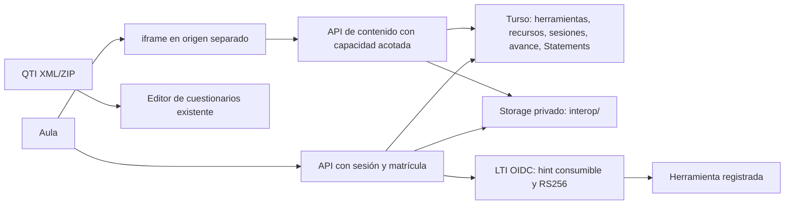

# CEO-73 — Interoperabilidad académica

Estado: VERIFICADA · 2026-09-02 · responsable: Codex/Juako.
Autorización: instrucción directa del usuario de ejecutar los planes y abrir PR sin solicitar aprobación. La trazabilidad se registra en este documento y en constantes de requisitos; no se añaden comentarios al código por preferencia expresa del usuario.

## Contrato y perfiles

CEOUBB actúa como plataforma LTI 1.3 Core mediante Resource Link Launch (OIDC y RS256). No anuncia servicios Advantage (AGS, NRPS, Deep Linking), registro dinámico ni certificación 1EdTech. Las herramientas se registran por un owner y los recursos se vinculan por docentes de la sección.

El reproductor admite paquetes ZIP SCORM 1.2 y SCORM 2004 con un único SCO, y paquetes Tin Can con una actividad xAPI 1.0.3. Implementa ciclo de sesión, localización, estado, puntuación y suspend_data. No ejecuta secuenciación SCORM 2004, múltiples SCO, plugins nativos ni contenido remoto. Los campos no implementados devuelven errores de runtime. xAPI ofrece escritura idempotente y consulta por statementId de Statements de la actividad, no un LRS completo (State, Agent/Activity Profile, adjuntos o consultas globales).

QTI 2.1 importa un assessmentItem XML o un Content Package ZIP y exporta un banco ZIP con imsmanifest.xml. Cubre alternativa única/VF, respuesta corta y numérica con corrección representable por el motor actual. Las interacciones, procesamiento o contenido enriquecido no representables se informan como omisiones; nunca se reinterpretan silenciosamente como una pregunta distinta. No se afirma compatibilidad con QTI 1.2/3, Common Cartridge ni todo QTI 2.1.

## Requisitos EARS

| ID        | Requisito                                                                                                                                                                                                                                                                                                                     |
| --------- | ----------------------------------------------------------------------------------------------------------------------------------------------------------------------------------------------------------------------------------------------------------------------------------------------------------------------------- |
| REQ-IO-01 | WHEN se solicita un recurso, el servidor SHALL comprobar sesión y matrícula activa en su sección; WHEN se modifica contenido, SHALL exigir owner o docente/coordinador y período abierto.                                                                                                                                     |
| REQ-IO-02 | WHEN un owner registra una herramienta, el servidor SHALL aceptar únicamente URLs HTTPS explícitas y generar client_id y deployment_id inmutables; docentes SHALL seleccionar destinos registrados.                                                                                                                           |
| REQ-IO-03 | WHEN se inicia LTI, el servidor SHALL crear un login_hint aleatorio de cinco minutos ligado a usuario/recurso; WHEN vuelve OIDC, SHALL validar parámetros, sesión, destino exacto y consumir el hint atómicamente antes de emitir id_token RS256 con nonce, issuer, audience, exp, deployment, contexto, rol y resource_link. |
| REQ-IO-04 | WHERE existen claves LTI configuradas, el endpoint JWKS SHALL publicar solamente material público y permitir claves públicas previas para rotación; IF falta configuración, THEN SHALL fallar con 503 sin generar claves efímeras.                                                                                            |
| REQ-IO-05 | WHEN se importa un paquete, el sistema SHALL validar ZIP, manifiesto, CRC, rutas, versión y un único objeto antes de publicarlo; SHALL limitarlo a 50 MiB comprimidos/expandidos, 1000 archivos, 10 MiB por entrada y 1 MiB de XML.                                                                                           |
| REQ-IO-06 | WHEN se reproduce contenido, SHALL servirse únicamente desde un origen HTTPS separado del portal, con CSP restrictiva, iframe sandbox y capacidades aleatorias con caducidad; SHALL rechazar servir HTML del paquete desde el origen del portal.                                                                              |
| REQ-IO-07 | WHEN un SCO confirma avance, SHALL persistirse por usuario y recurso con control optimista de versión, límites de tamaño y errores de runtime; SHALL restaurarse al relanzar y no modificar el libro de notas.                                                                                                                |
| REQ-IO-08 | WHEN se recibe un Statement xAPI, SHALL validarse versión, actor, actividad, registration y resultado, añadirse autoridad/fecha del servidor y guardarse sin sobrescritura; un UUID repetido con contenido distinto SHALL producir 409.                                                                                       |
| REQ-IO-09 | WHEN se importa o exporta QTI, SHALL conservarse pregunta, opciones, respuesta, puntuación y feedback del perfil compatible; SHALL rechazarse XML con DTD/entidades y advertirse cada ítem omitido.                                                                                                                           |
| REQ-IO-10 | WHEN se utiliza el aula, SHALL ofrecerse lista paginada de recursos, registro/vinculación LTI, carga/descarga ZIP, reproductor y acciones QTI en el editor de cuestionarios; SHALL presentar errores en español.                                                                                                              |
| REQ-IO-11 | The system SHALL usar índices por sección/usuario/recurso, páginas de hasta 50 elementos, cuotas de 100 recursos por sección y 1000 Statements por sesión; SHALL conservar invariantes de autenticación, notas e independencia institucional.                                                                                 |

## Diseño



Persistencia nueva aditiva en `db/interop-schema.ts`, reexportada por `db/schema.ts`, migración Drizzle: herramientas (configuración pública, enabled), recursos (sección, tipo, manifiesto, prefijo privado), grants (hash, usuario/recurso, caducidad, tipo y consumo), progreso (recurso/usuario/version/data), Statements (UUID, grant, usuario/recurso, payload canónico y fecha). Las filas operativas usan borrado en cascada; las referencias de autoría requieren reasignación antes de eliminar cuentas creadoras. Los objetos Storage permanecen privados por default deny; los endpoints usan la cuenta de servicio existente.

API: `/api/interop/tools` GET/POST/PATCH owner para mutación; `/api/courses/:sectionId/interop` GET/POST; `/api/courses/:sectionId/interop/:resourceId` POST para abrir, GET para descargar; `/api/courses/:sectionId/quizzes/:quizId/qti` GET docente para exportar bancos publicados; `/api/interop/lti/{authorize,jwks,configuration}`; `/api/interop/content/:grant/:path*` GET de activos/runtime, POST de progreso/Statements y PUT idempotente de Statements. Las mutaciones del portal validan Origin y tipo de cuerpo; el authorize OIDC admite GET/POST externos con sesión, hint y redirect exacto. JSON administrativo ≤64 KiB, progreso ≤128 KiB, Statements ≤32 KiB y lotes ≤20. Respuestas privadas no-store.

Configuración: `INTEROP_PLATFORM_ORIGIN`, `INTEROP_CONTENT_ORIGIN` en hosts distintos; `LTI_PRIVATE_JWK` RSA ≥2048 bits con kid, `LTI_PREVIOUS_PUBLIC_JWKS` opcional. El hostname de contenidos sólo acepta `/api/interop/content/`; no expone páginas de acceso ni cookies de sesión. El contenido puede emitir avance de su propia sesión; no obtiene sesión del portal ni credenciales Firebase. No hay fetch de URLs arbitrarias del manifiesto/herramientas. Cada recurso conserva ZIP original para descarga; el empaquetado QTI se genera con ZIP estándar sin dependencia adicional.

| Error                                   | HTTP | Recuperación                       |
| --------------------------------------- | ---- | ---------------------------------- |
| Entrada/formato no válido               | 400  | Corregir archivo/configuración     |
| Sesión ausente o capacidad vencida      | 401  | Reingresar/abrir recurso           |
| Matrícula/rol/origen/período denegado   | 403  | Revisar asignación                 |
| Recurso no encontrado                   | 404  | Refrescar lista                    |
| Hint usado, versión o UUID en conflicto | 409  | Relanzar/recargar                  |
| Límite de bytes                         | 413  | Reducir archivo                    |
| Cuota alcanzada                         | 429  | Nueva sesión o revisión docente    |
| Configuración/Storage no disponible     | 503  | Completar configuración/reintentar |

## Aceptación BDD

```gherkin
Scenario: REQ-IO-01 aislamiento de sección
 Given un estudiante activo en A y un docente asignado a B
 When intentan administrar recursos de A sin permisos docentes en A
 Then ambos reciben 403 y no se publica ningún recurso
Scenario: REQ-IO-02 registro restringido
 Given una sesión docente y una sesión owner
 When registran herramientas con URLs HTTP o credenciales incrustadas
 Then el docente recibe 403 y el owner recibe 400
Scenario: REQ-IO-03 lanzamiento y replay
 Given un hint vigente y un destino registrado
 When la herramienta devuelve OIDC válido y luego repite la petición
 Then el primer JWT verifica con la clave pública y el segundo intento recibe 409
Scenario: REQ-IO-04 clave privada protegida
 Given una clave privada RSA configurada
 When se solicita JWKS
 Then sólo se publican kty, n, e, kid, alg y use
Scenario: REQ-IO-05 paquete no confiable
 Given un ZIP con traversal, CRC inválido, expansión excesiva o múltiples SCO
 When se intenta importarlo
 Then la publicación se rechaza sin ejecutar su contenido
Scenario: REQ-IO-06 aislamiento de contenido
 Given una capacidad de contenido válida
 When se solicita el archivo desde el portal o una capacidad ajena/vencida
 Then no se entrega el HTML
Scenario: REQ-IO-07 reanudación y conflicto
 Given un SCO inicializado con versión 1
 When confirma localización y suspend_data y luego vuelve a abrirse
 Then recupera esos valores y una escritura con versión obsoleta recibe 409
Scenario: REQ-IO-08 identidad y duplicados xAPI
 Given una sesión xAPI ligada a usuario y actividad
 When envía otro actor o repite UUID con resultado distinto
 Then obtiene 403 o 409 y no cambia el Statement original
Scenario: REQ-IO-09 intercambio QTI
 Given preguntas compatibles y un ítem con interacción no admitida
 When se exportan e importan los ítems
 Then se conserva su contenido y pauta, y la interacción omitida genera advertencia
Scenario: REQ-IO-10 acciones del aula
 Given un docente con una sección abierta
 When importa un banco QTI o un paquete y abre los recursos
 Then dispone de vista previa, exportación y reproductor con estados de carga/error
Scenario: REQ-IO-11 límites institucionales
 Given más recursos que el tamaño de página y una sesión que alcanza su cuota
 When se listan recursos o se agregan Statements
 Then la página ofrece cursor estable y las escrituras excedentes se rechazan
```

## DAG y verificación

- [x] T1 (01–11): pruebas RED, esquema/migración y dominio puro; `pnpm run test:unit`.
- [x] T2 (02–04): LTI, autorización de sección y endpoints; pruebas de firma/replay y matriz de permisos.
- [x] T3 (05–08): paquetes, Storage privado, host aislado, runtime SCORM y xAPI; pruebas de archivos maliciosos, persistencia e idempotencia.
- [x] T4 (09–10): QTI e integración de interfaz; pruebas de round-trip y navegador.
- [x] T5 (01–11): `pnpm run lint`, `pnpm run typecheck`, `pnpm run verify:fast`, `pnpm test`, documentación operativa y PR.

Referencias primarias: [LTI Core 1.3](https://www.imsglobal.org/spec/lti/v1p3/), [Security Framework](https://www.imsglobal.org/spec/security/v1p0/), [QTI 2.1](https://www.imsglobal.org/question/qtiv2p1/imsqti_implv2p1.html), [ADL SCORM RTE](https://github.com/adlnet/SCORM-2004-4ed-SampleRTE), [xAPI 1.0.3](https://github.com/adlnet/xAPI-Spec/blob/master/xAPI-Communication.md).

Despliegue pendiente: migración en staging, configuración del origen aislado y claves privadas, prueba con herramienta externa y paquetes reales de la institución. El PR no cambia producción.

## Evidencia y entrega

- RED inicial: los módulos de formatos todavía inexistentes produjeron `ERR_MODULE_NOT_FOUND`. Una regresión adicional reprodujo el primer commit SCORM con puntuaciones sin informar: `false !== true`.
- GREEN/REFACTOR: 20 pruebas nuevas de formatos, servicios y HTTP; 525 unitarias y 548 en `pnpm test` incluyendo build y HTML/HTTP. `lint`, `typecheck`, `verify:fast` y 26 especificaciones OpenSpec pasan. Sellado de 59 archivos; ninguna prueba preexistente se modifica.
- Migración aplicada desde cero con toda la cadena en libSQL en memoria y en la base local sembrada. El generador habitual detecta una colisión preexistente entre snapshots 0006/0007; se generó el SQL aditivo y el snapshot completo mediante la API de drizzle-kit, sin alterar migraciones anteriores.
- Navegador: acceso docente al aula, formulario de recursos externos, importación ZIP QTI con vista previa y exportación. Reproductor con orígenes localhost/127.0.0.1: `Commit: true`, `Avance guardado`, reanudación en `página 2` y acceso al portal bloqueado. En esta prueba, Storage fue simulado; runtime, handlers y persistencia libSQL fueron reales.
- [Manual de activación y operación](../operations/academic-interoperability.md): variables, claves/rotación, roles, perfiles, límites, retención, limpieza y reversión. No hubo migración remota ni despliegue productivo. Requiere validación posterior con herramientas institucionales y medición de carga en Cloudflare.
