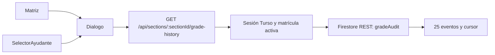

# P21 — Consulta visual del historial de notas (CEO-69)

- Estado: VERIFICADA
- Responsable: Codex / Juako · 2026-09-02
- Autorización: instrucción directa de ejecutar los planes y abrir PR, sin aprobaciones intermedias.
- Contrato: `openspec/specs/grade-history/spec.md`.

## Alcance y diseño

Una acción «Ver historial» por celda abre un único diálogo de solo lectura. Se muestran altas, correcciones y retiros de la evaluación seleccionada, autor original, fecha exacta con zona America/Santiago y valores anterior/nuevo. La ausencia de eventos no implica que la nota nunca haya cambiado antes de CEO-7.

Los ayudantes activos disponen de un selector paginado de estudiantes y evaluación en la pestaña Notas; no reciben la matriz editable ni nuevos permisos de escritura. Docentes, coordinadores y superusuarios acceden desde la matriz existente, incluso en secciones archivadas.

El servidor usa `getSessionUser`, `activeSectionRoleForUser` y la cuenta de servicio existente. Filtra `targetType=score`, `studentId` y `gradeItemId` dentro de la sección antes de leer. Ordena por `changedAt DESC, __name__ DESC`, solicita 26 documentos y devuelve 25; el cursor conserva el timestamp íntegro y el ID como desempate. No hay escuchas adicionales al montar el libro, barridos universitarios ni búsquedas del perfil actual del autor. Las respuestas son privadas y no se almacenan en caché. Un índice compuesto acompaña el PR.

Contrato de respuesta: `{ items: GradeHistoryEntry[], nextCursor: string | null }`; cada entrada contiene `id`, `actorUid`, `actorName`, `actorEmail`, `changedAt`, `previousValue: number | null` y `newValue: number | null`. Zod valida entrada, cursor, respuesta Firestore y DTO del cliente; valores numéricos usan `isValidGrade`/`formatGrade` de `lib/grades.ts`.

| Error                                          | HTTP | Comportamiento                |
| ---------------------------------------------- | ---- | ----------------------------- |
| Sesión ausente                                 | 401  | Solicitar nuevo ingreso       |
| Sin rol autorizado en la sección               | 403  | No consultar Firestore        |
| Identificador/cursor inválido                  | 400  | No consultar Firestore        |
| Firestore, índice o credenciales indisponibles | 503  | Mensaje genérico y reintentar |
| Historial vacío                                | 200  | Estado vacío explícito        |

Se preservan las cuatro políticas de autenticación vigentes, la aritmética central, los registros inmutables, el permiso histórico del estudiante de leer sus propios documentos directamente según CEO-7 y los descargos institucionales. El nuevo endpoint y la interfaz se reservan al equipo docente; no se amplían las reglas Firestore ni las escrituras de ayudantes. Se requiere desplegar el índice antes del portal; no se incluye despliegue productivo.

## Tareas y verificación

- [x] T1 REQ-HISTORY-01/02/03: pruebas RED y contrato de paginación/roles. `pnpm run test:unit`.
- [x] T2 REQ-HISTORY-01/02: lector REST, índice y endpoint GET; matriz de autorización y consultas acotadas. `pnpm run typecheck`, pruebas de historial.
- [x] T3 REQ-HISTORY-03/04: diálogo accesible y selector para ayudantes; cancelar consultas al cerrar/cambiar selección. `pnpm run lint`, verificación interactiva en navegador.
- [x] T4: `pnpm run verify:fast`, `pnpm run verify:invariants`, `pnpm run lint`, `pnpm test`; actualizar PLAN. Entrega mediante PR en español.

DAG: T1 → T2 → T3 → T4. La trazabilidad se registra en esta tabla y atributos `data-requirement`, respetando la preferencia explícita de no añadir comentarios al código.

## Evidencia

- RED: `node --experimental-strip-types --test tests/grade-history.test.ts` falló por ausencia del módulo, antes de escribir la implementación. Se selló la prueba; los siete casos pasan en GREEN. El único resellado posterior fue de formato, sin cambios a sus aserciones.
- `pnpm run verify:fast`: 512/512 pruebas, 58 archivos de pruebas con integridad SHA-256, 26 contratos OpenSpec válidos y typecheck sin errores.
- `pnpm run verify:invariants`: 35/35; `pnpm run lint`: cero errores y advertencias.
- `pnpm test`: compilación Next.js 16.3.4 y 535/535 pruebas. Se retiró del árbol de aplicación la fixture temporal antes de esta compilación.
- Navegador integrado, componentes reales y transporte simulado con datos sintéticos: matriz docente con nota retirada; cronología de alta/corrección/retiro; segunda página; vacío; error y reintento exitoso; Escape y retorno del foco al botón; un diálogo abierto y cero campos editables; selector de ayudante; estudiante sin acciones de auditoría. A 390 × 844, ancho interno y contenido del diálogo coinciden (335 px), sin desbordamiento horizontal propio.
- Pruebas de servidor con dependencias simuladas: identidad por sesión, permisos por matrícula, cero lecturas ante 401/403, filtros previos al límite, cursor con precisión de nanosegundos, rechazo de contexto ajeno, datos fuera de consulta y errores sin información interna.
- No se ejecutaron lecturas de notas reales ni despliegues de Firebase/Cloudflare. El índice compuesto debe quedar listo antes de activar el portal; son necesarias las credenciales de servicio existentes y el backend de CEO-7 desplegado. La matriz con cuentas reales queda para staging tras el despliegue del índice.

| Requisito      | Implementación                                                                               | Evidencia                                                                         |
| -------------- | -------------------------------------------------------------------------------------------- | --------------------------------------------------------------------------------- |
| REQ-HISTORY-01 | `canReadGradeHistory`, `handleGradeHistory`, ruta GET y `ClassroomView`                      | Matriz automatizada y vistas docente/ayudante/estudiante                          |
| REQ-HISTORY-02 | `parseGradeHistoryQuery`, `buildGradeHistoryQuery`, `readGradeHistoryPage`, índice Firestore | Siete pruebas de contrato/lector/endpoint                                         |
| REQ-HISTORY-03 | `GradeHistoryDialog`, acción de `TeacherStudentRow`, `formatGradeHistoryDate`                | Cronología, valores nulos, teclado y móvil en navegador                           |
| REQ-HISTORY-04 | `HistoryPage`, `StudentPage`, `loadGradeHistoryPage`                                         | Cancelación mediante AbortController; estados vacío/error y reintento verificados |
