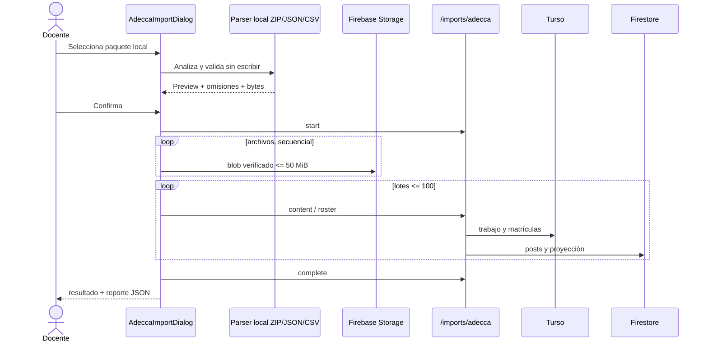

# P22 — Importación local de cursos y materiales ADECCA UBB

**Estado:** VERIFICADA LOCALMENTE · **Owner:** Codex / Juako · **Versión:** 1.1.0

**Rama:** `codex/importador-adecca` · **Fecha:** 2026-09-03

## 0. Aprobación y evidencia de origen

El mantenedor pidió explícitamente crear una capacidad equivalente al importador Moodle, subirla y abrir una PR para revisión. Esa instrucción aprueba requisitos, arquitectura y orden de tareas para este alcance, del mismo modo registrado en CEO-39. No autoriza un despliegue productivo.

El manual oficial enlazado por ADECCA documenta clonación de cursos sólo dentro de ADECCA, descarga XLS de nómina y descarga individual de materiales; no documenta un respaldo portátil equivalente a `.mbz`. La API histórica exige una clave global y expone RUT/contraseña en segmentos de URL. Por ello esta entrega importa un paquete local verificable y nunca solicita credenciales, cookies o claves de ADECCA ni llama a sus servidores.

## 1. Alcance

- ZIP local con carpetas y archivos descargados por el docente; `adecca-manifest.json` es opcional.
- JSON de manifiesto sin binarios para avisos, enlaces y actividades descriptivas.
- CSV UTF-8 opcional de nómina, obtenido al guardar como CSV el XLS que ADECCA permite descargar.
- Previsualización, carga secuencial, lotes acotados, IDs deterministas, reporte JSON y auditoría propios de ADECCA.
- Se omiten notas, entregas, intentos, foros, respuestas, revisiones entre pares, diarios, logs, credenciales y cualquier dato que no sea necesario para materiales o matrícula estudiantil.

No se implementa una conexión viva, scraping, proxy de sesión, exportador dentro de ADECCA ni restauración completa de semántica interactiva.

## 2. Requisitos formales

- **REQ-ADECCA-01 (Ubiquitous — entrada local):** The system SHALL accept a local ZIP, JSON manifest or UTF-8 CSV and SHALL NOT accept an ADECCA URL, RUT, password, cookie, token or API key.
- **REQ-ADECCA-02 (Unwanted Behavior — contenedor hostil):** IF an archive exceeds 250 MiB compressed, 512 MiB expanded, 20,000 entries, contains traversal, duplicate paths, encryption, invalid CRC, active files or an individual file above 50 MiB, THEN the system SHALL reject or omit the affected content before any persistent write.
- **REQ-ADECCA-03 (State-Driven — previsualización):** WHILE a valid source has been analyzed but not confirmed, the system SHALL show source, destination, folders, posts, files, upload bytes, students and omissions without writing to Turso, Firestore or Storage.
- **REQ-ADECCA-04 (Event-Driven — conversión):** WHEN an authorized teacher confirms import, the system SHALL map folder paths to bounded units, README/description content to sanitized posts, program/guide files to guides, passive files and safe links to resources, and descriptive assignments to assessments without historical submissions.
- **REQ-ADECCA-05 (Event-Driven — idempotencia):** WHEN the same source path or manifest item is imported again into the same section, the system SHALL update deterministic `adecca-*` documents, reuse only blobs whose full SHA-256 metadata and size match, suppress notifications and SHALL NOT delete older imported material absent from the new package.
- **REQ-ADECCA-06 (Optional — nómina):** WHERE participant import is explicitly enabled, the system SHALL accept only institutional student emails, SHALL enroll existing accounts, SHALL retain unmatched emails without names for at most 90 days, and SHALL keep this option disabled by default.
- **REQ-ADECCA-07 (Unwanted Behavior — autorización y período):** IF the actor lacks an active owner, teacher or coordinator authorization in the destination section, or the academic period is not open, THEN every server import action SHALL return a bounded 403/409 response without writes.
- **REQ-ADECCA-08 (Event-Driven — auditoría):** WHEN an import starts or completes, the system SHALL maintain one bounded ADECCA job per destination section and fingerprint and SHALL provide a detailed downloadable local JSON report.
- **REQ-ADECCA-09 (Unwanted Behavior — semántica incompatible):** IF source content represents grades, submissions, attempts, forum data, peer-review data, journals, logs, executable files or unknown interactive modules, THEN the system SHALL omit and report it without creating official records.
- **REQ-ADECCA-10 (Ubiquitous — accesibilidad y rendimiento):** The system SHALL expose a teacher-only keyboard workflow with labels, visible focus, `aria-live`, native progress, 44 px targets and a dynamically loaded client parser, with API batches capped at 100 and Firestore commits capped at 400.
- **REQ-ADECCA-11 (State-Driven — independencia):** WHILE CEOUBB lacks written institutional authorization, the implementation and review SHALL use synthetic fixtures only and SHALL preserve all non-official disclaimers.

### Precisiones del contrato de ejecución y privacidad

REQ-ADECCA-01/04/09 SHALL reject secrets in manifest keys or values, redact email/RUT from descriptive metadata, omit unsafe or ADECCA-hosted links, and accept only file extensions and MIME types permitted by Storage. Text/CSV attachments containing sensitive data SHALL be omitted. Binary documents are not scanned for personal data; the teacher MUST review their contents before confirmation.

REQ-ADECCA-03 SHALL show a bounded list of detected unit, post and file names, with the total counts and remaining-item count.

REQ-ADECCA-05/08 SHALL bind every batch to a server-issued run token, actor, source and declared cumulative plan. The server SHALL derive final counts from unique applied item hashes, serialize concurrent batches and reject writes after completion. Restarting a finished job SHALL rotate its token and reset technical item tracking; the single-job identity remains section/fingerprint. Interrupted jobs MAY resume only with the same actor, source and plan.

REQ-ADECCA-06 SHALL purge expired pending emails in bounded daily batches through the production Cloudflare scheduled handler and the existing Vercel cron endpoint. Operators MUST configure `CRON_SECRET` and monitor successful execution.

## 3. Criterios BDD

```gherkin
Feature: Importación local de materiales ADECCA

  Scenario: Un docente previsualiza un ZIP organizado
    Given un ZIP local con "Unidad 1/Apuntes.pdf" y "Unidad 1/README.md"
    When el docente lo selecciona
    Then la interfaz muestra una unidad, una guía y un archivo antes de escribir
    And el ZIP completo no se envía al servidor

  Scenario: Un manifiesto conserva actividades compatibles
    Given un manifiesto v1 con un aviso, un enlace HTTPS y una tarea descriptiva
    When se analiza el paquete
    Then el aviso, el recurso y la evaluación aparecen en la previsualización
    And entregas, calificaciones e intentos no aparecen como restaurables

  Scenario: Un ZIP hostil se rechaza
    Given un ZIP con "../escape.pdf" o CRC inválido
    When comienza el análisis
    Then el paquete se rechaza antes de cualquier escritura

  Scenario: Un archivo activo se omite
    Given un paquete con "Unidad 1/demo.html" y "Unidad 1/script.js"
    When se analiza el paquete
    Then el HTML se convierte a texto sólo si es una descripción reconocida y saneada
    And el JavaScript aparece como omitido y nunca llega a Storage

  Scenario: Una reimportación actualiza sin duplicar
    Given un archivo ya importado con ruta estable y SHA-256 completo
    When se confirma una versión nueva del mismo paquete
    Then el post determinista se actualiza
    And sólo se reutiliza un blob si tamaño y hash completo coinciden
    And no se envían notificaciones a estudiantes

  Scenario: La nómina es opcional y privada
    Given un CSV con una estudiante institucional, un docente y un correo externo
    When el docente habilita la importación de participantes
    Then sólo la estudiante institucional se matricula o queda pendiente
    And no se conserva nombre, RUT, contraseña ni correo externo

  Scenario: Una sección archivada no acepta importaciones
    Given un docente activo en una sección cuyo período está cerrado o archivado
    When intenta iniciar una importación
    Then la API rechaza la operación sin crear trabajo ni publicaciones

  Scenario: El flujo es operable por teclado
    Given un docente que navega sólo con teclado
    When selecciona, revisa, confirma y cierra una importación
    Then el foco permanece visible y el progreso se anuncia sin depender del color
```

## 4. Contratos de entrada

### 4.1 ZIP sin manifiesto

```text
Curso.zip
├── Programa.pdf
├── Guia didactica.pdf
├── descripcion.html
├── Unidad 1/
│   ├── README.md
│   ├── Apuntes.pdf
│   └── Ejercicios.docx
└── Unidad 2/
    └── Presentacion.pptx
```

Se elimina un directorio raíz común; el breadcrumb restante se aplana a una unidad de máximo 60 caracteres. `README.md`, `README.txt`, `descripcion.html` y `descripcion.htm` se convierten a contenido seguro con máximo 40.000 caracteres. Los demás archivos sólo se restauran si cumplen la allowlist académica pasiva.

### 4.2 `adecca-manifest.json`

```ts
type AdeccaManifestV1 = {
  format: "ceoubb-adecca-package";
  version: 1;
  source: {
    courseId: string;
    courseName: string;
    courseShortName?: string;
    adeccaVersion?: string;
  };
  items?: Array<{
    sourceId: string;
    title: string;
    kind: "notice" | "guide" | "assessment" | "resource";
    folder?: string;
    body?: string;
    bodyHtml?: string;
    linkUrl?: string;
    dueDate?: string;
    filePath?: string;
    sha256?: string;
    visible?: boolean;
  }>;
  participants?: Array<{
    sourceUserId: string;
    email: string;
    role: "student";
  }>;
};
```

El parser rechaza campos de secretos y no descarga destinos remotos. Un JSON sin ZIP puede contener posts y enlaces, pero no declara archivos restaurados.

## 5. Topología



## 6. Persistencia y errores

Se agregan `adecca_imports`, `adecca_import_run_items` y `pending_adecca_matriculas`, con índices de sección/fecha, ejecución/hash y correo/vencimiento. No se reutiliza `moodle_imports`: sus columnas y FK representan Moodle. Las consultas quedan limitadas a 50 trabajos, 100 participantes o 100 pendientes por operación. Los contadores se agrupan en cinco resultados posibles. La paginación de trabajos usa fecha e ID para conservar empates.

| Código                   | HTTP | Condición                         | Reintento       |
| :----------------------- | ---: | :-------------------------------- | :-------------- |
| `INVALID_ADECCA_PACKAGE` |  n/a | ZIP/JSON/CSV fuera de contrato    | Tras corregir   |
| `ADECCA_PACKAGE_LIMIT`   |  n/a | Presupuesto excedido              | Dividir paquete |
| `UNAUTHENTICATED`        |  401 | Sesión ausente                    | Tras ingresar   |
| `IMPORT_FORBIDDEN`       |  403 | Actor sin rol activo              | No              |
| `SECTION_READ_ONLY`      |  409 | Período no abierto                | No              |
| `INVALID_IMPORT_BATCH`   |  400 | Payload fuera de contrato         | No              |
| `PROJECTION_UNAVAILABLE` |  503 | Matrícula guardada sin proyección | Sí, idempotente |
| `IMPORT_INFRASTRUCTURE`  |  500 | Falla no clasificada              | Sí              |

## 7. Invariantes y presupuestos

- Turso conserva la sección como SoR; un paquete nunca crea una sección.
- `roleForEmail` sigue siendo la única derivación de identidad; no se importan roles docentes desde ADECCA.
- Firestore y Storage conservan aislamiento por sección y default deny.
- No se toca `lib/grades.ts` ni se escriben notas oficiales.
- No se duplica `public/biblioteca/` ni se añade código nativo.
- El paquete original permanece local; sólo viajan blobs confirmados y metadatos acotados.
- La UI conserva descargos de independencia y no representa esta integración como oficial.
- Por la preferencia global del mantenedor de no agregar comentarios al código, la trazabilidad se expresará mediante constantes `ADECCA_IMPORT_REQUIREMENTS`, nombres de pruebas y este DAG, sin comentarios fuente nuevos.

## 8. DAG de ejecución

- [x] **T1 — REQ-ADECCA-01..11:** registrar contrato y pruebas RED con ZIP/JSON/CSV sintéticos, ataques y composición UI/API. `node --experimental-strip-types --test tests/adecca-import.test.ts`
- [x] **T2 — REQ-ADECCA-01..05/09:** implementar tipos, parser local, sanitización, allowlist, SHA-256 e IDs. `node --experimental-strip-types --test tests/adecca-import.test.ts`
- [x] **T3 — REQ-ADECCA-06..08:** agregar esquema/migración y servicio autorizado/acotado, incluido período abierto. `pnpm run typecheck`
- [x] **T4 — REQ-ADECCA-05..08/10:** implementar Route Handler y orquestador cliente con Storage y lotes. `pnpm run verify:fast`
- [x] **T5 — REQ-ADECCA-03/06/09/10:** implementar diálogo dinámico, responsive y accesible junto al importador Moodle. `pnpm run lint && pnpm run typecheck`
- [x] **T6 — REQ-ADECCA-06/11:** integrar reclamo de pendientes, privacidad, manual operativo y handoff. `pnpm run verify:invariants`
- [x] **T7 — REQ-ADECCA-01..11:** ejecutar focal, fast, invariantes, lint, formato, Functions, suite completa y QA web móvil/escritorio. `pnpm test`
- [x] **T8 — REQ-ADECCA-01..11:** marcar `VERIFICADA LOCALMENTE`, commit/push en español y abrir [PR #151](https://github.com/CEOUBB/CEOUBB/pull/151) en español sin desplegar producción. CI iniciado; la validación de despliegue permanece pendiente.

## 9. Evidencia de verificación y límites de entrega — 2026-09-05

Sincronizado con `origin/main` en `f9fc4e4`, preservando el aula rediseñada y las migraciones anteriores. Verificación local: 17/17 pruebas ADECCA, `pnpm test` con compilación y 594/594 pruebas, TypeScript, ESLint, formato, 35/35 invariantes, sintaxis Functions y 30/30 contratos OpenSpec. Prueba real de migraciones y ejecución de nómina sobre libSQL aislado; pruebas de repetición, plan acumulado, actor/token, contadores derivados y cierre de ejecución.

QA de navegador con base local y datos sintéticos: botón junto a Moodle, carga ZIP, listas de contenido, nómina desactivada, escritorio y móvil 390×844 sin desbordamiento horizontal; Escape devuelve el foco al botón. No se realizaron cargas de archivos ni publicaciones en Firebase productivo. La verificación integral de Storage/Firestore en staging y en WebView queda para la revisión previa a despliegue.

El empaquetado OpenNext local compiló Next.js, pero no completó el artefacto Cloudflare: Windows rechazó symlinks y, tras un adaptador temporal de junctions, el empaquetador intentó resolver binarios nativos de `sharp`. El adaptador no forma parte de la entrega. GitHub debe confirmar el build Linux y su tamaño antes de aprobar despliegue. El ejecutor local de pnpm requirió `pnpm_config_verify_deps_before_run=false` para evitar reinstalaciones automáticas; no se cambiaron dependencias ni políticas del repositorio.

Aplicar migración 0013 antes de habilitar la nueva versión y configurar `CRON_SECRET`. Cancelar conserva escrituras ya confirmadas; puede dejar blobs huérfanos antes del lote de publicaciones, al igual que una reimportación desde otra cuenta. La recuperación usa el mismo actor, paquete y plan. Se conserva el último trabajo por sección/huella, no un historial por reintento. Estas limitaciones y la revisión de documentos binarios están detalladas en el manual operativo.
