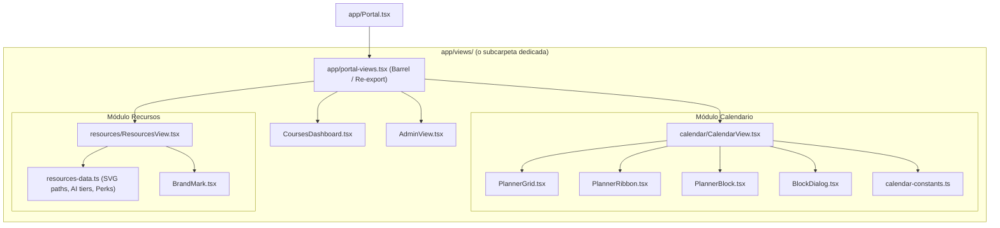

# P4 — Modularización de Vistas del Portal (SDD Specification)

**Status:** APPROVED FOR IMPLEMENTATION · **Target:** `app/portal-views.tsx` $\rightarrow$ `app/views/` (o estructura modular equivalente)  
**Execution Agent:** Claude Code · **Design Standard:** `DESIGN.md` · **Framework:** Next.js 16 (App Router), React 19, TypeScript

---

## 1. Visión Ejecutiva y Directiva de Libertad Creativa

El archivo [`app/portal-views.tsx`](file:///c:/Users/Pipe/Documents/Proyectos/Web/Next.js/ceoubb/CEOUBB/app/portal-views.tsx) contiene actualmente **1.633 líneas de código**, combinando cuatro dominios funcionales independientes (Dashboard de Cursos, Planificador Semanal / Calendario, Hub de Recursos de Estudio y Panel de Administración de Usuarios) junto con lógica de negocio, trazados SVG estáticos y estado reactivo.

> [!TIP]
> **Directiva de Libertad Creativa y Arquitectónica para Claude Code:**  
> Claude Code tiene **total libertad creativa, arquitectónica y de ordenamiento** para estructurar carpetas, nombrar archivos, modularizar componentes y extraer constantes o helpers como considere más limpio, robusto y elegante. La arquitectura sugerida en este documento sirve como guía base de referencia; Claude puede refinarla, mejorarla o adaptarla según su propio criterio técnico superior.

---

## 2. Requerimientos de Ingeniería (EARS & RFC 2119)

### Requisitos Funcionales y de Arquitectura

- **REQ-MOD-01 (Ubiquitous - Cero Breaking Changes en API Pública)**  
  The system SHALL preserve identical named exports (`CoursesDashboard`, `CalendarView`, `ResourcesView`, `AdminView`) so that [`app/Portal.tsx`](file:///c:/Users/Pipe/Documents/Proyectos/Web/Next.js/ceoubb/CEOUBB/app/Portal.tsx) and any consumer can continue importing from `app/portal-views` (or a barrel file) without functional breakage.

- **REQ-MOD-02 (State-Driven - Preservación de Estado y Suscripciones en Vivo)**  
  WHILE rendering `CalendarView`, the system SHALL maintain real-time Firestore synchronization (`watchPersonalEvents`), optimistic UI updates on block toggle/deletion, and preserve scroll positioning (`openGrid`).

- **REQ-MOD-03 (State-Driven - Segregación de Datos Estáticos de Recursos)**  
  WHILE modularizing `ResourcesView`, the system SHOULD separate static data dictionaries (`BRAND` SVG paths, `AI_TIERS`, `PERK_GROUPS`, `UBB_PORTALS`) from React rendering components to avoid re-evaluating static vectors and lists during render passes.

- **REQ-MOD-04 (Event-Driven - Interacciones y CRUD en Planificador)**  
  WHEN a user creates, edits, completes, or deletes a calendar time block, the system SHALL execute the corresponding validation (`validateBlock`) and Firestore mutation (`savePersonalEvent`, `deletePersonalEvent`, `setPersonalEventCompleted`) with error alerts.

- **REQ-MOD-05 (Ubiquitous - Conformidad con React Doctor y Fast Refresh)**  
  The system SHALL export only React components from component files (`react-refresh/only-export-components`), maintaining pure utilities and types in separate or specialized modules.

- **REQ-MOD-06 (Ubiquitous - Integridad de Animaciones y Tokens de Diseño)**  
  The system SHALL preserve all Framer Motion configurations (`LazyMotion`, `motion/react-m`, `AnimatePresence`, `stagger`, `rise`, `ease`) and CSS Custom Properties (`--course-tone`, `--planner-rows`, `--planner-dir`) per [`DESIGN.md`](file:///c:/Users/Pipe/Documents/Proyectos/Web/Next.js/ceoubb/CEOUBB/DESIGN.md).

- **REQ-MOD-07 (Unwanted Behavior - Protección ante Errores de Red en Administración)**  
  IF the user role change request fails in `AdminView`, THEN the system SHALL capture the error and render user-facing feedback without crashing the table.

---

## 3. BDD Acceptance Criteria (Gherkin Scenarios)

```gherkin
Feature: Modular Portal Views

  Scenario: Dashboard renders upcoming evaluations and course grid
    Given an authenticated user on the "courses" screen
    When the CoursesDashboard component renders
    Then the greeting with user first name must be displayed
    And the upcoming evaluation strip must show next due date and course tone
    And all active course cards must be rendered with motion rise variants

  Scenario: Calendar weekly view mounts and operates time blocks
    Given an active session in the "calendar" screen
    When the CalendarView component loads for the current week
    Then Firestore watchPersonalEvents subscription must be initialized
    And the hour scale (08:00–21:00) and time grid must render
    And clicking a time slot opens BlockDialog with pre-filled times
    And toggling a block checkbox updates Firestore state optimistically

  Scenario: Resources hub displays ecosystem, AI tools and perks
    Given a user navigating to the "resources" screen
    When ResourcesView renders
    Then all 4 thematic blocks must display (Ecosistema, IAs, Beneficios, Portales UBB)
    And brand SVG icons must render cleanly via BrandMark
    And external links must retain target="_blank" and rel="noreferrer noopener"

  Scenario: Administration view manages institutional roles
    Given a user with admin privileges in "admin" screen
    When the AdminView mounts
    Then loadAdminUsers fetches registered accounts
    And selecting a new role dispatches PATCH /api/admin/users and refreshes list

  Scenario: System verification and zero regressions
    Given the completed modularization
    When running automated typecheck and unit tests
    Then "pnpm run typecheck" must pass with 0 errors
    And "pnpm run lint" must pass with 0 warnings/errors
    And "pnpm test" and "pnpm run test:unit" must pass cleanly
```

---

## 4. Topología y Arquitectura Sugerida (Referencial)



### Estructura de Archivos Recomendada (Claude puede refinarla libremente):

```
app/
├── views/
│   ├── CoursesDashboard.tsx        (~140 líneas)
│   ├── AdminView.tsx               (~105 líneas)
│   ├── calendar/
│   │   ├── CalendarView.tsx        (~290 líneas - orquestador y subscripciones)
│   │   ├── PlannerGrid.tsx         (~130 líneas - grilla y columnas horarias)
│   │   ├── PlannerRibbon.tsx       (~50 líneas - cinta de entregas pendientes)
│   │   ├── PlannerBlock.tsx        (~80 líneas - PlannerBlockArticle interactivo)
│   │   ├── BlockDialog.tsx         (~185 líneas - modal de creación/edición de bloques)
│   │   └── calendar-constants.ts   (~30 líneas - constantes y helpers de cuadrícula)
│   └── resources/
│       ├── ResourcesView.tsx       (~230 líneas - layout, cards y secciones)
│       └── resources-data.ts       (~250 líneas - BRAND SVG paths, AI_TIERS, PERK_GROUPS, UBB_PORTALS)
└── portal-views.tsx                (Barrel file re-exportando las 4 vistas para compatibilidad 100%)
```

---

## 5. Plan de Ejecución DAG & Tareas Atómicas

- [x] **Task 1: Extracción del Módulo de Recursos** (`REQ-MOD-03`)
  - Extraer `resources-data.ts` (constantes `BRAND`, `AI_TIERS`, `PERK_GROUPS`, `UBB_PORTALS`, tipos `Brand`, `Tone`).
  - Crear `ResourcesView.tsx` (componente principal `ResourcesView` y `BrandMark`).
  - _Verificación:_ `pnpm run typecheck`

- [x] **Task 2: Extracción del Módulo de Calendario / Planificador** (`REQ-MOD-02`, `REQ-MOD-04`, `REQ-MOD-06`)
  - Extraer `calendar-constants.ts` (`SLOT_HOURS`, `HOUR_LINES`, `MINUTE_SPAN`, `KIND_LABEL`, `offsetOf`, tipo `BlockDraft`).
  - Crear subcomponentes aislados: `BlockDialog.tsx`, `PlannerBlock.tsx`, `PlannerRibbon.tsx`, `PlannerGrid.tsx`.
  - Crear `CalendarView.tsx` integrando los subcomponentes y conservando los hooks y suscripciones de Firestore.
  - _Verificación:_ `pnpm run typecheck`

- [x] **Task 3: Extracción de Dashboard y Administración** (`REQ-MOD-01`, `REQ-MOD-05`, `REQ-MOD-07`)
  - Crear `CoursesDashboard.tsx` con su animación `stagger`/`rise`.
  - Crear `AdminView.tsx` con sus handlers de role update.
  - _Verificación:_ `pnpm run typecheck`

- [x] **Task 4: Configuración del Barrel File y Compatibilidad Total** (`REQ-MOD-01`)
  - Actualizar `app/portal-views.tsx` como barrel export que re-exporta `CoursesDashboard`, `CalendarView`, `ResourcesView` y `AdminView`.
  - Verificar que `app/Portal.tsx` no requiere cambios o resuelve sus imports con total normalidad.
  - _Verificación:_ `pnpm run typecheck && pnpm run lint`

- [x] **Task 5: Verificación Integral de Suite de Pruebas y Build** (`REQ-MOD-01` a `REQ-MOD-07`)
  - Ejecutar tests unitarios (`pnpm run test:unit`) y tests completos de integración (`pnpm test`).
  - Verificar que no existan advertencias de React Doctor ni errores de bundle.
  - _Verificación:_ `pnpm test`
