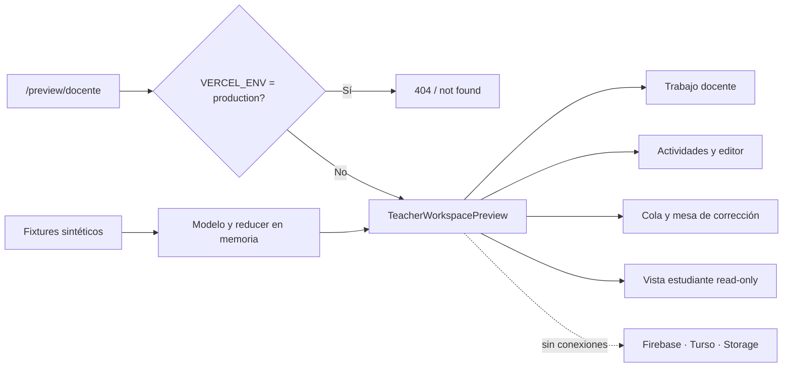

# P7 — Espacio docente CEOUBB: preview navegable

**Estado:** EN EJECUCION

**Responsables del gate:** Joaquín y Pipe

**Rama:** `codex/teacher-assignment-preview`

**Entrega autorizada:** PR en borrador + Vercel Preview; sin merge ni producción

**Última revisión:** 2026-08-15

**Aprobación humana:** Joaquín aprobó P7 el 2026-08-15 y autorizó exclusivamente los marcadores `// Implements: REQ-DOC-XX` exigidos por SDD.

## 1. Intención y decisión de producto

Esta rama construirá exclusivamente la experiencia docente. Tomará Canvas UdeC como referencia de claridad, módulos, tareas, corrección enfocada y control de publicación; ADECCA aportará el lenguaje UBB, los resultados de aprendizaje y la familiaridad docente; Moodle aportará profundidad de configuración. El resultado SHALL ser una interpretación original de CEOUBB, no una copia visual ni de código.

La mejora propia que debe demostrar el preview es un único recorrido continuo:

`trabajo pendiente → crear actividad → Vista estudiante → publicar → revisar entregas → corregir → publicar calificación`

Canvas distribuye estas acciones entre Módulos, Tareas, SpeedGrader y Calificaciones. CEOUBB las reunirá en una mesa docente contextual para reducir cambios de pantalla y doble ingreso de información.

Referencias verificadas:

- [Canvas para docentes de la UdeC](https://docentesenlinea.udec.cl/service/canvas/) recomienda organizar el material mediante módulos y confirma que la carga docente proviene del SAC.
- [Canvas Instructor Guide](https://community.instructure.com/en/kb/canvas-lms-instructor-guide) documenta módulos, tareas, calificaciones, roles y corrección.
- [SpeedGrader](https://community.instructure.com/en/kb/articles/662775-what-is-speedgrader) concentra entrega, rúbrica, nota y retroalimentación.
- [Canvas LMS](https://github.com/instructure/canvas-lms) es AGPLv3; este preview no reutilizará su código ni sus recursos.
- `ceoubb_moodle_adecca_comparison.md` y el manual ADECCA previamente auditado definen las brechas locales.

## 2. Gate humano obligatorio

El repositorio aplica SDD. Mientras el estado sea `BORRADOR`, no se escribirá código del preview. Para avanzar a `APROBADA`, Joaquín o Pipe debe aprobar explícitamente:

1. Requisitos y alcance.
2. Arquitectura y aislamiento de producción.
3. Orden de tareas.
4. Una excepción limitada a la preferencia de no agregar comentarios: autorizar únicamente marcadores `// Implements: REQ-DOC-XX` exigidos por SDD. No se autoriza ningún otro comentario nuevo.

## 3. Alcance

### Incluido en este PR después de la aprobación

- Ruta aislada `/preview/docente`, disponible en desarrollo y Vercel Preview.
- Marca persistente `Vista previa · datos de ejemplo · nada se guardará`, visible en todas las vistas. Desde el rediseño del 2026-08-15 viaja como píldora dentro del rastro de contexto de la cabecera del portal, en lugar de una barra propia sobre ella; bajo 900 px conserva el rótulo `Vista previa`.
- Inicio docente con trabajo pendiente y próximos vencimientos.
- Listado y filtros de actividades.
- Editor de actividad con borrador, Vista estudiante y publicación simulada.
- Cola acotada de entregas ficticias.
- Mesa de corrección con nota, retroalimentación, rúbrica simple e historial simulado.
- Publicación manual de nota y retroalimentación.
- Vista estudiante estrictamente de solo lectura dentro del espacio docente.
- Datos sintéticos tipados y estado únicamente en memoria.
- Diseño responsive y accesible conforme a `design-ceoubb.md`.

### Fuera de alcance

- Portal, formularios, subida o navegación real del alumnado; esa superficie pertenece a Pipe.
- Firebase Authentication, Firestore, Storage, Turso, Functions, reglas o migraciones.
- Cualquier dato personal, archivo, nota o matrícula real.
- Persistencia en `localStorage`, `sessionStorage`, IndexedDB o cookies.
- Despliegue de producción, merge a `main` o cambios en `ceoubb.com`.
- Cuestionarios, banco de preguntas, tareas grupales, revisión por pares, anotación PDF y analítica avanzada.

La integración real requerirá antes P1 (secciones y matrícula), P0.9 (auditoría de notas), P0.10 (pruebas de reglas) y P0.11 (staging). El cliente actual apunta al Firebase productivo, por lo que una preview conectada al backend violaría este alcance.

## 4. Requisitos formales

- **REQ-DOC-01 — Aislamiento de producción (Unwanted Behavior).** IF `VERCEL_ENV` equals `production`, THEN the system SHALL return a not-found response for `/preview/docente`; otherwise the preview MAY render.
- **REQ-DOC-02 — Datos seguros (Ubiquitous).** The preview SHALL use only synthetic fixtures held in memory and SHALL NOT import, call or mutate Firebase, Storage, Turso, Functions, browser persistence or CEOUBB production APIs.
- **REQ-DOC-03 — Propiedad de superficie (Ubiquitous).** The preview SHALL implement only teacher-facing workflows; the student perspective SHALL exist only as a non-interactive `Vista estudiante` inside the teacher workspace.
- **REQ-DOC-04 — Flujo unificado (State-Driven).** WHILE a teacher works in one section, the system SHALL connect activity authoring, deadline, submission queue, review status and grade publication without duplicate data entry or navigation into unrelated portal surfaces.
- **REQ-DOC-05 — Autoría progresiva (Event-Driven).** WHEN a teacher creates or edits an activity, the system SHALL accept title, instructions, RA/unit, opening, due and cutoff dates, submission settings, grade linkage and a draft/published state through progressively disclosed controls.
- **REQ-DOC-06 — Validación recuperable (Unwanted Behavior).** IF required fields, date order or grade values are invalid, THEN the system SHALL prevent publication, preserve the draft, explain every error in clear Chilean Spanish and focus the first invalid control.
- **REQ-DOC-07 — Trabajo docente priorizado (State-Driven).** WHILE the preview contains sample activities, the teacher home SHALL display bounded counters and an urgency-ordered work list for pending reviews, missing submissions, drafts and the next deadline.
- **REQ-DOC-08 — Cola de entregas (State-Driven).** WHILE reviewing a sample activity, the system SHALL provide search, status filters and deterministic pagination for synthetic submissions classified as `sin entrega`, `entregada`, `atrasada`, `corrección en borrador` or `calificada`.
- **REQ-DOC-09 — Corrección privada (Event-Driven).** WHEN a teacher saves a correction draft, the system SHALL retain its grade, feedback and rubric in memory while keeping them hidden from `Vista estudiante`.
- **REQ-DOC-10 — Publicación conjunta (Event-Driven).** WHEN a teacher publishes a valid correction, the system SHALL reveal grade and feedback together in `Vista estudiante` and append a synthetic immutable history event containing actor, time, previous state and new state.
- **REQ-DOC-11 — Diseño original y accesible (Ubiquitous).** The preview SHALL use the CEOUBB design system, Phosphor icons, WCAG 2.2 AA semantics, visible focus, non-color status labels, reduced motion support and touch targets of at least 44 by 44 pixels; it SHALL NOT reproduce Canvas branding, layout assets or copy.
- **REQ-DOC-12 — Adaptación móvil (State-Driven).** WHILE the viewport is below 768 pixels, long authoring and grading flows SHALL use full-screen stacked surfaces respecting safe areas, without horizontal page scrolling; sheets MAY be used only for filters or short actions.
- **REQ-DOC-13 — Reinicio determinista (Event-Driven).** WHEN the preview reloads, the system SHALL restore the original fixtures and SHALL discard all simulated edits.
- **REQ-DOC-14 — Presupuesto técnico (Ubiquitous).** The preview SHALL add no runtime dependency, SHALL keep fewer than 1,500 active DOM nodes in the seeded scenario and SHALL keep Firebase, Storage and Turso SDKs out of its route bundle.

## 5. Criterios BDD

```gherkin
Feature: Espacio docente CEOUBB aislado

  Scenario: REQ-DOC-01 bloquea producción
    Given la aplicación se ejecuta con VERCEL_ENV igual a production
    When una persona solicita /preview/docente
    Then la respuesta debe ser not found
    And no debe renderizar datos de demostración

  Scenario: REQ-DOC-02 usa únicamente memoria
    Given el docente recorre todas las pantallas del preview
    When crea, publica y corrige datos de muestra
    Then no debe ocurrir ninguna solicitud a Firebase, Storage, Turso o Functions
    And el banner de datos de ejemplo debe permanecer visible

  Scenario: REQ-DOC-03 no invade la rama del alumnado
    Given el docente abre Vista estudiante
    When revisa una actividad publicada
    Then debe ver una representación de solo lectura
    And no debe existir control para entregar, adjuntar o editar como estudiante

  Scenario: REQ-DOC-04 conecta el ciclo docente
    Given una actividad de ejemplo publicada
    When el docente navega desde Trabajo docente hasta su corrección
    Then debe conservar el contexto de actividad y sección
    And no debe volver a ingresar la fecha ni la evaluación vinculada

  Scenario: REQ-DOC-05 guarda un borrador
    Given el docente completa los datos mínimos de una actividad
    When selecciona Guardar borrador
    Then la actividad debe quedar marcada Borrador en memoria
    And Vista estudiante no debe mostrarla como publicada

  Scenario: REQ-DOC-06 rechaza fechas invertidas
    Given una fecha de cierre anterior al vencimiento
    When el docente intenta publicar
    Then la publicación debe bloquearse
    And el campo de cierre debe recibir foco con una explicación
    And los demás valores deben conservarse

  Scenario: REQ-DOC-07 ordena el trabajo por urgencia
    Given existen revisiones pendientes, entregas faltantes y borradores
    When el docente abre el inicio
    Then la primera acción debe corresponder al vencimiento o revisión más urgente
    And cada contador debe coincidir con los fixtures visibles

  Scenario: REQ-DOC-08 pagina la cola
    Given una actividad con más entregas que el tamaño de página
    When el docente filtra por Atrasada
    Then la lista debe mostrar únicamente atrasadas
    And debe ofrecer un cursor o página siguiente estable

  Scenario: REQ-DOC-09 mantiene privada una corrección
    Given una entrega pendiente
    When el docente guarda una nota y comentario como borrador
    Then la cola debe indicar Corrección en borrador
    And Vista estudiante no debe revelar la nota ni el comentario

  Scenario: REQ-DOC-10 publica nota y feedback juntos
    Given una corrección válida en borrador
    When el docente selecciona Publicar calificación
    Then la nota y la retroalimentación deben hacerse visibles simultáneamente
    And el historial sintético debe registrar el estado anterior y el nuevo

  Scenario: REQ-DOC-11 permite navegación completa por teclado
    Given el foco está en la navegación del espacio docente
    When la persona recorre controles, editor y corrección usando teclado
    Then todo control debe recibir foco visible y nombre accesible
    And ningún significado debe depender únicamente del color

  Scenario: REQ-DOC-12 corrige en teléfono
    Given una ventana de 360 por 800 píxeles
    When el docente abre una entrega
    Then cola, entrega y retroalimentación deben recorrerse sin scroll horizontal
    And las acciones deben quedar por encima del área segura inferior

  Scenario: REQ-DOC-13 descarta cambios al recargar
    Given el docente modificó actividades y correcciones de ejemplo
    When recarga el preview
    Then deben reaparecer los fixtures originales
    And no debe sobrevivir ningún cambio simulado

  Scenario: REQ-DOC-14 conserva el aislamiento del bundle
    Given se construyó el preview
    When se inspecciona su código y escenario inicial
    Then no debe importar SDKs de Firebase, Storage o Turso
    And el DOM activo debe permanecer bajo 1500 nodos
```

## 6. Arquitectura



### Contratos TypeScript del preview

```ts
type ActivityLifecycle = "draft" | "scheduled" | "open" | "closed" | "archived";
type SubmissionState = "missing" | "submitted" | "late" | "review_draft" | "graded";

type TeacherActivityPreview = {
  id: string;
  sectionId: string;
  title: string;
  instructions: string;
  unit: string;
  opensAt: string;
  dueAt: string;
  cutoffAt: string;
  submissionMode: "file" | "text" | "file_or_text";
  maxAttempts: number;
  acceptedTypes: string[];
  gradeItemId: string | null;
  lifecycle: ActivityLifecycle;
};

type SubmissionPreview = {
  id: string;
  activityId: string;
  studentAlias: string;
  state: SubmissionState;
  submittedAt: string | null;
  attempt: number;
  fileName: string | null;
  text: string;
};

type ReviewPreview = {
  submissionId: string;
  grade: number | null;
  feedback: string;
  rubric: Record<string, number>;
  visibility: "draft" | "published";
  history: ReadonlyArray<{
    actor: string;
    occurredAt: string;
    previous: string;
    next: string;
  }>;
};
```

### Taxonomía de errores

| Código | Condición | Respuesta del preview | Reintento |
|---|---|---|---|
| `PREVIEW_DISABLED` | Entorno productivo | 404 sin contenido del preview | No |
| `REQUIRED_FIELD` | Título o instrucciones vacíos | Mensaje asociado y foco | Sí |
| `INVALID_DATE_ORDER` | Apertura, vencimiento o cierre invertidos | Bloquear publicación, conservar borrador | Sí |
| `INVALID_GRADE` | Nota fuera de 1,0–7,0 | Error en línea; no publicar | Sí |
| `NOTHING_TO_PUBLISH` | Corrección vacía o sin entrega | Explicación contextual | Sí |

### Seguridad, privacidad y presupuesto

- Cero datos personales: nombres y archivos son ficticios.
- Cero red y persistencia: el modelo es local al árbol de React.
- `robots: { index: false, follow: false }` en metadata.
- La ruta no aparece en la navegación, búsqueda, sitemap ni service worker.
- No se modifica la política de roles, cursos, notas, Firebase ni Storage.
- No se añade dependencia; se usan React, Motion y Phosphor ya instalados.
- La validación de notas reutilizará el módulo puro `lib/grades.ts`; no duplicará aritmética.
- Las listas se paginan en el modelo aunque los fixtures sean pequeños.

### Invariantes preservados

| Invariante | Tratamiento |
|---|---|
| Plataforma independiente | Se mantiene el disclaimer y el banner declara demostración |
| Rama docente | No se crea superficie editable de alumnado |
| Roles y autorización | No se consultan ni modifican |
| Course identity | `sectionId` sólo existe en fixtures; no se persiste deuda nueva |
| Grade math seam | Escala 1,0–7,0 mediante `lib/grades.ts` |
| Firebase productivo | No se importa ni se llama |
| Canvas AGPLv3 | Referencia conceptual únicamente; cero código o activos reutilizados |

## 7. DAG de ejecución

- [x] **T0 — REQ-DOC-01..REQ-DOC-14:** escribir esta especificación y registrar la rama en `PLAN.md`.
  - **Archivos:** `docs/specs/p7-teacher-workspace-preview.md`, `PLAN.md`.
  - **Verificación:** `git diff --check`.
- [x] **T1 — REQ-DOC-01, REQ-DOC-02, REQ-DOC-13, REQ-DOC-14:** crear guard de entorno, metadata, tipos, fixtures y reducer puros.
  - **Archivos previstos:** `app/preview/docente/page.tsx`, `app/preview/docente/teacher-preview-model.ts`, `tests/teacher-workspace-preview.test.ts`.
  - **Verificación:** `pnpm run test:unit`.
- [x] **T2 — REQ-DOC-03, REQ-DOC-04, REQ-DOC-07:** construir shell docente, resumen y navegación propia del preview.
  - **Archivos previstos:** `app/preview/docente/TeacherWorkspacePreview.tsx`.
  - **Verificación:** `pnpm run typecheck && pnpm run lint`.
- [x] **T3 — REQ-DOC-05, REQ-DOC-06:** implementar listado y editor progresivo con borrador/publicación simulados.
  - **Archivos previstos:** componentes bajo `app/preview/docente/`.
  - **Verificación:** `pnpm run test:unit && pnpm run typecheck`.
- [x] **T4 — REQ-DOC-08, REQ-DOC-09, REQ-DOC-10:** implementar cola paginada, mesa de corrección e historial sintético.
  - **Archivos previstos:** componentes bajo `app/preview/docente/`.
  - **Verificación:** `pnpm run test:unit && pnpm run typecheck`.
- [x] **T5 — REQ-DOC-03, REQ-DOC-09, REQ-DOC-10:** implementar Vista estudiante read-only alimentada por el mismo estado docente.
  - **Archivos previstos:** componentes bajo `app/preview/docente/`.
  - **Verificación:** `pnpm run test:unit && pnpm run typecheck`.
- [x] **T6 — REQ-DOC-11, REQ-DOC-12, REQ-DOC-14:** aplicar diseño CEOUBB, responsive, teclado, foco y reducción de movimiento.
  - **Archivos previstos:** `app/preview/docente/teacher-workspace-preview.module.css`.
  - **Verificación:** `pnpm run lint && pnpm run typecheck`.
- [x] **T7 — REQ-DOC-01..REQ-DOC-14:** cerrar pruebas automatizadas, aislamiento de bundle y presupuesto DOM.
  - **Archivos previstos:** `tests/teacher-workspace-preview.test.ts`, `tests/rendered-html.test.mjs`, `package.json`.
  - **Verificación:** `pnpm run check:functions && pnpm run lint && pnpm run typecheck && pnpm test`.
- [ ] **T8 — REQ-DOC-01..REQ-DOC-14:** verificar teclado, 360×800, escritorio, red vacía y Vercel Preview; actualizar handoff.
  - **Archivos:** `docs/specs/p7-teacher-workspace-preview.md`, `PLAN.md`, `PLAN_ARCHIVE.md`.
  - **Verificación:** navegador + `git diff --check`.
  - **Estado:** verificación técnica y Vercel Preview completados; revisión funcional de Pipe y archivo del handoff pendientes.

### Registro de ejecución local

- `pnpm run test:unit`: 67/67 pruebas aprobadas.
- `pnpm run lint`, `pnpm run typecheck`, `pnpm run check:functions` y `pnpm run build`: aprobados.
- React Doctor sobre archivos modificados: cero hallazgos atribuibles al preview; permanecen seis diagnósticos preexistentes fuera de P7.
- Navegador automatizado: recorrido completo aprobado en 1440×1000 y 390×844, foco recuperable, cero desborde horizontal, cero errores de consola y cero solicitudes a Firebase, Storage, Turso o Functions.
- Guard de entorno: respuesta 200 con `noindex` en preview y 404 sin contenido docente con `VERCEL_ENV=production`.
- `pnpm test`: 91/92 local porque este workspace conserva un directorio Android vacío y no versionado que activa la protección contra la antigua copia de `assets/www`; el checkout limpio de GitHub Actions aprobó la suite completa.
- GitHub Actions: `CI`, `React Doctor` y `Deploy to Vercel` aprobados para `bb6feee`; preview publicada y protegida por inicio de sesión del equipo.

## 8. Gate de salida del preview

El PR sólo puede pasar de borrador a revisión normal si:

1. Todos los escenarios BDD tienen una aserción automatizada o verificación manual registrada.
2. `pnpm run lint`, `pnpm run typecheck` y `pnpm test` están verdes.
3. La pestaña Network confirma cero llamadas a Firebase, Storage, Turso y APIs mutables.
4. `/preview/docente` responde 404 en configuración de producción.
5. Pipe confirma que la rama no invade su vista de alumnado.
6. La preview fue revisada en teléfono y escritorio.
7. El estado de esta spec pasa a `VERIFICADA` y el handoff queda en `PLAN_ARCHIVE.md`.
