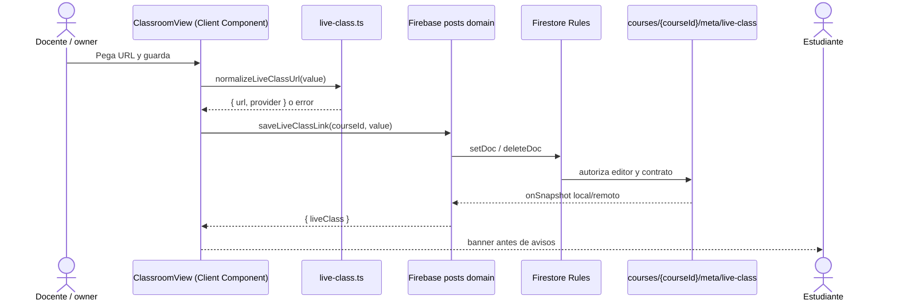

# P8 — Banner de clase en vivo por sección (CEO-56)

**Estado:** EN EJECUCION · **Owner:** Codex / Juako · **Versión:** 1.1.0  
**Objetivo:** Portal web y shell Capacitor (`app/views/classroom/`, `lib/live-class.ts`, `lib/firebase/posts.ts`, `firebase/firestore.rules`)  
**Issue:** [CEO-56](https://linear.app/ceoubb/issue/CEO-56/banner-de-clase-en-vivo-zoom-teams-en-la-portada-del-ramo)

---

## 1. Intención y alcance

La entrada a una videoclase debe ser la acción más rápida de la portada de un ramo. Fase 1 persiste un único enlace Zoom o Microsoft Teams por sección, permite que el equipo docente actual lo configure y muestra un banner antes del contenido ordinario. No incluye horario, recurrencia, reuniones múltiples ni video embebido; la activación por bloque horario queda vinculada a CEO-23.

El modelo actual no posee el rol de matrícula `assistant`: sólo `owner`, `teacher` y `student`. Para no inventar una autorización paralela al modelo académico, esta fase reconoce como equipo editor a `teacher` y `owner`; la futura proyección de matrículas deberá ampliar la misma capacidad a `assistant` antes de abrir ayudantías reales.

## 2. Requisitos formales

- **REQ-LIVE-01 (Event-Driven — persistencia):** WHEN an authorized course editor saves a valid live-class URL, the system SHALL persist one normalized live-class document under `courses/{courseId}/meta/live-class` and SHALL expose it through the existing real-time classroom subscription.
- **REQ-LIVE-02 (Unwanted Behavior — validación):** IF a submitted value is not an HTTPS URL on `zoom.us`, a `zoom.us` subdomain, `teams.microsoft.com`, or `teams.cloud.microsoft`, THEN the system SHALL reject it before writing and SHALL present a Chilean-Spanish validation message.
- **REQ-LIVE-03 (State-Driven — portada):** WHILE a valid live-class link exists and the user views the course home tab, the system SHALL render a prominent banner before announcements with provider context and an external “Entrar a la clase” action.
- **REQ-LIVE-04 (State-Driven — ausencia):** WHILE no valid live-class link exists, the system SHALL render no banner container, placeholder, or reserved banner space for students.
- **REQ-LIVE-05 (Event-Driven — eliminación):** WHEN an authorized course editor saves an empty value, the system SHALL delete the live-class document and SHALL remove the banner through the same real-time state path.
- **REQ-LIVE-06 (Unwanted Behavior — autorización):** IF a student or unauthenticated client attempts to create, update, or delete `meta/live-class`, THEN Firestore SHALL reject the write; reads SHALL retain the classroom membership policy already in force.
- **REQ-LIVE-07 (Ubiquitous — accesibilidad y shell):** The system SHALL provide a keyboard-visible configuration control, associated form label, live error/status feedback, a minimum 44 px touch target, and an ordinary HTTPS anchor that the Capacitor external-link bridge can hand to the system browser.
- **REQ-LIVE-08 (Ubiquitous — escala):** The system SHALL add at most one bounded document listener and one document of at most 2 KiB per active section, with no collection-group scan or per-student copy.

## 3. Criterios BDD

```gherkin
Feature: Acceso a la clase en vivo desde la portada del ramo

  Scenario: Un docente publica Zoom y el estudiante lo recibe
    Given un docente autenticado en la sección "estatica"
    And no existe un enlace de clase en vivo
    When guarda "https://us02web.zoom.us/j/123456789?pwd=abc"
    Then Firestore conserva el enlace normalizado con proveedor "zoom"
    And el listener de la sección emite el nuevo estado sin recargar
    And la portada muestra "Entrar a la clase" antes de los avisos

  Scenario: Un docente publica un enlace Teams vigente
    Given un docente autenticado en la portada del ramo
    When guarda un enlace HTTPS de "teams.microsoft.com" o "teams.cloud.microsoft"
    Then el banner identifica Microsoft Teams
    And la acción externa conserva la URL completa de la reunión

  Scenario: Se rechaza un dominio desconocido
    Given un docente autenticado en la configuración de clase en vivo
    When intenta guardar "https://videollamada.example.com/reunion"
    Then ve un mensaje que solicita un enlace HTTPS de Zoom o Teams
    And no se ejecuta una escritura en Firestore

  Scenario: La portada no reserva un banner vacío
    Given un estudiante cuya sección no tiene enlace configurado
    When abre la portada del ramo
    Then no existe un contenedor de banner de clase en vivo
    And los avisos mantienen su posición normal

  Scenario: El docente elimina el enlace
    Given una sección con un enlace de clase en vivo
    When el docente guarda el campo vacío
    Then se elimina "courses/{courseId}/meta/live-class"
    And el banner desaparece sin recargar la página

  Scenario: Un estudiante intenta modificar el enlace
    Given un usuario autenticado con rol "student"
    When intenta escribir "courses/estatica/meta/live-class"
    Then Firestore rechaza la operación
```

## 4. Diseño técnico

### 4.1 Topología y secuencia



### 4.2 Contratos

```ts
export type LiveClassProvider = "zoom" | "teams";

export type LiveClassLink = {
  url: string;
  provider: LiveClassProvider;
};

export type LiveClassDocument = LiveClassLink & {
  courseId: string;
  updatedBy: string;
  updatedAt: FieldValue;
};

export type ClassroomState = {
  liveClass: LiveClassLink | null;
};
```

Normalización: longitud máxima 2.048 caracteres; protocolo `https:`; sin usuario ni contraseña; hostname en minúsculas; Zoom admite `zoom.us` y subdominios; Teams admite los hosts exactos `teams.microsoft.com` y `teams.cloud.microsoft`; path, query y fragment se preservan. Un valor vacío representa eliminación.

### 4.3 Reglas de seguridad

`meta/live-class` tendrá reglas específicas de creación/actualización/eliminación. El documento sólo admitirá `courseId`, `url`, `provider`, `updatedBy`, `updatedAt`; `courseId` deberá coincidir con la ruta, `updatedBy` con `request.auth.uid`, y URL/proveedor deberán coincidir. El wildcard `meta/{documentId}` excluirá explícitamente `live-class` de su permiso de escritura para impedir que una regla superpuesta eluda la validación.

### 4.4 Errores

| Condición | Código lógico | Mensaje / tratamiento | Reintento |
| :--- | :--- | :--- | :--- |
| Vacío | `LIVE_CLASS_CLEAR` | Elimina configuración; no es error | No |
| URL/formato/dominio inválido | `LIVE_CLASS_INVALID_URL` | “Usa un enlace HTTPS de Zoom o Microsoft Teams.” | Tras corregir |
| Sesión expirada | `AUTH_REQUIRED` | Mensaje existente de sesión de Google | Tras reingreso |
| Firestore `permission-denied` | `LIVE_CLASS_FORBIDDEN` | “No tienes permiso para editar esta clase en vivo.” | No |
| Falla de red/sincronización | `LIVE_CLASS_SYNC_FAILED` | Mantener estado previo y mostrar error inline | Sí |

### 4.5 Presupuestos e invariantes

- Rendimiento: una lectura de documento inicial y un listener O(1) por aula abierta; payload ≤2 KiB; ninguna consulta global nueva.
- Seguridad: validación duplicada en cliente y reglas; enlaces se abren como navegación externa con `noopener noreferrer`; no se almacenan credenciales fuera de la propia URL pegada por el docente.
- Identidad: no cambia `roleForEmail` ni sus cuatro espejos; la carencia de ayudante por matrícula queda explícita en §1.
- Datos: el documento cuelga de la sección actual; no agrega estructura académica a Firestore ni altera Turso como sistema de registro.
- Notas: no toca `lib/grades.ts` ni rutas de escritura de calificaciones.
- Biblioteca/móvil: no duplica `public/biblioteca/`; el anchor reutiliza el bridge Capacitor y degrada normalmente en web.
- Diseño: papel claro, hairline, azul UBB sólo para la CTA, iconos Phosphor, motion 120–260 ms y `prefers-reduced-motion` existente.

## 5. DAG de ejecución

- [x] **T1 — REQ-LIVE-01/02/05:** crear contrato puro de URL y pruebas de Zoom, Teams, entradas maliciosas y vacío. `pnpm exec node --experimental-strip-types --test tests/live-class.test.ts`
- [x] **T2 — REQ-LIVE-01/05/08:** ampliar `ClassroomState`, listener de documento y mutación `setDoc`/`deleteDoc`. `pnpm run typecheck`
- [x] **T3 — REQ-LIVE-02/06:** aislar y endurecer las reglas de `meta/live-class`; verificar paridad estática con el contrato. `pnpm run test:unit`
- [x] **T4 — REQ-LIVE-03/04/07:** implementar control docente, error inline y banner condicional sobre avisos. `pnpm run lint && pnpm run typecheck`
- [x] **T5 — REQ-LIVE-03/04/07:** aplicar estilos responsive/accesibles y comprobar escritorio/móvil en navegador. `pnpm run dev` + recorrido visual
- [ ] **T6 — REQ-LIVE-01..08:** ejecutar gates completos, actualizar `PLAN.md`, comentar Linear y preparar PR. `pnpm run lint && pnpm run typecheck && pnpm test`

## 6. Gate de aprobación

El mantenedor aprobó requisitos, arquitectura, alcance y orden de tareas al solicitar la ejecución directa de P8 el 15 de agosto de 2026. La actualización de rutas en la versión 1.1.0 refleja la modularización ya integrada en `main` y no cambia el contrato aprobado.
