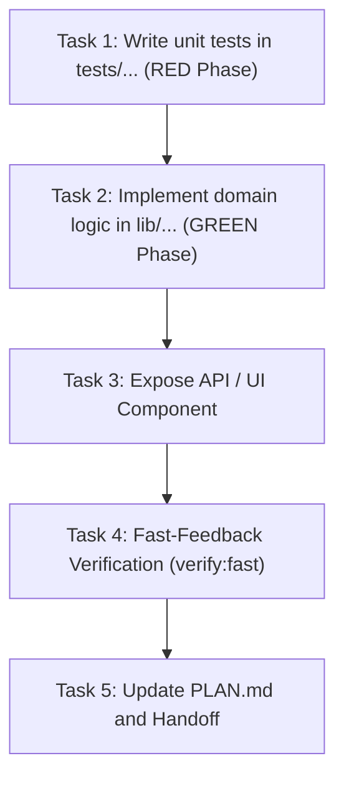

# SPEC-XXX: [Formal Title of Feature or Remediation]

- **Status:** [BORRADOR | APROBADA | EN EJECUCION | VERIFICADA]
- **Creation Date:** YYYY-MM-DD
- **Author / Responsible Agent:** [Agent Name / Maintainer]
- **Related ADRs:** [ADR-0001, ADR-0002]

---

## 1. Executive Summary & Problem Statement

_Concise description of the functionality, technical or scale justification, and boundary of the intervention._

---

## 2. Formal Requirements (EARS Syntax)

- **REQ-01 (Ubiquitous):** The system SHALL [fundamental and continuous invariant].
- **REQ-02 (Event-Driven):** WHEN [trigger event], the system SHALL [system response].
- **REQ-03 (State-Driven):** WHILE [active state or role], the system SHALL [conditioned behavior].
- **REQ-04 (Unwanted Behavior):** IF [error condition or invalid payload], THEN the system SHALL [exception handling].
- **REQ-05 (Optional Feature):** WHERE [platform or environment condition], the system SHALL [specific behavior].

---

## 3. BDD Acceptance Criteria (Gherkin Scenarios)

```gherkin
Feature: [Module or Capability Name]

  Scenario: [Primary Success Path]
    Given [System precondition and data state]
    And [Authenticated user role or session]
    When [Action performed on endpoint or component]
    Then [Observable outcome and HTTP response status]
    And [Side effect or persistence verified in Turso/Firestore]

  Scenario: [Error Handling / Unauthorized Access]
    Given [Unauthorized user or invalid payload]
    When [Action performed]
    Then [Typed error response and matching status code]
```

---

## 4. Technical Design & Component Architecture

### 4.1 Database & Schema Modifications

_DDL definitions or Drizzle/TypeScript schema snippets with indexes and foreign keys._

### 4.2 File Mapping & Blast Radius

- `[NEW]` `app/api/.../route.ts` (Description of new file)
- `[MODIFY]` `lib/...ts` (Description of change)
- `[NEW]` `tests/...test.ts` (Linked test suite)

---

## 5. Task Decomposition (Dependency DAG)



- [ ] **Task 1 (TDD Setup):** Create test suite in `tests/` and record hash snapshot. _Verification: `node scripts/verify-test-hashes.mjs --generate`_
- [ ] **Task 2 (Core Logic):** Implement domain functions in `lib/` with `// Implements: REQ-XX`. _Verification: `pnpm run test:unit`_
- [ ] **Task 3 (Integration):** Expose endpoint or UI component consuming `DESIGN.md` tokens. _Verification: `pnpm run typecheck`_
- [ ] **Task 4 (Auto-QA):** Run local verification cascade (`pnpm run verify:fast`).
- [ ] **Task 5 (Handoff):** Update `PLAN.md` with structured task completion notes.
