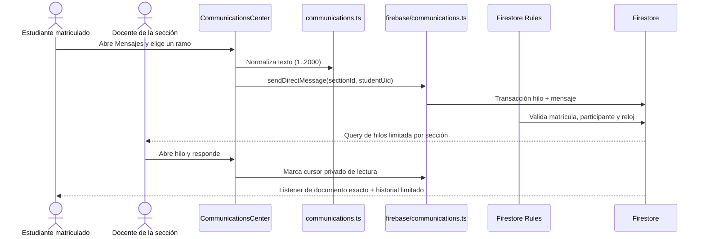
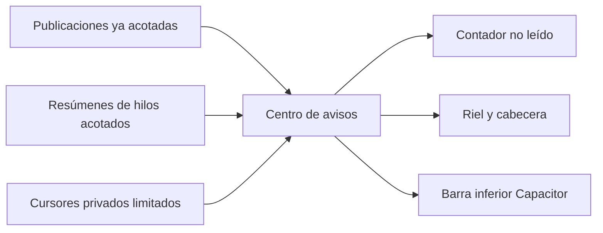

## Context

El portal ya agrega hasta 20 publicaciones por cada sección matriculada mediante `watchCourseActivity`; duplicarlas en documentos de notificación produciría fan-out, costo y riesgo de desincronización. Firestore es la proyección operacional declarada para notificaciones y chat, y `enrollments/{uid}/sections/{seccionId}` es la llave canónica de autorización.

La mensajería usa un hilo determinista `messageThreads/{studentUid}`. Así el estudiante accede por documento exacto sin consulta y el equipo docente lista sólo hilos de su sección. Cada mensaje es inmutable; el documento del hilo contiene únicamente el resumen necesario para la lista. Los cursores viven bajo el usuario y comparan el último `createdAt` o `updatedAt` visto.





## Goals / Non-Goals

**Goals**

- Responder “qué pasó desde la última visita” con una bandeja ordenada y persistente.
- Abrir un canal privado, simple y trazable entre estudiante y equipo docente.
- Mantener cada lectura ligada a matrícula y cada consulta limitada.
- Compartir exactamente la misma interfaz remota entre navegador y Capacitor.
- Conservar teclado, lector de pantalla, reflujo a 320 px y objetivos táctiles de 44 px.

**Non-Goals**

- Sustituir las publicaciones docentes, FCM o un sistema institucional de correo.
- Construir chat grupal, archivos, moderación avanzada o retención legal automática.
- Resolver el catálogo estático o la incorporación de nuevos docentes a una sección.

## Data Contracts

```ts
type MessageThread = {
  courseId: string;
  studentId: string;
  studentName: string;
  studentEmail: string;
  latestBody: string;
  latestAuthorId: string;
  latestAuthorName: string;
  createdAt: Timestamp;
  updatedAt: Timestamp;
};

type DirectMessage = {
  courseId: string;
  threadId: string;
  authorId: string;
  authorName: string;
  body: string;
  createdAt: Timestamp;
};

type ReadCursor = {
  key: string;
  readAt: Timestamp;
};
```

Rutas:

```text
courses/{courseId}/messageThreads/{studentUid}
courses/{courseId}/messageThreads/{studentUid}/messages/{messageId}
users/{uid}/notificationReads/{cursorId}
```

Claves de cursor:

```text
course:{courseId}
thread:{courseId}:{studentUid}
```

## Decisions

### D1. Avisos derivados, no materializados

La vista reutiliza `CourseActivity[]`, ya aislado y limitado por matrícula. Cada aviso compara `createdAt` contra el cursor `course:{courseId}`. Marcar todos como leídos escribe un cursor por sección visible, no un documento por publicación.

### D2. Hilo determinista por estudiante y sección

El UID del estudiante es el ID del hilo. Un estudiante observa exactamente ese documento en cada sección; docente y coordinación consultan hasta 25 hilos por sección ordenados por `updatedAt`. No existe `collectionGroup`, barrido universitario ni índice compuesto adicional.

### D3. Mensajes inmutables y resumen transaccional

Una transacción lee el hilo, crea el mensaje con ID previo y crea o actualiza el resumen. Las reglas exigen que autor, cuerpo y timestamp del resumen coincidan con el mensaje escrito. No se habilitan update/delete sobre mensajes.

### D4. Cursores privados entre dispositivos

Un listener limitado a 200 documentos bajo `users/{uid}/notificationReads` entrega el estado reciente. Sólo el dueño puede leer o escribir; cada escritura usa `serverTimestamp`. El centro limita la mezcla a 120 avisos/hilos, por lo que `Marcar todo` permanece bajo el límite de 500 operaciones por batch.

### D5. Navegación única con dos modos

`Avisos y mensajes` es una pantalla del portal con pestañas semánticas. El icono de cabecera muestra el total no leído y abre la pantalla; riel y barra inferior presentan la misma capacidad. En escritorio, mensajes usa lista + conversación; en móvil, la conversación reemplaza la lista y ofrece volver.

### D6. Autorización en reglas, no en la interfaz

La UI decide qué controles mostrar, pero Firestore vuelve a verificar identidad, matrícula, rol de sección, pertenencia del hilo, claves exactas, longitud 1..2.000 y timestamp de servidor. Un estudiante no puede consultar la colección de hilos ni elegir otro UID.

## Error Taxonomy

| Condición                            | Superficie | Respuesta                                             | Reintento          |
| :----------------------------------- | :--------- | :---------------------------------------------------- | :----------------- |
| Texto vacío o sobre 2.000 caracteres | Dominio/UI | Mensaje asociado en español, sin escritura            | Corregir entrada   |
| Sesión Firebase vencida              | Cliente    | “Tu sesión expiró…”                                   | Volver a ingresar  |
| `permission-denied`                  | Firestore  | “No tienes permiso para acceder a esta conversación.” | No automático      |
| Red/listener interrumpido            | Centro     | Estado inline no destructivo; conserva datos previos  | Automático por SDK |
| Hilo inexistente al responder        | Docente    | “La conversación ya no está disponible.”              | Volver a la lista  |

## Security and Performance Budgets

- Autorización: matrícula activa obligatoria en `courses/{courseId}/**`; estudiante sólo `threadId == uid`; cursores sólo `userId == uid`.
- Validación: claves exactas, cuerpos 1..2.000, nombres <= 120, correo del hilo igual al token, `createdAt/updatedAt == request.time`.
- Lecturas: máximo 40 secciones, 25 hilos por sección, 100 mensajes por hilo y 200 cursores.
- Mezcla en memoria: máximo 120 avisos, 120 hilos y 200 cursores; orden O(n log n) sobre datos ya acotados.
- Privacidad: ningún texto de mensaje se envía a Turso, Sentry, FCM o almacenamiento local.
- Retención: los mensajes quedan persistentes e inmutables; una política de expiración/eliminación institucional es trabajo legal separado y se documenta como riesgo.

## Affected Invariants

| Invariante                  | Tratamiento                                                                    |
| :-------------------------- | :----------------------------------------------------------------------------- |
| Derivación de rol           | No cambia; la autorización usa sesión verificada y rol de matrícula existente. |
| Aislamiento por sección     | Se exige en los tres caminos nuevos y no se añade comodín global.              |
| Turso como SoR académico    | No cambia; mensajes son operación de aula en Firestore.                        |
| Escala institucional        | Sin fan-out por estudiante; listeners y resultados llevan techos explícitos.   |
| Notas y auditoría           | Sin cambios.                                                                   |
| Capacitor remoto            | Reutiliza la misma vista web, sin implementación nativa paralela.              |
| Independencia institucional | El descargo existente permanece intacto.                                       |

## TDD Triangulation

- **RED:** la suite deberá fallar por ausencia del contrato `lib/communications.ts`, de las reglas `messageThreads/notificationReads` y de la composición de navegación/centro.
- **GREEN:** se añadirá primero el dominio puro, luego persistencia y reglas, y finalmente la UI hasta satisfacer cada escenario.
- **REFACTOR:** se revisarán límites, listeners, estados de error, reflujo y duplicación; todos los tests quedarán bloqueados antes de la implementación.

## Risks / Trade-offs

- El resumen del hilo sólo permite contar una conversación no leída, no el número exacto de mensajes pendientes. Se prioriza una lectura O(1) sobre contadores mutables por participante.
- Un docente con más de 25 conversaciones activas por sección verá primero las recientes; la paginación histórica queda fuera de CEO-26 y se declara en el handoff.
- Las reglas deben desplegarse antes que el portal. Publicar la UI primero produciría `permission-denied` en mensajería y cursores.
- No existe todavía Emulator Suite como merge gate; la suite contractual inspecciona reglas, y el smoke multirol en staging sigue siendo obligatorio antes de producción.

## Rollback

Revertir UI, cliente y reglas deja `messageThreads` y `notificationReads` sin consumidores. No hay migración de Turso ni fan-out que deshacer. Los documentos se conservan para reintento; su eliminación requeriría una operación explícita posterior.

## Blast Radius

| Área         | Archivos                                                                                              |
| :----------- | :---------------------------------------------------------------------------------------------------- |
| Contrato     | `lib/communications.ts`                                                                               |
| Tiempo real  | `lib/firebase/communications.ts`, `lib/firebase-classroom-client.ts`                                  |
| Autorización | `firebase/firestore.rules`                                                                            |
| Portal       | `app/Portal.tsx`, `app/portal-types.ts`, `app/portal-shell.tsx`, `app/views/CommunicationsCenter.tsx` |
| Estilos      | `app/globals.css`, `app/mobile-shell.css`                                                             |
| Verificación | `tests/communications.test.ts`, `package.json`, `.agents/.test-hashes.json`                           |
| Handoff      | `PLAN.md`, `docs/archive/PLAN_ARCHIVE.md`                                                             |
