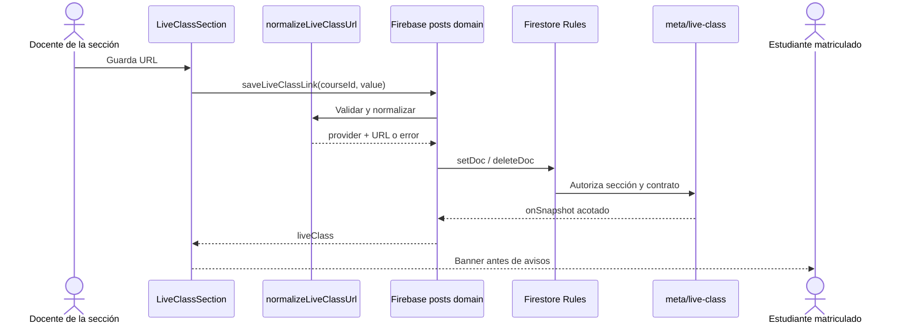

## Context

El aula ya mantiene una suscripción por sección mediante `watchClassroom`, y Firestore restringe `courses/{courseId}/**` con la proyección de matrícula. La solución debe reutilizar ambos límites: la videoclase es metadato de la sección, no una publicación ni un registro global.

## Goals / Non-Goals

**Goals**

- Acceso visible y directo a la reunión desde la portada.
- Contrato idéntico en lógica pura y reglas.
- Actualización inmediata mediante el listener existente del aula.
- Objetivos táctiles de 44 px y control de teclado con foco visible.

**Non-Goals**

- Agenda semanal, múltiples reuniones, video embebido y APIs de proveedores.
- Cambios al modelo de roles, notas o estructura académica.

## Decisions

### D1. Documento fijo de metadatos

La ruta es `courses/{courseId}/meta/live-class`, con las claves exactas `courseId`, `url`, `provider`, `updatedBy` y `updatedAt`. Un identificador fijo evita consultas, limita cada lectura a O(1) y hace que eliminar el enlace equivalga a eliminar el documento.

### D2. Normalización pura antes de Firebase

`normalizeLiveClassUrl` recorta la entrada, interpreta vacío como eliminación, limita la URL a 2.048 caracteres, exige HTTPS sin credenciales y reconoce solamente `zoom.us`, sus subdominios y los hosts exactos vigentes de Teams. Se preservan path, query y fragment porque contienen la identidad y credenciales propias de la reunión.

### D3. Reglas específicas sin bypass del wildcard

El permiso genérico de `meta/{documentId}` excluye `live-class`. La regla exacta conserva `isEnrolled(courseId)` para lectura y `teachesSection(courseId)` para mutación, valida claves, autor, timestamp, proveedor, dominio y longitud.

### D4. Banner condicional antes de avisos

`LiveClassSection` se monta al inicio de la portada. Para estudiantes retorna `null` cuando no hay enlace; para docentes conserva el editor aunque el banner no exista. La entrada es un anchor HTTPS ordinario con `noopener noreferrer`, compatible con navegador y shell Capacitor.

## TDD Triangulation

- **RED:** la suite nueva definió normalización, rechazo de dominios, paridad de reglas, orden visual y ausencia de contenedor. P8 comenzó antes de la adopción del arnés OpenSpec, por lo que el primer terminal RED no quedó preservado; el fallo esperado era la ausencia de `lib/live-class.ts` y de `LiveClassSection`.
- **GREEN:** se añadió la lógica mínima, el listener de documento, la mutación, las reglas específicas y la composición de portada hasta aprobar la suite.
- **REFACTOR:** al rebasar sobre el `main` endurecido se eliminó la adaptación heredada de `watchGradebooks`, ya innecesaria porque ahora escucha documentos por sección, y se conservó intacta la prueba preexistente de reglas nativas.

## Risks / Trade-offs

- Los enlaces de reunión pueden contener secretos en query; se almacenan sólo porque el proveedor los requiere para entrar y no se registran por separado.
- Las reglas deben desplegarse después del merge; hasta entonces la UI no puede guardar el nuevo documento en producción.
- El rol de ayudante no existe en la autorización actual. Conceder acceso antes de modelarlo rompería el aislamiento por matrícula.

## Rollback

Revertir el código y las reglas deja los documentos `meta/live-class` sin consumidores. No existe migración ni escritura masiva; los documentos pueden conservarse para un reintento o eliminarse explícitamente en una operación posterior.

## Blast Radius

| Área | Archivos |
| :--- | :--- |
| Contrato | `lib/live-class.ts` |
| Tiempo real | `lib/firebase/posts.ts`, `lib/firebase-classroom-client.ts` |
| Autorización | `firebase/firestore.rules` |
| Interfaz | `app/views/classroom/LiveClassSection.tsx`, `ClassroomView.tsx`, `use-classroom-handlers.ts`, `classroom-utils.ts`, `app/globals.css` |
| Verificación | `tests/live-class.test.ts`, `package.json`, `.agents/.test-hashes.json` |
| Handoff | `PLAN.md`, `docs/specs/p8-live-class-banner.md` |
