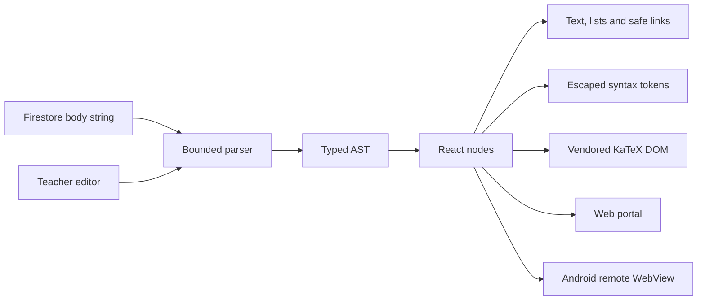

## Context

Classroom posts are stored at `courses/{sectionId}/posts/{postId}` with `body: string`. `PostsSection` currently emits that value as plain React text and `MaterialsSection` collects it with a textarea. Android is remote-first and renders the production portal at `https://ceoubb.com`, while the only offline native directory is the contingency document.

KaTeX is already vendored at `public/biblioteca/assets/vendor/katex/`. Adding another Markdown, highlighting or formula package is unnecessary and prohibited by the no-new-dependency constraint.

## Goals / Non-Goals

**Goals**

- Preserve the existing persisted string contract and render historical plain text without loss.
- Make unsafe HTML inert by construction instead of sanitizing an author-controlled HTML string after generation.
- Use one renderer for preview, published web content and the Android WebView.
- Keep parsing and highlighting deterministic and bounded for university-scale feeds.

**Non-Goals**

- No arbitrary HTML mode or WYSIWYG document model.
- No native platform branch and no data backfill.
- No asynchronous server rendering of classroom post bodies.

## Decisions

### D1. Typed AST and React nodes instead of generated HTML

`parseRichText` produces only typed blocks and inlines. `RichText` maps those values to React elements, so React escapes every author string. Raw `<script>`, event attributes and malformed markup stay visible as inert text. Link nodes receive an `href` only after an allowlist accepts `http:`, `https:` or `mailto:`.

This avoids `dangerouslySetInnerHTML` entirely and makes sanitization structural rather than dependent on a second HTML parser.



### D2. Small deterministic parser over a dependency

The accepted subset covers headings, paragraphs, lists, blockquotes, emphasis, strong text, inline code, fenced code, links and TeX delimiters. New writes are capped at 40,000 characters. The parser performs bounded scans and never evaluates source code.

The syntax tokenizer is language-specific for MATLAB, Python, C++ and SQL and emits text tokens. An unknown fence renders as plain escaped code. This keeps the bundle and supply-chain surface unchanged.

### D3. KaTeX uses the existing same-origin asset

`RichTextAssets` loads `/biblioteca/assets/vendor/katex/katex.min.js` once after hydration. Formula nodes call KaTeX with `trust: false`, `strict: "error"`, `throwOnError: true`, `maxSize: 10`, `maxExpand: 1000` and `htmlAndMathml` output. If the runtime is unavailable or rejects a formula, the original delimited TeX remains visible.

KaTeX is the only code that writes generated DOM, and it receives only a formula plus the restrictive options above. Teacher-authored HTML never reaches it as HTML.

### D4. Preview and published output share one component

`RichPostEditor` defers its controlled value for responsive typing and renders `RichText`. The post feed also renders `RichText`; there is no preview-only grammar. Creation and editing keep the draft until the Firebase operation succeeds.

### D5. Compatibility and Android parity need no migration

Plain text is parsed as paragraphs with preserved line breaks. Existing bodies over the new authoring limit are still rendered because the limit is enforced only when publishing or editing. Android requires no native change because Capacitor points at the same remote portal.

## Contracts

```ts
type RichBlock =
  | { type: "paragraph" | "quote"; content: RichInline[] }
  | { type: "heading"; level: number; content: RichInline[] }
  | { type: "list"; ordered: boolean; items: RichInline[][] }
  | { type: "code"; language: CodeLanguage; value: string }
  | { type: "math"; display: true; value: string };

type RichInline =
  | { type: "text" | "code" | "math"; value: string }
  | { type: "strong" | "emphasis"; content: RichInline[] }
  | { type: "link"; href: string | null; content: RichInline[] };
```

No Drizzle or Zod schema changes apply because the persisted payload is unchanged.

## Blast Radius

| Surface | Effect | Risk control |
| :--- | :--- | :--- |
| Classroom feed | Plain body becomes rich nodes | Legacy text regression test |
| Teacher authoring | Controlled live-preview editor | Same renderer; draft cleared only on success |
| Firebase writes | Body/link validation | Bounded input and scheme allowlist |
| KaTeX assets | Same-origin client script | Existing vendored files; restrictive options; source fallback |
| Android | Receives remote web bundle | Capacitor config parity assertion; no native files changed |
| Scale | O(n) work per visible body | 40,000-character write bound; no queries added |

## TDD Triangulation

- **RED:** acceptance tests initially failed because `lib/rich-text.ts`, `RichText` and `RichPostEditor` did not exist and classroom bodies were emitted by a plain `<p>`.
- **GREEN:** the bounded parser, tokenizers, safe renderer, KaTeX adapter and shared editor satisfied legacy, language, formula, sanitization, preview and Android-parity assertions.
- **REFACTOR:** the preview moved to `useDeferredValue`, KaTeX readiness subscriptions were consolidated into one module-level set, and parsing/highlighting stayed memoized without changing assertions.

## Risks / Trade-offs

- The subset is deliberately smaller than CommonMark. Unsupported syntax remains readable text rather than producing surprising HTML.
- KaTeX rendering is client-side; a blocked script displays source TeX, preserving content but not typesetting.
- Physical-device rendering still needs a deployment smoke test, although Android executes the same verified bundle and no native seam changes.
