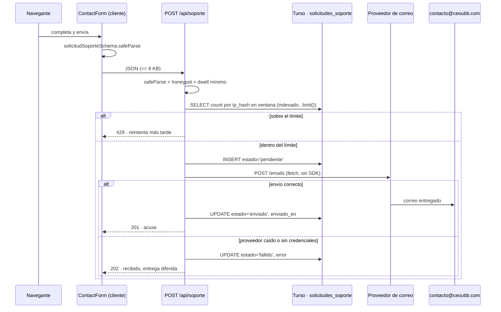

## Context

See `proposal.md` — Why. What shapes the approach here is the state of the surrounding code, not the motivation.

CEOUBB already publishes three static pages — `/privacidad`, `/terminos`, `/accesibilidad` — that share one chrome: `<main className="policy-page">`, a `.skip-link`, a `.policy-head` carrying `.app-brand` and `.policy-back`, and an `<article id="contenido-principal" tabIndex={-1}>`. Every class lives in `app/globals.css`; there is no CSS module and no Tailwind on these routes. Icons come from `@phosphor-icons/react/ssr`. This is an established visual world with a coherent identity, so the two new pages inherit it rather than inventing one — a new surface inside an existing family is not an identity exercise.

Three absences constrain the backend:

- **No validation library.** The Gold Standard Reference `app/api/admin/users/route.ts` that `AGENTS.md` describes as Zod-validated actually validates by hand (`parseInt`, clamping, `LIKE` escaping). Zod is newly authorized by the owner.
- **No mail transport.** No Resend, nodemailer, SendGrid or SMTP configuration exists. The provider account is not contracted yet.
- **No status-feedback library.** The repository's established pattern is a persistent `aria-live="polite"` region with `.tool-status.ok` / `.tool-status.bad`, used in fifteen components. There is no `Toaster` provider in `app/layout.tsx`.

Two accessory facts matter. `<details>`/`<summary>` is already the project's disclosure primitive (`MaterialsSection`, `CoursesDashboard`, `portal-shell`, `MoodleImportDialog`), so the FAQ needs no accordion component. And `/accesibilidad` publishes a full WCAG 2.2 AA conformance claim over an enumerated page list, which these two pages must join.

## Goals / Non-Goals

**Goals:**

- Two published pages indistinguishable in craft from the existing `.policy-page` family, extending it with the two element classes it lacks — form controls and disclosure groups — as reusable additions rather than page-private styles.
- One submission schema, defined once, enforced identically in the browser and on the server.
- A support request that survives a mail provider outage, and a codebase that ships and works before the mail account exists.
- A public unauthenticated endpoint whose abuse controls need no new infrastructure.
- WCAG 2.2 AA on both pages, keeping the published conformance statement truthful.

**Non-Goals** (design level; see `proposal.md` for scope exclusions):

- No design-token additions. Every value comes from `DESIGN.md`; if a page seems to need a new token, the page is wrong.
- No shared `<Accordion>` or `<Form>` abstraction. Two pages are not a component library, and the native elements already carry the behavior.
- No client-side routing state for the FAQ filter. The filter is ephemeral UI, not a URL-worthy application state; the question anchors are the durable addresses.

## Decisions

### D1 — Both pages inherit `.policy-page`; neither gets the portal shell

**Chosen:** `/contacto` and `/faq` render as standalone `.policy-page` documents, exactly like their three siblings, with `.policy-back` returning to the portal.

**Alternative rejected:** mounting them inside `app/portal-shell.tsx` with the navy app bar and sidebar. The shell assumes an authenticated session and a selected view; these pages must answer a locked-out student. The `.policy-page` family _is_ the project's public-document shell, and it is what the sibling pages use.

**Consequence:** no `hero-band`. `DESIGN.md` reserves the Midnight Navy band for the portal hero, and none of the three sibling pages carries one. A Read-mode document opens on its heading.

### D2 — Mode is Read on both, with one Operate block

`/faq` is Read end to end: structure for comprehension, wayfinding first. `/contacto` is Read framing around a single Operate block — the form — where scanability and state clarity outrank expression. Practically this forbids the marketing reflexes: no eyebrow above the `h1` (`DESIGN.md` names this explicitly), no icon-and-gradient feature grid for the contact channels, no illustration. The contact channels are a definition list, because that is what they are.

### D3 — Form feedback is a persistent region, not a toast

**Chosen:** the existing `aria-live="polite"` + `.tool-status` pattern. On success the form is replaced in place by a confirmation panel restating the category, the destination address, and the published response commitment, with a control to send another message.

**Alternative rejected:** Sonner. It is a new dependency plus a global provider, and a toast that auto-dismisses after four seconds is at its worst in exactly this moment — the one confirmation a user needs to read, remember, and possibly screenshot. Replacing the form also prevents the double-submit that a toast leaves wide open.

### D4 — Zod schema shared across the boundary, and applied to the GSR

`lib/support-request.ts` exports one schema consumed by the client component and the route handler. Field-level errors render under their inputs via `aria-describedby` and `aria-invalid`; the server repeats validation because the client is not a trust boundary.

The same change converts `app/api/admin/users/route.ts` to Zod. That file is the Gold Standard Reference `AGENTS.md` points every agent at for "Zod schema validation"; leaving it hand-rolled means the documented standard and the reference implementation disagree, and every future agent inherits the wrong pattern.

```ts
// lib/support-request.ts
import { z } from "zod";

export const CATEGORIAS_SOPORTE = [
  "soporte-tecnico",
  "sugerencia",
  "reporte-error",
  "duda-academica",
] as const;

// The five fields a person fills in. This is what the form validates.
export const solicitudSoporteSchema = z.object({
  nombre: z.string().trim().min(2, "Indica tu nombre.").max(120),
  email: z.string().trim().toLowerCase().pipe(z.email("Revisa el formato del correo.")),
  categoria: z.enum(CATEGORIAS_SOPORTE, { error: "Selecciona una categoría." }),
  asunto: z.string().trim().min(4, "Resume tu consulta en el asunto.").max(160),
  mensaje: z.string().trim().min(20, "Cuéntanos un poco más para poder ayudarte.").max(4000),
});

// What travels over the wire: the person's fields plus the two abuse controls.
// They stay outside the form schema so a failure in either can never surface as
// an error on a visible field. The honeypot deliberately accepts any content:
// rejecting it here would answer 400 with field errors, telling an automated
// client exactly what gave it away. The route decides instead, and its answer
// is indistinguishable from an acceptance.
export const envioSoporteSchema = solicitudSoporteSchema.extend({
  sitioWeb: z.string().max(200).optional(),
  duracionMs: z.number().int().nonnegative().optional(),
});

export type SolicitudSoporte = z.infer<typeof solicitudSoporteSchema>;
```

`duracionMs` carries elapsed time measured in the browser, not a timestamp. A timestamp would require the client clock to agree with the server's, and many do not.

### D5 — Institutional domain is annotated, never enforced, on this endpoint

**Chosen:** accept any syntactically valid address. Derive `rolDeclarado` with `roleForEmail()` from `lib/access-policy.ts` and store it (nullable). When the domain is not institutional, the form shows a non-blocking note beneath the field: the message will still be answered, but enrollment cannot be verified from it.

**Alternative rejected:** rejecting non-institutional domains with 403, mirroring the auth policy. `AGENTS.md` §2.1 governs _role derivation and authentication_ — deciding who may enter and as what. A contact form decides nothing; and the single most likely sender is a person writing precisely because their institutional address is not working. Rejecting them closes the only door they have left.

The rule that does carry over intact: the domain check is never reimplemented. `roleForEmail()` is the SSOT, called, not copied.

### D6 — Persist first, deliver second



The row is written before the transport is touched, so an outage degrades to a queued ticket instead of a lost message. The user is told the truth in both cases: 201 says it was delivered, 202 says it was received and is pending delivery — never a green checkmark over a dropped message.

**Alternative rejected:** send-only, no persistence. One provider hiccup silently discards a student's message, and there is no record that it ever existed. This is the data-loss case that laziness does not get to simplify away.

**Alternative rejected:** a background queue or cron retry. Real, and out of scope; a `pendiente`/`fallido` row is already the queue, and `openspec/changes/.../tasks.md` records the retry as future work rather than building it now.

### D7 — Rate limiting reads the table it already writes

**Chosen:** a `COUNT` over `solicitudes_soporte` filtered by `ip_hash` within a rolling window, on a composite index, with an explicit `.limit()`. Threshold: 3 per hour per IP hash, 20 per hour globally.

**Alternative rejected:** an in-memory `Map` in the route module. Vercel runs many isolated instances; a per-instance counter is a rate limit in name only. **Alternative rejected:** Upstash or Vercel KV — new infrastructure and a new bill for a form that will see single-digit daily traffic.

`ip_hash` is `SHA-256(ip + SOPORTE_IP_PEPPER)`, never the raw address. The recently published privacy work established a per-category retention table, and adding a new raw-IP column would widen the declared data inventory more than necessary. A peppered hash still counts as personal data and still gets a retention limit — it simply cannot be read back into an address.

Three layers sit in front of the counter, cheapest first: a hard 8 KB body bound, the honeypot field, and a minimum dwell of three seconds between form mount and submit. All three are server-checked; the client copies exist only to fail fast.

### D8 — Drizzle table

```ts
// db/schema.ts
export const solicitudesSoporte = sqliteTable(
  "solicitudes_soporte",
  {
    id: text("id").primaryKey(),
    nombre: text("nombre").notNull(),
    email: text("email").notNull(),
    rolDeclarado: text("rol_declarado", { enum: ["owner", "teacher", "student"] }),
    categoria: text("categoria", {
      enum: ["soporte-tecnico", "sugerencia", "reporte-error", "duda-academica"],
    }).notNull(),
    asunto: text("asunto").notNull(),
    mensaje: text("mensaje").notNull(),
    estado: text("estado", { enum: ["pendiente", "enviado", "fallido"] }).notNull(),
    errorEntrega: text("error_entrega"),
    ipHash: text("ip_hash").notNull(),
    userId: text("user_id").references(() => users.id),
    createdAt: text("created_at").notNull(),
    enviadoEn: text("enviado_en"),
  },
  (table) => [
    index("idx_soporte_ip_created").on(table.ipHash, table.createdAt),
    index("idx_soporte_estado_created").on(table.estado, table.createdAt),
  ]
);
```

`userId` is populated only when a session cookie is present, linking the ticket to the account without requiring one.

### D9 — Mail seam with a no-op driver as the default

`lib/services/support-mail.ts` exports one function, `enviarCorreoSoporte(solicitud)`, returning `{ entregado: boolean; error?: string }`. Driver selection is by environment:

| `SOPORTE_MAIL_DRIVER` | Behavior                                                                                                                   |
| :-------------------- | :------------------------------------------------------------------------------------------------------------------------- |
| unset or `none`       | No transport. Returns `{ entregado: false, error: "sin proveedor configurado" }`; the ticket stays `pendiente`.            |
| `brevo`               | `POST https://api.brevo.com/v3/smtp/email` with an `api-key` header, plain-text JSON body, `replyTo` set to the submitter. |

**Chosen provider: Brevo.** The owner's criterion was the most generous permanent free tier, and Brevo carries 300 transactional emails per day with no credit card, no time limit and no expiry, roughly 9,000 a month. Resend and MailerSend both cap at 3,000 a month, Postmark at 100, and SendGrid and Mailgun no longer offer a permanent free tier at all. At the traffic a university support form actually sees, Brevo's ceiling is roughly thirty times the realistic load, so the paid tier only ever arrives if something goes very right or very wrong.

Its API also happens to be the plainest of the shortlist: one `POST`, an `api-key` header rather than a signed request, and a body whose fields map one to one onto the port.

```
POST https://api.brevo.com/v3/smtp/email
api-key: <SOPORTE_MAIL_API_KEY>
content-type: application/json
accept: application/json

{
  "sender":      { "name": "Centro de Estudio UBB", "email": "<SOPORTE_MAIL_FROM>" },
  "to":          [{ "email": "<SOPORTE_MAIL_TO>", "name": "Soporte CEOUBB" }],
  "replyTo":     { "name": "<nombre del remitente>", "email": "<correo del remitente>" },
  "subject":     "[<categoría>] <asunto>",
  "textContent": "<cuerpo en texto plano>"
}
```

`textContent` is used and `htmlContent` is deliberately never set. Brevo accepts only one body type per request, so choosing the plain-text field makes the no-HTML guarantee structural rather than a convention someone can forget.

**Alternative rejected: Zoho ZeptoMail.** The owner already runs Zoho Mail on `contacto@ceoubb.com`, so staying inside one vendor is tempting. But ZeptoMail's free allowance is a one-off block of trial credits, not a recurring tier; once spent it is pay-as-you-go. That fails the stated criterion.

**Alternative rejected: sending through Zoho Mail's own SMTP.** It would cost nothing on top of the existing mailbox, but SMTP access is not part of Zoho's free mail plan, a long-lived SMTP connection is a poor fit for a serverless function, and it would force a `nodemailer` dependency in place of one `fetch`.

**Alternative rejected: installing a vendor SDK.** `@getbrevo/brevo` exists and adds nothing that fifteen lines of `fetch` do not already do, while making a provider change a dependency change.

**Sender identity is a subdomain, not the root domain.** `ceoubb.com` already carries Zoho's MX, SPF and DKIM records. Brevo authenticates its own sending domain, and a domain may hold only one SPF record, so pointing Brevo at the root risks breaking the mailbox that receives these very messages. The sender is therefore `soporte@notificaciones.ceoubb.com`, authenticated on a delegated subdomain, and the destination stays the Zoho mailbox `contacto@ceoubb.com`. The two systems never touch each other's DNS.

The no-op default is what lets both pages merge and deploy before the Brevo account exists. The failure is visible, not silent: the response is 202 with honest copy, and the rows accumulate as `pendiente` for the owner to see.

### D10 — FAQ structure: native disclosure, client filter, addressable questions

Content lives in `app/faq/faq-content.ts` as a typed array of categories and questions, each with a stable slug. The page is a Server Component; only the filter and its list are client-side.

```
/faq
├── h1 + one-line purpose
├── índice de categorías (ancla interna, ya existe como .policy-index)
├── [cliente] campo de filtro + recuento "N de M preguntas" (.num, tabular-nums)
└── por categoría: h2 + <details id="{slug}"> · <summary> pregunta · respuesta
```

Decisions inside it:

- **Multiple open at once.** No `name` attribute on `<details>`; exclusive accordions punish the person comparing two answers, and they fight the filter.
- **Filter matches question and answer text**, is debounced, announces its result count through `aria-live="polite"`, auto-opens matches so the matched text is visible, and renders an explicit empty state routing to `/contacto` — the highest-intent moment on the page.
- **Every question is addressable** at `/faq#{slug}`, and a `<details>` targeted by the hash opens on load. This is what makes the FAQ answerable by link in a support reply, which is the whole point of building it before the form.
- **No match highlighting** in this change. It costs a text-splitting renderer and risks mangling the answer markup; the auto-open already puts the match on screen.

### D11 — Motion

Disclosure animates through `::details-content` with `interpolate-size: allow-keywords`, one transition on `block-size` and `opacity` at 140 ms — no JavaScript, no measured heights, and instant open where the browser lacks support. Every transition is wrapped in `@media (prefers-reduced-motion: reduce)` to zero. Nothing else on either page moves: `DESIGN.md` forbids `transition: all`, and a Read-mode document that animates its own paragraphs is a document arguing with itself.

### D12 — CSS lives in the `.policy-page` family

New classes are scoped under `.policy-page` in `app/globals.css` and named for their role, not their page: `.policy-form`, `.policy-field`, `.policy-field-error`, `.policy-disclosure`, `.policy-filter`, `.policy-empty`. Values are taken from `DESIGN.md` — inputs at `{rounded.xs}` 4px on a white surface with a `{colors.hairline}` border, the submit control as a `{rounded.full}` pill in `{colors.primary}`, the focus ring in `{colors.primary}`, counters in `lining-nums tabular-nums`. `/privacidad` and `/terminos` gain the ability to carry a form without a single line changing.

## Risks / Trade-offs

- **A public unauthenticated write endpoint is a new attack surface** → Four independent controls (8 KB body bound, honeypot, minimum dwell, per-IP and global rate limit backed by an indexed query), no attachments, no HTML rendered from user input, and every outbound field escaped as plain text in the email body.
- **The ticket table adds a personal-data category — full name, email, free-text message, hashed IP — that `/privacidad` does not declare** → `/privacidad` was just rewritten with a per-category retention table under Ley 21.719. Publishing a form that collects data the policy omits would break a promise made four weeks ago. Extending the policy and setting a retention limit for `solicitudes_soporte` is a task in this change, not a follow-up.
- **`/accesibilidad` claims full WCAG 2.2 AA conformance over an enumerated list of pages** → Both routes join that list in the same change; the pages are built to the claim rather than the claim narrowed to the pages.
- **The message body reaches an inbox and could carry an injection payload** → The email is sent as plain text with no HTML part, and the user's address goes in `reply-to`, never in `from`, so provider domain authentication stays intact.
- **Shipping with no mail provider means real messages sit undelivered** → The 202 response says so in plain language, the confirmation panel repeats the direct `mailto:contacto@ceoubb.com` as an always-available second route, and an owner-only count of `estado = 'pendiente'` makes the backlog visible.
- **Zod on the GSR route touches working production code for no user-visible gain** → It is bounded to query-parameter parsing in one handler, its existing behavior (clamping, defaults, `LIKE` escaping) is preserved exactly, and the admin API test suite already covers it.
- **`::details-content` has uneven browser support** → The transition is progressive enhancement; without it the disclosure opens instantly, which is the correct fallback and what the rest of the project's `<details>` usages already do.

## Migration Plan

1. `pnpm add zod`, then the shared schema and the GSR conversion, verified by the existing admin API suite before anything new is built on it.
2. Drizzle migration for `solicitudes_soporte` with both indexes; additive, no backfill, no existing table touched.
3. Backend: mail seam with the no-op driver, then the route handler. Testable end to end with zero configuration — the no-op path is the default path.
4. `app/globals.css` additions, then `/faq` (no backend dependency), then `/contacto`.
5. Wiring: sitemap, portal footer, sidebar, and the `/accesibilidad` and `/privacidad` text updates.
6. Environment variables added in Vercel when the provider is chosen; setting `SOPORTE_MAIL_DRIVER=rest` is the entire activation step.

**Rollback:** the pages are additive routes with no consumers. Reverting means deleting them and the four link references; the table can stay (empty and unread) or be dropped separately. Disabling delivery alone is one environment variable.

### D13 — Retention: twelve months, then the row is deleted

A support request is not an academic record, and nothing in the platform depends on one after a semester or two. Twelve months is also the number the privacy policy already uses to purge the client IP from the grade audit trail, so section 5 of that document gains a row without gaining a second deadline for a reader to keep track of.

At twelve months the whole row goes, not just its identifying columns. There is no analytical use for an anonymized support ticket that would justify keeping the text.

### D14 — Em dashes are removed from every published page, not only the new ones

The owner's rule covers the whole site. `/privacidad`, `/terminos` and `/accesibilidad` contain em dashes today, and this change removes them by restructuring the affected sentences.

This is editing published legal text, so the constraint is strict: **the meaning of every sentence is preserved exactly.** A dash between clauses becomes a full stop, a comma, a colon where what follows explains what precedes, or parentheses for a true aside. Nothing is added, nothing is dropped, no commitment is softened or strengthened. The existing `tests/privacy-terms.test.ts` and `tests/accessibility.test.ts` assertions must keep passing untouched; if one fails, the rewrite changed something it should not have.

The rule governs published copy. Specification text, code comments and these planning documents are unaffected.

## Open Questions

None. The mail provider is resolved in D9, the retention period in D13, and the copy rule in D14.

## Blast Radius

| File                                                                                         | Change                              | Risk                                                                                       |
| :------------------------------------------------------------------------------------------- | :---------------------------------- | :----------------------------------------------------------------------------------------- |
| `app/contacto/page.tsx`, `ContactForm.tsx`                                                   | new                                 | none — new route                                                                           |
| `app/faq/page.tsx`, `FaqBrowser.tsx`, `faq-content.ts`                                       | new                                 | none — new route                                                                           |
| `app/api/soporte/route.ts`                                                                   | new                                 | new public write endpoint; abuse controls per D7                                           |
| `lib/support-request.ts`, `lib/services/support-mail.ts`, `lib/services/support-requests.ts` | new                                 | none                                                                                       |
| `db/schema.ts` + migration                                                                   | additive table                      | low — no existing table touched                                                            |
| `app/globals.css`                                                                            | new classes under `.policy-page`    | low — additive, no existing selector edited                                                |
| `app/api/admin/users/route.ts`                                                               | hand-rolled → Zod                   | **medium** — live admin endpoint; behavior preserved, covered by `tests/admin-api.test.ts` |
| `app/sitemap.xml/route.ts`                                                                   | two `<url>` entries                 | none                                                                                       |
| `app/Portal.tsx`, `app/portal-shell.tsx`                                                     | footer and sidebar links            | low                                                                                        |
| `app/accesibilidad/page.tsx`                                                                 | conformance scope list              | low — published claim, wording reviewed                                                    |
| `app/privacidad/page.tsx`                                                                    | new data category and retention row | **medium** — published legal text, wording reviewed                                        |
| `package.json`                                                                               | `+ zod`                             | low — authorized                                                                           |
