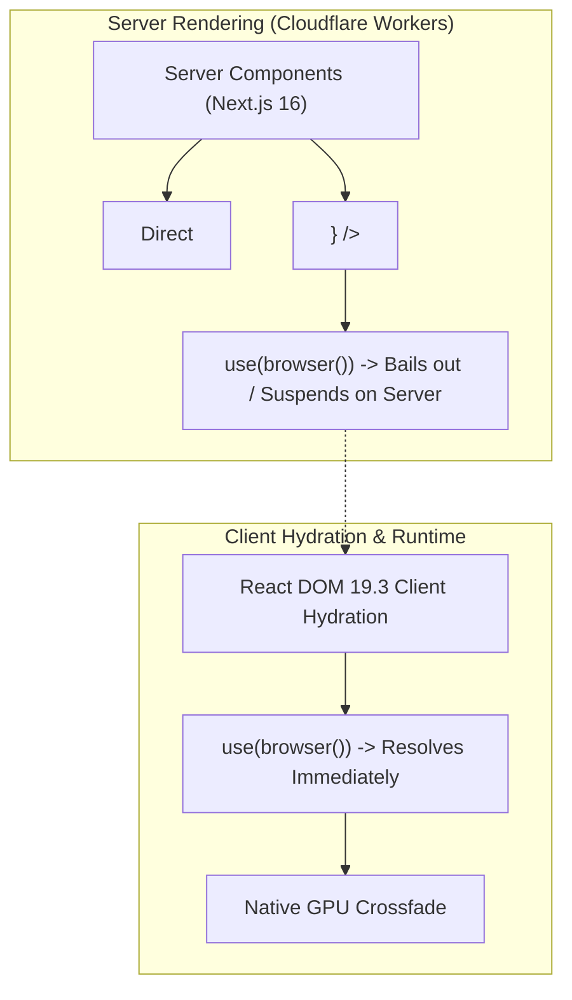

## Context

CEOUBB se ejecuta sobre Next.js 16 (App Router), React 19.2.8 y `@opennextjs/cloudflare` para despliegue en Cloudflare Workers, empaquetado también en Android mediante Capacitor (`cl.ubb.centroestudio`).

El portal presenta componentes con bifurcación de entorno donde se montan modales, paletas y componentes con APIs de navegador (`app/Portal.tsx`, `app/command-palette.tsx`, `lib/hooks/use-touch-capable.ts`), actualmente resueltos con comprobaciones de tipo `typeof window !== 'undefined'` o estados `mounted` diferidos. Asimismo, la navegación entre vistas del aula y el panel de cursos depende de re-renderizados sin transiciones visuales nativas continuas o delega transiciones a `motion`.

Ver `proposal.md` y las especificaciones en `specs/` para la justificación funcional.

## Goals / Non-Goals

**Goals:**

- Actualizar el runtime base a React 19.3.x garantizando total paridad con el pipeline de build de Next.js y Cloudflare Workers.
- Adoptar `use(browser())` en primitivas de montaje y cliente para eliminar renders duplicados y garantizar compatibilidad estricta de SSR con Suspense.
- Introducir `<ViewTransition>` de forma progresiva en componentes clave de navegación (`CoursesDashboard.tsx`) y transiciones de skeletons diferidos (`ui/view-skeletons`).
- Asegurar 100% de cumplimiento con las pruebas de invariantes (`verify:invariants`), pruebas rápidas (`verify:fast`) y test-locking SHA-256.

**Non-Goals:**

- No se reemplaza `motion` en animaciones micro-interactivas complejas (gestos de arrastre, sheets táctiles con física de resorte como `vaul`). `<ViewTransition>` se usa para transiciones de estado y vistas a nivel de layout/GPU.
- No se alteran esquemas de base de datos Turso ni reglas de seguridad de Firestore/Storage.
- No se modifica la política determinista de roles por dominio de correo (`lib/access-policy.ts`).

## Architecture & Data Flow

## Decisions

### 1. Reemplazo de guardas `mounted` por `use(browser())` en `app/Portal.tsx`

- **Decisión**: Utilizar `use(browser())` de `react-dom` dentro de componentes que requieren acceso inmediato a `document.body` o APIs del DOM.
- **Alternativas consideradas**:
  - _Mantener `useEffect` con `mounted`_: Requiere dos pasadas de renderizado en cliente y produce saltos visuales o retrasos en la apertura de modales y drawers.
  - _`useSyncExternalStore` con snapshot vacío_: Añade boilerplate y no se integra nativamente con los árboles de Suspense en SSR streaming de Next.js.
- **Razón**: `use(browser())` suspende en el servidor produciendo el fallback de Suspense inmediatamente, y en el cliente resuelve de inmediato sin ciclo extra de reconciliación.

### 2. Coordinación de transiciones con `<ViewTransition>` y `addTransitionType`

- **Decisión**: Aplicar `<ViewTransition update="auto" default="none">` en el envoltorio de las vistas con lazy loading (`CoursesDashboard`, pestañas de aula) y enlazarlas a `startTransition`.
- **Alternativas consideradas**:
  - _Animaciones JS puras con `motion`_: Aumenta el cálculo en el hilo principal y el tamaño del bundle en el WebView móvil.
  - _CSS transitions clásicas_: No pueden sincronizar automáticamente elementos compartidos o reemplazo de vistas asíncronas con Suspense.
- **Razón**: La API nativa aprovecha la aceleración por hardware de Chromium en el WebView de Android y en navegadores modernos, con degradación automática a render instantáneo en clientes que no la soporten o con `prefers-reduced-motion`.

### 3. Mantenimiento estricto de invariantes y contratos de tipado

- **Decisión**: Sincronizar `@types/react` y `@types/react-dom` a sus versiones alineadas con 19.3 para habilitar tipos de `<ViewTransition>` y `browser()`.
- **Blast Radius**:
  - `package.json`: Modificación de versiones.
  - `app/Portal.tsx`: Refactor de hidratación.
  - `app/views/CoursesDashboard.tsx`: Envoltorio de transiciones de pestaña.
  - No afecta APIs de backend (`app/api/**`), migraciones (`drizzle/**`) ni reglas (`firebase/**`).

## Risks / Trade-offs

- **[Riesgo: Incompatibilidad entre Next.js 16.3.4 y paquetes externos de React 19.3]** $\rightarrow$ _Mitigación_: Next.js 16 gestiona internamente sus dependencias de `react-server`. Si existiera colisión de peer dependencies, se validará con `pnpm run verify:fast` y `pnpm run build` antes de cualquier integración.
- **[Riesgo: Navegadores sin soporte de View Transitions API]** $\rightarrow$ _Mitigación_: React maneja `<ViewTransition>` con degradación elegante; si el navegador no soporta `document.startViewTransition`, la mutación de estado ocurre de forma instantánea sin errores.
- **[Riesgo: Impacto en accesibilidad por animaciones no deseadas]** $\rightarrow$ _Mitigación_: Se declara en CSS la regla global `@media (prefers-reduced-motion: reduce)` para cancelar la duración de las transiciones nativas.

## Migration Plan

1. Actualizar `package.json` con `react@19.3.0`, `react-dom@19.3.0` y sus `@types/*`.
2. Ejecutar instalación de dependencias vía `pnpm install`.
3. Refactorizar `app/Portal.tsx` para adoptar `use(browser())`.
4. Integrar `<ViewTransition>` en el panel de navegación de cursos.
5. Ejecutar la batería de verificación: `pnpm run format:check`, `pnpm run verify:fast`, `pnpm run verify:invariants` y `pnpm test`.
