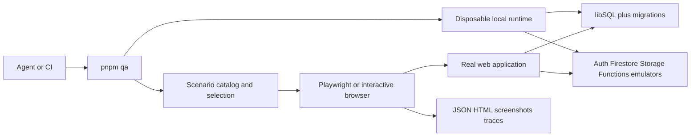

## Context

See proposal.md for motivation and the interview decisions. The current suite has nine browser spec files, ad hoc screenshots, preview sessions, and several synthetic component transports. The portal uses internal navigation rather than distinct routes. Server Firebase calls use Google REST endpoints while client services initialize independently. Emulator ports exist but are not wired through the application.

## Goals / Non-Goals

**Goals:** use existing Node, pnpm, Playwright, axe, libSQL/Drizzle, and Firebase tooling; make one scenario reproducible by any terminal-capable agent; report evidence honestly; preserve production behavior.

**Non-goals:** a new testing framework, custom agent MCP server, production mutation, arbitrary defect repair, or new application tables.

## Decisions

1. `pnpm qa` is a thin Node launcher over existing checks and Playwright. Named areas and stable scenario IDs select ordinary tests. `--list`, `--area`, `--scenario`, `--all`, `--screenshots`, and `--explore` expose discovery and use. Unknown arguments and empty selections fail with help.
2. Local runs explicitly opt into QA with a demo Firebase project, loopback service endpoints, a disposable file database, synthetic credentials, and isolated output. The launcher never copies remote target credentials into the child environment. A run owns its process handles and cleans only its own processes/data. Local browser concurrency is bounded for constrained Windows machines.
3. Firebase client connection happens before any service use. Server REST origins and emulator authorization are selected at the common service boundary. Every enabled endpoint is validated; QA does not replace role derivation, membership rules, or application session creation. CSP and App Check have guarded local behavior only.
4. Reuse Drizzle migrations and existing data shapes. Seed institutional Auth identities and matching relational users, account-role documents, active/archived periods, sections, and projections. Seed business data for populated and empty scenarios. Mutating scenarios reset only disposable fixtures; separate agents use independent runs.
5. Scenario metadata records IDs, area, source files, role/membership, semantic state, criticality, and checkpoints. Ordinary Playwright functions prepare/navigate/assert; controlled transport failures are limited to testing failure states and are labeled. Successful persistence scenarios use the real backend and emulator SDKs.
6. A source/state inventory makes gaps visible. The catalog is complete only when every required entry has an implemented and executed checkpoint, or a reviewed non-applicable reason. A URL crawl or a screenshot alone never establishes functional coverage.
7. Keep Playwright HTML/JSON reports, attach screenshot evidence, and retain traces on failure. Summary classification separates functional failure, accessibility failure, visual difference, environment failure, and external verification required. Compare references only for the same platform/browser/viewport; missing references remain visible. No autonomous baseline acceptance.
8. PR selection combines the git base diff with local staged/unstaged/untracked source changes and always includes critical journeys. Shared infrastructure or unknown application paths select the full suite. Nightly/manual runs select the full catalog. Staging operates on dedicated synthetic data and never resets shared preview datasets.
9. English instructions live in a short AGENTS.md entry linked to an operational guide. CLAUDE.md already imports AGENTS.md. Agents must register new feature states and inspect screenshots and failures after code changes.

### Data contracts

No Drizzle schema migration is required. Existing user/session/academic tables remain authoritative. Validate untrusted CLI configuration and serialized scenario/result records with existing Zod or explicit bounded parsers; use finite role/state enums and safe path resolution. Never use `any` or unsafe casts to fabricate Firebase users.

### Blast radius

- QA launcher, fixture setup, scenario catalog, browser helpers and reports.
- Firebase client initialization, shared server endpoint/credential resolution, local CSP and build output isolation.
- New QA workflow and package scripts, without replacing established test gates.
- AGENTS.md, English operational documentation, and PLAN.md handoff.
- Existing protected test files and production rule predicates remain unchanged.

## Risks / Trade-offs

- Platform-dependent rendering: keep comparison environments compatible and use Linux CI as the canonical complete comparison source.
- Expensive full catalogs: select affected areas for PRs, run full verification nightly, and limit local workers; never reduce the documented coverage silently.
- Existing defects: retain failing evidence and separate remediation work, as the user requested.
- External integrations: deterministic local contracts plus explicit staging/manual evidence, never fictional delivery success.
- Concurrent data resets: per-run isolation and serial mutations within each runtime first; increase concurrency only with proven fixture partitioning.

## Migration Plan

Introduce the local runtime behind explicit QA-only configuration, add catalog/scenarios and CLI, then wire CI and instructions. Preserve existing scripts and tests. Rollback removes the QA entry points and disables the local opt-in without changing production data. Validate malformed/remote configuration rejection and default production behavior before enabling automated runs.
