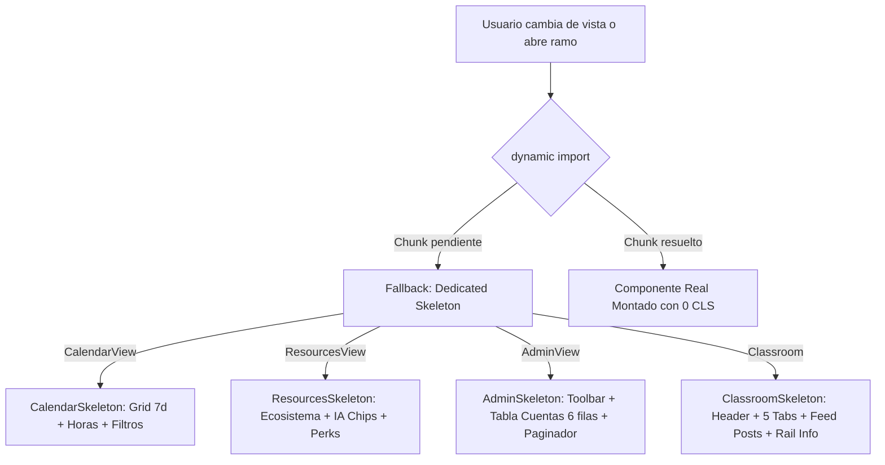

## Context

Ver `proposal.md` y `specs/ui/view-skeletons/spec.md`. Actualmente, `app/portal-shell.tsx` carga de forma asíncrona mediante `next/dynamic` cuatro vistas: `CalendarView`, `ResourcesView`, `AdminView` y `Classroom`. Las cuatro consumen una función auxiliar `ViewSkeleton` que emite tres bloques lineales planos, causando un salto visual (CLS) severo cuando el componente real sustituye al esqueleto.

## Goals / Non-Goals

**Goals:**

- Implementar cuatro componentes de esqueleto (`CalendarSkeleton`, `ResourcesSkeleton`, `AdminSkeleton` y `ClassroomSkeleton`) que repliquen de forma fidedigna la estructura, jerarquía y espaciado de sus vistas reales.
- Reutilizar la infraestructura de animación y tokens OKLCH existente (`.sk`, `sk-sweep`, `--sk-delay`, tokens de superficie).
- Cumplir con WCAG 2.2 (`role="status"`, `aria-busy="true"`, `aria-label="Cargando..."`, `@media (prefers-reduced-motion)`).
- Eliminar el CLS durante transiciones de navegación en el portal.

**Non-Goals:**

- No modificar la lógica de carga de datos en Firestore ni las consultas en Turso.
- No alterar los endpoints de autenticación o políticas de acceso.
- No introducir librerías externas de skeleton o componentes no auditados.

## Decisions

### 1. Ubicación y Estructura Modular de los Esqueletos

- **Decisión**: Crear un archivo de módulo `app/views/ViewSkeletons.tsx` (o directorio `app/views/skeletons/`) que exporte los cuatro componentes dedicados:
  - `CalendarSkeleton`
  - `ResourcesSkeleton`
  - `AdminSkeleton`
  - `ClassroomSkeleton`
- **Alternativa descartada**: Declarar esqueletos inline dentro de cada archivo de vista (rompería la separación de empaquetado para `next/dynamic`, ya que el fallback de carga debe estar disponible antes de importar el bundle del componente).

### 2. Arquitectura de Carga y Flujo de Renderizado

### 3. Reutilización de Clases CSS y Micro-Tokens

- Se aprovecharán las clases nativas y de diseño del sistema:
  - `.sk`: Contenedor base de shimmer con fondo `color-mix`.
  - `.sk-round`: Para avatares e indicadores circulares.
  - `--sk-delay`: Variables CSS escalonadas (e.g. `40ms`, `80ms`, `120ms`...) para que el barrido de luz diagonal viaje armónicamente a través de la pantalla.
  - Clases estructurales existentes: `.planner-frame`, `.resource-layout`, `.admin-table`, `.classroom-columns`, etc. para garantizar consistencia milimétrica.

## Blast Radius & Archivos Afectados

- `app/views/ViewSkeletons.tsx` (Nuevo): Módulo de componentes de esqueletos dedicados.
- `app/portal-shell.tsx` (Modificado): Integración de los nuevos esqueletos en las opciones `loading` de `dynamic()`.
- `app/globals.css` (Modificado): Utilidades adicionales o ajustes finos para contenedores de esqueletos.

## Risks / Trade-offs

- **[Riesgo]** Desalineación si la vista real cambia de diseño en el futuro.
  - _Mitigación_: Los esqueletos consumen exactamente las mismas clases de contenedor (`.planner-frame`, `.admin-table`, `.classroom-layout`) y variables de rejilla CSS que las vistas de producción.
- **[Riesgo]** Overhead en el bundle principal.
  - _Mitigación_: Los componentes de esqueleto son componentes puros de presentación HTML/CSS con cero dependencias pesadas y pesan menos de 2KB.
