## Context

`main` has no shared academic prose renderer and no KaTeX/highlighting dependency. The root layout already owns global CSS and self-hosted `next/font` variables for Manrope/Merriweather. Android is remote-first Capacitor, so the same Next.js HTML and CSS serve both web and native WebView.

The acceptance criteria make a client-only DOM pass unsuitable: it would initially ship literal delimiters/code, introduce visual restyling after mount and repeat the full parse on hydration. The chosen pipeline builds a sanitized HAST tree synchronously and renders it into the first HTML payload. A small client wrapper owns only clipboard events and its `aria-live` announcement.

```mermaid
flowchart LR
  S[Markdown o HTML seguro] --> RP[remark-parse + GFM + math]
  RP --> RH[remark-rehype]
  RH --> RAW[rehype-raw]
  RAW --> SAN[rehype-sanitize]
  SAN --> K[rehype-katex]
  K --> H[rehype-highlight\n5 gramáticas]
  H --> T[toolbar HAST de código]
  T --> HTML[HTML inicial]
  HTML --> R[AcademicContentRenderer]
  R --> C[Clipboard client boundary]
```



## Goals / Non-Goals

**Goals**

- Salida SSR determinista, idéntica durante hidratación y navegaciones RSC.
- Saneamiento antes del marcado confiable de KaTeX/Highlight.js.
- API de componente pequeña: contenido, formato y clase opcional.
- JS cliente acotado al portapapeles.
- CSS institucional legible, responsivo y accesible.

**Non-Goals**

- Editor, persistencia o publicación de contenido.
- DOMPurify/Word cleanup completo de CEO-57.
- Ejecución de código o HTML activo.

## Decisions

### D1. Unified AST en vez de parseo con expresiones regulares

La cadena Remark/Rehype mantiene separados texto, HTML crudo, matemática y código. `rehype-sanitize` opera después de reconstruir HTML seguro y antes de que KaTeX/Highlight agreguen nodos confiables. De esta forma no se necesita permitir estilos arbitrarios o todo MathML en la entrada docente.

Alternativa descartada: `marked` + saneamiento del string final. KaTeX requiere estilos y una familia amplia de nodos MathML; permitirlos al final también ampliaría la entrada HTML no confiable o exigiría un segundo parser.

### D2. Pipeline puro en `lib/` y boundary cliente diminuto

`renderAcademicContentToHtml` no consulta DOM, fecha, red ni estado global; puede ejecutarse en servidor y navegador y es comprobable con `node:test`. `AcademicContentRenderer` calcula la salida y se la entrega al wrapper cliente. El wrapper usa delegación de evento sobre botones generados en HAST y copia el `textContent` del `<code>` asociado.

Esto serializa una copia del HTML por el límite RSC cuando se usa como Server Component, pero evita enviar el parser, KaTeX y los gramáticos al bundle cliente. Para publicaciones de aula esa compensación es menor que parsear dos veces. Si una vista cliente importa la función en el futuro, el pipeline sigue siendo isomorfo.

### D3. CSS crítico y fuente en el layout raíz

`katex/dist/katex.min.css` se importa antes de `globals.css` desde `app/layout.tsx`; Next.js lo incluye en el CSS de producción y las reglas locales pueden ajustar overflow después. JetBrains Mono se autohospeda con `next/font/google`, sin solicitud de fuente desde el navegador, y alimenta `--font-mono`.

### D4. Highlight.js selectivo y sin autodetección

Se importan los módulos `python`, `matlab`, `c`, `sql` y `r` desde `highlight.js/lib/languages/*`. `rehype-highlight` recibe ese registro y `detect: false`. Los aliases `py` y `m` se normalizan a Python y MATLAB. Lenguajes desconocidos conservan texto escapado.

### D5. Saneamiento y navegación

El schema deriva de `rehype-sanitize/defaultSchema`, suma `aside` y permite únicamente las clases `callout-notice`/`callout-assessment` en `div` y `aside`. No admite estilos inline, handlers, scripts, iframes ni esquemas peligrosos. KaTeX y Highlight se ejecutan después del saneamiento; su HTML nunca proviene del docente.

### D6. Trazabilidad sin comentarios nuevos

La preferencia global del usuario prohíbe agregar comentarios en código fuente. En lugar de marcadores `// Implements`, `lib/academic-content.ts` exporta una tupla inmutable `ACADEMIC_RENDERER_REQUIREMENTS` con `REQ-RENDER-01` a `REQ-RENDER-05`, y los nombres aparecen también en las pruebas y tareas. Es una desviación explícita del formato de comentario SDD para respetar la instrucción de mayor prioridad sin perder trazabilidad grepable.

## Contracts

```typescript
type AcademicContentFormat = "markdown" | "html";

type AcademicContentRendererProps = {
  content: string;
  format?: AcademicContentFormat;
  className?: string;
};

function renderAcademicContentToHtml(content: string, format?: AcademicContentFormat): string;
```

La función es total para strings: contenido vacío devuelve HTML vacío; LaTeX inválido conserva una representación de error legible (`throwOnError: false`); lenguaje desconocido se representa como texto plano; HTML inseguro se elimina.

## Performance and Security Budgets

- Complejidad objetivo `O(n)` sobre el tamaño del contenido, sin consultas ni listeners.
- `detect: false` y cinco gramáticos registrados; no se importa `highlight.js` completo.
- No hay `useEffect` para fórmulas o highlighting y no hay fetch de fuentes/CSS en montaje.
- Scripts, handlers, estilos inline, iframes y URLs `javascript:` deben estar ausentes de la salida.
- Copy utiliza una única delegación de evento por renderer y timers de anuncio acotados.

## Blast Radius

| Archivo                                      | Cambio                                           |
| :------------------------------------------- | :----------------------------------------------- |
| `lib/academic-content.ts`                    | Pipeline y plugin de toolbar                     |
| `app/components/AcademicContentRenderer.tsx` | API pública SSR                                  |
| `app/components/AcademicContentClient.tsx`   | Clipboard + aria-live                            |
| `app/layout.tsx`                             | KaTeX CSS y JetBrains Mono                       |
| `app/globals.css`                            | `.academic-prose`, callouts, código y responsive |
| `tests/academic-content-renderer.test.ts`    | BDD ejecutable                                   |
| `package.json`, `pnpm-lock.yaml`             | Dependencias y suite                             |
| `.agents/.test-hashes.json`                  | Snapshot test-locking                            |
| `PLAN.md`, `docs/archive/PLAN_ARCHIVE.md`    | Estado y handoff                                 |

No toca autenticación, autorización, grade math, base de datos, Firebase ni la copia única de `public/biblioteca/`.

## Risks / Trade-offs

- El HTML serializado cruza el límite hacia el pequeño wrapper cliente. Es proporcional a una publicación y no duplica gramáticos en el navegador; medir antes de cambiar esta decisión.
- KaTeX puede aumentar CSS global. Es requisito para evitar FOUC y el archivo queda extraído/minificado por Next.js.
- HTML enriquecido no significa HTML libre activo: el schema sacrifica estilos/iframes por seguridad. CEO-57 podrá ampliar el schema mediante una enmienda formal, nunca saltándose el sanitizer.
- `format="html"` comparte el parser Markdown para que LaTeX y estructuras mixtas sigan funcionando; el HTML seguro conserva su semántica, pero Markdown textual dentro de él también puede interpretarse.

## Verification Strategy

1. TDD RED con pruebas importando la función pura antes de que exista.
2. Test-locking SHA-256 del archivo nuevo.
3. GREEN para matemática, HTML seguro, cinco lenguajes, unknown fallback, callouts y toolbar.
4. Render visual en ruta de harness temporal o página existente de prueba a 375 px y 1280 px, incluido clipboard.
5. `pnpm run verify:fast`, `pnpm run verify:invariants`, `pnpm run lint`, `pnpm test` y `pnpm run format:check`.

## Rollback

La reversión elimina componentes, pipeline, CSS y dependencias. No existe migración ni dato persistido, por lo que el rollback es completo y sin pérdida.
