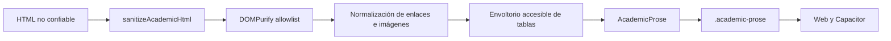

# Diseño técnico: contenido académico seguro

## Context

La aplicación mezcla Server Components y Client Components y el shell Android carga el mismo portal remoto. El sanitizador debe producir el mismo HTML seguro durante prerenderizado Node y durante previsualizaciones futuras en navegador, sin depender de una API ni duplicar políticas.



## Goals / Non-Goals

**Goals**

- Un solo límite sanitizador para SSR y cliente.
- Allowlist semántica explícita y protocolos acotados.
- Eliminación total de estilos de origen para heredar el diseño CEOUBB.
- Tablas utilizables con mouse, tacto y teclado en pantallas estrechas.

**Non-goals**

- Persistencia, autorización de edición, conversión Markdown/LaTeX y uploads.
- Preservar fidelidad visual exacta de Word o Moodle; se preserva estructura y contenido, no su tema.

## Decisions

### D1. `isomorphic-dompurify@3.0.0`

La rama `3.0.0` admite Node `^22.12.0`, compatible con `engines >=22.13.0`, y ofrece exports diferenciados para Node y navegador. La versión más reciente exige Node 22.22.2 y ampliaría el contrato de runtime sin necesidad funcional.

### D2. Allowlist y atributos por elemento

DOMPurify elimina primero cualquier elemento o atributo fuera de la lista. Una segunda pasada sobre el `DocumentFragment` conserva únicamente atributos semánticos válidos para cada etiqueta. `style`, `class`, `id`, `srcset`, atributos `on*`, custom elements y etiquetas ejecutables no sobreviven.

### D3. URLs fail-closed

Los enlaces admiten HTTP(S), fragmentos y rutas relativas. Los absolutos externos se abren en una pestaña aislada con `noopener noreferrer`. Las imágenes admiten solamente HTTPS o rutas relativas a CEOUBB, sin credenciales; `javascript:`, `data:`, `blob:`, `file:` y fuentes HTTP remotas se eliminan.

### D4. Contenedor como único sink

`AcademicProse` recibe HTML no confiable, invoca `sanitizeAcademicHtml` durante el render y entrega exclusivamente el resultado saneado a `dangerouslySetInnerHTML`. No acepta HTML preconfiable ni ofrece una ruta para omitir la sanitización.

### D5. Tablas con región desplazable

La pasada DOM envuelve cada tabla en un `div.academic-table-scroll` constante, enfocable y etiquetado. El CSS mantiene la tabla semántica y aplica el overflow al envoltorio, evitando que toda la publicación desborde.

### D6. Límite previo al parseo

`MAX_ACADEMIC_HTML_LENGTH` fija 100.000 caracteres antes de invocar JSDOM/DOMPurify. La carga sintética SSR midió 29,5 kB en 181 ms, 118 kB en 2,4 s y 295 kB en 36,7 s; aceptar entradas ilimitadas convertiría el sanitizador en un vector de agotamiento de CPU. El dominio lanza `AcademicContentTooLargeError` y `AcademicProse` lo transforma en un mensaje estático seguro que pide dividir el material.

## Contract

```ts
export type SanitizedAcademicHtml = string & {
  readonly __sanitizedAcademicHtml: unique symbol;
};

export const MAX_ACADEMIC_HTML_LENGTH = 100_000;
export class AcademicContentTooLargeError extends RangeError {}
export function sanitizeAcademicHtml(input: string): SanitizedAcademicHtml;

export type AcademicProseProps = {
  html: string;
  className?: string;
};
```

## Error Taxonomy

| Condición                          | Tratamiento                           | Resultado visible                                  | Reintento     |
| :--------------------------------- | :------------------------------------ | :------------------------------------------------- | :------------ |
| Elemento/atributo prohibido        | Eliminar sin ejecutar                 | Se conserva contenido textual seguro cuando aplica | No            |
| URL de enlace insegura             | Quitar `href`, `target` y `rel`       | Texto del enlace permanece                         | Tras corregir |
| Fuente de imagen insegura          | Eliminar el elemento `img`            | No se solicita el recurso                          | Tras corregir |
| HTML vacío o nulo normalizado      | Producir cadena vacía                 | Contenedor vacío estable                           | No            |
| Entrada mayor a 100.000 caracteres | Lanzar `AcademicContentTooLargeError` | Pedir dividir el material en publicaciones menores | Tras dividir  |

## Security and Performance Budgets

- El sanitizador MUST recorrer el fragmento una cantidad acotada de veces y SHALL NOT ejecutar solicitudes de red.
- El sanitizador MUST rechazar entradas mayores a 100.000 caracteres antes de construir el árbol DOM.
- Toda mutación pos-sanitización MUST usar nombres y valores constantes controlados por la aplicación.
- La salida MUST ser idempotente para permitir saneamiento tanto al guardar como al renderizar sin anidar envoltorios.
- No se admiten `style`, custom elements, SVG, MathML, formularios, multimedia activa, iframes ni atributos de evento.

## Affected Invariants

- **Identidad y matrícula:** no se modifican `roleForEmail`, reglas ni proyecciones.
- **Datos académicos:** no se modifica Turso ni Firestore.
- **Notas:** `lib/grades.ts` permanece intacto.
- **Biblioteca/móvil:** no se duplican assets; el portal remoto comparte la misma salida con Capacitor.
- **Diseño:** `.academic-prose` consume `--font-core`, `--font-display`, `--font-mono`, superficies, tinta, hairlines y azul UBB del sistema vigente.

## TDD Triangulation

- **RED:** una suite nueva exigirá ausencia de scripts/eventos/protocolos, limpieza Word/Moodle, refuerzo de enlaces, envoltorios de tabla e idempotencia antes de existir el módulo.
- **GREEN:** la primera ejecución reveló que la prueba Word rechazaba toda clase aunque REQ-PROSE-06 exige `academic-table-scroll`; se corrigió la aserción para aceptar únicamente esa clase constante. TypeScript detectó además flags `s` redundantes incompatibles con el target ES2017; se retiraron sin cambiar los patrones. Ambos ajustes se documentaron y congelaron antes de continuar con la mínima allowlist DOM, el componente y el CSS.
- **REFACTOR:** se consolidarán mapas de atributos y validadores de URL sin alterar el snapshot de pruebas.

## Rollback

Revertir el módulo, componente, CSS y dependencia no requiere migración: este cambio no persiste contenido ni modifica datos existentes.
