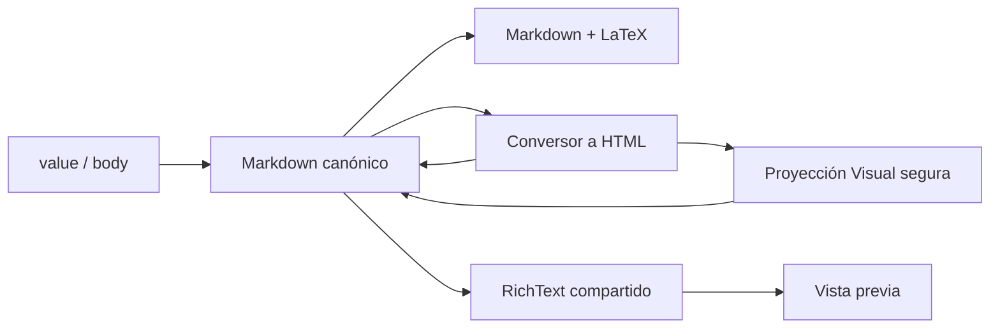

# Diseño: editor académico multimodal

## Estado

APROBADA

## Dirección de interfaz

La pieza se diseña como una mesa de redacción académica: pestañas planas con indicador azul, una barra compacta de herramientas sobre papel blanco y una prueba de lectura separada por un filete. La jerarquía es deliberadamente sobria, densa y familiar para un docente; no introduce otra paleta ni un lenguaje visual ajeno al portal.

## Arquitectura



## Decisiones

### D1. Un solo contrato persistido

`RichPostEditor` conserva las props `name`, `value`, `onChange` y `required`. El valor emitido sigue siendo un string Markdown y el formulario lo publica con el mismo nombre `body`. No se añade una columna, un campo Firestore ni una migración.

### D2. Conversión semántica y HTML libre

La conversión cubre negrita, cursiva, enlaces, títulos, párrafos, listas, citas, código y fórmulas. Las estructuras que Markdown no expresa sin pérdida —tablas, subrayado, alineación y marcado desconocido— se conservan como HTML crudo dentro de la fuente Markdown. Esto permite volver al modo HTML sin eliminar contenido arbitrario.

### D3. Visual seguro por construcción

La pestaña Visual no inserta la cadena HTML del docente directamente en React. Un `DOMParser` inerte alimenta un clon por lista permitida construido con `createElement` y `textContent`; scripts, iframes, handlers y protocolos ejecutables no llegan al `contenteditable`. La fuente HTML continúa disponible en su pestaña y el renderer publicado permanece como frontera definitiva de seguridad.

### D4. Edición visual nativa y acotada

El navegador aplica comandos de edición ampliamente interoperables para negrita, cursiva, subrayado y alineación. Tabla, fórmula, código y callout se insertan mediante `Selection`/`Range` como nodos creados por la aplicación. Cada entrada vuelve inmediatamente al Markdown canónico y respeta el límite de 40.000 caracteres.

### D5. Accesibilidad operable

Las pestañas implementan selección automática con flechas, Inicio y Fin. La toolbar implementa foco itinerante y las mismas teclas. Los botones tienen nombres visibles o programáticos, estados `aria-pressed`, objetivos de 44 px y foco de alto contraste. `Ctrl/Cmd+B`, `Ctrl/Cmd+I` y `Ctrl/Cmd+K` funcionan dentro del lienzo Visual y del área Markdown.

## Contratos

```ts
type EditorMode = "visual" | "markdown" | "html";

type MultimodalEditorProps = {
  label?: string;
  name: string;
  onChange: (value: string) => void;
  required?: boolean;
  value: string;
};
```

## Seguridad y escala

| Riesgo                        | Control                                                                   |
| :---------------------------- | :------------------------------------------------------------------------ |
| HTML ejecutable en Visual     | Parseo inerte, clon allowlist y URL allowlist                             |
| XSS publicado                 | El preview/feed siguen usando `RichText`, que emite nodos React escapados |
| Trabajo excesivo              | Entrada limitada a 40.000 caracteres; conversiones O(n), sin consultas    |
| Pérdida al cambiar de pestaña | Fuente canónica única y passthrough de HTML no representable              |
| Regresión móvil               | Mismo componente web remoto; layout de una columna por defecto            |

## Invariantes preservadas

- Política de roles y proyección de inscripciones: sin cambios.
- Identidad de sección y consultas acotadas: sin cambios ni consultas nuevas.
- Biblioteca única y seam Capacitor: sin archivos nativos ni copias.
- Estado no oficial y badges: sin cambios.

## TDD

- RED: la nueva suite exige conversiones, tres pestañas, toolbar, atajos y patrones ARIA que el textarea actual no ofrece.
- GREEN: se implementan el conversor puro y el componente mínimo integrado a `RichPostEditor`.
- REFACTOR: se centralizan descriptores de modos/herramientas y estilos responsivos manteniendo la suite verde.
