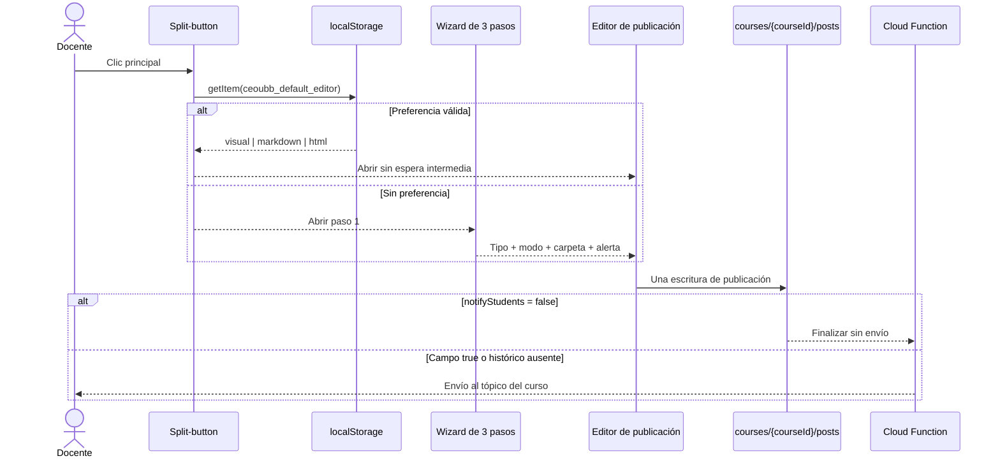

## Context

`MaterialsSection` contiene hoy un formulario de publicación siempre visible y delega una única escritura en `publishClassroomPost`. La notificación se dispara después mediante `notifyStudentsOnCoursePost`. CEO-60 debe reducir la fricción sin agregar lecturas ni duplicar el editor de CEO-59.

## Goals / Non-Goals

**Goals**

- Ruta principal instantánea, sin `await`, import dinámico ni lectura remota antes de abrir el editor.
- Tres pasos claros, reversibles y navegables por teclado.
- Preferencia local validada y recuperable ante excepciones del navegador.
- Publicación silenciosa real, retrocompatible con posts existentes.
- Paridad responsive entre navegador y WebView Capacitor.

**Non-Goals**

- Implementar las superficies Visual, Markdown y HTML de CEO-59.
- Crear preferencias de cuenta sincronizadas entre dispositivos.
- Agregar una cola propia de notificaciones o consultas por estudiante.

## Decisions

### D1. Contrato puro y almacenamiento síncrono

`lib/publication-workflow.ts` define los tres valores admitidos y encapsula lectura, escritura y eliminación. El manejador principal consulta `window.localStorage` en el mismo evento de clic y actualiza estado inmediatamente. Un valor desconocido o una excepción se trata como ausencia de preferencia.

### D2. Dos diálogos con responsabilidades separadas

El wizard recopila decisiones; el editor recopila el contenido. El cierre del wizard monta el editor con un borrador tipado. Separar ambos diálogos evita estados híbridos y permite que CEO-59 reemplace únicamente la superficie del editor.

### D3. Menú de cambio con persistencia inmediata

Cada modo del menú actúa como elección explícita: se guarda como preferencia y abre el editor. La entrada `Abrir asistente` conserva el recorrido completo para cambiar tipo, destino y alertas.

### D4. Booleano retrocompatible para alertas

Las publicaciones nuevas escriben `notifyStudents`. La Function retorna antes de FCM sólo cuando el valor es exactamente `false`; `true` y la ausencia histórica mantienen el comportamiento existente. Esto no requiere migración ni consulta adicional.

### D5. Interfaz académica sobria

El split-button usa azul UBB exclusivamente como CTA. Los pasos se presentan sobre papel blanco con hairlines, los tipos usan iconos Phosphor y los diálogos no incorporan animación nueva. En móvil, los diálogos ocupan el ancho disponible y conservan objetivos de al menos 44 px.

## Error Taxonomy

| Caso                     | Respuesta                                              | Recuperación                              |
| :----------------------- | :----------------------------------------------------- | :---------------------------------------- |
| `localStorage` bloqueado | Tratar como sin preferencia y abrir wizard             | El docente continúa sin persistencia      |
| Valor local inválido     | Ignorar y abrir wizard                                 | Una elección posterior reemplaza el valor |
| Publicación rechazada    | Conservar editor y contenido; mostrar estado existente | Reintento manual                          |
| Notificación silenciosa  | Guardar post y terminar Function sin FCM               | No requiere reintento                     |

## TDD Triangulation

- **RED:** `tests/publication-workflow.test.ts` se registró antes del código. La ejecución dirigida falló con `ERR_MODULE_NOT_FOUND` para `lib/publication-workflow.ts`, antes de que existieran el contrato o los componentes, y luego quedó fijada en el snapshot SHA-256 de 25 archivos.
- **GREEN:** se añade el contrato mínimo, los dos diálogos, la integración del formulario y el guard de Function hasta aprobar los escenarios bloqueados.
- **REFACTOR:** se extraen decisiones puras del componente, se reutiliza `RichPostEditor` y se conserva una sola ruta de persistencia.

El primer GREEN reveló dos aserciones de composición que no representaban el contrato: buscaban un signo `+` textual aunque la interfaz usa el icono Phosphor `Plus` oculto al árbol accesible, y exigían construir `notifyStudents` dentro del objeto aunque la implementación lo deriva antes para reutilizarlo en el mensaje de estado. Se corrigieron para exigir icono más rótulo y derivación más escritura, sin retirar escenarios ni reducir cobertura, y se regeneró el snapshot antes de continuar.

## Risks / Trade-offs

- La preferencia es por dispositivo y origen, no por cuenta; es deliberado para mantener la apertura síncrona y cero infraestructura.
- CEO-59 aún está en estado `Todo`; por eso este cambio transporta el modo elegido hasta el editor actual, pero no simula capacidades multimodales que todavía no existen.
- La opción silenciosa necesita desplegar la Function actualizada después del merge para evitar que producción siga notificando todos los posts.

## Rollback

Revertir el launcher restaura el formulario permanente. El campo `notifyStudents` es aditivo y puede permanecer; una Function anterior lo ignora. No hay migraciones ni datos locales compartidos que limpiar.

## Blast Radius

| Área         | Archivos                                                                                                                                                   |
| :----------- | :--------------------------------------------------------------------------------------------------------------------------------------------------------- |
| Contrato     | `lib/publication-workflow.ts`                                                                                                                              |
| Interfaz     | `PublicationLauncher.tsx`, `PublicationWizardDialog.tsx`, `PublicationComposerDialog.tsx`, `MaterialsSection.tsx`, `RichPostEditor.tsx`, `app/globals.css` |
| Persistencia | `use-classroom-handlers.ts`, `lib/firebase/posts.ts`, `firebase/functions/index.js`                                                                        |
| Verificación | `tests/publication-workflow.test.ts`, `package.json`, `.agents/.test-hashes.json`                                                                          |
| Handoff      | `PLAN.md`, `docs/specs/p15-publication-wizard.md`                                                                                                          |
