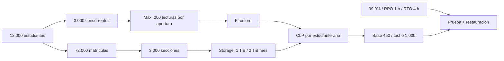

## Context

La arquitectura divide estructura académica en Turso y actividad en Firestore/Storage. El costo variable no depende sólo de usuarios: las escuchas por sección controlan lecturas y las descargas de archivos dominan el egreso. La línea base debe conservar esa relación y distinguir objetivo, estimación y evidencia medida.

## Decisions

### D1. Población de 12.000 con holgura de identidad

El anuario UBB 2022 informa 11.112 estudiantes de pregrado diurno. Se redondea a 12.000 estudiantes activos y 15.000 identidades para incluir personal y crecimiento, sin convertir la cifra histórica en una matrícula vigente.

### D2. Secciones derivadas de matrículas

Seis secciones por estudiante producen 72.000 matrículas. Un promedio conservador de 30 estudiantes produce 2.400 secciones; 25% de holgura fija el objetivo de 3.000. Un extracto futuro de DARCA puede refinar la distribución, pero no reducir la envolvente sin evidencia.

### D3. Costo sostenible sin créditos promocionales

El modelo ignora prueba gratuita y promociones, usa CLP 1.000/USD y agrega 25% de contingencia. El caso base es CLP 450 por estudiante-año y el techo de expansión es CLP 1.000. El costo total institucional permanece fuera hasta que existan acuerdos de soporte y migración.

### D4. Objetivo de producto, no suma de SLA

CEOUBB adopta 99,9% mensual porque el producto combina proveedores y los planes actuales no ofrecen un SLA contractual común. El error presupuestado es 43 min 12 s en 30 días. RPO de una hora y RTO de cuatro horas deben demostrarse en staging.

## Risks / Trade-offs

- La cifra de secciones es una hipótesis de diseño porque no hay extracto vigente de DARCA.
- Cloud Storage domina el costo y puede superar el techo si descargas o cuotas personales crecen.
- La arquitectura actual todavía contiene lecturas de aula sin paginación; el presupuesto de 200 aplica al portal inicial y no absuelve esa deuda.
- Vercel Pro y Turso Scaler no entregan por sí solos el SLA institucional; un contrato Enterprise cambiaría el costo unitario.

## Rollback

Revertir esta documentación restaura los campos P0.7 sin definir. No hay datos, recursos ni comportamiento de producción que revertir.

## Blast Radius

| Área             | Archivos                                          |
| :--------------- | :------------------------------------------------ |
| Línea base       | `docs/operations/capacity-cost-baseline.md`       |
| Seguridad piloto | `docs/specs/p0-pilot-safety.md`                   |
| Dossier          | `docs/institutional/moodle-adecca-comparison.md`  |
| Contrato vivo    | `openspec/specs/operations/capacity-cost/spec.md` |
| Handoff          | `PLAN.md`, `docs/archive/PLAN_ARCHIVE.md`         |
