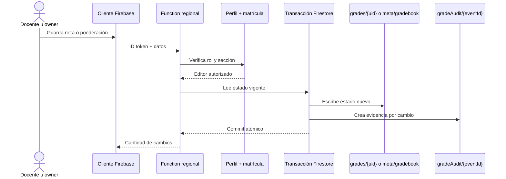

## Context

El cliente escribe hoy directamente la fila completa de un estudiante y el documento `meta/gradebook`. Esa arquitectura no puede demostrar que la bitácora se escribió: un cliente antiguo o modificado puede omitir cualquier segunda escritura. Las bibliotecas de servidor omiten las reglas de Firestore, por lo que la autorización debe repetirse dentro de la Function antes de usar credenciales administrativas.



## Goals / Non-Goals

**Goals**

- Imposibilitar desde la aplicación una nota nueva sin su evidencia correspondiente.
- Tomar identidad y tiempo desde infraestructura confiable, no desde el payload.
- Evitar entradas duplicadas cuando el valor no cambia.
- Mantener acotadas las operaciones para secciones de escala universitaria.

**Non-Goals**

- Interfaz de consulta, exportación institucional y firma avanzada.
- Reconstrucción del pasado o sincronización con actas UBB.
- Borrado administrativo de auditoría.

## Data Contracts

### Score audit document

```typescript
type GradeScoreAudit = {
  targetType: "score";
  courseId: string;
  studentId: string;
  gradeItemId: string;
  previousValue: number | null;
  newValue: number | null;
  actorUid: string;
  actorEmail: string;
  actorName: string;
  changedAt: FirebaseFirestore.FieldValue;
};
```

### Gradebook audit document

```typescript
type GradebookAudit = {
  targetType: "gradebook";
  courseId: string;
  studentId: null;
  previousValue: { items: GradeItem[]; exemption: number | null } | null;
  newValue: { items: GradeItem[]; exemption: number | null };
  actorUid: string;
  actorEmail: string;
  actorName: string;
  changedAt: FirebaseFirestore.FieldValue;
};
```

## Decisions

### D1. Callable Functions en vez de doble escritura cliente

Las mutaciones `saveAuditedStudentScores` y `saveAuditedGradebook` reciben automáticamente el ID token y operan con Admin SDK. Las reglas pasan a `allow write: if false` para `grades/{uid}` y excluyen `meta/gradebook` de la escritura directa. Así ningún cliente soportado o modificado puede saltarse la auditoría.

### D2. Una transacción por fila de estudiante

Cada transacción lee una fila, calcula diferencias, reemplaza la fila y crea una entrada por calificación cambiada. Firestore reintenta la función transaccional ante contención y publica todos los documentos o ninguno. Diez transacciones paralelas evitan una ráfaga sin convertir 300 estudiantes en 300 rondas estrictamente secuenciales.

### D3. Identidad y reloj confiables

`actorUid`, `actorEmail` y `actorName` provienen exclusivamente de `request.auth`; `changedAt` usa `FieldValue.serverTimestamp()`. El payload no admite campos de autor ni tiempo.

### D4. Lectura aislada y mutación denegada

`gradeAudit` permite leer a `owner`, al docente matriculado y al estudiante sólo cuando `targetType == "score"` y `studentId == request.auth.uid`. Toda escritura cliente se deniega. El índice compuesto `studentId ASC, changedAt DESC` prepara la consulta acotada del estudiante.

## Error Taxonomy

| Condición                                      | Código callable            | Reintento                        |
| :--------------------------------------------- | :------------------------- | :------------------------------- |
| Sesión ausente o correo no verificado          | `unauthenticated`          | Tras iniciar sesión              |
| Rol o matrícula insuficiente                   | `permission-denied`        | No                               |
| Sección, UID, evaluación, nota o lote inválido | `invalid-argument`         | Tras corregir datos              |
| Falla transitoria de Firestore                 | `unavailable` o `internal` | Sí, con nueva acción del usuario |

## Security and Performance Budgets

- Máximo 100 filas y 100 evaluaciones por fila en una invocación.
- Máximo diez transacciones de estudiante concurrentes.
- Identificadores limitados a caracteres seguros y 128 caracteres; `courseId` conserva el contrato de 2 a 61 caracteres.
- Ningún `collectionGroup`, barrido global ni duplicación por estudiante adicional a la evidencia del cambio.
- El historial es append-only; no existe ruta callable de actualización o borrado.

## Affected Invariants

- **Grade math seam:** la Function sólo valida y persiste la escala 1,0–7,0; no calcula promedios ni ponderaciones.
- **Role policy:** no deriva dominios; confía en `users/{uid}.role`, correo verificado y matrícula proyectada.
- **Section identity:** toda ruta usa `courseId` como identificador de sección canónica.
- **Privacy:** actor y notas son datos académicos ya inventariados por `/privacidad`; la dirección IP no se agrega.
- **Non-official status:** el cambio no altera descargos ni presenta las notas como acta UBB.

## TDD Triangulation

- **RED:** `tests/grade-audit.test.ts` falló con `MODULE_NOT_FOUND` para `firebase/functions/grade-audit.js`; 29 archivos quedaron sellados antes de crear código productivo.
- **GREEN:** el módulo puro, las dos callables, el cliente regional, las reglas y el índice aprobaron los nueve escenarios nuevos sin cambiar aserciones.
- **REFACTOR:** el gate de formato detectó únicamente saltos y sangría mecánicos en la suite nueva y tres archivos productivos. Prettier reescribió esos espacios sin alterar aserciones. La suite integral detectó además una aserción histórica que exigía la escritura directa ahora prohibida; se sustituyó por las garantías más estrictas de denegación para `grades`, `meta/gradebook` y `gradeAudit`. Ambos ajustes se sellaron de inmediato y no relajaron cobertura.

## Rollback

Revertir cliente, Functions y reglas de forma coordinada devuelve la escritura directa anterior y conserva los documentos `gradeAudit` como evidencia de sólo lectura. Nunca se deben borrar las entradas creadas durante un rollback.

## Blast Radius

| Área         | Archivos                                                                                                  |
| :----------- | :-------------------------------------------------------------------------------------------------------- |
| Contrato     | `openspec/specs/grades/spec.md`, `docs/specs/p17-immutable-grade-audit-trail.md`                          |
| Functions    | `firebase/functions/grade-audit.js`, `firebase/functions/index.js`, `firebase/functions/package.json`     |
| Cliente      | `lib/firebase/sdk.ts`, `lib/firebase/grades.ts`                                                           |
| Seguridad    | `firebase/firestore.rules`, `firebase/firestore.indexes.json`                                             |
| Verificación | `tests/grade-audit.test.ts`, `tests/native-services.test.ts`, `package.json`, `.agents/.test-hashes.json` |
| Handoff      | `PLAN.md`, `docs/archive/PLAN_ARCHIVE.md`                                                                 |
