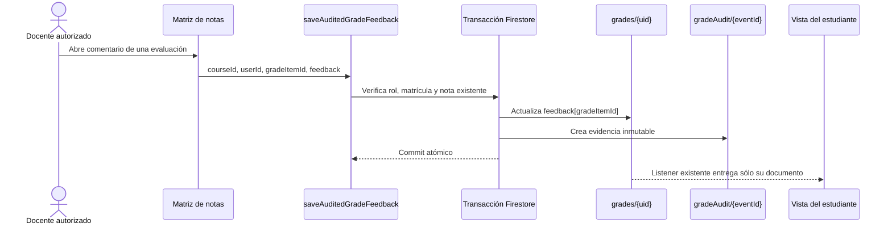

## Context

Cada estudiante ya dispone de un documento `courses/{courseId}/grades/{uid}` leído por el listener vigente del aula. Las escrituras oficiales pasan por Callable Functions y `gradeAudit` conserva evidencia inmutable. Separar el comentario en otra colección duplicaría lecturas y superficies de autorización; incorporarlo como mapa en el documento existente mantiene la privacidad y la escala actuales.



## Goals / Non-Goals

**Goals**

- Asociar texto plano privado a una nota oficial concreta.
- Evitar que clientes modificados escriban feedback sin autorización o sin auditoría.
- Preservar saltos de línea y retirar el comentario mediante un valor vacío.
- Mantener el costo de lectura exactamente igual al actual.

**Non-Goals**

- Conversaciones, menciones, formatos enriquecidos, archivos o rúbricas.
- Comentarios compartidos entre estudiantes.
- Historial visible en esta entrega; la evidencia queda disponible para una vista posterior.

## Data Contracts

### Grade document extension

```typescript
type GradeFeedback = Record<string, string>;

type StudentGradeDocument = {
  uid: string;
  courseId: string;
  scores: GradeScores;
  feedback?: GradeFeedback;
  updatedBy: string;
  updatedAt: FirebaseFirestore.FieldValue;
};
```

### Callable request

```typescript
type SaveGradeFeedbackRequest = {
  courseId: string;
  userId: string;
  gradeItemId: string;
  feedback: string;
};
```

### Feedback audit document

```typescript
type GradeFeedbackAudit = {
  targetType: "feedback";
  courseId: string;
  studentId: string;
  gradeItemId: string;
  previousValue: string | null;
  newValue: string | null;
  actorUid: string;
  actorEmail: string;
  actorName: string;
  changedAt: FirebaseFirestore.FieldValue;
};
```

## Decisions

### D1. Mapa en el documento de notas existente

`feedback[gradeItemId]` comparte el documento y el listener de `scores`. El peor caso admitido —100 evaluaciones por 2.000 caracteres— permanece bajo el límite de 1 MiB de Firestore y no añade fan-out de lectura.

### D2. Callable dedicada y parche transaccional

`saveAuditedGradeFeedback` modifica un único comentario con `merge: true`; no reenvía ni reemplaza el mapa completo de notas. La transacción exige que ya exista una calificación válida para la evaluación, evitando retroalimentación huérfana y sobrescrituras por estado obsoleto del cliente.

### D3. Texto plano acotado

El servidor recorta espacio exterior, conserva saltos internos, trata el texto vacío como eliminación y rechaza entradas sobre 2.000 caracteres. React lo renderiza como texto, sin HTML ni un nuevo sink de sanitización.

### D4. Editor único por matriz

Cada celda expone una acción con icono Phosphor y estado visible cuando existe comentario. `TeacherGrades` monta como máximo un diálogo nativo, identificado por estudiante y evaluación; esto evita crear un `textarea` por celda en secciones grandes.

### D5. Trazabilidad sin comentarios fuente nuevos

La preferencia global del mantenedor prohíbe agregar comentarios al código. La trazabilidad se expresa mediante `GRADE_FEEDBACK_REQUIREMENTS`, nombres de pruebas `REQ-FEEDBACK-*` y atributos `data-requirement` en la interfaz, conservando los comentarios existentes sin introducir otros.

## Error Taxonomy

| Condición                                  | Código callable            | Mensaje de interfaz             | Reintento            |
| :----------------------------------------- | :------------------------- | :------------------------------ | :------------------- |
| Sesión ausente o no verificada             | `unauthenticated`          | La sesión expiró                | Tras ingresar        |
| Rol o matrícula insuficiente               | `permission-denied`        | Sin permisos para editar        | No                   |
| Estudiante o nota inexistente              | `failed-precondition`      | Guarda primero una nota oficial | Tras corregir estado |
| Texto sobre 2.000 caracteres o ID inválido | `invalid-argument`         | Corrige la retroalimentación    | Tras editar          |
| Falla transitoria                          | `internal` / `unavailable` | No fue posible guardar          | Sí                   |

## Security and Performance Budgets

- Máximo 2.000 caracteres y 100 claves de retroalimentación almacenadas por documento.
- Autorización idéntica a la edición auditada de notas: `owner` o docente con matrícula activa en la sección.
- El estudiante sólo lee `grades/{request.auth.uid}` y auditorías con su propio `studentId`.
- Toda escritura cliente a `grades` y `gradeAudit` permanece en `allow write: if false`.
- Cero consultas, listeners, índices o documentos de lectura adicionales.
- Un único diálogo y ningún `textarea` persistente por celda de la matriz.

## Affected Invariants

- **Grade math seam:** `lib/grades.ts` conserva intactas la escala 1,0–7,0 y la aritmética; el nuevo mapa sólo normaliza texto.
- **Role policy:** la Function reutiliza perfiles y matrículas proyectadas; no deriva dominios ni acepta roles del payload.
- **Section isolation:** toda lectura y mutación conserva `courseId` como sección canónica.
- **Privacy:** otros estudiantes no pueden leer el documento ni la auditoría del dueño.
- **Mobile seam:** Capacitor consume la misma vista remota; no se agrega implementación nativa paralela.
- **Non-official status:** no se alteran descargos ni se presenta la nota como acta oficial UBB.

## TDD Triangulation

- **RED:** `tests/grade-feedback.test.ts` falló con `SyntaxError` porque `lib/grades.ts` todavía no exportaba `GRADE_FEEDBACK_REQUIREMENTS`; los 32 archivos de prueba quedaron sellados antes de crear código productivo.
- **GREEN:** el contrato de texto, la Callable transaccional, la proyección sobre los listeners existentes y ambas vistas aprobaron 7/7 escenarios nuevos con el snapshot sellado.
- **REFACTOR:** Prettier ajustó únicamente formato mecánico y el hash de la suite se renovó sin cambiar aserciones; `verify:fast` aprobó 255/255, el build y la suite integral 280/280, y React Doctor no encontró problemas en los nueve archivos cambiados que analizó.

## Rollback

Revertir Function, cliente y vista deja el campo `feedback` y sus auditorías como datos ignorados de sólo lectura. No se deben borrar evidencias creadas. Las reglas pueden volver a restringir el historial estudiantil a `targetType == 'score'` sólo si la interfaz ya no expone historial de feedback.

## Blast Radius

| Área              | Archivos                                                                                               |
| :---------------- | :----------------------------------------------------------------------------------------------------- |
| Contrato          | `openspec/changes/add-private-grade-feedback/`, `openspec/specs/grades/spec.md`                        |
| Dominio y cliente | `lib/grades.ts`, `lib/firebase/grades.ts`, `lib/firebase/posts.ts`, `lib/firebase-classroom-client.ts` |
| Functions         | `firebase/functions/grade-audit.js`, `firebase/functions/index.js`                                     |
| Seguridad         | `firebase/firestore.rules`                                                                             |
| UI                | `app/views/classroom/GradesSection.tsx`, `app/views/classroom/classroom-utils.ts`, `app/globals.css`   |
| Verificación      | `tests/grade-feedback.test.ts`, `package.json`, `.agents/.test-hashes.json`                            |
| Handoff           | `PLAN.md`, `docs/archive/PLAN_ARCHIVE.md`                                                              |
