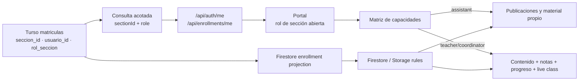

## Context

Turso ya guarda `matriculas.rol_seccion` con `teacher`, `student`, `assistant` y `coordinator`, y `enrollment-projection.ts` ya copia ese valor a `enrollments/{uid}/sections/{seccionId}.role`. La brecha está después de esa proyección: los endpoints reducen la matrícula a una lista de IDs, el portal deriva `canTeach` del rol global y las reglas no consultan el campo `role` de la sección.



## Goals / Non-Goals

**Goals**

- Una sola matriz pura de capacidades para la interfaz.
- Paridad exacta en reglas con mínimo privilegio.
- Falla cerrada cuando la sesión no trae un rol reconocido.
- Compatibilidad de respuesta mediante `sectionIds` durante la transición.

**Non-Goals**

- Gestión de nómina, invitaciones o selector docente para promover ayudantes.
- Acceso de ayudantes a datos de evaluación o coordinación sin una especificación posterior.
- Cambios de esquema o dependencia.

## Contracts

```ts
export const SECTION_ROLES = ["teacher", "student", "assistant", "coordinator"] as const;
export type SectionRole = (typeof SECTION_ROLES)[number];
export type SectionMembership = { sectionId: string; role: SectionRole };

export function canManageSectionContent(
  accountRole: "owner" | "teacher" | "student",
  sectionRole: SectionRole | null
): boolean;

export function canTeachSection(
  accountRole: "owner" | "teacher" | "student",
  sectionRole: SectionRole | null
): boolean;
```

Los endpoints devuelven `{ user, sectionIds, memberships }` o `{ sectionIds, memberships }`. `sectionIds` se conserva para consumidores antiguos; ambos campos se construyen desde la misma consulta acotada.

## Authorization Matrix

| Actor contextual                 | Publicar/subir | Editar/borrar propio | Notas y progreso agregado | Clase en vivo |
| :------------------------------- | :------------: | :------------------: | :-----------------------: | :-----------: |
| `owner`                          |       Sí       | Sí, cualquier autor  |            Sí             |      Sí       |
| `teacher` / `coordinator` activo |       Sí       |      Sí, propio      |            Sí             |      Sí       |
| `assistant` activo               |       Sí       |      Sí, propio      |            No             |      No       |
| `student` activo o rol inválido  |       No       |          No          |            No             |      No       |

## Rule Design

- `sectionRole(seccionId)` lee el documento de matrícula sólo si existe.
- `teachesSection(seccionId)` conserva el nombre para compatibilidad y exige `teacher/coordinator` más identidad docente institucional; `owner` permanece global.
- `assistsSection(seccionId)` exige identidad miembro, matrícula activa y rol `assistant`.
- `managesSectionContent(seccionId)` une ambos caminos.
- `posts` y la ruta de material en Storage usan `managesSectionContent`; `meta`, `grades`, progreso agregado y entregas docentes siguen usando `teachesSection`.
- Actualizar y borrar publicaciones o archivos conserva la comprobación de autor/UID existente.

## Error Taxonomy

| Condición                            | Resultado                            | Reintento              |
| :----------------------------------- | :----------------------------------- | :--------------------- |
| Sesión ausente                       | HTTP 401                             | Tras iniciar sesión    |
| Consulta Turso falla                 | Lista de membresías vacía            | Automático al recargar |
| Rol o sección malformados en cliente | Entrada descartada                   | No                     |
| Ayudante intenta capacidad docente   | `permission-denied` / control oculto | No                     |
| Ayudante altera contenido ajeno      | `permission-denied`                  | No                     |

## Performance and Scale Budget

- Máximo 100 matrículas activas transportadas por sesión, con `.limit()` y orden por índice.
- Cero listeners adicionales; el aula conserva los listeners de la sección abierta.
- Cero escrituras por estudiante y cero consultas `collectionGroup`.
- La lectura de reglas reutiliza el mismo documento de matrícula requerido por el aislamiento de sección.

## Affected Invariants

- `roleForEmail` sigue siendo la SSOT de autenticación global y no incorpora `assistant`.
- Turso continúa como SoR y Firestore como proyección unidireccional.
- Toda lectura/escritura sigue exigiendo matrícula activa o `owner`.
- El ayudante nunca obtiene acceso a calificaciones de terceros, preservando el límite de datos académicos.

## TDD Triangulation

- **RED:** una suite nueva fijará la matriz, el parseo cerrado, el transporte API y la separación de reglas/UI antes de modificar negocio.
- **GREEN:** se añadirá el contrato puro y se propagará el rol con el mínimo cambio necesario hasta que la suite pase.
- **REFACTOR:** se eliminará el estado duplicado de IDs cuando pueda derivarse de las mismas membresías y se verificará que ningún permiso siga dependiendo sólo del rol global.

## Blast Radius

| Área         | Archivos                                                                                                                 |
| :----------- | :----------------------------------------------------------------------------------------------------------------------- |
| Contrato     | `lib/section-roles.ts`                                                                                                   |
| Datos/API    | `lib/services/academic-catalog.ts`, `app/api/auth/me/route.ts`, `app/api/enrollments/me/route.ts`, `lib/portal-utils.ts` |
| Portal/aula  | `app/Portal.tsx`, `app/portal-shell.tsx`, `app/views/classroom/*`                                                        |
| Autorización | `firebase/firestore.rules`, `firebase/storage.rules`                                                                     |
| Verificación | `tests/assistant-role.test.ts`, `package.json`, `.agents/.test-hashes.json`                                              |
| Handoff      | `PLAN.md`, `openspec/specs/academic/spec.md` tras archivo                                                                |

## Rollback

Revertir el código y las reglas devuelve la autorización anterior. No existe migración ni escritura masiva; las matrículas `assistant` permanecen como datos válidos pero vuelven a comportarse como estudiantes sin capacidad de carga.
