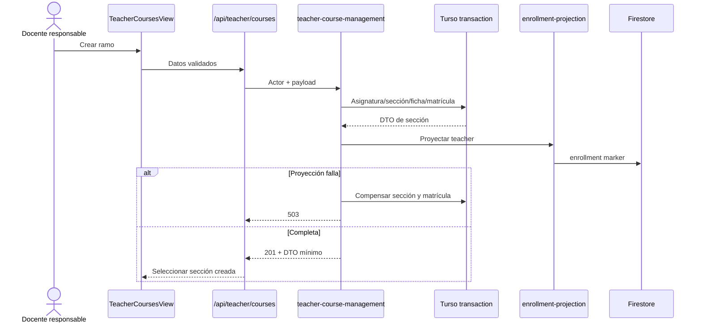

## Context

Turso ya contiene la jerarquía académica y `matriculas.rol_seccion` admite `assistant`; Firestore ya consume la proyección mínima de esa matrícula y conserva `meta/gradebook`. Falta el Data Access Layer que autorice por `secciones.docente_id`, preserve atomicidad local y devuelva DTO mínimos al cliente.



## Goals / Non-Goals

**Goals**

- Cero intervención del mantenedor para crear y configurar una sección sobre catálogos existentes.
- Autorización por recurso en cada mutación, no por datos enviados por el cliente.
- Reversión segura de una ayudantía sin conservar acceso accidental.
- Composición coherente con el portal y usable en Web/Capacitor.

**Non-Goals**

- Provisionar toda la oferta académica UBB, integrar DARCA o validar oficialmente códigos de asignatura.
- Transferir a ayudantes potestades de publicación o calificación.
- Convertir el gradebook de Firestore a Turso.

## Decisions

### D1. Ficha 1:1 separada de la identidad académica

`section_profiles` guarda título visible, descripción, modalidad, sala y tono. La asignatura, el período y el número de sección permanecen normalizados e inmutables después del alta. Esto permite presentación docente sin convertir un cambio editorial en una mutación institucional compartida.

### D2. Alta transaccional más compensación de proyección

Asignatura, sección, ficha y matrícula se escriben en una transacción libSQL. La proyección Firestore ocurre después; si falla, una transacción compensatoria elimina la sección recién creada y la asignatura si quedó huérfana. No se devuelve éxito con una sección inaccesible.

### D3. Ayudantía reversible

`assistant_assignments` registra rol y estado anteriores. Al retirar, una matrícula previa se restaura; una matrícula creada exclusivamente para ayudar se retira. La proyección refleja cada transición. Sólo cuentas `student` registradas pueden ser ayudantes en este alcance.

### D4. Gradebook existente, editor compartido

El panel no crea una segunda fuente de evaluaciones. Extrae un `GradebookSettingsEditor`, escucha un único `meta/gradebook` y usa `saveGradebook`; la matriz de notas existente continúa separada en el aula.

### D5. Portal derivado del SoR

`GET /api/courses/me` devuelve únicamente matrículas activas con presentación serializable. El cliente usa esos DTO para navegación y listeners. Un fallo entrega lista vacía; no recupera el catálogo estático porque eso reabriría secciones ajenas en la interfaz.

### D6. Catálogo mínimo idempotente

La migración incluye una facultad, departamento y período general de CEOUBB mediante `INSERT OR IGNORE`. Permite el primer alta autónoma en el piloto; una integración institucional podrá agregar catálogos reales sin modificar el flujo ni duplicar entidades.

## Data Contracts

```ts
type CreateTeacherCourseInput = {
  code: string;
  name: string;
  creditsSct: number;
  departmentId: string;
  periodId: string;
  sectionNumber: number;
  summary: string;
  modality: "presencial" | "hibrida" | "remota";
  room: string;
  tone: "sky" | "emerald" | "gold" | "red" | "teal" | "purple";
};

type ManagedCourse = {
  id: string;
  name: string;
  code: string;
  section: string;
  teacher: string;
  period: string;
  summary: string;
  role: "teacher" | "student" | "assistant" | "coordinator";
  modality: CreateTeacherCourseInput["modality"];
  room: string;
  toneKey: CreateTeacherCourseInput["tone"];
  creditsSct: number;
};
```

## Error Taxonomy

| Error                    | HTTP | Respuesta                             |
| :----------------------- | :--- | :------------------------------------ |
| `INVALID_INPUT`          | 400  | Campo accionable en español           |
| `UNAUTHENTICATED`        | 401  | Sesión no válida                      |
| `FORBIDDEN`              | 403  | Rango o sección ajena                 |
| `NOT_FOUND`              | 404  | Sección/cuenta/catálogo inexistente   |
| `CONFLICT`               | 409  | Paralelo ya creado                    |
| `PROJECTION_UNAVAILABLE` | 503  | Reintento seguro, mutación compensada |
| `INTERNAL`               | 500  | Mensaje genérico sin detalle interno  |

## TDD Triangulation

- **RED:** la suite nueva importará contratos y rutas todavía inexistentes y fallará antes de la implementación.
- **GREEN:** se añadirán esquema, DAL, rutas y UI mínimos hasta cubrir alta, propiedad, validación, ayudantía, catálogo y gradebook.
- **REFACTOR:** se extraerá el editor reutilizable, se consolidarán DTO y manejo de errores, y se revisará el alcance visual sin cambiar aserciones bloqueadas.

## Risks / Trade-offs

- Una proyección remota no comparte transacción con Turso; la compensación reduce el fallo parcial y el endpoint nunca lo presenta como éxito.
- La cuenta ayudante debe haberse registrado previamente. Una invitación diferida requiere modelar onboarding y queda fuera.
- El catálogo general es deuda de piloto documentada; no sustituye la futura provisión institucional.

## Rollback

Revertir la migración no será destructivo en producción: no se ejecuta en este trabajo. Antes de un despliegue real, el rollback operacional elimina sólo `assistant_assignments` y `section_profiles` después de exportar sus filas; las secciones y matrículas canónicas sobreviven.

## Blast Radius

| Área     | Archivos                                                                                                                                                                  |
| :------- | :------------------------------------------------------------------------------------------------------------------------------------------------------------------------ |
| Datos    | `db/schema.ts`, `drizzle/0005_*.sql`, `drizzle/meta/`                                                                                                                     |
| Dominio  | `lib/course-management.ts`, `lib/services/teacher-course-management.ts`                                                                                                   |
| API      | `app/api/courses/me/`, `app/api/teacher/courses/`                                                                                                                         |
| Firebase | `lib/firebase/grades.ts`, `lib/firebase-classroom-client.ts`                                                                                                              |
| UI       | `app/Portal.tsx`, `app/portal-types.ts`, `app/portal-shell.tsx`, `app/views/TeacherCoursesView.tsx`, `app/views/classroom/GradebookSettingsEditor.tsx`, `app/globals.css` |
| Pruebas  | `tests/teacher-course-management.test.ts`, `package.json`, `.agents/.test-hashes.json`                                                                                    |
| Handoff  | `PLAN.md`, `docs/specs/p17-teacher-course-management.md`                                                                                                                  |
