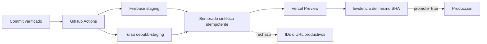

# Diseño técnico

## Topología y secuencia

## Decisiones

### D1. Identidades fijas y aliases sin default

Firebase usa `centro-de-estudio-ubb-staging` y `centro-de-estudio-ubb`; Turso usa una URL cuyo host contiene `ceoubb-staging`. `.firebaserc` sólo expone `staging` y `production`, por lo que una publicación siempre declara el destino.

### D2. Selección de Firebase en build time

El cliente consume `NEXT_PUBLIC_FIREBASE_API_KEY`, `NEXT_PUBLIC_FIREBASE_AUTH_DOMAIN`, `NEXT_PUBLIC_FIREBASE_PROJECT_ID`, `NEXT_PUBLIC_FIREBASE_STORAGE_BUCKET`, `NEXT_PUBLIC_FIREBASE_MESSAGING_SENDER_ID` y `NEXT_PUBLIC_FIREBASE_APP_ID`. La API server-side reutiliza la API key pública. Los valores vigentes quedan como fallback para que producción no cambie hasta configurar su entorno explícitamente.

### D3. Sembrado declarativo e idempotente

`STAGING_FIXTURES` contiene sólo IDs y correos sintéticos reservados con el prefijo `staging-` y el dominio no resoluble `example.invalid`. El script ejecuta migraciones Drizzle, usa UPSERT para Turso y commits REST deterministas para Firestore. Repetirlo converge al mismo conjunto lógico; no genera sesiones, contraseñas ni datos personales.

### D4. Promoción por el mismo SHA

El workflow manual siempre ejecuta verificación, despliegue y sembrado de staging. La tarea de producción depende de ese job y sólo existe con `promote_to_production=true`. El deploy web de `main` recibe el mismo gate para no adelantarse al backend de staging.

## Contrato de datos sintéticos

| Entidad                           |   Cantidad mínima | Identidad determinista                 |
| :-------------------------------- | ----------------: | :------------------------------------- |
| Facultad / departamento / carrera |         1 / 1 / 1 | `staging-*`                            |
| Asignaturas / secciones           |             2 / 2 | `staging-asig-*`, `staging-sec-*`      |
| Docentes / estudiantes            |             1 / 3 | `firebase:staging-*`                   |
| Matrículas activas                |                 8 | docente y tres estudiantes por sección |
| Avisos / evaluaciones             | 2 / 2 por sección | documentos con ID fijo                 |

## Taxonomía de errores

| Código                       | Condición                               | Conducta                              | Reintento          |
| :--------------------------- | :-------------------------------------- | :------------------------------------ | :----------------- |
| `STAGING_ENV_REQUIRED`       | falta `CEOUBB_ENVIRONMENT=staging`      | abortar antes de conectar             | corregir entorno   |
| `PRODUCTION_TARGET_REJECTED` | aparece el proyecto o URL productiva    | abortar antes de escribir             | nunca automático   |
| `STAGING_CONFIG_INCOMPLETE`  | falta una variable o credencial         | abortar con nombre, sin valor         | configurar secreto |
| `STAGING_SEED_FAILED`        | Turso o Firestore rechaza una operación | fallar workflow y bloquear producción | sí, idempotente    |

## Seguridad y presupuesto

- Las credenciales MUST vivir sólo en GitHub Environments o Vercel; ningún valor secreto entra al árbol Git.
- GitHub MUST autenticar el service account de staging con OIDC y credenciales efímeras, sin llaves JSON persistentes.
- El service account de staging MUST pertenecer al proyecto staging y no tendrá permisos sobre producción.
- Los archivos de reglas, índices y Functions MUST ser los mismos para ambos proyectos.
- El fixture base MUST permanecer bajo 20 usuarios, 20 secciones y 200 escrituras por ejecución; la carga institucional es otro proceso.
- Las consultas productivas, la política de roles y el aislamiento por matrícula no cambian.

## Blast radius

| Área                | Riesgo                               | Mitigación                                                       |
| :------------------ | :----------------------------------- | :--------------------------------------------------------------- |
| Config Firebase web | bundle apunta al proyecto equivocado | test de valores y Preview con variables staging                  |
| Turso               | escritura accidental en producción   | host staging obligatorio + variable de entorno                   |
| Reglas / Functions  | publicación prematura                | job staging obligatorio para el mismo SHA                        |
| Datos de ejemplo    | PII o duplicados                     | manifest sintético determinista + UPSERT                         |
| Vercel              | Preview usa producción               | variables Preview reemplazadas y verificadas por nombres/entorno |

## Rollback

Revertir el commit devuelve el flujo anterior sin borrar recursos. Los proyectos y la base staging se conservan para diagnóstico; su eliminación exige una operación separada y explícita. Producción no se modifica durante la implementación de CEO-12.
