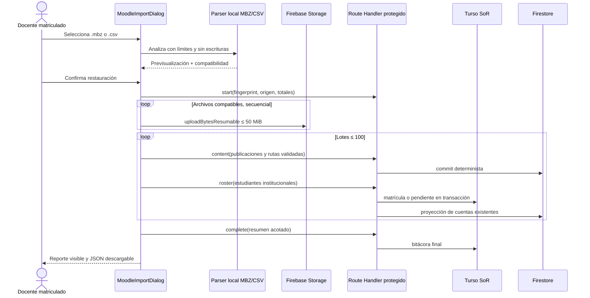

## Context

La sección es el System of Record en Turso y la proyección de matrícula controla Firestore y Storage. Un `.mbz` puede ser TGZ o ZIP, contiene XML por curso/sección/actividad y guarda binarios por hash bajo `files/`. Enviar el respaldo a una Route Handler chocaría con límites serverless y duplicaría tráfico; analizarlo en el cliente permite subir sólo recursos aceptados a Storage, mientras la API conserva la autoridad sobre metadatos, nómina y auditoría.



## Goals / Non-Goals

**Goals**

- Restauración honesta, segura e idempotente de estructura y material compatible.
- Flujo previo de sólo lectura que permita detectar incompatibilidades antes de publicar.
- Matrícula de estudiantes sin crear identidades Firebase ficticias.
- Límites adecuados a miles de importaciones independientes por sección.
- Reporte útil para una reconciliación institucional y para reintentos.

**Non-Goals**

- Emular Moodle, ejecutar plugins o preservar estados de interacción.
- Convertir cuestionarios, bancos QTI, calificaciones o entregas.
- Cargar el contenedor completo en Vercel o conservarlo como copia maestra.
- Fusionar o eliminar automáticamente contenido previo de CEOUBB.

## Decisions

### D1. Parser local, formatos TGZ y ZIP

`openMoodleArchive` detecta magic bytes, limita 250 MiB comprimidos, 512 MiB expandidos y 20.000 entradas, rechaza rutas absolutas o con `..`, archivos ZIP cifrados/ZIP64, métodos desconocidos, duplicados y XML con DTD. TGZ se descomprime con stream y corte temprano; ZIP usa el directorio central y descomprime una entrada por vez. No se añade una dependencia de compresión.

### D2. Modelo normalizado y compatibilidad explícita

El parser transforma XML de Moodle 2+ a un plan independiente del proveedor. Las secciones se vuelven carpetas; `page`, `label`, `url`, `assign` y capítulos de `book` se vuelven publicaciones; `resource`, `folder` y paquetes `scorm` se vuelven archivos. SCORM queda marcado como paquete descargable. Actividades ocultas, plugins desconocidos, quizzes, intentos, notas y foros se omiten con motivo; nunca cuentan como restaurados.

### D3. Identidad semántica, no identidad del archivo

`sourceKey = SHA-256(original_wwwroot + original_course_id)` identifica el curso Moodle y `sourceId` combina esa clave con el ID estable de módulo/archivo. El fingerprint de manifest y catálogo identifica la ejecución para auditoría. Los documentos Firestore usan IDs derivados de `sourceId`; reimportar actualiza y no duplica. El proceso no borra documentos que ya no aparezcan, porque una migración histórica debe fallar hacia la conservación.

### D4. Binarios directos; metadatos autorizados en servidor

El navegador verifica que cada blob coincide con el SHA-1 declarado en `files.xml`, bloquea extensiones activas y tamaños sobre 50 MiB, y lo carga bajo la ruta docente ya autorizada por Storage. La API recibe únicamente metadatos en lotes de 100, vuelve a validarlos, verifica matrícula docente/coordinadora en Turso y escribe documentos deterministas con credenciales de servicio. Ningún rol enviado por el cliente decide autorización.

### D5. Nómina diferida y sin elevación de privilegios

Sólo el arquetipo Moodle `student` es importable. Correos no institucionales, anónimos o con roles docentes/administrativos pasan al reporte manual. Una cuenta existente obtiene `matriculas` activa y proyección Firestore; una cuenta institucional aún inexistente genera `pending_matriculas` sin nombre y con vencimiento de 90 días. En el próximo inicio de sesión, la ruta de autenticación reclama la matrícula, proyecta y borra la pendiente sólo después de una proyección exitosa.

### D6. Auditoría relacional acotada

`moodle_imports` guarda una fila por sección y fingerprint con estado `running`, `completed` o `partial`, actor, origen, contadores y un resumen JSON limitado. El reporte detallado permanece en el dispositivo y se descarga como JSON. Las consultas de historial usan cursor y límite máximo 50.

### D7. Flujo docente dentro de Materiales

La entrada `Importar Moodle` aparece sólo cuando `canTeach` ya habilita herramientas docentes. El diálogo sigue seleccionar → revisar → importar → resultado, con foco gestionado, `aria-live`, progreso nativo, acciones de 44 px y vista de una columna en móvil. La confirmación de participantes es explícita y puede desactivarse.

## Data Contracts

```typescript
type MoodleImportSource = {
  sourceKey: string;
  fingerprint: string;
  courseId: string;
  courseName: string;
  courseShortName: string;
  moodleVersion: string;
  fileName: string;
};

type MoodleImportPost = {
  sourceId: string;
  title: string;
  body: string;
  kind: "notice" | "guide" | "assessment" | "resource";
  folder: string;
  linkUrl: string;
  dueDate: string;
  storagePath: string;
  fileName: string;
  contentType: string;
  fileSize: number;
  sourceCreatedAt: string | null;
};

type MoodleRosterParticipant = {
  sourceUserId: string;
  email: string;
  role: "student";
};
```

```sql
CREATE TABLE moodle_imports (
  id TEXT PRIMARY KEY,
  seccion_id TEXT NOT NULL REFERENCES secciones(id) ON DELETE CASCADE,
  fingerprint TEXT NOT NULL,
  actor_id TEXT NOT NULL REFERENCES users(id),
  status TEXT NOT NULL,
  source_course_id TEXT NOT NULL,
  source_course_name TEXT NOT NULL,
  source_moodle_version TEXT NOT NULL,
  source_file_name TEXT NOT NULL,
  content_count INTEGER NOT NULL DEFAULT 0,
  file_count INTEGER NOT NULL DEFAULT 0,
  participant_count INTEGER NOT NULL DEFAULT 0,
  warning_count INTEGER NOT NULL DEFAULT 0,
  report_json TEXT NOT NULL DEFAULT '{}',
  created_at TEXT NOT NULL,
  updated_at TEXT NOT NULL
);

CREATE TABLE pending_matriculas (
  id TEXT PRIMARY KEY,
  seccion_id TEXT NOT NULL REFERENCES secciones(id) ON DELETE CASCADE,
  email TEXT NOT NULL,
  rol_seccion TEXT NOT NULL DEFAULT 'student',
  source_import_id TEXT NOT NULL REFERENCES moodle_imports(id) ON DELETE CASCADE,
  expires_at TEXT NOT NULL,
  created_at TEXT NOT NULL,
  updated_at TEXT NOT NULL
);
```

## Error Taxonomy

| Code                     | HTTP | Meaning                                                    | Retry                         |
| :----------------------- | ---: | :--------------------------------------------------------- | :---------------------------- |
| `INVALID_ARCHIVE`        |  n/a | Firma, TAR/ZIP, XML o manifest inválido                    | No; obtener otro respaldo     |
| `ARCHIVE_LIMIT`          |  n/a | Archivo, expansión, entrada o conteo excede el presupuesto | No; dividir/limpiar el curso  |
| `UNSUPPORTED_CONTENT`    |  n/a | Actividad o archivo no convertible                         | Revisión manual               |
| `UNAUTHENTICATED`        |  401 | Falta sesión CEOUBB                                        | Sí, tras iniciar sesión       |
| `IMPORT_FORBIDDEN`       |  403 | Actor sin rol activo en la sección                         | No, requiere coordinación     |
| `INVALID_IMPORT_BATCH`   |  400 | Metadatos o lote fuera de contrato                         | No; corregir cliente          |
| `SECTION_NOT_FOUND`      |  404 | Destino inexistente en Turso                               | No; elegir sección válida     |
| `PROJECTION_UNAVAILABLE` |  503 | Turso guardó, Firestore no proyectó                        | Sí; reimportación idempotente |
| `IMPORT_INFRASTRUCTURE`  |  500 | Falla no clasificada sin datos internos expuestos          | Sí, con reporte parcial       |

## Security & Performance Budgets

- 250 MiB comprimidos, 512 MiB expandidos, 20.000 entradas, XML individual de 8 MiB y profundidad 64.
- Máximo 50 MiB por archivo, 100 publicaciones/participantes por request y 400 escrituras por commit Firestore.
- Binarios secuenciales para mantener memoria acotada; nunca consultas `collectionGroup` ni copias por estudiante.
- Sólo extensiones académicas pasivas; HTML, SVG, JavaScript, ejecutables y rutas ambiguas se omiten.
- XML no admite DTD/entidades externas y el cliente no usa `dangerouslySetInnerHTML` para la previsualización.
- API vuelve a derivar actor, sección, UID, rutas y límites; no confía en rol, autor ni destino enviados.

## Affected Invariants

| Invariant                    | Preservation                                                                                                      |
| :--------------------------- | :---------------------------------------------------------------------------------------------------------------- |
| Turso SoR y sección canónica | Toda importación exige una `secciones.id` existente; el respaldo no crea IDs de curso globales.                   |
| Proyección de matrícula      | Sólo el servicio servidor escribe marcadores; pendientes se reclaman desde Turso.                                 |
| Role SSOT                    | Los dominios se validan mediante `roleForEmail`; no aparece parsing alternativo.                                  |
| Default deny                 | Storage mantiene carga autenticada por matrícula y Firestore recibe metadatos sólo tras autorización de servidor. |
| Grade seam y auditoría       | No se importan calificaciones Moodle ni se toca `lib/grades.ts`.                                                  |
| Biblioteca única y Capacitor | No se crea árbol Android; la UI web remota funciona también en Capacitor.                                         |
| Independencia institucional  | El flujo no altera descargos ni presenta CEOUBB como servicio oficial.                                            |

## TDD Triangulation

- **RED:** `tests/moodle-import.test.ts` exigirá detección TGZ/ZIP/CSV, límites y rutas seguras, parseo Moodle, compatibilidad explícita, IDs deterministas, esquema, autorización fuente y composición del diálogo antes de que existan los módulos.
- **GREEN:** se implementará primero el parser puro, luego persistencia/servicios, API, cliente Firebase y UI hasta aprobar la suite bloqueada.
- **REFACTOR:** se eliminarán duplicaciones entre TGZ/ZIP y entre nómina de respaldo/CSV, se mantendrán lotes y rutas en helpers puros y se ejecutarán todos los gates sin modificar las aserciones RED.

## Risks / Trade-offs

- Un curso sobre 250 MiB debe dividir videos o archivos grandes, igual que otras ofertas administradas de Moodle; el reporte identifica exactamente qué quedó fuera.
- El formato de respaldo es extensible por plugins. La allowlist evita restauraciones falsas, a costa de requerir adaptadores futuros.
- Una caída después de subir un blob y antes de registrar su post puede dejar un objeto huérfano; reintentar repara el documento, pero la limpieza automática de huérfanos queda fuera.
- Las matrículas pendientes dependen de una cuenta de servicio válida para completar la proyección; permanecen pendientes si esa infraestructura falla.

## Rollback

Revertir código y migración antes del despliegue no cambia producción. Después de desplegar, revertir la UI/API deja `moodle_imports` y `pending_matriculas` sin nuevos escritores; el contenido ya restaurado permanece como material ordinario para evitar pérdida. La eliminación de ese contenido debe ser una operación separada y explícita basada en `sourceSystem/sourceId`.

## Blast Radius

| Area         | Files                                                                                                        |
| :----------- | :----------------------------------------------------------------------------------------------------------- |
| Contrato     | `lib/moodle/**`, `openspec/specs/integrations/moodle-course-import/spec.md`                                  |
| Datos        | `db/schema.ts`, `drizzle/`, `lib/services/moodle-import.ts`                                                  |
| API/Auth     | `app/api/courses/[sectionId]/imports/moodle/route.ts`, `app/api/auth/firebase/route.ts`                      |
| Firebase     | `lib/firebase/moodle-import.ts`, `lib/services/enrollment-projection.ts`, `lib/firebase-classroom-client.ts` |
| Interfaz     | `app/views/classroom/MoodleImportDialog.tsx`, `MaterialsSection.tsx`, `app/globals.css`                      |
| Verificación | `tests/moodle-import.test.ts`, `package.json`, `.agents/.test-hashes.json`                                   |
| Handoff      | `PLAN.md`, `docs/archive/PLAN_ARCHIVE.md`                                                                    |
