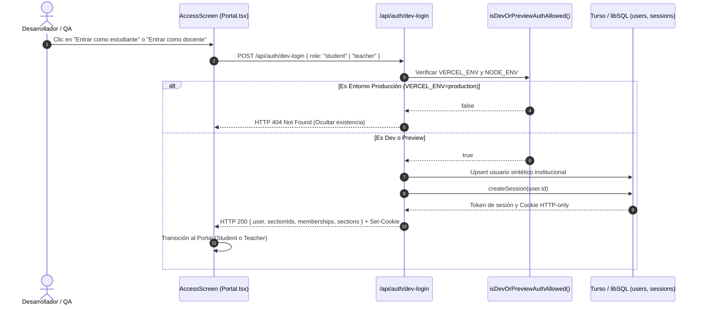

# Documento de Diseño: Botones de Acceso Rápido para Testing en Dev y Preview (CEO-62)

## Context

Ver `proposal.md` para la justificación y alcance general.
El sistema actual autentica usuarios mediante `signInWithInstitutionalGoogle` en el cliente Firebase y verifica el `idToken` en `/api/auth/firebase/route.ts`, el cual valida el dominio institucional (`@alumnos.ubiobio.cl` o `@ubiobio.cl`) y crea una sesión en Turso/libSQL.

Para acelerar la validación funcional en desarrollo local (`NODE_ENV === 'development'`) y previsualizaciones de Vercel (`VERCEL_ENV === 'preview'`), se requiere un mecanismo seguro que provisione identidades institucionales sintéticas sin credenciales externas, garantizando que en producción institucional (`VERCEL_ENV === 'production'`) el mecanismo quede completamente sellado e inaccesible.

## Goals / Non-Goals

**Goals:**

- Proporcionar acceso con un solo clic con roles `student` y `teacher` en desarrollo local y preview de Vercel.
- Mantener la integridad de los 4 espejos de seguridad institucionales usando correos sintéticos con dominios `@alumnos.ubiobio.cl` y `@ubiobio.cl`.
- Bloquear en tiempo de compilación y ejecución cualquier intento de invocación en producción institucional.
- Mantener compatibilidad con el sistema de sesiones existente (`lib/auth.ts`, `createSession`, `getSessionUser`).

**Non-Goals:**

- No se admiten correos no institucionales ni parámetros arbitrarios de rol.
- No se modifica el flujo de producción de Firebase Google OAuth.
- No se expone ningún secret ni token sensible.

## Decisions

### 1. Detección y Aislamiento Criptográfico de Entorno

Se implementa una función de guardia en `lib/auth-dev.ts` (o `lib/environment.ts`):

```ts
export function isDevOrPreviewAuthAllowed(
  vercelEnv = process.env.VERCEL_ENV,
  nodeEnv = process.env.NODE_ENV
): boolean {
  if (vercelEnv === "production") return false;
  return nodeEnv === "development" || vercelEnv === "preview";
}
```

- **Racional:** Tratar `VERCEL_ENV === 'production'` como un disyuntor absoluto. Si la variable indica producción, el acceso rápido queda deshabilitado sin importar cualquier otra configuración.
- **Alternativa Descartada:** Depender únicamente de `NODE_ENV`. Descartada porque `next build` en Vercel Preview ejecuta con `NODE_ENV === 'production'`, pero `VERCEL_ENV === 'preview'`.

### 2. Esquema Zod y Payload para Dev Login

```ts
import { z } from "zod";

export const DevLoginSchema = z.object({
  role: z.enum(["student", "teacher"]),
});

export type DevLoginInput = z.infer<typeof DevLoginSchema>;
```

### 3. Modelo de Identidades Sintéticas Institucionales

Las cuentas de testing utilizan identificadores deterministas e inmutables:

- **Estudiante de Prueba:**
  - `id`: `dev:student-demo`
  - `email`: `estudiante.demo@alumnos.ubiobio.cl`
  - `name`: `Estudiante Demo UBB`
  - `role`: `student`
- **Docente de Prueba:**
  - `id`: `dev:teacher-demo`
  - `email`: `docente.demo@ubiobio.cl`
  - `name`: `Docente Demo UBB`
  - `role`: `teacher`

Ambos correos satisfacen `roleForEmail(email)` en `lib/access-policy.ts`.

### 4. Arquitectura y Diagrama de Secuencia



## Blast Radius Analysis

Archivos y componentes impactados:

1. `app/api/auth/dev-login/route.ts` _(Nuevo)_: Handler de autenticación no productiva con guardia estricta de entorno.
2. `lib/auth-dev.ts` _(Nuevo)_: Lógica de validación de entorno y definición de perfiles sintéticos.
3. `app/Portal.tsx` _(Modificado)_: Renderizado condicional de botones de testing en `AccessScreen`.
4. `tests/dev-auth.test.ts` _(Nuevo)_: Pruebas unitarias de aislamiento de entorno y emisión de sesión.

## Risks / Trade-offs

- **[Riesgo] Exposición accidental en producción**:
  - _Mitigación:_ Doble capa de seguridad: el cliente no renderiza los botones si no está en dev/preview (`NEXT_PUBLIC_VERCEL_ENV === 'preview'` o `NODE_ENV === 'development'`), y el servidor rechaza cualquier petición con `404` si `VERCEL_ENV === 'production'`.
- **[Riesgo] Colisión con usuarios reales**:
  - _Mitigación:_ Los IDs tienen prefijo `dev:` y los correos `*.demo@ubiobio.cl` son fijos y deterministas.
- **[Riesgo] Inconsistencia con reglas de Firestore**:
  - _Mitigación:_ Los correos sintéticos cumplen estrictamente la regex institucional (`@alumnos.ubiobio.cl` y `@ubiobio.cl`), por lo que no requieren excepciones en las reglas de seguridad.

## Migration Plan

No requiere migraciones de esquema en Turso ya que reutiliza las tablas existentes `users` y `sessions`. Despliegue directo sin tiempo de inactividad.
