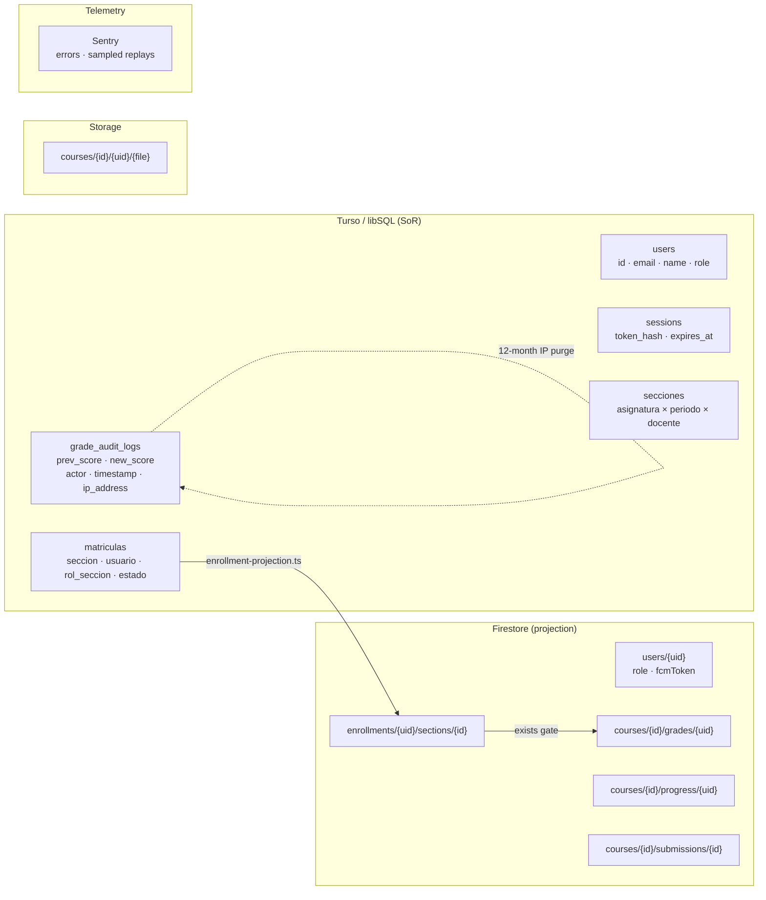
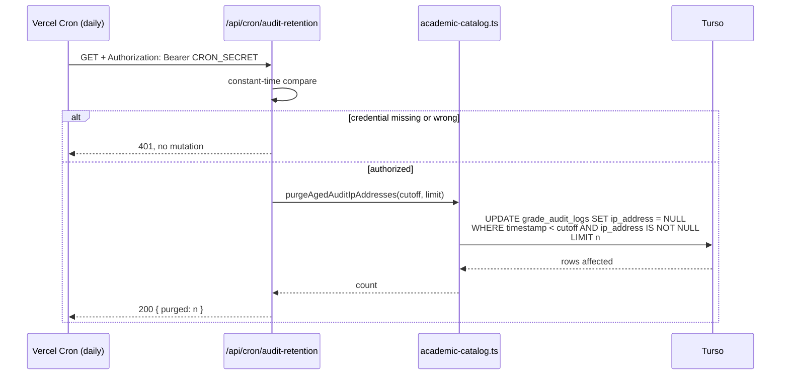

## Context

See `proposal.md` — Why. This section records only the current state that constrains the approach.

The legal surface today is a single route, `app/privacidad/page.tsx` (53 lines), a server component rendering static prose inside the `.policy-page` shell already defined in `app/globals.css` (lines 808–870, plus the responsive override at 4995). It is linked from one place, the `legal-note` paragraph in `app/Portal.tsx:220-223`, and listed in `app/sitemap.xml/route.ts`.

Personal academic data is split across two stores, and the policy must describe both accurately:

Read access to `courses/{courseId}/grades/{userId}` is granted by `firebase/firestore.rules:108-111` to three principals — `isOwner()`, `teachesSection(courseId)`, and the enrolled student themself. Per the answer to question D, the owner path stays for auditing, so the policy discloses it rather than the rules removing it.

Two constraints shape the implementation more than anything else:

1. **Test-Locking.** `scripts/verify-test-hashes.mjs` snapshots SHA-256 of every file under `tests/` into `.agents/.test-hashes.json` and flags untracked files, so adding a test file requires regenerating the snapshot. `tests/academic-model.test.ts:85` asserts the exact column set of `grade_audit_logs`, which forbids dropping `ip_address`; the retention routine must null values, not alter the schema.
2. **`tests/access-policy.test.ts:83-93`** already asserts that no enforcement surface hardcodes a non-institutional address. `app/privacidad/page.tsx` is not in that list, which is why the Gmail address survived there; the new test file closes the gap for legal pages.

## Goals / Non-Goals

**Goals**

- One shared legal-page pattern serving both `/privacidad` and `/terminos`, reusing the existing `.policy-page` CSS rather than introducing per-route chrome.
- Every promise made in the published text has an enforcing mechanism or is a statement of fact verifiable in code, and a test that fails if the two drift apart.
- Zero database migration.

**Non-Goals** (design-level, beyond the proposal's scope boundaries)

- No new UI components, no client-side interactivity, no animation on either legal page. Both remain server components rendering static prose, so the `impeccable` design pass and `useReducedMotion` wrapping do not apply — there is nothing to animate and no new visual system to introduce.
- No admin dashboard for rights requests. The request inbox is an email address.
- No versioning or changelog machinery for the legal documents. A single "Vigente desde" date per page, updated by hand, is enough at this scale.

## Decisions

### D1. Two sibling routes over one route with tabs

`/privacidad` and `/terminos` are separate routes sharing the `.policy-page` class, not one route with a segmented control.

_Rationale_: `/privacidad` is already indexed, linked from the mobile bridge test fixture, and referenced from the sitemap; a tabbed rewrite would break that stable URL for no benefit. Legal documents are also cited individually — a link must land on the document, not on a tab that may or may not be selected.

_Alternative considered_: a single `/legal/[doc]` dynamic route. Rejected: it buys parameterisation for exactly two documents that will never grow to ten, and it moves `/privacidad` off its published URL.

_Shared markup_: none extracted. Two files of static prose sharing a CSS class do not need a `LegalLayout` component; extracting one would be an abstraction with two call sites and no varying behavior.

### D2. Rights procedure by email, not by endpoint

The rights section publishes `contacto@ceoubb.com` and a maximum response window, with no self-service export or delete button.

_Rationale_: Ley 21.719 requires an effective channel and a bounded response, not a self-service interface. A deletion endpoint on an LMS also has to answer a question the law does not — whether erasing a student's record may erase grade evidence a teacher is obliged to keep — and that answer belongs in an institutional agreement that does not exist yet. Shipping a delete button ahead of that policy would create an irreversible action with undefined semantics.

_Alternative considered_: `GET /api/me/export` returning a JSON bundle. Deferred, not rejected — it becomes worthwhile if request volume makes manual handling impractical, and the spec's rights requirement is written so an endpoint can satisfy it later without a spec change.

### D3. Retention enforced by nulling the column, not by deleting rows

The purge sets `ip_address` to `NULL` for entries older than 12 months.

_Rationale_: the audit trail exists so a grade change can be reconstructed. Deleting aged rows would destroy exactly the evidence the owner audit access (question D) is meant to provide, while the IP is the only field in the row that identifies a device rather than an academic act. Nulling erases the personal identifier and preserves the audit.

_Alternative considered_: stop writing `ip_address` altogether. Rejected: the IP is what distinguishes an audit entry from a self-reported claim during a grade dispute, and `tests/academic-model.test.ts` locks the column into the schema.

_Bound_: the update runs against a fixed maximum batch per execution, consistent with the project's mandatory-`.limit()` rule, and reports the count it touched. At the platform's write volume one daily execution drains the backlog; if it ever does not, the count in the response is the signal.

### D4. Cron credential required, unlike the existing standup cron

`app/api/cron/standup/route.ts` performs no authentication. The new route requires `Authorization: Bearer ${CRON_SECRET}` and returns 401 otherwise.

_Rationale_: the standup route only reads and posts a summary; this one mutates the audit trail. An unauthenticated mutation endpoint that erases audit fields is a way to launder a grade change, so the credential is not optional. The existing route's laxness is not a precedent worth matching, and tightening it is out of scope here.

### D5. Sentry masking stated explicitly and locked by test

`sentry.client.config.ts` passes `maskAllText: true`, `maskAllInputs: true`, `blockAllMedia: true` to `Sentry.replayIntegration()` even though `@sentry/replay@10.70.0` already defaults all three to `true` (verified in the installed build).

_Rationale_: the change is a no-op at runtime today and entirely about the future. Once `/privacidad` publishes "recordings mask text content", that sentence is a commitment; leaving it resting on an unstated library default means a minor version bump can withdraw it silently. Three literals plus one assertion make the commitment breakable only on purpose.

_Not done_: disabling replay on grade routes. Masking already removes the academic content, and route-scoped replay disabling costs client logic to buy nothing beyond what masking gives.

### D6. Documents written against Ley 21.719 now

Both documents cite Ley 21.719 rather than Ley 19.628 (answer B).

_Rationale_: the law is in force in December 2026, four months out; grades entered this term outlive that date. Writing to 19.628 now guarantees a rewrite within one semester, and 21.719's rights set is a superset, so a document satisfying it also satisfies the current regime.

_Consequence_: the published rights list includes portability and blocking, which 19.628 does not require. That is intentional and costs nothing while requests are handled by hand.

### D7. Verification by content assertion, not by snapshot

`tests/privacy-terms.test.ts` reads the two page sources and the Sentry config as text and asserts required substrings and forbidden patterns — the contact address is `contacto@ceoubb.com`, no non-institutional address appears, the grade and audit-IP disclosures are present, the retention bound is stated, both routes are linked from the footer and the sitemap, and the three masking flags are literal.

_Rationale_: the failure mode this change guards against is prose silently drifting away from behavior — someone edits the retention paragraph without touching the purge, or vice versa. A substring assertion catches exactly that. A full-text snapshot would fail on every wording tweak and train people to regenerate it, which is the opposite of a lock.

_Bound_: assertions target the load-bearing claims only, not the whole document, so ordinary copy edits stay free.

## Risks / Trade-offs

- **`contacto@ceoubb.com` does not exist or goes unread** → the page publishes a deadline the project cannot meet, which is worse than the current silence. Mailbox provisioning and a monitored recipient are a deploy gate in `tasks.md`, ahead of the copy work.
- **Owner audit access reads badly to students** → disclosing "the administrator can read any grade" is a real trust cost, but the access exists and is deliberate (question D); an undisclosed reader discovered later costs far more. Mitigation is wording that states the purpose and the audit trail that records the access, not omission.
- **The 12-month IP window is a judgement call, not a statutory figure** → it is written once in the policy text and once as the purge cutoff constant. Both live in files this change touches, and the test asserts the published number, so changing the window later is a two-line edit that fails loudly if only one side moves.
- **Purge batch never drains** → if eligible rows ever exceed the per-run limit persistently, aged IPs outlive the published window while the policy claims otherwise. The route returns the processed count; if it comes back at the limit repeatedly, the schedule or the limit needs raising. Not currently plausible at this write volume.
- **Adding a test file breaks `verify:fast` until the hash snapshot is regenerated** → `scripts/verify-test-hashes.mjs` flags untracked files. Regeneration plus registering the file in the `verify:fast` script list are explicit tasks, not incidental steps.
- **Legal documents drafted by engineers** → neither document has had legal review. They are written to describe what the system verifiably does, which is the defensible part; the classification of the platform as controller versus processor relative to Universidad del Bío-Bío remains an open institutional question that no wording here can settle. The documents state the platform's independence rather than asserting a role it has no agreement to claim.

## Migration Plan

1. Provision and verify `contacto@ceoubb.com`; set `CRON_SECRET` in the Vercel environment.
2. Ship the code (masking flags, purge function, cron route, `vercel.json` entry) and the two documents in one deploy — text and enforcement must not land separately, or the published promises are briefly untrue.
3. Verify the cron route returns 401 unauthenticated and a count when authorized, in production, before announcing the pages.
4. Only then move CEO-11 to done and unblock real grade uploads.

**Rollback**: both pages are static routes and the purge is additive; reverting the commit restores the prior state with no data loss. Already-nulled IP addresses are not recoverable, which is the intended direction of the operation.

## Blast Radius

| File                                    | Change                                          |
| :-------------------------------------- | :---------------------------------------------- |
| `app/privacidad/page.tsx`               | Rewritten body; contact address; new sections   |
| `app/terminos/page.tsx`                 | New route                                       |
| `app/Portal.tsx`                        | Footer link to `/terminos` beside `/privacidad` |
| `app/sitemap.xml/route.ts`              | `/terminos` entry                               |
| `sentry.client.config.ts`               | Explicit replay masking options                 |
| `lib/services/academic-catalog.ts`      | `purgeAgedAuditIpAddresses`                     |
| `app/api/cron/audit-retention/route.ts` | New authenticated route                         |
| `vercel.json`                           | Cron schedule entry                             |
| `tests/privacy-terms.test.ts`           | New locked test file                            |
| `package.json`                          | `verify:fast` test list                         |
| `.agents/.test-hashes.json`             | Regenerated snapshot                            |

Untouched and deliberately so: `db/schema.ts` and `drizzle/` (no migration), `firebase/firestore.rules` and `firebase/storage.rules` (access unchanged per question D), `lib/access-policy.ts` (role derivation unchanged), `SECURITY.md` and the ADR files (internal governance, out of scope).
