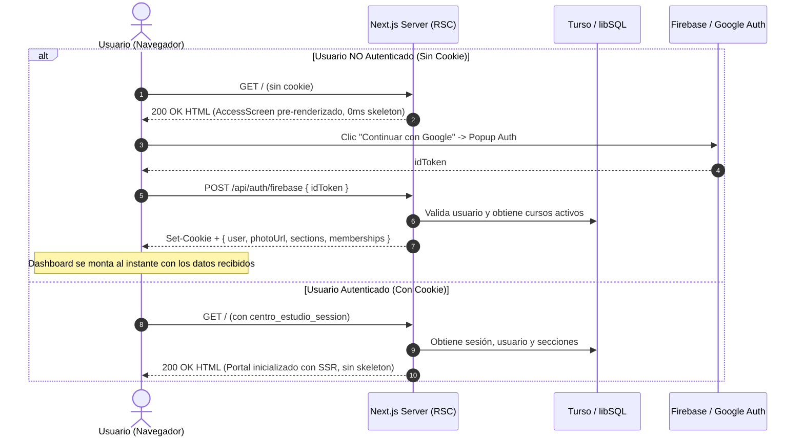

## Context

Actualmente `app/page.tsx` monta directamente `<Portal />` como Client Component (`"use client"`). El estado inicial de React inicia con `checking: true`, mostrando un esqueleto `<LoadingScreen />` que bloquea la visualización del login o del dashboard hasta que se completa un `fetch("/api/auth/me?includeSections=1")` en el cliente.

Para más contexto y motivación, ver [proposal.md](file:///C:/Users/Pipe/Documents/Proyectos/Web/Next.js/ceoubb/CEOUBB/openspec/changes/fast-boot-auth-optimization/proposal.md).

## Goals / Non-Goals

**Goals:**

- Resolver la sesión en el servidor en `app/page.tsx` mediante Server Components e inspección de cookies (`centro_estudio_session`).
- Renderizar de forma inmediata `AccessScreen` en el SSR inicial para usuarios no autenticados (0ms de pantalla de carga).
- Proveer datos iniciales (`initialUser`, `initialSections`, `initialMemberships`) a `<Portal />` en el SSR para usuarios autenticados.
- Unificar la respuesta de `POST /api/auth/firebase` para entregar usuario, membresías y secciones en una sola llamada de red (cero round-trips post-auth).
- Dividir bundles de código (_code splitting_) entre el flujo de acceso público y las vistas pesadas del dashboard académico.
- Añadir preconexiones de red (`preconnect`) a dominios de autenticación en `app/layout.tsx`.

**Non-Goals:**

- Alterar el esquema de base de datos en Turso ni las reglas de Firestore/Storage.
- Modificar la política de derivación de roles determinista (`lib/access-policy.ts`).
- Modificar el archivo de fallback offline de Capacitor (`capacitor/www/`).

## Architectural Flow

## Decisions

### Decision 1: `app/page.tsx` como Server Component con resolución de sesión

- **Elección:** Convertir `app/page.tsx` en un Async Server Component que lee la cookie `centro_estudio_session` usando `cookies()` de `next/headers`.
- **Implementación:** Si existe cookie y es válida en Turso, carga los cursos iniciales y pasa `{ initialSession }` a `<Portal />`. Si no existe cookie, pasa `{ initialSession: null }`, evitando que `<Portal />` monte el loader inicial.
- **Alternativa descartada:** Mantener `page.tsx` como cliente y usar `localStorage` para recordar el estado de login. Se descarta porque causa desincronización de estado (_hydration mismatch_) y no elimina el skeleton en el primer render de un nuevo usuario.

### Decision 2: Unificación de payload en `POST /api/auth/firebase`

- **Elección:** En el endpoint de login Firebase, invocar `listUserSections` y `listUserSectionMemberships` antes de responder, devolviendo `{ user, photoUrl, sectionIds, memberships, sections, archivedNextCursor }`.
- **Implementación:** Almacena la sesión en cookie y retorna todos los datos que el cliente necesita para montar el dashboard inmediatamente sin un segundo `fetch`.
- **Alternativa descartada:** Mantener el endpoint ligero y forzar un `fetch('/api/auth/me')` adicional en el cliente. Se descarta porque añade 100-300ms de latencia innecesaria tras presionar ingresar.

### Decision 3: Preconexión de red y optimización de recursos en `layout.tsx`

- **Elección:** Incorporar enlaces `<link rel="preconnect">` y `<link rel="dns-prefetch">` hacia `https://accounts.google.com`, `https://identitytoolkit.googleapis.com` y `https://firestore.googleapis.com`.
- **Alternativa descartada:** Conectar solo bajo demanda al hacer clic. Se descarta porque el handshake TLS toma entre 50ms y 150ms en redes móviles.

## Risks / Trade-offs

- **[Riesgo]** Si Turso experimenta latencia al resolver la sesión en `app/page.tsx` para un usuario autenticado, el Time to First Byte (TTFB) del documento podría aumentar levemente.
  $\rightarrow$ _Mitigación:_ Si la verificación en el servidor falla o excede un umbral corto, degradar graciosamente pasando `initialSession={undefined}` para que el cliente continúe con el flujo resiliente habitual.
- **[Riesgo]** Desincronización si la sesión expira mientras el usuario navega.
  $\rightarrow$ _Mitigación:_ Las peticiones autenticadas subsecuentes a APIs y Firestore capturan errores 401 y redirigen al login de manera segura.
