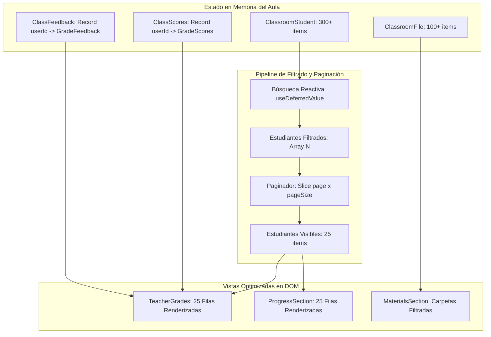

# Technical Design: Paginación de Listas Grandes y Loteo Seguro de Notas (CEO-17)

## Context

En CEOUBB, las aulas virtuales cargan recursos y nóminas en tiempo real para estudiantes y docentes. En asignaturas de plan común (e.g., Cálculo, Física, Álgebra) y cursos masivos (>300 estudiantes), la renderización de tablas completas (como la matriz de notas de $300 \times 5 = 1.500$ celdas interactivas con botones de retroalimentación) genera:

1. Saturación del DOM y degradación de frames en navegadores móviles y equipos de gama media.
2. Dificultad para localizar estudiantes específicos sin una herramienta de filtrado rápido.
3. Riesgo de abortos de transacción en Firestore si una mutación de notas acumulada supera el límite de 500 operaciones por lote.

Ver `proposal.md` y `specs/classroom/large-lists-pagination/spec.md`.

## Goals / Non-Goals

**Goals:**

- Implementar paginación interactiva y búsqueda por nombre/correo en `TeacherGrades` (`GradesSection.tsx`) con tamaños de página de 25, 50 y 100 estudiantes.
- Implementar paginación y búsqueda en la tabla de avance de estudiantes `ProgressSection.tsx`.
- Añadir barra de búsqueda reactiva por nombre de archivo y partición de carpetas en `MaterialsSection.tsx`.
- Verificar y certificar el particionamiento en lotes seguros ($\le 400$ operaciones) en `saveSectionScores` (`lib/firebase/grades.ts`).
- Cumplir las directrices de diseño institucional de `DESIGN.md` (tipografía tabular en numerales `.num`, componentes accesibles con `@phosphor-icons/react`, tokens OKLCH).

**Non-Goals:**

- Modificar el esquema de base de datos relacional en Turso ni crear nuevas migraciones Drizzle.
- Alterar la experiencia de simulación privada de notas del estudiante.

## Architectural Flow

## Decisions

### Decision 1: Paginación y Filtrado en Cliente para `TeacherGrades` y `ProgressSection`

- **Elección:** Filtrar y paginar el arreglo `students` en el cliente usando `useMemo`, `useDeferredValue` y slicing determinista `students.slice(start, end)`.
- **Razón:** En el aula virtual, `watchClassroom` mantiene la sincronización en tiempo real de la sección. Al paginar en memoria los estudiantes ya suscritos:
  1. El DOM solo renderiza 25-50 filas a la vez en lugar de 300+, eliminando el lag de entrada de teclado.
  2. La búsqueda es instantánea ($< 5\text{ms}$) sin realizar peticiones de red adicionales.
  3. No se pierden las notas editadas en otras páginas ya que el estado raíz de `classScores` vive en `ClassroomState`.
- **Alternativas descartadas:**
  - _Paginación en servidor con múltiples onSnapshot:_ Crearía decenas de suscripciones Firestore abiertas por docente y mayor costo de lecturas.
  - _Virtualización CSS / Windowing (react-window):_ Añade dependencias externas prohibidas por `AGENTS.md` (regla 5) y rompe la accesibilidad de lectura por teclado en tablas estándar.

### Decision 2: Controles de Paginación Accesibles y Estandarizados

- **Componente:** `PaginationControls` reutilizable en `app/views/classroom/classroom-utils.ts` o componente UI local.
- **Comportamiento:**
  - Botones "Anterior" y "Siguiente" con `disabled` condicional.
  - Indicador numérico `Mostrando X–Y de Z estudiantes (Página A de B)`.
  - Selector de tamaño de página (25, 50, 100).
  - Al escribir en el buscador, resetea automáticamente a la página 1.

### Decision 3: Filtrado Global y Colapso Inteligente en `MaterialsSection`

- **Elección:** Barra de búsqueda en la cabecera de `MaterialsSection` que busca archivos por nombre o autor de manera insensible a mayúsculas y acentos.
- **Comportamiento:**
  - Si hay un término de búsqueda activo, se filtran los archivos de cada carpeta y las carpetas que contengan coincidencias se expanden automáticamente.
  - Las carpetas sin coincidencias se ocultan o muestran vacías.

### Decision 4: Invariantes de Loteo Seguro en Calificaciones ($\le 400$ ops)

- **Constante:** `MAX_BATCH_OPERATIONS = 400` y `MAX_AUDITED_ROWS_PER_CALL = 100` con olas de 4 llamadas concurrentes en `lib/firebase/grades.ts`.
- **Verificación:** Pruebas unitarias en `tests/grades-batch.test.ts` que validen la partición de un arreglo de 350+ filas de notas en lotes estrictamente $\le 400$ operaciones.

## Risks / Trade-offs

- **[Riesgo] Pérdida de foco o salto de página al ingresar notas:**
  - _Mitigación:_ Cada celda de nota usa `onBlur` para persistir la mutación y `TeacherStudentRow` está memoizado con `React.memo` para evitar re-renders innecesarios.
- **[Riesgo] Búsqueda con caracteres especiales o acentos en español:**
  - _Mitigación:_ Normalización con `normalize("NFD").replace(/[\u0300-\u036f]/g, "").toLowerCase()` para emparejar "gonzalez" con "González".
